[matrixStats]: Benchmark report

---------------------------------------


# colWeightedMedians() and rowWeightedMedians() benchmarks on subsetted computation

This report benchmark the performance of colWeightedMedians() and rowWeightedMedians on subsetted computation.


## Data
```r
> rmatrix <- function(nrow, ncol, mode = c("logical", "double", "integer", "index"), range = c(-100, 
+     +100), na_prob = 0) {
+     mode <- match.arg(mode)
+     n <- nrow * ncol
+     if (mode == "logical") {
+         x <- sample(c(FALSE, TRUE), size = n, replace = TRUE)
+     }     else if (mode == "index") {
+         x <- seq_len(n)
+         mode <- "integer"
+     }     else {
+         x <- runif(n, min = range[1], max = range[2])
+     }
+     storage.mode(x) <- mode
+     if (na_prob > 0) 
+         x[sample(n, size = na_prob * n)] <- NA
+     dim(x) <- c(nrow, ncol)
+     x
+ }
> rmatrices <- function(scale = 10, seed = 1, ...) {
+     set.seed(seed)
+     data <- list()
+     data[[1]] <- rmatrix(nrow = scale * 1, ncol = scale * 1, ...)
+     data[[2]] <- rmatrix(nrow = scale * 10, ncol = scale * 10, ...)
+     data[[3]] <- rmatrix(nrow = scale * 100, ncol = scale * 1, ...)
+     data[[4]] <- t(data[[3]])
+     data[[5]] <- rmatrix(nrow = scale * 10, ncol = scale * 100, ...)
+     data[[6]] <- t(data[[5]])
+     names(data) <- sapply(data, FUN = function(x) paste(dim(x), collapse = "x"))
+     data
+ }
> data <- rmatrices(mode = "double")
```

## Results

### 10x10 matrix


```r
> X <- data[["10x10"]]
> rows <- sample.int(nrow(X), size = nrow(X) * 0.7)
> cols <- sample.int(ncol(X), size = ncol(X) * 0.7)
> X_S <- X[rows, cols]
> w <- runif(nrow(X))
> w_S <- w[rows]
> gc()
           used  (Mb) gc trigger  (Mb) max used  (Mb)
Ncells  5332124 284.8    8529671 455.6  8529671 455.6
Vcells 10812817  82.5   31876688 243.2 60562128 462.1
> colStats <- microbenchmark(colWeightedMedians_X_w_S = colWeightedMedians(X_S, w = w_S, na.rm = FALSE), 
+     `colWeightedMedians(X, w, rows, cols)` = colWeightedMedians(X, w = w, rows = rows, cols = cols, 
+         na.rm = FALSE), `colWeightedMedians(X[rows, cols], w[rows])` = colWeightedMedians(X[rows, 
+         cols], w = w[rows], na.rm = FALSE), unit = "ms")
> X <- t(X)
> X_S <- t(X_S)
> gc()
           used  (Mb) gc trigger  (Mb) max used  (Mb)
Ncells  5322502 284.3    8529671 455.6  8529671 455.6
Vcells 10780820  82.3   31876688 243.2 60562128 462.1
> rowStats <- microbenchmark(rowWeightedMedians_X_w_S = rowWeightedMedians(X_S, w = w_S, na.rm = FALSE), 
+     `rowWeightedMedians(X, w, cols, rows)` = rowWeightedMedians(X, w = w, rows = cols, cols = rows, 
+         na.rm = FALSE), `rowWeightedMedians(X[cols, rows], w[rows])` = rowWeightedMedians(X[cols, 
+         rows], w = w[rows], na.rm = FALSE), unit = "ms")
```

_Table: Benchmarking of colWeightedMedians_X_w_S(), colWeightedMedians(X, w, rows, cols)() and colWeightedMedians(X[rows, cols], w[rows])() on 10x10 data. The top panel shows times in milliseconds and the bottom panel shows relative times._


|   |expr                                       |      min|        lq|      mean|    median|        uq|      max|
|:--|:------------------------------------------|--------:|---------:|---------:|---------:|---------:|--------:|
|1  |colWeightedMedians_X_w_S                   | 0.052045| 0.0536070| 0.0575650| 0.0569805| 0.0602065| 0.089569|
|3  |colWeightedMedians(X[rows, cols], w[rows]) | 0.053224| 0.0560555| 0.0594848| 0.0583805| 0.0623330| 0.078030|
|2  |colWeightedMedians(X, w, rows, cols)       | 0.053628| 0.0553440| 0.0642821| 0.0584975| 0.0625230| 0.524478|


|   |expr                                       |      min|       lq|     mean|   median|       uq|       max|
|:--|:------------------------------------------|--------:|--------:|--------:|--------:|--------:|---------:|
|1  |colWeightedMedians_X_w_S                   | 1.000000| 1.000000| 1.000000| 1.000000| 1.000000| 1.0000000|
|3  |colWeightedMedians(X[rows, cols], w[rows]) | 1.022654| 1.045675| 1.033350| 1.024570| 1.035320| 0.8711719|
|2  |colWeightedMedians(X, w, rows, cols)       | 1.030416| 1.032402| 1.116686| 1.026623| 1.038476| 5.8555750|

_Table: Benchmarking of rowWeightedMedians_X_w_S(), rowWeightedMedians(X, w, cols, rows)() and rowWeightedMedians(X[cols, rows], w[rows])() on 10x10 data (transposed). The top panel shows times in milliseconds and the bottom panel shows relative times._


|   |expr                                       |      min|        lq|      mean|    median|       uq|      max|
|:--|:------------------------------------------|--------:|---------:|---------:|---------:|--------:|--------:|
|1  |rowWeightedMedians_X_w_S                   | 0.052127| 0.0544615| 0.0596529| 0.0583315| 0.063122| 0.080281|
|3  |rowWeightedMedians(X[cols, rows], w[rows]) | 0.053777| 0.0559745| 0.0597013| 0.0594850| 0.061987| 0.073712|
|2  |rowWeightedMedians(X, w, cols, rows)       | 0.053930| 0.0567925| 0.0644175| 0.0602810| 0.064068| 0.412862|


|   |expr                                       |      min|       lq|     mean|   median|        uq|       max|
|:--|:------------------------------------------|--------:|--------:|--------:|--------:|---------:|---------:|
|1  |rowWeightedMedians_X_w_S                   | 1.000000| 1.000000| 1.000000| 1.000000| 1.0000000| 1.0000000|
|3  |rowWeightedMedians(X[cols, rows], w[rows]) | 1.031654| 1.027781| 1.000812| 1.019775| 0.9820189| 0.9181749|
|2  |rowWeightedMedians(X, w, cols, rows)       | 1.034589| 1.042801| 1.079873| 1.033421| 1.0149869| 5.1427112|

_Figure: Benchmarking of colWeightedMedians_X_w_S(), colWeightedMedians(X, w, rows, cols)() and colWeightedMedians(X[rows, cols], w[rows])() on 10x10 data  as well as rowWeightedMedians_X_w_S(), rowWeightedMedians(X, w, cols, rows)() and rowWeightedMedians(X[cols, rows], w[rows])() on the same data transposed.  Outliers are displayed as crosses.  Times are in milliseconds._


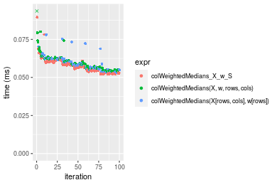

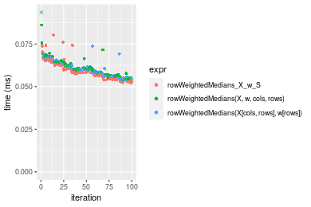
_Table: Benchmarking of colWeightedMedians_X_w_S() and rowWeightedMedians_X_w_S() on 10x10 data (original and transposed).  The top panel shows times in milliseconds and the bottom panel shows relative times._


|   |expr                     |    min|      lq|     mean|  median|      uq|    max|
|:--|:------------------------|------:|-------:|--------:|-------:|-------:|------:|
|1  |colWeightedMedians_X_w_S | 52.045| 53.6070| 57.56501| 56.9805| 60.2065| 89.569|
|2  |rowWeightedMedians_X_w_S | 52.127| 54.4615| 59.65287| 58.3315| 63.1220| 80.281|


|   |expr                     |      min|      lq|    mean|  median|       uq|       max|
|:--|:------------------------|--------:|-------:|-------:|-------:|--------:|---------:|
|1  |colWeightedMedians_X_w_S | 1.000000| 1.00000| 1.00000| 1.00000| 1.000000| 1.0000000|
|2  |rowWeightedMedians_X_w_S | 1.001576| 1.01594| 1.03627| 1.02371| 1.048425| 0.8963034|

_Figure: Benchmarking of colWeightedMedians_X_w_S() and rowWeightedMedians_X_w_S() on 10x10 data (original and transposed).  Outliers are displayed as crosses. Times are in milliseconds._


### 100x100 matrix


```r
> X <- data[["100x100"]]
> rows <- sample.int(nrow(X), size = nrow(X) * 0.7)
> cols <- sample.int(ncol(X), size = ncol(X) * 0.7)
> X_S <- X[rows, cols]
> w <- runif(nrow(X))
> w_S <- w[rows]
> gc()
           used  (Mb) gc trigger  (Mb) max used  (Mb)
Ncells  5321501 284.2    8529671 455.6  8529671 455.6
Vcells 10452190  79.8   31876688 243.2 60562128 462.1
> colStats <- microbenchmark(colWeightedMedians_X_w_S = colWeightedMedians(X_S, w = w_S, na.rm = FALSE), 
+     `colWeightedMedians(X, w, rows, cols)` = colWeightedMedians(X, w = w, rows = rows, cols = cols, 
+         na.rm = FALSE), `colWeightedMedians(X[rows, cols], w[rows])` = colWeightedMedians(X[rows, 
+         cols], w = w[rows], na.rm = FALSE), unit = "ms")
> X <- t(X)
> X_S <- t(X_S)
> gc()
           used  (Mb) gc trigger  (Mb) max used  (Mb)
Ncells  5321477 284.2    8529671 455.6  8529671 455.6
Vcells 10462243  79.9   31876688 243.2 60562128 462.1
> rowStats <- microbenchmark(rowWeightedMedians_X_w_S = rowWeightedMedians(X_S, w = w_S, na.rm = FALSE), 
+     `rowWeightedMedians(X, w, cols, rows)` = rowWeightedMedians(X, w = w, rows = cols, cols = rows, 
+         na.rm = FALSE), `rowWeightedMedians(X[cols, rows], w[rows])` = rowWeightedMedians(X[cols, 
+         rows], w = w[rows], na.rm = FALSE), unit = "ms")
```

_Table: Benchmarking of colWeightedMedians_X_w_S(), colWeightedMedians(X, w, rows, cols)() and colWeightedMedians(X[rows, cols], w[rows])() on 100x100 data. The top panel shows times in milliseconds and the bottom panel shows relative times._


|   |expr                                       |      min|        lq|      mean|    median|        uq|      max|
|:--|:------------------------------------------|--------:|---------:|---------:|---------:|---------:|--------:|
|1  |colWeightedMedians_X_w_S                   | 0.444418| 0.4576690| 0.5007292| 0.4747745| 0.4999890| 0.755358|
|3  |colWeightedMedians(X[rows, cols], w[rows]) | 0.454004| 0.4635380| 0.5023220| 0.4798105| 0.5053505| 0.800361|
|2  |colWeightedMedians(X, w, rows, cols)       | 0.456333| 0.4705215| 0.5184292| 0.4861820| 0.5227245| 0.913797|


|   |expr                                       |     min|       lq|     mean|   median|       uq|      max|
|:--|:------------------------------------------|-------:|--------:|--------:|--------:|--------:|--------:|
|1  |colWeightedMedians_X_w_S                   | 1.00000| 1.000000| 1.000000| 1.000000| 1.000000| 1.000000|
|3  |colWeightedMedians(X[rows, cols], w[rows]) | 1.02157| 1.012824| 1.003181| 1.010607| 1.010723| 1.059578|
|2  |colWeightedMedians(X, w, rows, cols)       | 1.02681| 1.028083| 1.035348| 1.024027| 1.045472| 1.209753|

_Table: Benchmarking of rowWeightedMedians_X_w_S(), rowWeightedMedians(X, w, cols, rows)() and rowWeightedMedians(X[cols, rows], w[rows])() on 100x100 data (transposed). The top panel shows times in milliseconds and the bottom panel shows relative times._


|   |expr                                       |      min|        lq|      mean|    median|        uq|      max|
|:--|:------------------------------------------|--------:|---------:|---------:|---------:|---------:|--------:|
|1  |rowWeightedMedians_X_w_S                   | 0.441649| 0.4660425| 0.5114300| 0.4851390| 0.5296885| 0.778382|
|3  |rowWeightedMedians(X[cols, rows], w[rows]) | 0.456554| 0.4748245| 0.5169599| 0.4937935| 0.5134185| 0.872021|
|2  |rowWeightedMedians(X, w, cols, rows)       | 0.457541| 0.4791175| 0.5078214| 0.4954720| 0.5111390| 0.777244|


|   |expr                                       |      min|       lq|      mean|   median|        uq|      max|
|:--|:------------------------------------------|--------:|--------:|---------:|--------:|---------:|--------:|
|1  |rowWeightedMedians_X_w_S                   | 1.000000| 1.000000| 1.0000000| 1.000000| 1.0000000| 1.000000|
|3  |rowWeightedMedians(X[cols, rows], w[rows]) | 1.033748| 1.018844| 1.0108127| 1.017839| 0.9692838| 1.120300|
|2  |rowWeightedMedians(X, w, cols, rows)       | 1.035983| 1.028055| 0.9929442| 1.021299| 0.9649804| 0.998538|

_Figure: Benchmarking of colWeightedMedians_X_w_S(), colWeightedMedians(X, w, rows, cols)() and colWeightedMedians(X[rows, cols], w[rows])() on 100x100 data  as well as rowWeightedMedians_X_w_S(), rowWeightedMedians(X, w, cols, rows)() and rowWeightedMedians(X[cols, rows], w[rows])() on the same data transposed.  Outliers are displayed as crosses.  Times are in milliseconds._


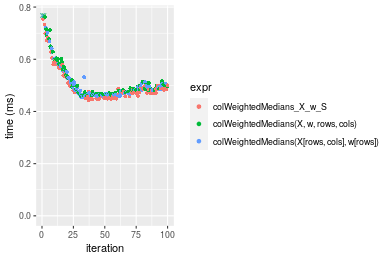

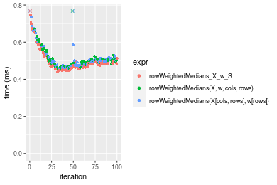
_Table: Benchmarking of colWeightedMedians_X_w_S() and rowWeightedMedians_X_w_S() on 100x100 data (original and transposed).  The top panel shows times in milliseconds and the bottom panel shows relative times._


|   |expr                     |     min|       lq|     mean|   median|       uq|     max|
|:--|:------------------------|-------:|--------:|--------:|--------:|--------:|-------:|
|1  |colWeightedMedians_X_w_S | 444.418| 457.6690| 500.7292| 474.7745| 499.9890| 755.358|
|2  |rowWeightedMedians_X_w_S | 441.649| 466.0425| 511.4300| 485.1390| 529.6885| 778.382|


|   |expr                     |       min|       lq|    mean|  median|     uq|      max|
|:--|:------------------------|---------:|--------:|-------:|-------:|------:|--------:|
|1  |colWeightedMedians_X_w_S | 1.0000000| 1.000000| 1.00000| 1.00000| 1.0000| 1.000000|
|2  |rowWeightedMedians_X_w_S | 0.9937694| 1.018296| 1.02137| 1.02183| 1.0594| 1.030481|

_Figure: Benchmarking of colWeightedMedians_X_w_S() and rowWeightedMedians_X_w_S() on 100x100 data (original and transposed).  Outliers are displayed as crosses. Times are in milliseconds._


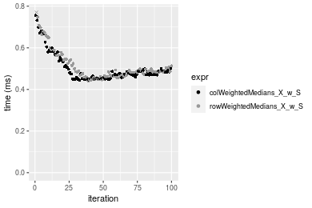

### 1000x10 matrix


```r
> X <- data[["1000x10"]]
> rows <- sample.int(nrow(X), size = nrow(X) * 0.7)
> cols <- sample.int(ncol(X), size = ncol(X) * 0.7)
> X_S <- X[rows, cols]
> w <- runif(nrow(X))
> w_S <- w[rows]
> gc()
           used  (Mb) gc trigger  (Mb) max used  (Mb)
Ncells  5322239 284.3    8529671 455.6  8529671 455.6
Vcells 10458130  79.8   31876688 243.2 60562128 462.1
> colStats <- microbenchmark(colWeightedMedians_X_w_S = colWeightedMedians(X_S, w = w_S, na.rm = FALSE), 
+     `colWeightedMedians(X, w, rows, cols)` = colWeightedMedians(X, w = w, rows = rows, cols = cols, 
+         na.rm = FALSE), `colWeightedMedians(X[rows, cols], w[rows])` = colWeightedMedians(X[rows, 
+         cols], w = w[rows], na.rm = FALSE), unit = "ms")
> X <- t(X)
> X_S <- t(X_S)
> gc()
           used  (Mb) gc trigger  (Mb) max used  (Mb)
Ncells  5322227 284.3    8529671 455.6  8529671 455.6
Vcells 10468203  79.9   31876688 243.2 60562128 462.1
> rowStats <- microbenchmark(rowWeightedMedians_X_w_S = rowWeightedMedians(X_S, w = w_S, na.rm = FALSE), 
+     `rowWeightedMedians(X, w, cols, rows)` = rowWeightedMedians(X, w = w, rows = cols, cols = rows, 
+         na.rm = FALSE), `rowWeightedMedians(X[cols, rows], w[rows])` = rowWeightedMedians(X[cols, 
+         rows], w = w[rows], na.rm = FALSE), unit = "ms")
```

_Table: Benchmarking of colWeightedMedians_X_w_S(), colWeightedMedians(X, w, rows, cols)() and colWeightedMedians(X[rows, cols], w[rows])() on 1000x10 data. The top panel shows times in milliseconds and the bottom panel shows relative times._


|   |expr                                       |      min|        lq|      mean|    median|        uq|      max|
|:--|:------------------------------------------|--------:|---------:|---------:|---------:|---------:|--------:|
|1  |colWeightedMedians_X_w_S                   | 0.292534| 0.2982060| 0.3339655| 0.3050530| 0.3642510| 0.505192|
|2  |colWeightedMedians(X, w, rows, cols)       | 0.308501| 0.3136840| 0.3580004| 0.3216080| 0.3897435| 0.628624|
|3  |colWeightedMedians(X[rows, cols], w[rows]) | 0.307387| 0.3121495| 0.3499378| 0.3253825| 0.3805265| 0.560474|


|   |expr                                       |      min|       lq|     mean|   median|       uq|      max|
|:--|:------------------------------------------|--------:|--------:|--------:|--------:|--------:|--------:|
|1  |colWeightedMedians_X_w_S                   | 1.000000| 1.000000| 1.000000| 1.000000| 1.000000| 1.000000|
|2  |colWeightedMedians(X, w, rows, cols)       | 1.054582| 1.051904| 1.071968| 1.054269| 1.069986| 1.244327|
|3  |colWeightedMedians(X[rows, cols], w[rows]) | 1.050774| 1.046758| 1.047826| 1.066642| 1.044682| 1.109428|

_Table: Benchmarking of rowWeightedMedians_X_w_S(), rowWeightedMedians(X, w, cols, rows)() and rowWeightedMedians(X[cols, rows], w[rows])() on 1000x10 data (transposed). The top panel shows times in milliseconds and the bottom panel shows relative times._


|   |expr                                       |      min|        lq|      mean|    median|       uq|      max|
|:--|:------------------------------------------|--------:|---------:|---------:|---------:|--------:|--------:|
|1  |rowWeightedMedians_X_w_S                   | 0.291770| 0.2968595| 0.3270638| 0.3010230| 0.350930| 0.490349|
|2  |rowWeightedMedians(X, w, cols, rows)       | 0.309691| 0.3155940| 0.3553845| 0.3248840| 0.379625| 0.644361|
|3  |rowWeightedMedians(X[cols, rows], w[rows]) | 0.308279| 0.3137730| 0.3548879| 0.3299175| 0.385463| 0.500003|


|   |expr                                       |      min|       lq|     mean|   median|       uq|      max|
|:--|:------------------------------------------|--------:|--------:|--------:|--------:|--------:|--------:|
|1  |rowWeightedMedians_X_w_S                   | 1.000000| 1.000000| 1.000000| 1.000000| 1.000000| 1.000000|
|2  |rowWeightedMedians(X, w, cols, rows)       | 1.061422| 1.063109| 1.086591| 1.079266| 1.081768| 1.314086|
|3  |rowWeightedMedians(X[cols, rows], w[rows]) | 1.056582| 1.056975| 1.085072| 1.095988| 1.098404| 1.019688|

_Figure: Benchmarking of colWeightedMedians_X_w_S(), colWeightedMedians(X, w, rows, cols)() and colWeightedMedians(X[rows, cols], w[rows])() on 1000x10 data  as well as rowWeightedMedians_X_w_S(), rowWeightedMedians(X, w, cols, rows)() and rowWeightedMedians(X[cols, rows], w[rows])() on the same data transposed.  Outliers are displayed as crosses.  Times are in milliseconds._


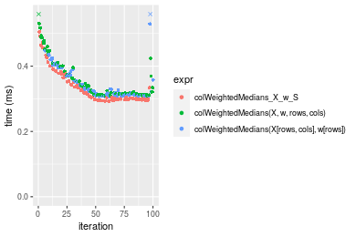

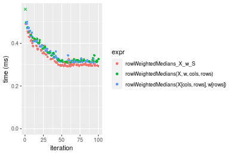
_Table: Benchmarking of colWeightedMedians_X_w_S() and rowWeightedMedians_X_w_S() on 1000x10 data (original and transposed).  The top panel shows times in milliseconds and the bottom panel shows relative times._


|   |expr                     |     min|       lq|     mean|  median|      uq|     max|
|:--|:------------------------|-------:|--------:|--------:|-------:|-------:|-------:|
|2  |rowWeightedMedians_X_w_S | 291.770| 296.8595| 327.0638| 301.023| 350.930| 490.349|
|1  |colWeightedMedians_X_w_S | 292.534| 298.2060| 333.9655| 305.053| 364.251| 505.192|


|   |expr                     |      min|       lq|     mean|   median|       uq|     max|
|:--|:------------------------|--------:|--------:|--------:|--------:|--------:|-------:|
|2  |rowWeightedMedians_X_w_S | 1.000000| 1.000000| 1.000000| 1.000000| 1.000000| 1.00000|
|1  |colWeightedMedians_X_w_S | 1.002619| 1.004536| 1.021102| 1.013388| 1.037959| 1.03027|

_Figure: Benchmarking of colWeightedMedians_X_w_S() and rowWeightedMedians_X_w_S() on 1000x10 data (original and transposed).  Outliers are displayed as crosses. Times are in milliseconds._


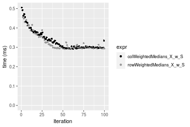

### 10x1000 matrix


```r
> X <- data[["10x1000"]]
> rows <- sample.int(nrow(X), size = nrow(X) * 0.7)
> cols <- sample.int(ncol(X), size = ncol(X) * 0.7)
> X_S <- X[rows, cols]
> w <- runif(nrow(X))
> w_S <- w[rows]
> gc()
           used  (Mb) gc trigger  (Mb) max used  (Mb)
Ncells  5322463 284.3    8529671 455.6  8529671 455.6
Vcells 10457457  79.8   31876688 243.2 60562128 462.1
> colStats <- microbenchmark(colWeightedMedians_X_w_S = colWeightedMedians(X_S, w = w_S, na.rm = FALSE), 
+     `colWeightedMedians(X, w, rows, cols)` = colWeightedMedians(X, w = w, rows = rows, cols = cols, 
+         na.rm = FALSE), `colWeightedMedians(X[rows, cols], w[rows])` = colWeightedMedians(X[rows, 
+         cols], w = w[rows], na.rm = FALSE), unit = "ms")
> X <- t(X)
> X_S <- t(X_S)
> gc()
           used  (Mb) gc trigger  (Mb) max used  (Mb)
Ncells  5322439 284.3    8529671 455.6  8529671 455.6
Vcells 10467510  79.9   31876688 243.2 60562128 462.1
> rowStats <- microbenchmark(rowWeightedMedians_X_w_S = rowWeightedMedians(X_S, w = w_S, na.rm = FALSE), 
+     `rowWeightedMedians(X, w, cols, rows)` = rowWeightedMedians(X, w = w, rows = cols, cols = rows, 
+         na.rm = FALSE), `rowWeightedMedians(X[cols, rows], w[rows])` = rowWeightedMedians(X[cols, 
+         rows], w = w[rows], na.rm = FALSE), unit = "ms")
```

_Table: Benchmarking of colWeightedMedians_X_w_S(), colWeightedMedians(X, w, rows, cols)() and colWeightedMedians(X[rows, cols], w[rows])() on 10x1000 data. The top panel shows times in milliseconds and the bottom panel shows relative times._


|   |expr                                       |      min|       lq|     mean|   median|       uq|      max|
|:--|:------------------------------------------|--------:|--------:|--------:|--------:|--------:|--------:|
|1  |colWeightedMedians_X_w_S                   | 2.255763| 2.447366| 2.622357| 2.516212| 2.587087| 9.047498|
|2  |colWeightedMedians(X, w, rows, cols)       | 2.265093| 2.481343| 2.602557| 2.541040| 2.600634| 8.935241|
|3  |colWeightedMedians(X[rows, cols], w[rows]) | 2.252489| 2.491293| 2.612389| 2.555455| 2.616852| 4.107836|


|   |expr                                       |       min|       lq|      mean|   median|       uq|       max|
|:--|:------------------------------------------|---------:|--------:|---------:|--------:|--------:|---------:|
|1  |colWeightedMedians_X_w_S                   | 1.0000000| 1.000000| 1.0000000| 1.000000| 1.000000| 1.0000000|
|2  |colWeightedMedians(X, w, rows, cols)       | 1.0041361| 1.013883| 0.9924496| 1.009867| 1.005236| 0.9875925|
|3  |colWeightedMedians(X[rows, cols], w[rows]) | 0.9985486| 1.017949| 0.9961989| 1.015596| 1.011505| 0.4540301|

_Table: Benchmarking of rowWeightedMedians_X_w_S(), rowWeightedMedians(X, w, cols, rows)() and rowWeightedMedians(X[cols, rows], w[rows])() on 10x1000 data (transposed). The top panel shows times in milliseconds and the bottom panel shows relative times._


|   |expr                                       |      min|       lq|     mean|   median|       uq|      max|
|:--|:------------------------------------------|--------:|--------:|--------:|--------:|--------:|--------:|
|1  |rowWeightedMedians_X_w_S                   | 2.222791| 2.423980| 2.513887| 2.510527| 2.560751| 3.277597|
|3  |rowWeightedMedians(X[cols, rows], w[rows]) | 2.264434| 2.491439| 2.604456| 2.533383| 2.576276| 8.796850|
|2  |rowWeightedMedians(X, w, cols, rows)       | 2.285834| 2.500108| 2.635925| 2.545445| 2.598762| 8.930997|


|   |expr                                       |      min|       lq|     mean|   median|       uq|      max|
|:--|:------------------------------------------|--------:|--------:|--------:|--------:|--------:|--------:|
|1  |rowWeightedMedians_X_w_S                   | 1.000000| 1.000000| 1.000000| 1.000000| 1.000000| 1.000000|
|3  |rowWeightedMedians(X[cols, rows], w[rows]) | 1.018735| 1.027830| 1.036028| 1.009104| 1.006063| 2.683933|
|2  |rowWeightedMedians(X, w, cols, rows)       | 1.028362| 1.031406| 1.048545| 1.013908| 1.014844| 2.724861|

_Figure: Benchmarking of colWeightedMedians_X_w_S(), colWeightedMedians(X, w, rows, cols)() and colWeightedMedians(X[rows, cols], w[rows])() on 10x1000 data  as well as rowWeightedMedians_X_w_S(), rowWeightedMedians(X, w, cols, rows)() and rowWeightedMedians(X[cols, rows], w[rows])() on the same data transposed.  Outliers are displayed as crosses.  Times are in milliseconds._


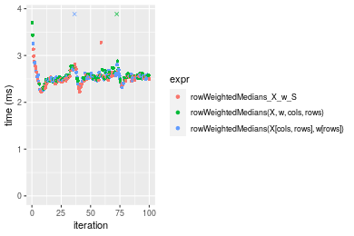
_Table: Benchmarking of colWeightedMedians_X_w_S() and rowWeightedMedians_X_w_S() on 10x1000 data (original and transposed).  The top panel shows times in milliseconds and the bottom panel shows relative times._


|   |expr                     |      min|       lq|     mean|   median|       uq|      max|
|:--|:------------------------|--------:|--------:|--------:|--------:|--------:|--------:|
|2  |rowWeightedMedians_X_w_S | 2.222791| 2.423980| 2.513887| 2.510527| 2.560751| 3.277597|
|1  |colWeightedMedians_X_w_S | 2.255763| 2.447366| 2.622357| 2.516212| 2.587087| 9.047498|


|   |expr                     |      min|       lq|     mean|   median|       uq|      max|
|:--|:------------------------|--------:|--------:|--------:|--------:|--------:|--------:|
|2  |rowWeightedMedians_X_w_S | 1.000000| 1.000000| 1.000000| 1.000000| 1.000000| 1.000000|
|1  |colWeightedMedians_X_w_S | 1.014834| 1.009648| 1.043148| 1.002264| 1.010285| 2.760406|

_Figure: Benchmarking of colWeightedMedians_X_w_S() and rowWeightedMedians_X_w_S() on 10x1000 data (original and transposed).  Outliers are displayed as crosses. Times are in milliseconds._


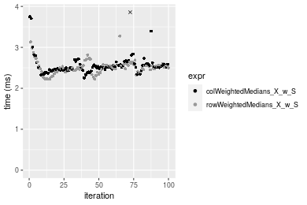

### 100x1000 matrix


```r
> X <- data[["100x1000"]]
> rows <- sample.int(nrow(X), size = nrow(X) * 0.7)
> cols <- sample.int(ncol(X), size = ncol(X) * 0.7)
> X_S <- X[rows, cols]
> w <- runif(nrow(X))
> w_S <- w[rows]
> gc()
           used  (Mb) gc trigger  (Mb) max used  (Mb)
Ncells  5322665 284.3    8529671 455.6  8529671 455.6
Vcells 10502411  80.2   31876688 243.2 60562128 462.1
> colStats <- microbenchmark(colWeightedMedians_X_w_S = colWeightedMedians(X_S, w = w_S, na.rm = FALSE), 
+     `colWeightedMedians(X, w, rows, cols)` = colWeightedMedians(X, w = w, rows = rows, cols = cols, 
+         na.rm = FALSE), `colWeightedMedians(X[rows, cols], w[rows])` = colWeightedMedians(X[rows, 
+         cols], w = w[rows], na.rm = FALSE), unit = "ms")
> X <- t(X)
> X_S <- t(X_S)
> gc()
           used  (Mb) gc trigger  (Mb) max used  (Mb)
Ncells  5322647 284.3    8529671 455.6  8529671 455.6
Vcells 10602474  80.9   31876688 243.2 60562128 462.1
> rowStats <- microbenchmark(rowWeightedMedians_X_w_S = rowWeightedMedians(X_S, w = w_S, na.rm = FALSE), 
+     `rowWeightedMedians(X, w, cols, rows)` = rowWeightedMedians(X, w = w, rows = cols, cols = rows, 
+         na.rm = FALSE), `rowWeightedMedians(X[cols, rows], w[rows])` = rowWeightedMedians(X[cols, 
+         rows], w = w[rows], na.rm = FALSE), unit = "ms")
```

_Table: Benchmarking of colWeightedMedians_X_w_S(), colWeightedMedians(X, w, rows, cols)() and colWeightedMedians(X[rows, cols], w[rows])() on 100x1000 data. The top panel shows times in milliseconds and the bottom panel shows relative times._


|   |expr                                       |      min|       lq|     mean|   median|       uq|       max|
|:--|:------------------------------------------|--------:|--------:|--------:|--------:|--------:|---------:|
|1  |colWeightedMedians_X_w_S                   | 4.311679| 4.741583| 4.956463| 4.791073| 4.830357| 21.410768|
|3  |colWeightedMedians(X[rows, cols], w[rows]) | 4.393377| 4.883563| 5.138474| 4.936115| 5.002079| 21.825685|
|2  |colWeightedMedians(X, w, rows, cols)       | 4.404769| 4.925762| 5.076675| 4.989513| 5.077012|  7.161016|


|   |expr                                       |      min|       lq|     mean|   median|       uq|       max|
|:--|:------------------------------------------|--------:|--------:|--------:|--------:|--------:|---------:|
|1  |colWeightedMedians_X_w_S                   | 1.000000| 1.000000| 1.000000| 1.000000| 1.000000| 1.0000000|
|3  |colWeightedMedians(X[rows, cols], w[rows]) | 1.018948| 1.029944| 1.036722| 1.030274| 1.035551| 1.0193789|
|2  |colWeightedMedians(X, w, rows, cols)       | 1.021590| 1.038843| 1.024254| 1.041419| 1.051063| 0.3344586|

_Table: Benchmarking of rowWeightedMedians_X_w_S(), rowWeightedMedians(X, w, cols, rows)() and rowWeightedMedians(X[cols, rows], w[rows])() on 100x1000 data (transposed). The top panel shows times in milliseconds and the bottom panel shows relative times._


|   |expr                                       |      min|       lq|     mean|   median|       uq|       max|
|:--|:------------------------------------------|--------:|--------:|--------:|--------:|--------:|---------:|
|1  |rowWeightedMedians_X_w_S                   | 4.374137| 4.838030| 5.129654| 4.905475| 4.956457| 21.734457|
|2  |rowWeightedMedians(X, w, cols, rows)       | 4.486593| 4.932139| 4.989111| 4.996608| 5.054518|  5.998196|
|3  |rowWeightedMedians(X[cols, rows], w[rows]) | 4.505412| 4.920116| 5.160906| 5.007936| 5.052717| 21.755484|


|   |expr                                       |      min|       lq|      mean|   median|       uq|       max|
|:--|:------------------------------------------|--------:|--------:|---------:|--------:|--------:|---------:|
|1  |rowWeightedMedians_X_w_S                   | 1.000000| 1.000000| 1.0000000| 1.000000| 1.000000| 1.0000000|
|2  |rowWeightedMedians(X, w, cols, rows)       | 1.025709| 1.019452| 0.9726017| 1.018578| 1.019784| 0.2759763|
|3  |rowWeightedMedians(X[cols, rows], w[rows]) | 1.030012| 1.016967| 1.0060923| 1.020887| 1.019421| 1.0009674|

_Figure: Benchmarking of colWeightedMedians_X_w_S(), colWeightedMedians(X, w, rows, cols)() and colWeightedMedians(X[rows, cols], w[rows])() on 100x1000 data  as well as rowWeightedMedians_X_w_S(), rowWeightedMedians(X, w, cols, rows)() and rowWeightedMedians(X[cols, rows], w[rows])() on the same data transposed.  Outliers are displayed as crosses.  Times are in milliseconds._


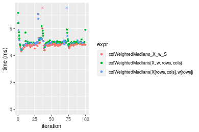

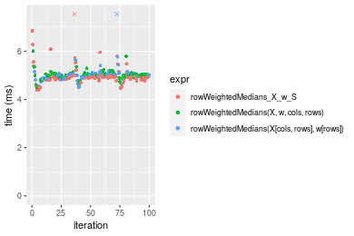
_Table: Benchmarking of colWeightedMedians_X_w_S() and rowWeightedMedians_X_w_S() on 100x1000 data (original and transposed).  The top panel shows times in milliseconds and the bottom panel shows relative times._


|   |expr                     |      min|       lq|     mean|   median|       uq|      max|
|:--|:------------------------|--------:|--------:|--------:|--------:|--------:|--------:|
|1  |colWeightedMedians_X_w_S | 4.311679| 4.741583| 4.956463| 4.791073| 4.830357| 21.41077|
|2  |rowWeightedMedians_X_w_S | 4.374137| 4.838030| 5.129654| 4.905475| 4.956457| 21.73446|


|   |expr                     |      min|       lq|     mean|   median|       uq|      max|
|:--|:------------------------|--------:|--------:|--------:|--------:|--------:|--------:|
|1  |colWeightedMedians_X_w_S | 1.000000| 1.000000| 1.000000| 1.000000| 1.000000| 1.000000|
|2  |rowWeightedMedians_X_w_S | 1.014486| 1.020341| 1.034943| 1.023878| 1.026106| 1.015118|

_Figure: Benchmarking of colWeightedMedians_X_w_S() and rowWeightedMedians_X_w_S() on 100x1000 data (original and transposed).  Outliers are displayed as crosses. Times are in milliseconds._


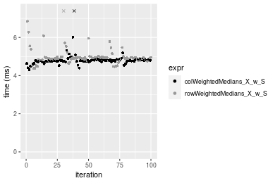

### 1000x100 matrix


```r
> X <- data[["1000x100"]]
> rows <- sample.int(nrow(X), size = nrow(X) * 0.7)
> cols <- sample.int(ncol(X), size = ncol(X) * 0.7)
> X_S <- X[rows, cols]
> w <- runif(nrow(X))
> w_S <- w[rows]
> gc()
           used  (Mb) gc trigger  (Mb) max used  (Mb)
Ncells  5322871 284.3    8529671 455.6  8529671 455.6
Vcells 10504742  80.2   31876688 243.2 60562128 462.1
> colStats <- microbenchmark(colWeightedMedians_X_w_S = colWeightedMedians(X_S, w = w_S, na.rm = FALSE), 
+     `colWeightedMedians(X, w, rows, cols)` = colWeightedMedians(X, w = w, rows = rows, cols = cols, 
+         na.rm = FALSE), `colWeightedMedians(X[rows, cols], w[rows])` = colWeightedMedians(X[rows, 
+         cols], w = w[rows], na.rm = FALSE), unit = "ms")
> X <- t(X)
> X_S <- t(X_S)
> gc()
           used  (Mb) gc trigger  (Mb) max used  (Mb)
Ncells  5322853 284.3    8529671 455.6  8529671 455.6
Vcells 10604805  81.0   31876688 243.2 60562128 462.1
> rowStats <- microbenchmark(rowWeightedMedians_X_w_S = rowWeightedMedians(X_S, w = w_S, na.rm = FALSE), 
+     `rowWeightedMedians(X, w, cols, rows)` = rowWeightedMedians(X, w = w, rows = cols, cols = rows, 
+         na.rm = FALSE), `rowWeightedMedians(X[cols, rows], w[rows])` = rowWeightedMedians(X[cols, 
+         rows], w = w[rows], na.rm = FALSE), unit = "ms")
```

_Table: Benchmarking of colWeightedMedians_X_w_S(), colWeightedMedians(X, w, rows, cols)() and colWeightedMedians(X[rows, cols], w[rows])() on 1000x100 data. The top panel shows times in milliseconds and the bottom panel shows relative times._


|   |expr                                       |      min|       lq|     mean|   median|       uq|       max|
|:--|:------------------------------------------|--------:|--------:|--------:|--------:|--------:|---------:|
|1  |colWeightedMedians_X_w_S                   | 2.730721| 2.975335| 3.051785| 3.033352| 3.054703|  4.592462|
|3  |colWeightedMedians(X[rows, cols], w[rows]) | 2.876968| 3.092077| 3.269317| 3.157447| 3.183505| 11.976339|
|2  |colWeightedMedians(X, w, rows, cols)       | 2.819557| 3.096354| 3.269797| 3.160439| 3.191239| 12.535302|


|   |expr                                       |      min|       lq|     mean|   median|       uq|      max|
|:--|:------------------------------------------|--------:|--------:|--------:|--------:|--------:|--------:|
|1  |colWeightedMedians_X_w_S                   | 1.000000| 1.000000| 1.000000| 1.000000| 1.000000| 1.000000|
|3  |colWeightedMedians(X[rows, cols], w[rows]) | 1.053556| 1.039236| 1.071280| 1.040910| 1.042165| 2.607825|
|2  |colWeightedMedians(X, w, rows, cols)       | 1.032532| 1.040674| 1.071438| 1.041896| 1.044697| 2.729538|

_Table: Benchmarking of rowWeightedMedians_X_w_S(), rowWeightedMedians(X, w, cols, rows)() and rowWeightedMedians(X[cols, rows], w[rows])() on 1000x100 data (transposed). The top panel shows times in milliseconds and the bottom panel shows relative times._


|   |expr                                       |      min|       lq|     mean|   median|       uq|       max|
|:--|:------------------------------------------|--------:|--------:|--------:|--------:|--------:|---------:|
|1  |rowWeightedMedians_X_w_S                   | 2.776292| 3.010362| 3.084377| 3.043135| 3.087946|  4.491698|
|3  |rowWeightedMedians(X[cols, rows], w[rows]) | 2.857283| 3.130842| 3.216857| 3.186015| 3.230631|  4.242627|
|2  |rowWeightedMedians(X, w, cols, rows)       | 2.839546| 3.110234| 3.399287| 3.186598| 3.242221| 12.830877|


|   |expr                                       |      min|       lq|     mean|   median|       uq|       max|
|:--|:------------------------------------------|--------:|--------:|--------:|--------:|--------:|---------:|
|1  |rowWeightedMedians_X_w_S                   | 1.000000| 1.000000| 1.000000| 1.000000| 1.000000| 1.0000000|
|3  |rowWeightedMedians(X[cols, rows], w[rows]) | 1.029172| 1.040022| 1.042952| 1.046951| 1.046207| 0.9445486|
|2  |rowWeightedMedians(X, w, cols, rows)       | 1.022784| 1.033176| 1.102099| 1.047143| 1.049960| 2.8565761|

_Figure: Benchmarking of colWeightedMedians_X_w_S(), colWeightedMedians(X, w, rows, cols)() and colWeightedMedians(X[rows, cols], w[rows])() on 1000x100 data  as well as rowWeightedMedians_X_w_S(), rowWeightedMedians(X, w, cols, rows)() and rowWeightedMedians(X[cols, rows], w[rows])() on the same data transposed.  Outliers are displayed as crosses.  Times are in milliseconds._


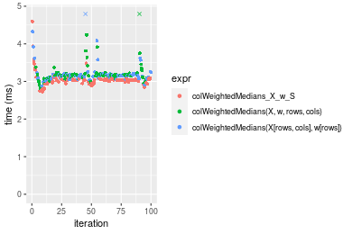

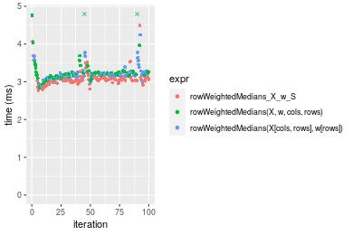
_Table: Benchmarking of colWeightedMedians_X_w_S() and rowWeightedMedians_X_w_S() on 1000x100 data (original and transposed).  The top panel shows times in milliseconds and the bottom panel shows relative times._


|   |expr                     |      min|       lq|     mean|   median|       uq|      max|
|:--|:------------------------|--------:|--------:|--------:|--------:|--------:|--------:|
|1  |colWeightedMedians_X_w_S | 2.730721| 2.975335| 3.051785| 3.033352| 3.054703| 4.592462|
|2  |rowWeightedMedians_X_w_S | 2.776292| 3.010362| 3.084377| 3.043135| 3.087946| 4.491698|


|   |expr                     |      min|       lq|     mean|   median|       uq|       max|
|:--|:------------------------|--------:|--------:|--------:|--------:|--------:|---------:|
|1  |colWeightedMedians_X_w_S | 1.000000| 1.000000| 1.000000| 1.000000| 1.000000| 1.0000000|
|2  |rowWeightedMedians_X_w_S | 1.016688| 1.011772| 1.010679| 1.003225| 1.010883| 0.9780588|

_Figure: Benchmarking of colWeightedMedians_X_w_S() and rowWeightedMedians_X_w_S() on 1000x100 data (original and transposed).  Outliers are displayed as crosses. Times are in milliseconds._


## Appendix

### Session information
```r
R version 4.1.1 Patched (2021-08-10 r80727)
Platform: x86_64-pc-linux-gnu (64-bit)
Running under: Ubuntu 18.04.5 LTS

Matrix products: default
BLAS:   /home/hb/software/R-devel/R-4-1-branch/lib/R/lib/libRblas.so
LAPACK: /home/hb/software/R-devel/R-4-1-branch/lib/R/lib/libRlapack.so

locale:
 [1] LC_CTYPE=en_US.UTF-8       LC_NUMERIC=C              
 [3] LC_TIME=en_US.UTF-8        LC_COLLATE=en_US.UTF-8    
 [5] LC_MONETARY=en_US.UTF-8    LC_MESSAGES=en_US.UTF-8   
 [7] LC_PAPER=en_US.UTF-8       LC_NAME=C                 
 [9] LC_ADDRESS=C               LC_TELEPHONE=C            
[11] LC_MEASUREMENT=en_US.UTF-8 LC_IDENTIFICATION=C       

attached base packages:
[1] stats     graphics  grDevices utils     datasets  methods   base     

other attached packages:
[1] microbenchmark_1.4-7   matrixStats_0.60.1     ggplot2_3.3.5         
[4] knitr_1.33             R.devices_2.17.0       R.utils_2.10.1        
[7] R.oo_1.24.0            R.methodsS3_1.8.1-9001 history_0.0.1-9000    

loaded via a namespace (and not attached):
 [1] Biobase_2.52.0          httr_1.4.2              splines_4.1.1          
 [4] bit64_4.0.5             network_1.17.1          assertthat_0.2.1       
 [7] highr_0.9               stats4_4.1.1            blob_1.2.2             
[10] GenomeInfoDbData_1.2.6  robustbase_0.93-8       pillar_1.6.2           
[13] RSQLite_2.2.8           lattice_0.20-44         glue_1.4.2             
[16] digest_0.6.27           XVector_0.32.0          colorspace_2.0-2       
[19] Matrix_1.3-4            XML_3.99-0.7            pkgconfig_2.0.3        
[22] zlibbioc_1.38.0         genefilter_1.74.0       purrr_0.3.4            
[25] ergm_4.1.2              xtable_1.8-4            scales_1.1.1           
[28] tibble_3.1.4            annotate_1.70.0         KEGGREST_1.32.0        
[31] farver_2.1.0            generics_0.1.0          IRanges_2.26.0         
[34] ellipsis_0.3.2          cachem_1.0.6            withr_2.4.2            
[37] BiocGenerics_0.38.0     mime_0.11               survival_3.2-13        
[40] magrittr_2.0.1          crayon_1.4.1            statnet.common_4.5.0   
[43] memoise_2.0.0           laeken_0.5.1            fansi_0.5.0            
[46] R.cache_0.15.0          MASS_7.3-54             R.rsp_0.44.0           
[49] progressr_0.8.0         tools_4.1.1             lifecycle_1.0.0        
[52] S4Vectors_0.30.0        trust_0.1-8             munsell_0.5.0          
[55] tabby_0.0.1-9001        AnnotationDbi_1.54.1    Biostrings_2.60.2      
[58] compiler_4.1.1          GenomeInfoDb_1.28.1     rlang_0.4.11           
[61] grid_4.1.1              RCurl_1.98-1.4          cwhmisc_6.6            
[64] rappdirs_0.3.3          startup_0.15.0          labeling_0.4.2         
[67] bitops_1.0-7            base64enc_0.1-3         boot_1.3-28            
[70] gtable_0.3.0            DBI_1.1.1               markdown_1.1           
[73] R6_2.5.1                lpSolveAPI_5.5.2.0-17.7 rle_0.9.2              
[76] dplyr_1.0.7             fastmap_1.1.0           bit_4.0.4              
[79] utf8_1.2.2              parallel_4.1.1          Rcpp_1.0.7             
[82] vctrs_0.3.8             png_0.1-7               DEoptimR_1.0-9         
[85] tidyselect_1.1.1        xfun_0.25               coda_0.19-4            
```
Total processing time was 18.68 secs.


### Reproducibility
To reproduce this report, do:
```r
html <- matrixStats:::benchmark('colRowWeightedMedians_subset')
```

[RSP]: https://cran.r-project.org/package=R.rsp
[matrixStats]: https://cran.r-project.org/package=matrixStats

[StackOverflow:colMins?]: https://stackoverflow.com/questions/13676878 "Stack Overflow: fastest way to get Min from every column in a matrix?"
[StackOverflow:colSds?]: https://stackoverflow.com/questions/17549762 "Stack Overflow: Is there such 'colsd' in R?"
[StackOverflow:rowProds?]: https://stackoverflow.com/questions/20198801/ "Stack Overflow: Row product of matrix and column sum of matrix"

---------------------------------------
Copyright Dongcan Jiang. Last updated on 2021-08-25 19:11:59 (+0200 UTC). Powered by [RSP].

<script>
 var link = document.createElement('link');
 link.rel = 'icon';
 link.href = "data:image/png;base64,iVBORw0KGgoAAAANSUhEUgAAACAAAAAgCAMAAABEpIrGAAAA21BMVEUAAAAAAP8AAP8AAP8AAP8AAP8AAP8AAP8AAP8AAP8AAP8AAP8AAP8AAP8AAP8AAP8AAP8AAP8AAP8AAP8AAP8AAP8AAP8AAP8AAP8AAP8AAP8AAP8AAP8AAP8AAP8AAP8AAP8AAP8AAP8AAP8AAP8AAP8AAP8AAP8AAP8AAP8BAf4CAv0DA/wdHeIeHuEfH+AgIN8hId4lJdomJtknJ9g+PsE/P8BAQL9yco10dIt1dYp3d4h4eIeVlWqWlmmXl2iYmGeZmWabm2Tn5xjo6Bfp6Rb39wj4+Af//wA2M9hbAAAASXRSTlMAAQIJCgsMJSYnKD4/QGRlZmhpamtsbautrrCxuru8y8zN5ebn6Pn6+///////////////////////////////////////////LsUNcQAAAS9JREFUOI29k21XgkAQhVcFytdSMqMETU26UVqGmpaiFbL//xc1cAhhwVNf6n5i5z67M2dmYOyfJZUqlVLhkKucG7cgmUZTybDz6g0iDeq51PUr37Ds2cy2/C9NeES5puDjxuUk1xnToZsg8pfA3avHQ3lLIi7iWRrkv/OYtkScxBIMgDee0ALoyxHQBJ68JLCjOtQIMIANF7QG9G9fNnHvisCHBVMKgSJgiz7nE+AoBKrAPA3MgepvgR9TSCasrCKH0eB1wBGBFdCO+nAGjMVGPcQb5bd6mQRegN6+1axOs9nGfYcCtfi4NQosdtH7dB+txFIpXQqN1p9B/asRHToyS0jRgpV7nk4nwcq1BJ+x3Gl/v7S9Wmpp/aGquum7w3ZDyrADFYrl8vHBH+ev9AUASW1dmU4h4wAAAABJRU5ErkJggg=="
 document.getElementsByTagName('head')[0].appendChild(link);
</script>


