[matrixStats]: Benchmark report

---------------------------------------


# indexByRow() benchmarks

This report benchmark the performance of `indexByRow()` against alternative methods:

* `indexByRow_R1()` based in `matrix(..., byrow = TRUE)`
* `indexByRow_R2()` is a modified version of `indexByRow_R1()`

where `indexByRow_R1()` and `indexByRow_R2()` are defined as in the Appendix.


## Data

```r
> data <- rmatrices(mode = "index")
```
where `rmatrices()` is defined in the Appendix.


## Results

### 10x10 matrix


```r
> X <- data[["10x10"]]
> dim <- dim(X)
> idxsList <- list(`all-by-NULL` = NULL, all = seq_len(prod(dim)), odd = seq(from = 1, to = prod(dim), 
+     by = 2L))
> str(idxsList)
List of 3
 $ all-by-NULL: NULL
 $ all        : int [1:100] 1 2 3 4 5 6 7 8 9 10 ...
 $ odd        : num [1:50] 1 3 5 7 9 11 13 15 17 19 ...
```


#### Index set 'all-by-NULL'

```r
> stats <- microbenchmark(indexByRow = indexByRow(dim, idxs = idxs), indexByRow_R1 = indexByRow_R1(dim, 
+     idxs = idxs), indexByRow_R2 = indexByRow_R2(dim, idxs = idxs), unit = "ms")
```

_Table: Benchmarking of indexByRow(), indexByRow_R1() and indexByRow_R2() on 10x10+all-by-NULL data. The top panel shows times in milliseconds and the bottom panel shows relative times._


|   |expr          |      min|        lq|      mean|    median|        uq|      max|
|:--|:-------------|--------:|---------:|---------:|---------:|---------:|--------:|
|1  |indexByRow    | 0.001299| 0.0015820| 0.0018379| 0.0017665| 0.0018650| 0.009142|
|3  |indexByRow_R2 | 0.005909| 0.0065965| 0.0068262| 0.0067405| 0.0069570| 0.011900|
|2  |indexByRow_R1 | 0.006170| 0.0066940| 0.0071205| 0.0068535| 0.0070345| 0.030130|


|   |expr          |      min|       lq|     mean|   median|       uq|      max|
|:--|:-------------|--------:|--------:|--------:|--------:|--------:|--------:|
|1  |indexByRow    | 1.000000| 1.000000| 1.000000| 1.000000| 1.000000| 1.000000|
|3  |indexByRow_R2 | 4.548884| 4.169722| 3.714200| 3.815737| 3.730295| 1.301684|
|2  |indexByRow_R1 | 4.749808| 4.231353| 3.874354| 3.879706| 3.771850| 3.295778|

_Figure: Benchmarking of indexByRow(), indexByRow_R1() and indexByRow_R2() on 10x10+all-by-NULL data.  Outliers are displayed as crosses.  Times are in milliseconds._

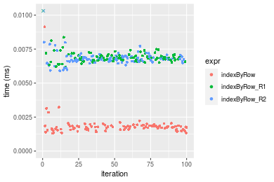


#### Index set 'all'

```r
> stats <- microbenchmark(indexByRow = indexByRow(dim, idxs = idxs), indexByRow_R1 = indexByRow_R1(dim, 
+     idxs = idxs), indexByRow_R2 = indexByRow_R2(dim, idxs = idxs), unit = "ms")
```

_Table: Benchmarking of indexByRow(), indexByRow_R1() and indexByRow_R2() on 10x10+all data. The top panel shows times in milliseconds and the bottom panel shows relative times._


|   |expr          |      min|        lq|      mean|   median|        uq|      max|
|:--|:-------------|--------:|---------:|---------:|--------:|---------:|--------:|
|1  |indexByRow    | 0.002651| 0.0028410| 0.0030917| 0.003025| 0.0031490| 0.010353|
|2  |indexByRow_R1 | 0.006865| 0.0074755| 0.0081541| 0.007747| 0.0081120| 0.022752|
|3  |indexByRow_R2 | 0.008505| 0.0091020| 0.0095135| 0.009320| 0.0095155| 0.026926|


|   |expr          |      min|       lq|     mean|   median|       uq|      max|
|:--|:-------------|--------:|--------:|--------:|--------:|--------:|--------:|
|1  |indexByRow    | 1.000000| 1.000000| 1.000000| 1.000000| 1.000000| 1.000000|
|2  |indexByRow_R1 | 2.589589| 2.631292| 2.637413| 2.560992| 2.576056| 2.197624|
|3  |indexByRow_R2 | 3.208223| 3.203801| 3.077106| 3.080992| 3.021753| 2.600792|

_Figure: Benchmarking of indexByRow(), indexByRow_R1() and indexByRow_R2() on 10x10+all data.  Outliers are displayed as crosses.  Times are in milliseconds._

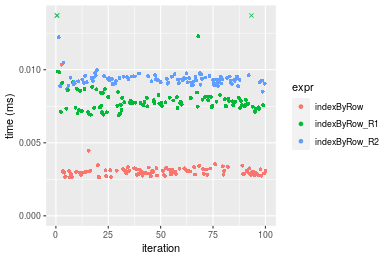


#### Index set 'odd'

```r
> stats <- microbenchmark(indexByRow = indexByRow(dim, idxs = idxs), indexByRow_R1 = indexByRow_R1(dim, 
+     idxs = idxs), indexByRow_R2 = indexByRow_R2(dim, idxs = idxs), unit = "ms")
```

_Table: Benchmarking of indexByRow(), indexByRow_R1() and indexByRow_R2() on 10x10+odd data. The top panel shows times in milliseconds and the bottom panel shows relative times._


|   |expr          |      min|        lq|      mean|    median|        uq|      max|
|:--|:-------------|--------:|---------:|---------:|---------:|---------:|--------:|
|1  |indexByRow    | 0.002170| 0.0026120| 0.0028964| 0.0027420| 0.0029275| 0.015684|
|3  |indexByRow_R2 | 0.005774| 0.0066035| 0.0069382| 0.0068375| 0.0069935| 0.015883|
|2  |indexByRow_R1 | 0.006599| 0.0075625| 0.0080337| 0.0077960| 0.0080375| 0.026498|


|   |expr          |      min|       lq|     mean|   median|       uq|      max|
|:--|:-------------|--------:|--------:|--------:|--------:|--------:|--------:|
|1  |indexByRow    | 1.000000| 1.000000| 1.000000| 1.000000| 1.000000| 1.000000|
|3  |indexByRow_R2 | 2.660830| 2.528139| 2.395483| 2.493618| 2.388898| 1.012688|
|2  |indexByRow_R1 | 3.041014| 2.895291| 2.773709| 2.843180| 2.745517| 1.689493|

_Figure: Benchmarking of indexByRow(), indexByRow_R1() and indexByRow_R2() on 10x10+odd data.  Outliers are displayed as crosses.  Times are in milliseconds._

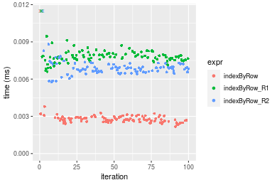


### 100x100 matrix


```r
> X <- data[["100x100"]]
> dim <- dim(X)
> idxsList <- list(`all-by-NULL` = NULL, all = seq_len(prod(dim)), odd = seq(from = 1, to = prod(dim), 
+     by = 2L))
> str(idxsList)
List of 3
 $ all-by-NULL: NULL
 $ all        : int [1:10000] 1 2 3 4 5 6 7 8 9 10 ...
 $ odd        : num [1:5000] 1 3 5 7 9 11 13 15 17 19 ...
```


#### Index set 'all-by-NULL'

```r
> stats <- microbenchmark(indexByRow = indexByRow(dim, idxs = idxs), indexByRow_R1 = indexByRow_R1(dim, 
+     idxs = idxs), indexByRow_R2 = indexByRow_R2(dim, idxs = idxs), unit = "ms")
```

_Table: Benchmarking of indexByRow(), indexByRow_R1() and indexByRow_R2() on 100x100+all-by-NULL data. The top panel shows times in milliseconds and the bottom panel shows relative times._


|   |expr          |      min|        lq|      mean|    median|        uq|      max|
|:--|:-------------|--------:|---------:|---------:|---------:|---------:|--------:|
|1  |indexByRow    | 0.014707| 0.0157655| 0.0169439| 0.0166400| 0.0177275| 0.029435|
|3  |indexByRow_R2 | 0.071444| 0.0762680| 0.0818437| 0.0799215| 0.0864430| 0.125276|
|2  |indexByRow_R1 | 0.072069| 0.0779185| 0.0825318| 0.0814940| 0.0860730| 0.109465|


|   |expr          |      min|       lq|     mean|   median|       uq|      max|
|:--|:-------------|--------:|--------:|--------:|--------:|--------:|--------:|
|1  |indexByRow    | 1.000000| 1.000000| 1.000000| 1.000000| 1.000000| 1.000000|
|3  |indexByRow_R2 | 4.857823| 4.837652| 4.830278| 4.802975| 4.876209| 4.256022|
|2  |indexByRow_R1 | 4.900320| 4.942342| 4.870888| 4.897476| 4.855338| 3.718872|

_Figure: Benchmarking of indexByRow(), indexByRow_R1() and indexByRow_R2() on 100x100+all-by-NULL data.  Outliers are displayed as crosses.  Times are in milliseconds._

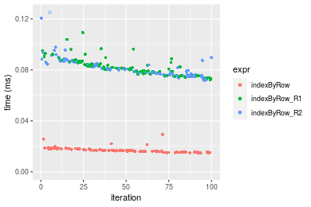


#### Index set 'all'

```r
> stats <- microbenchmark(indexByRow = indexByRow(dim, idxs = idxs), indexByRow_R1 = indexByRow_R1(dim, 
+     idxs = idxs), indexByRow_R2 = indexByRow_R2(dim, idxs = idxs), unit = "ms")
```

_Table: Benchmarking of indexByRow(), indexByRow_R1() and indexByRow_R2() on 100x100+all data. The top panel shows times in milliseconds and the bottom panel shows relative times._


|   |expr          |      min|       lq|      mean|    median|       uq|      max|
|:--|:-------------|--------:|--------:|---------:|---------:|--------:|--------:|
|2  |indexByRow_R1 | 0.072910| 0.080718| 0.0902224| 0.0901955| 0.096851| 0.142181|
|1  |indexByRow    | 0.078984| 0.086229| 0.0990125| 0.0966650| 0.106715| 0.137972|
|3  |indexByRow_R2 | 0.298727| 0.318073| 0.3661331| 0.3549020| 0.400063| 0.504130|


|   |expr          |      min|       lq|     mean|   median|       uq|       max|
|:--|:-------------|--------:|--------:|--------:|--------:|--------:|---------:|
|2  |indexByRow_R1 | 1.000000| 1.000000| 1.000000| 1.000000| 1.000000| 1.0000000|
|1  |indexByRow    | 1.083308| 1.068275| 1.097427| 1.071727| 1.101847| 0.9703969|
|3  |indexByRow_R2 | 4.097202| 3.940546| 4.058118| 3.934808| 4.130706| 3.5456918|

_Figure: Benchmarking of indexByRow(), indexByRow_R1() and indexByRow_R2() on 100x100+all data.  Outliers are displayed as crosses.  Times are in milliseconds._

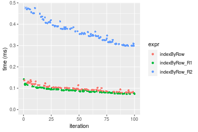


#### Index set 'odd'

```r
> stats <- microbenchmark(indexByRow = indexByRow(dim, idxs = idxs), indexByRow_R1 = indexByRow_R1(dim, 
+     idxs = idxs), indexByRow_R2 = indexByRow_R2(dim, idxs = idxs), unit = "ms")
```

_Table: Benchmarking of indexByRow(), indexByRow_R1() and indexByRow_R2() on 100x100+odd data. The top panel shows times in milliseconds and the bottom panel shows relative times._


|   |expr          |      min|        lq|      mean|    median|        uq|      max|
|:--|:-------------|--------:|---------:|---------:|---------:|---------:|--------:|
|1  |indexByRow    | 0.052460| 0.0580035| 0.0624434| 0.0613560| 0.0660955| 0.083137|
|2  |indexByRow_R1 | 0.084546| 0.0917165| 0.0991287| 0.0963445| 0.1056215| 0.137692|
|3  |indexByRow_R2 | 0.167735| 0.1826280| 0.1959618| 0.1942570| 0.2084645| 0.255780|


|   |expr          |      min|       lq|     mean|   median|       uq|      max|
|:--|:-------------|--------:|--------:|--------:|--------:|--------:|--------:|
|1  |indexByRow    | 1.000000| 1.000000| 1.000000| 1.000000| 1.000000| 1.000000|
|2  |indexByRow_R1 | 1.611628| 1.581223| 1.587497| 1.570254| 1.598013| 1.656206|
|3  |indexByRow_R2 | 3.197389| 3.148569| 3.138229| 3.166064| 3.153989| 3.076608|

_Figure: Benchmarking of indexByRow(), indexByRow_R1() and indexByRow_R2() on 100x100+odd data.  Outliers are displayed as crosses.  Times are in milliseconds._

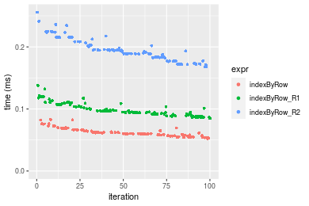


### 1000x10 matrix


```r
> X <- data[["1000x10"]]
> dim <- dim(X)
> idxsList <- list(`all-by-NULL` = NULL, all = seq_len(prod(dim)), odd = seq(from = 1, to = prod(dim), 
+     by = 2L))
> str(idxsList)
List of 3
 $ all-by-NULL: NULL
 $ all        : int [1:10000] 1 2 3 4 5 6 7 8 9 10 ...
 $ odd        : num [1:5000] 1 3 5 7 9 11 13 15 17 19 ...
```


#### Index set 'all-by-NULL'

```r
> stats <- microbenchmark(indexByRow = indexByRow(dim, idxs = idxs), indexByRow_R1 = indexByRow_R1(dim, 
+     idxs = idxs), indexByRow_R2 = indexByRow_R2(dim, idxs = idxs), unit = "ms")
```

_Table: Benchmarking of indexByRow(), indexByRow_R1() and indexByRow_R2() on 1000x10+all-by-NULL data. The top panel shows times in milliseconds and the bottom panel shows relative times._


|   |expr          |      min|        lq|      mean|    median|        uq|      max|
|:--|:-------------|--------:|---------:|---------:|---------:|---------:|--------:|
|1  |indexByRow    | 0.013854| 0.0152330| 0.0164959| 0.0160885| 0.0170400| 0.028068|
|3  |indexByRow_R2 | 0.069970| 0.0760695| 0.0806432| 0.0794470| 0.0847020| 0.100642|
|2  |indexByRow_R1 | 0.070949| 0.0755335| 0.0830653| 0.0817080| 0.0853975| 0.229437|


|   |expr          |      min|       lq|     mean|   median|       uq|      max|
|:--|:-------------|--------:|--------:|--------:|--------:|--------:|--------:|
|1  |indexByRow    | 1.000000| 1.000000| 1.000000| 1.000000| 1.000000| 1.000000|
|3  |indexByRow_R2 | 5.050527| 4.993731| 4.888670| 4.938123| 4.970775| 3.585649|
|2  |indexByRow_R1 | 5.121192| 4.958544| 5.035497| 5.078659| 5.011590| 8.174327|

_Figure: Benchmarking of indexByRow(), indexByRow_R1() and indexByRow_R2() on 1000x10+all-by-NULL data.  Outliers are displayed as crosses.  Times are in milliseconds._

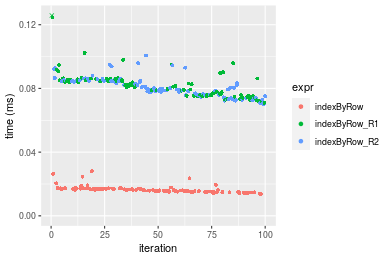


#### Index set 'all'

```r
> stats <- microbenchmark(indexByRow = indexByRow(dim, idxs = idxs), indexByRow_R1 = indexByRow_R1(dim, 
+     idxs = idxs), indexByRow_R2 = indexByRow_R2(dim, idxs = idxs), unit = "ms")
```

_Table: Benchmarking of indexByRow(), indexByRow_R1() and indexByRow_R2() on 1000x10+all data. The top panel shows times in milliseconds and the bottom panel shows relative times._


|   |expr          |      min|        lq|      mean|    median|        uq|      max|
|:--|:-------------|--------:|---------:|---------:|---------:|---------:|--------:|
|2  |indexByRow_R1 | 0.072431| 0.0765610| 0.0887787| 0.0887680| 0.0961470| 0.126798|
|1  |indexByRow    | 0.079205| 0.0860535| 0.0995028| 0.0989155| 0.1069795| 0.141722|
|3  |indexByRow_R2 | 0.298908| 0.3254525| 0.3678825| 0.3571470| 0.3919725| 0.513092|


|   |expr          |      min|       lq|     mean|   median|       uq|      max|
|:--|:-------------|--------:|--------:|--------:|--------:|--------:|--------:|
|2  |indexByRow_R1 | 1.000000| 1.000000| 1.000000| 1.000000| 1.000000| 1.000000|
|1  |indexByRow    | 1.093524| 1.123986| 1.120796| 1.114315| 1.112666| 1.117699|
|3  |indexByRow_R2 | 4.126797| 4.250891| 4.143814| 4.023376| 4.076804| 4.046531|

_Figure: Benchmarking of indexByRow(), indexByRow_R1() and indexByRow_R2() on 1000x10+all data.  Outliers are displayed as crosses.  Times are in milliseconds._

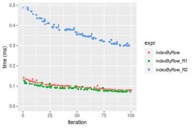


#### Index set 'odd'

```r
> stats <- microbenchmark(indexByRow = indexByRow(dim, idxs = idxs), indexByRow_R1 = indexByRow_R1(dim, 
+     idxs = idxs), indexByRow_R2 = indexByRow_R2(dim, idxs = idxs), unit = "ms")
```

_Table: Benchmarking of indexByRow(), indexByRow_R1() and indexByRow_R2() on 1000x10+odd data. The top panel shows times in milliseconds and the bottom panel shows relative times._


|   |expr          |      min|        lq|      mean|    median|        uq|      max|
|:--|:-------------|--------:|---------:|---------:|---------:|---------:|--------:|
|1  |indexByRow    | 0.054830| 0.0582375| 0.0635264| 0.0615535| 0.0664515| 0.087094|
|2  |indexByRow_R1 | 0.085742| 0.0927930| 0.1000789| 0.0967470| 0.1055590| 0.148024|
|3  |indexByRow_R2 | 0.171513| 0.1877405| 0.2000782| 0.1948435| 0.2152745| 0.249066|


|   |expr          |      min|       lq|     mean|   median|       uq|      max|
|:--|:-------------|--------:|--------:|--------:|--------:|--------:|--------:|
|1  |indexByRow    | 1.000000| 1.000000| 1.000000| 1.000000| 1.000000| 1.000000|
|2  |indexByRow_R1 | 1.563779| 1.593355| 1.575390| 1.571755| 1.588512| 1.699589|
|3  |indexByRow_R2 | 3.128087| 3.223705| 3.149527| 3.165433| 3.239573| 2.859738|

_Figure: Benchmarking of indexByRow(), indexByRow_R1() and indexByRow_R2() on 1000x10+odd data.  Outliers are displayed as crosses.  Times are in milliseconds._

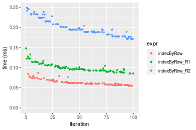


### 10x1000 matrix


```r
> X <- data[["10x1000"]]
> dim <- dim(X)
> idxsList <- list(`all-by-NULL` = NULL, all = seq_len(prod(dim)), odd = seq(from = 1, to = prod(dim), 
+     by = 2L))
> str(idxsList)
List of 3
 $ all-by-NULL: NULL
 $ all        : int [1:10000] 1 2 3 4 5 6 7 8 9 10 ...
 $ odd        : num [1:5000] 1 3 5 7 9 11 13 15 17 19 ...
```


#### Index set 'all-by-NULL'

```r
> stats <- microbenchmark(indexByRow = indexByRow(dim, idxs = idxs), indexByRow_R1 = indexByRow_R1(dim, 
+     idxs = idxs), indexByRow_R2 = indexByRow_R2(dim, idxs = idxs), unit = "ms")
```

_Table: Benchmarking of indexByRow(), indexByRow_R1() and indexByRow_R2() on 10x1000+all-by-NULL data. The top panel shows times in milliseconds and the bottom panel shows relative times._


|   |expr          |      min|        lq|      mean|    median|        uq|      max|
|:--|:-------------|--------:|---------:|---------:|---------:|---------:|--------:|
|1  |indexByRow    | 0.013077| 0.0141160| 0.0154194| 0.0152745| 0.0161520| 0.031682|
|3  |indexByRow_R2 | 0.068060| 0.0716075| 0.0772792| 0.0761455| 0.0804155| 0.118814|
|2  |indexByRow_R1 | 0.067850| 0.0719840| 0.0779652| 0.0763925| 0.0810255| 0.113477|


|   |expr          |      min|       lq|     mean|   median|       uq|      max|
|:--|:-------------|--------:|--------:|--------:|--------:|--------:|--------:|
|1  |indexByRow    | 1.000000| 1.000000| 1.000000| 1.000000| 1.000000| 1.000000|
|3  |indexByRow_R2 | 5.204558| 5.072790| 5.011807| 4.985139| 4.978671| 3.750205|
|2  |indexByRow_R1 | 5.188499| 5.099462| 5.056302| 5.001309| 5.016438| 3.581750|

_Figure: Benchmarking of indexByRow(), indexByRow_R1() and indexByRow_R2() on 10x1000+all-by-NULL data.  Outliers are displayed as crosses.  Times are in milliseconds._

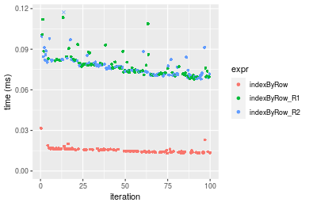


#### Index set 'all'

```r
> stats <- microbenchmark(indexByRow = indexByRow(dim, idxs = idxs), indexByRow_R1 = indexByRow_R1(dim, 
+     idxs = idxs), indexByRow_R2 = indexByRow_R2(dim, idxs = idxs), unit = "ms")
```

_Table: Benchmarking of indexByRow(), indexByRow_R1() and indexByRow_R2() on 10x1000+all data. The top panel shows times in milliseconds and the bottom panel shows relative times._


|   |expr          |      min|        lq|      mean|    median|        uq|      max|
|:--|:-------------|--------:|---------:|---------:|---------:|---------:|--------:|
|2  |indexByRow_R1 | 0.071935| 0.0802495| 0.0911010| 0.0915240| 0.1001050| 0.134227|
|1  |indexByRow    | 0.079312| 0.0863960| 0.1006102| 0.1005545| 0.1104035| 0.147812|
|3  |indexByRow_R2 | 0.292392| 0.3170705| 0.3595154| 0.3465860| 0.3822290| 0.569033|


|   |expr          |      min|       lq|     mean|   median|       uq|      max|
|:--|:-------------|--------:|--------:|--------:|--------:|--------:|--------:|
|2  |indexByRow_R1 | 1.000000| 1.000000| 1.000000| 1.000000| 1.000000| 1.000000|
|1  |indexByRow    | 1.102551| 1.076592| 1.104382| 1.098668| 1.102877| 1.101209|
|3  |indexByRow_R2 | 4.064669| 3.951059| 3.946340| 3.786832| 3.818281| 4.239333|

_Figure: Benchmarking of indexByRow(), indexByRow_R1() and indexByRow_R2() on 10x1000+all data.  Outliers are displayed as crosses.  Times are in milliseconds._

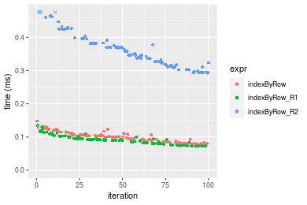


#### Index set 'odd'

```r
> stats <- microbenchmark(indexByRow = indexByRow(dim, idxs = idxs), indexByRow_R1 = indexByRow_R1(dim, 
+     idxs = idxs), indexByRow_R2 = indexByRow_R2(dim, idxs = idxs), unit = "ms")
```

_Table: Benchmarking of indexByRow(), indexByRow_R1() and indexByRow_R2() on 10x1000+odd data. The top panel shows times in milliseconds and the bottom panel shows relative times._


|   |expr          |      min|        lq|      mean|    median|       uq|      max|
|:--|:-------------|--------:|---------:|---------:|---------:|--------:|--------:|
|1  |indexByRow    | 0.055208| 0.0599835| 0.0649007| 0.0622565| 0.067882| 0.089031|
|2  |indexByRow_R1 | 0.084403| 0.0930065| 0.1009876| 0.0979790| 0.108639| 0.154516|
|3  |indexByRow_R2 | 0.168124| 0.1821755| 0.1951964| 0.1903740| 0.210525| 0.250651|


|   |expr          |      min|       lq|     mean|   median|       uq|      max|
|:--|:-------------|--------:|--------:|--------:|--------:|--------:|--------:|
|1  |indexByRow    | 1.000000| 1.000000| 1.000000| 1.000000| 1.000000| 1.000000|
|2  |indexByRow_R1 | 1.528818| 1.550535| 1.556033| 1.573795| 1.600410| 1.735530|
|3  |indexByRow_R2 | 3.045283| 3.037094| 3.007618| 3.057898| 3.101338| 2.815323|

_Figure: Benchmarking of indexByRow(), indexByRow_R1() and indexByRow_R2() on 10x1000+odd data.  Outliers are displayed as crosses.  Times are in milliseconds._

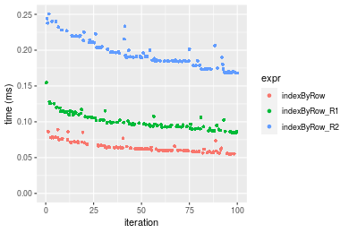


### 100x1000 matrix


```r
> X <- data[["100x1000"]]
> dim <- dim(X)
> idxsList <- list(`all-by-NULL` = NULL, all = seq_len(prod(dim)), odd = seq(from = 1, to = prod(dim), 
+     by = 2L))
> str(idxsList)
List of 3
 $ all-by-NULL: NULL
 $ all        : int [1:100000] 1 2 3 4 5 6 7 8 9 10 ...
 $ odd        : num [1:50000] 1 3 5 7 9 11 13 15 17 19 ...
```


#### Index set 'all-by-NULL'

```r
> stats <- microbenchmark(indexByRow = indexByRow(dim, idxs = idxs), indexByRow_R1 = indexByRow_R1(dim, 
+     idxs = idxs), indexByRow_R2 = indexByRow_R2(dim, idxs = idxs), unit = "ms")
```

_Table: Benchmarking of indexByRow(), indexByRow_R1() and indexByRow_R2() on 100x1000+all-by-NULL data. The top panel shows times in milliseconds and the bottom panel shows relative times._


|   |expr          |      min|        lq|      mean|    median|        uq|       max|
|:--|:-------------|--------:|---------:|---------:|---------:|---------:|---------:|
|1  |indexByRow    | 0.096349| 0.1104665| 0.1422542| 0.1195365| 0.2001225|  0.217076|
|3  |indexByRow_R2 | 0.525708| 0.5882020| 0.6891502| 0.6551905| 0.8073100|  0.856582|
|2  |indexByRow_R1 | 0.526196| 0.6100990| 0.8132235| 0.7463895| 0.8094195| 10.693230|


|   |expr          |      min|       lq|     mean|   median|       uq|      max|
|:--|:-------------|--------:|--------:|--------:|--------:|--------:|--------:|
|1  |indexByRow    | 1.000000| 1.000000| 1.000000| 1.000000| 1.000000|  1.00000|
|3  |indexByRow_R2 | 5.456289| 5.324709| 4.844498| 5.481091| 4.034079|  3.94600|
|2  |indexByRow_R1 | 5.461354| 5.522932| 5.716692| 6.244030| 4.044620| 49.26031|

_Figure: Benchmarking of indexByRow(), indexByRow_R1() and indexByRow_R2() on 100x1000+all-by-NULL data.  Outliers are displayed as crosses.  Times are in milliseconds._

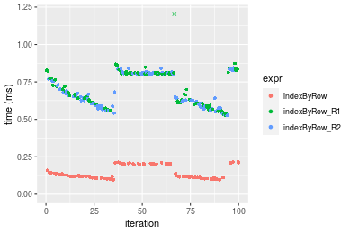


#### Index set 'all'

```r
> stats <- microbenchmark(indexByRow = indexByRow(dim, idxs = idxs), indexByRow_R1 = indexByRow_R1(dim, 
+     idxs = idxs), indexByRow_R2 = indexByRow_R2(dim, idxs = idxs), unit = "ms")
```

_Table: Benchmarking of indexByRow(), indexByRow_R1() and indexByRow_R2() on 100x1000+all data. The top panel shows times in milliseconds and the bottom panel shows relative times._


|   |expr          |      min|        lq|      mean|   median|       uq|       max|
|:--|:-------------|--------:|---------:|---------:|--------:|--------:|---------:|
|2  |indexByRow_R1 | 0.668629| 0.6991650| 0.7722982| 0.717976| 0.763533|  1.226463|
|1  |indexByRow    | 0.779617| 0.8038425| 0.8569607| 0.832211| 0.891887|  1.189537|
|3  |indexByRow_R2 | 3.013338| 3.0963505| 3.5061742| 3.212157| 3.689051| 11.740948|


|   |expr          |      min|       lq|     mean|   median|       uq|       max|
|:--|:-------------|--------:|--------:|--------:|--------:|--------:|---------:|
|2  |indexByRow_R1 | 1.000000| 1.000000| 1.000000| 1.000000| 1.000000| 1.0000000|
|1  |indexByRow    | 1.165993| 1.149718| 1.109624| 1.159107| 1.168105| 0.9698923|
|3  |indexByRow_R2 | 4.506741| 4.428641| 4.539923| 4.473907| 4.831554| 9.5730144|

_Figure: Benchmarking of indexByRow(), indexByRow_R1() and indexByRow_R2() on 100x1000+all data.  Outliers are displayed as crosses.  Times are in milliseconds._

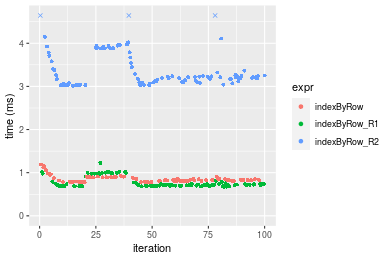


#### Index set 'odd'

```r
> stats <- microbenchmark(indexByRow = indexByRow(dim, idxs = idxs), indexByRow_R1 = indexByRow_R1(dim, 
+     idxs = idxs), indexByRow_R2 = indexByRow_R2(dim, idxs = idxs), unit = "ms")
```

_Table: Benchmarking of indexByRow(), indexByRow_R1() and indexByRow_R2() on 100x1000+odd data. The top panel shows times in milliseconds and the bottom panel shows relative times._


|   |expr          |      min|        lq|      mean|    median|       uq|      max|
|:--|:-------------|--------:|---------:|---------:|---------:|--------:|--------:|
|1  |indexByRow    | 0.459125| 0.4680545| 0.6008779| 0.4868045| 0.574379| 9.133765|
|2  |indexByRow_R1 | 0.707026| 0.7339155| 0.8397930| 0.7643920| 0.990676| 1.102537|
|3  |indexByRow_R2 | 1.483072| 1.5023825| 1.7314764| 1.6263660| 1.905382| 3.071705|


|   |expr          |      min|       lq|     mean|   median|       uq|       max|
|:--|:-------------|--------:|--------:|--------:|--------:|--------:|---------:|
|1  |indexByRow    | 1.000000| 1.000000| 1.000000| 1.000000| 1.000000| 1.0000000|
|2  |indexByRow_R1 | 1.539942| 1.568013| 1.397610| 1.570224| 1.724778| 0.1207100|
|3  |indexByRow_R2 | 3.230214| 3.209845| 2.881578| 3.340902| 3.317290| 0.3363022|

_Figure: Benchmarking of indexByRow(), indexByRow_R1() and indexByRow_R2() on 100x1000+odd data.  Outliers are displayed as crosses.  Times are in milliseconds._

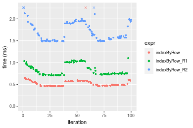


### 1000x100 matrix


```r
> X <- data[["1000x100"]]
> dim <- dim(X)
> idxsList <- list(`all-by-NULL` = NULL, all = seq_len(prod(dim)), odd = seq(from = 1, to = prod(dim), 
+     by = 2L))
> str(idxsList)
List of 3
 $ all-by-NULL: NULL
 $ all        : int [1:100000] 1 2 3 4 5 6 7 8 9 10 ...
 $ odd        : num [1:50000] 1 3 5 7 9 11 13 15 17 19 ...
```


#### Index set 'all-by-NULL'

```r
> stats <- microbenchmark(indexByRow = indexByRow(dim, idxs = idxs), indexByRow_R1 = indexByRow_R1(dim, 
+     idxs = idxs), indexByRow_R2 = indexByRow_R2(dim, idxs = idxs), unit = "ms")
```

_Table: Benchmarking of indexByRow(), indexByRow_R1() and indexByRow_R2() on 1000x100+all-by-NULL data. The top panel shows times in milliseconds and the bottom panel shows relative times._


|   |expr          |      min|        lq|      mean|   median|        uq|      max|
|:--|:-------------|--------:|---------:|---------:|--------:|---------:|--------:|
|1  |indexByRow    | 0.099831| 0.1119940| 0.1373374| 0.122643| 0.1476510| 0.215146|
|2  |indexByRow_R1 | 0.482236| 0.5211715| 0.6253584| 0.596648| 0.7752655| 0.846253|
|3  |indexByRow_R2 | 0.481438| 0.5233860| 0.6955313| 0.602666| 0.7354995| 6.996129|


|   |expr          |      min|       lq|     mean|   median|       uq|       max|
|:--|:-------------|--------:|--------:|--------:|--------:|--------:|---------:|
|1  |indexByRow    | 1.000000| 1.000000| 1.000000| 1.000000| 1.000000|  1.000000|
|2  |indexByRow_R1 | 4.830524| 4.653566| 4.553445| 4.864917| 5.250662|  3.933389|
|3  |indexByRow_R2 | 4.822530| 4.673340| 5.064398| 4.913986| 4.981338| 32.518053|

_Figure: Benchmarking of indexByRow(), indexByRow_R1() and indexByRow_R2() on 1000x100+all-by-NULL data.  Outliers are displayed as crosses.  Times are in milliseconds._

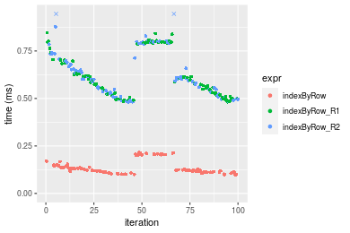


#### Index set 'all'

```r
> stats <- microbenchmark(indexByRow = indexByRow(dim, idxs = idxs), indexByRow_R1 = indexByRow_R1(dim, 
+     idxs = idxs), indexByRow_R2 = indexByRow_R2(dim, idxs = idxs), unit = "ms")
```

_Table: Benchmarking of indexByRow(), indexByRow_R1() and indexByRow_R2() on 1000x100+all data. The top panel shows times in milliseconds and the bottom panel shows relative times._


|   |expr          |      min|        lq|      mean|    median|        uq|       max|
|:--|:-------------|--------:|---------:|---------:|---------:|---------:|---------:|
|2  |indexByRow_R1 | 0.672735| 0.6933185| 0.8037763| 0.7172435| 0.9851695|  1.056198|
|1  |indexByRow    | 0.779524| 0.7961490| 0.8712172| 0.8563715| 0.9341550|  1.203426|
|3  |indexByRow_R2 | 3.029157| 3.0778145| 3.5656160| 3.2164275| 3.9160485| 11.938071|


|   |expr          |      min|       lq|     mean|   median|        uq|       max|
|:--|:-------------|--------:|--------:|--------:|--------:|---------:|---------:|
|2  |indexByRow_R1 | 1.000000| 1.000000| 1.000000| 1.000000| 1.0000000|  1.000000|
|1  |indexByRow    | 1.158739| 1.148316| 1.083905| 1.193976| 0.9482175|  1.139394|
|3  |indexByRow_R2 | 4.502749| 4.439250| 4.436080| 4.484429| 3.9749997| 11.302872|

_Figure: Benchmarking of indexByRow(), indexByRow_R1() and indexByRow_R2() on 1000x100+all data.  Outliers are displayed as crosses.  Times are in milliseconds._

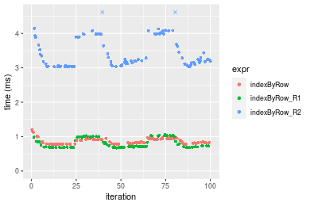


#### Index set 'odd'

```r
> stats <- microbenchmark(indexByRow = indexByRow(dim, idxs = idxs), indexByRow_R1 = indexByRow_R1(dim, 
+     idxs = idxs), indexByRow_R2 = indexByRow_R2(dim, idxs = idxs), unit = "ms")
```

_Table: Benchmarking of indexByRow(), indexByRow_R1() and indexByRow_R2() on 1000x100+odd data. The top panel shows times in milliseconds and the bottom panel shows relative times._


|   |expr          |      min|        lq|      mean|    median|        uq|      max|
|:--|:-------------|--------:|---------:|---------:|---------:|---------:|--------:|
|1  |indexByRow    | 0.458298| 0.4623595| 0.5152177| 0.4865565| 0.5682305| 0.734950|
|2  |indexByRow_R1 | 0.704467| 0.7249640| 0.8760234| 0.7468985| 0.8710335| 7.363990|
|3  |indexByRow_R2 | 1.487527| 1.5049120| 1.6739440| 1.5726410| 1.8617750| 2.334786|


|   |expr          |      min|       lq|     mean|   median|       uq|       max|
|:--|:-------------|--------:|--------:|--------:|--------:|--------:|---------:|
|1  |indexByRow    | 1.000000| 1.000000| 1.000000| 1.000000| 1.000000|  1.000000|
|2  |indexByRow_R1 | 1.537137| 1.567966| 1.700298| 1.535070| 1.532888| 10.019716|
|3  |indexByRow_R2 | 3.245764| 3.254853| 3.249003| 3.232186| 3.276443|  3.176796|

_Figure: Benchmarking of indexByRow(), indexByRow_R1() and indexByRow_R2() on 1000x100+odd data.  Outliers are displayed as crosses.  Times are in milliseconds._

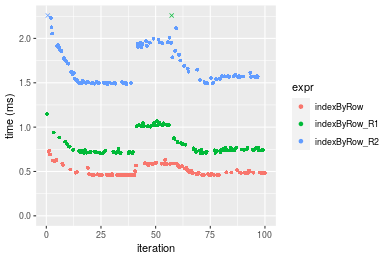


## Appendix

### Session information
```r
R version 4.1.1 Patched (2021-08-10 r80727)
Platform: x86_64-pc-linux-gnu (64-bit)
Running under: Ubuntu 18.04.5 LTS

Matrix products: default
BLAS:   /home/hb/software/R-devel/R-4-1-branch/lib/R/lib/libRblas.so
LAPACK: /home/hb/software/R-devel/R-4-1-branch/lib/R/lib/libRlapack.so

locale:
 [1] LC_CTYPE=en_US.UTF-8       LC_NUMERIC=C              
 [3] LC_TIME=en_US.UTF-8        LC_COLLATE=en_US.UTF-8    
 [5] LC_MONETARY=en_US.UTF-8    LC_MESSAGES=en_US.UTF-8   
 [7] LC_PAPER=en_US.UTF-8       LC_NAME=C                 
 [9] LC_ADDRESS=C               LC_TELEPHONE=C            
[11] LC_MEASUREMENT=en_US.UTF-8 LC_IDENTIFICATION=C       

attached base packages:
[1] stats     graphics  grDevices utils     datasets  methods   base     

other attached packages:
[1] microbenchmark_1.4-7   matrixStats_0.60.1     ggplot2_3.3.5         
[4] knitr_1.33             R.devices_2.17.0       R.utils_2.10.1        
[7] R.oo_1.24.0            R.methodsS3_1.8.1-9001 history_0.0.1-9000    

loaded via a namespace (and not attached):
 [1] Biobase_2.52.0          httr_1.4.2              splines_4.1.1          
 [4] bit64_4.0.5             network_1.17.1          assertthat_0.2.1       
 [7] highr_0.9               stats4_4.1.1            blob_1.2.2             
[10] GenomeInfoDbData_1.2.6  robustbase_0.93-8       pillar_1.6.2           
[13] RSQLite_2.2.8           lattice_0.20-44         glue_1.4.2             
[16] digest_0.6.27           XVector_0.32.0          colorspace_2.0-2       
[19] Matrix_1.3-4            XML_3.99-0.7            pkgconfig_2.0.3        
[22] zlibbioc_1.38.0         genefilter_1.74.0       purrr_0.3.4            
[25] ergm_4.1.2              xtable_1.8-4            scales_1.1.1           
[28] tibble_3.1.4            annotate_1.70.0         KEGGREST_1.32.0        
[31] farver_2.1.0            generics_0.1.0          IRanges_2.26.0         
[34] ellipsis_0.3.2          cachem_1.0.6            withr_2.4.2            
[37] BiocGenerics_0.38.0     mime_0.11               survival_3.2-13        
[40] magrittr_2.0.1          crayon_1.4.1            statnet.common_4.5.0   
[43] memoise_2.0.0           laeken_0.5.1            fansi_0.5.0            
[46] R.cache_0.15.0          MASS_7.3-54             R.rsp_0.44.0           
[49] progressr_0.8.0         tools_4.1.1             lifecycle_1.0.0        
[52] S4Vectors_0.30.0        trust_0.1-8             munsell_0.5.0          
[55] tabby_0.0.1-9001        AnnotationDbi_1.54.1    Biostrings_2.60.2      
[58] compiler_4.1.1          GenomeInfoDb_1.28.1     rlang_0.4.11           
[61] grid_4.1.1              RCurl_1.98-1.4          cwhmisc_6.6            
[64] rappdirs_0.3.3          startup_0.15.0          labeling_0.4.2         
[67] bitops_1.0-7            base64enc_0.1-3         boot_1.3-28            
[70] gtable_0.3.0            DBI_1.1.1               markdown_1.1           
[73] R6_2.5.1                lpSolveAPI_5.5.2.0-17.7 rle_0.9.2              
[76] dplyr_1.0.7             fastmap_1.1.0           bit_4.0.4              
[79] utf8_1.2.2              parallel_4.1.1          Rcpp_1.0.7             
[82] vctrs_0.3.8             png_0.1-7               DEoptimR_1.0-9         
[85] tidyselect_1.1.1        xfun_0.25               coda_0.19-4            
```
Total processing time was 18.34 secs.


### Reproducibility
To reproduce this report, do:
```r
html <- matrixStats:::benchmark('indexByRow')
```

[RSP]: https://cran.r-project.org/package=R.rsp
[matrixStats]: https://cran.r-project.org/package=matrixStats

[StackOverflow:colMins?]: https://stackoverflow.com/questions/13676878 "Stack Overflow: fastest way to get Min from every column in a matrix?"
[StackOverflow:colSds?]: https://stackoverflow.com/questions/17549762 "Stack Overflow: Is there such 'colsd' in R?"
[StackOverflow:rowProds?]: https://stackoverflow.com/questions/20198801/ "Stack Overflow: Row product of matrix and column sum of matrix"

---------------------------------------
Copyright Henrik Bengtsson. Last updated on 2021-08-25 19:14:31 (+0200 UTC). Powered by [RSP].

<script>
 var link = document.createElement('link');
 link.rel = 'icon';
 link.href = "data:image/png;base64,iVBORw0KGgoAAAANSUhEUgAAACAAAAAgCAMAAABEpIrGAAAA21BMVEUAAAAAAP8AAP8AAP8AAP8AAP8AAP8AAP8AAP8AAP8AAP8AAP8AAP8AAP8AAP8AAP8AAP8AAP8AAP8AAP8AAP8AAP8AAP8AAP8AAP8AAP8AAP8AAP8AAP8AAP8AAP8AAP8AAP8AAP8AAP8AAP8AAP8AAP8AAP8AAP8AAP8AAP8BAf4CAv0DA/wdHeIeHuEfH+AgIN8hId4lJdomJtknJ9g+PsE/P8BAQL9yco10dIt1dYp3d4h4eIeVlWqWlmmXl2iYmGeZmWabm2Tn5xjo6Bfp6Rb39wj4+Af//wA2M9hbAAAASXRSTlMAAQIJCgsMJSYnKD4/QGRlZmhpamtsbautrrCxuru8y8zN5ebn6Pn6+///////////////////////////////////////////LsUNcQAAAS9JREFUOI29k21XgkAQhVcFytdSMqMETU26UVqGmpaiFbL//xc1cAhhwVNf6n5i5z67M2dmYOyfJZUqlVLhkKucG7cgmUZTybDz6g0iDeq51PUr37Ds2cy2/C9NeES5puDjxuUk1xnToZsg8pfA3avHQ3lLIi7iWRrkv/OYtkScxBIMgDee0ALoyxHQBJ68JLCjOtQIMIANF7QG9G9fNnHvisCHBVMKgSJgiz7nE+AoBKrAPA3MgepvgR9TSCasrCKH0eB1wBGBFdCO+nAGjMVGPcQb5bd6mQRegN6+1axOs9nGfYcCtfi4NQosdtH7dB+txFIpXQqN1p9B/asRHToyS0jRgpV7nk4nwcq1BJ+x3Gl/v7S9Wmpp/aGquum7w3ZDyrADFYrl8vHBH+ev9AUASW1dmU4h4wAAAABJRU5ErkJggg=="
 document.getElementsByTagName('head')[0].appendChild(link);
</script>


### Local functions
```r
> indexByRow_R1 <- function(dim, idxs = NULL, ...) {
+     n <- prod(dim)
+     x <- matrix(seq_len(n), nrow = dim[2L], ncol = dim[1L], byrow = TRUE)
+     if (!is.null(idxs)) 
+         x <- x[idxs]
+     as.vector(x)
+ }
```
```r
> indexByRow_R2 <- function(dim, idxs = NULL, ...) {
+     n <- prod(dim)
+     if (is.null(idxs)) {
+         x <- matrix(seq_len(n), nrow = dim[2L], ncol = dim[1L], byrow = TRUE)
+         as.vector(x)
+     }     else {
+         idxs <- idxs - 1
+         cols <- idxs%/%dim[2L]
+         rows <- idxs%%dim[2L]
+         cols + dim[1L] * rows + 1L
+     }
+ }
```
```r
> rmatrix <- function(nrow, ncol, mode = c("logical", "double", "integer", "index"), range = c(-100, 
+     +100), na_prob = 0) {
+     mode <- match.arg(mode)
+     n <- nrow * ncol
+     if (mode == "logical") {
+         x <- sample(c(FALSE, TRUE), size = n, replace = TRUE)
+     }     else if (mode == "index") {
+         x <- seq_len(n)
+         mode <- "integer"
+     }     else {
+         x <- runif(n, min = range[1], max = range[2])
+     }
+     storage.mode(x) <- mode
+     if (na_prob > 0) 
+         x[sample(n, size = na_prob * n)] <- NA
+     dim(x) <- c(nrow, ncol)
+     x
+ }
> rmatrices <- function(scale = 10, seed = 1, ...) {
+     set.seed(seed)
+     data <- list()
+     data[[1]] <- rmatrix(nrow = scale * 1, ncol = scale * 1, ...)
+     data[[2]] <- rmatrix(nrow = scale * 10, ncol = scale * 10, ...)
+     data[[3]] <- rmatrix(nrow = scale * 100, ncol = scale * 1, ...)
+     data[[4]] <- t(data[[3]])
+     data[[5]] <- rmatrix(nrow = scale * 10, ncol = scale * 100, ...)
+     data[[6]] <- t(data[[5]])
+     names(data) <- sapply(data, FUN = function(x) paste(dim(x), collapse = "x"))
+     data
+ }
```


