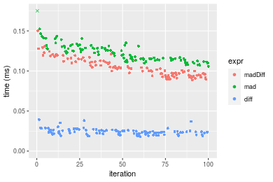
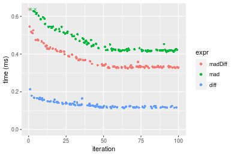
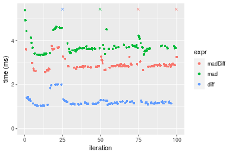
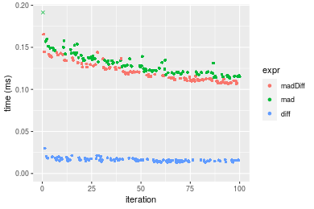
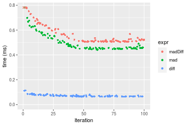
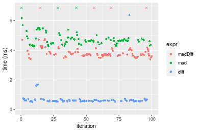
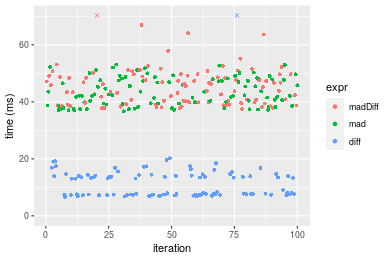

[matrixStats]: Benchmark report

---------------------------------------


# madDiff() benchmarks

This report benchmark the performance of madDiff() against alternative methods.

## Alternative methods

* N/A


## Data type "integer"
### Data
```r
> rvector <- function(n, mode = c("logical", "double", "integer"), range = c(-100, +100), na_prob = 0) {
+     mode <- match.arg(mode)
+     if (mode == "logical") {
+         x <- sample(c(FALSE, TRUE), size = n, replace = TRUE)
+     }     else {
+         x <- runif(n, min = range[1], max = range[2])
+     }
+     storage.mode(x) <- mode
+     if (na_prob > 0) 
+         x[sample(n, size = na_prob * n)] <- NA
+     x
+ }
> rvectors <- function(scale = 10, seed = 1, ...) {
+     set.seed(seed)
+     data <- list()
+     data[[1]] <- rvector(n = scale * 100, ...)
+     data[[2]] <- rvector(n = scale * 1000, ...)
+     data[[3]] <- rvector(n = scale * 10000, ...)
+     data[[4]] <- rvector(n = scale * 1e+05, ...)
+     data[[5]] <- rvector(n = scale * 1e+06, ...)
+     names(data) <- sprintf("n = %d", sapply(data, FUN = length))
+     data
+ }
> data <- rvectors(mode = mode)
> data <- data[1:4]
```

### Results

### n = 1000 vector

#### All elements
```r
> x <- data[["n = 1000"]]
> stats <- microbenchmark(madDiff = madDiff(x), mad = mad(x), diff = diff(x), unit = "ms")
```

_Table: Benchmarking of madDiff(), mad() and diff() on integer+n = 1000 data. The top panel shows times in milliseconds and the bottom panel shows relative times._


|   |expr    |      min|        lq|      mean|   median|        uq|      max|
|:--|:-------|--------:|---------:|---------:|--------:|---------:|--------:|
|3  |diff    | 0.017752| 0.0214995| 0.0241288| 0.023748| 0.0259275| 0.039277|
|1  |madDiff | 0.088629| 0.0949025| 0.1046152| 0.103037| 0.1121460| 0.150218|
|2  |mad     | 0.105680| 0.1136725| 0.1237513| 0.122174| 0.1292590| 0.270952|


|   |expr    |      min|       lq|     mean|   median|       uq|      max|
|:--|:-------|--------:|--------:|--------:|--------:|--------:|--------:|
|3  |diff    | 1.000000| 1.000000| 1.000000| 1.000000| 1.000000| 1.000000|
|1  |madDiff | 4.992621| 4.414172| 4.335696| 4.338765| 4.325369| 3.824579|
|2  |mad     | 5.953132| 5.287216| 5.128775| 5.144602| 4.985402| 6.898490|

_Figure: Benchmarking of madDiff(), mad() and diff() on integer+n = 1000 data.  Outliers are displayed as crosses.  Times are in milliseconds._



### n = 10000 vector

#### All elements
```r
> x <- data[["n = 10000"]]
> stats <- microbenchmark(madDiff = madDiff(x), mad = mad(x), diff = diff(x), unit = "ms")
```

_Table: Benchmarking of madDiff(), mad() and diff() on integer+n = 10000 data. The top panel shows times in milliseconds and the bottom panel shows relative times._


|   |expr    |      min|        lq|      mean|    median|        uq|      max|
|:--|:-------|--------:|---------:|---------:|---------:|---------:|--------:|
|3  |diff    | 0.113027| 0.1183590| 0.1317600| 0.1249735| 0.1411005| 0.213902|
|1  |madDiff | 0.324380| 0.3301435| 0.3712612| 0.3364710| 0.4056640| 0.638642|
|2  |mad     | 0.411193| 0.4192715| 0.4678962| 0.4313300| 0.5069095| 0.680386|


|   |expr    |      min|       lq|     mean|   median|       uq|      max|
|:--|:-------|--------:|--------:|--------:|--------:|--------:|--------:|
|3  |diff    | 1.000000| 1.000000| 1.000000| 1.000000| 1.000000| 1.000000|
|1  |madDiff | 2.869934| 2.789340| 2.817708| 2.692339| 2.875000| 2.985676|
|2  |mad     | 3.638007| 3.542371| 3.551125| 3.451372| 3.592542| 3.180830|

_Figure: Benchmarking of madDiff(), mad() and diff() on integer+n = 10000 data.  Outliers are displayed as crosses.  Times are in milliseconds._



### n = 100000 vector

#### All elements
```r
> x <- data[["n = 100000"]]
> stats <- microbenchmark(madDiff = madDiff(x), mad = mad(x), diff = diff(x), unit = "ms")
```

_Table: Benchmarking of madDiff(), mad() and diff() on integer+n = 100000 data. The top panel shows times in milliseconds and the bottom panel shows relative times._


|   |expr    |      min|       lq|     mean|   median|       uq|       max|
|:--|:-------|--------:|--------:|--------:|--------:|--------:|---------:|
|3  |diff    | 1.036132| 1.130519| 1.300537| 1.172840| 1.255360|  7.771759|
|1  |madDiff | 2.575734| 2.813886| 3.053933| 2.850616| 2.926643|  9.541398|
|2  |mad     | 3.337370| 3.567168| 3.835025| 3.658603| 3.796289| 10.060741|


|   |expr    |      min|       lq|     mean|   median|       uq|      max|
|:--|:-------|--------:|--------:|--------:|--------:|--------:|--------:|
|3  |diff    | 1.000000| 1.000000| 1.000000| 1.000000| 1.000000| 1.000000|
|1  |madDiff | 2.485913| 2.489021| 2.348209| 2.430524| 2.331318| 1.227701|
|2  |mad     | 3.220989| 3.155337| 2.948801| 3.119440| 3.024064| 1.294526|

_Figure: Benchmarking of madDiff(), mad() and diff() on integer+n = 100000 data.  Outliers are displayed as crosses.  Times are in milliseconds._



### n = 1000000 vector

#### All elements
```r
> x <- data[["n = 1000000"]]
> stats <- microbenchmark(madDiff = madDiff(x), mad = mad(x), diff = diff(x), unit = "ms")
```

_Table: Benchmarking of madDiff(), mad() and diff() on integer+n = 1000000 data. The top panel shows times in milliseconds and the bottom panel shows relative times._


|   |expr    |      min|       lq|     mean|   median|       uq|       max|
|:--|:-------|--------:|--------:|--------:|--------:|--------:|---------:|
|3  |diff    | 11.02840| 11.65005| 17.75196| 12.08700| 18.66433| 392.88244|
|1  |madDiff | 31.70395| 33.02597| 36.01248| 34.33064| 40.07227|  50.52308|
|2  |mad     | 34.74192| 36.15372| 39.83439| 37.17157| 44.77725|  58.22014|


|   |expr    |      min|       lq|     mean|   median|       uq|       max|
|:--|:-------|--------:|--------:|--------:|--------:|--------:|---------:|
|3  |diff    | 1.000000| 1.000000| 1.000000| 1.000000| 1.000000| 1.0000000|
|1  |madDiff | 2.874754| 2.834836| 2.028647| 2.840294| 2.146998| 0.1285959|
|2  |mad     | 3.150222| 3.103311| 2.243943| 3.075334| 2.399082| 0.1481872|

_Figure: Benchmarking of madDiff(), mad() and diff() on integer+n = 1000000 data.  Outliers are displayed as crosses.  Times are in milliseconds._


## Data type "double"
### Data
```r
> rvector <- function(n, mode = c("logical", "double", "integer"), range = c(-100, +100), na_prob = 0) {
+     mode <- match.arg(mode)
+     if (mode == "logical") {
+         x <- sample(c(FALSE, TRUE), size = n, replace = TRUE)
+     }     else {
+         x <- runif(n, min = range[1], max = range[2])
+     }
+     storage.mode(x) <- mode
+     if (na_prob > 0) 
+         x[sample(n, size = na_prob * n)] <- NA
+     x
+ }
> rvectors <- function(scale = 10, seed = 1, ...) {
+     set.seed(seed)
+     data <- list()
+     data[[1]] <- rvector(n = scale * 100, ...)
+     data[[2]] <- rvector(n = scale * 1000, ...)
+     data[[3]] <- rvector(n = scale * 10000, ...)
+     data[[4]] <- rvector(n = scale * 1e+05, ...)
+     data[[5]] <- rvector(n = scale * 1e+06, ...)
+     names(data) <- sprintf("n = %d", sapply(data, FUN = length))
+     data
+ }
> data <- rvectors(mode = mode)
> data <- data[1:4]
```

### Results

### n = 1000 vector

#### All elements
```r
> x <- data[["n = 1000"]]
> stats <- microbenchmark(madDiff = madDiff(x), mad = mad(x), diff = diff(x), unit = "ms")
```

_Table: Benchmarking of madDiff(), mad() and diff() on double+n = 1000 data. The top panel shows times in milliseconds and the bottom panel shows relative times._


|   |expr    |      min|        lq|      mean|    median|       uq|      max|
|:--|:-------|--------:|---------:|---------:|---------:|--------:|--------:|
|3  |diff    | 0.013201| 0.0147700| 0.0162467| 0.0159435| 0.016973| 0.029938|
|1  |madDiff | 0.106338| 0.1109705| 0.1200912| 0.1163020| 0.126430| 0.165608|
|2  |mad     | 0.113455| 0.1201745| 0.1314006| 0.1279825| 0.137668| 0.270726|


|   |expr    |      min|       lq|     mean|   median|       uq|      max|
|:--|:-------|--------:|--------:|--------:|--------:|--------:|--------:|
|3  |diff    | 1.000000| 1.000000| 1.000000| 1.000000| 1.000000| 1.000000|
|1  |madDiff | 8.055299| 7.513236| 7.391731| 7.294634| 7.448889| 5.531699|
|2  |mad     | 8.594425| 8.136391| 8.087838| 8.027252| 8.111000| 9.042889|

_Figure: Benchmarking of madDiff(), mad() and diff() on double+n = 1000 data.  Outliers are displayed as crosses.  Times are in milliseconds._



### n = 10000 vector

#### All elements
```r
> x <- data[["n = 10000"]]
> stats <- microbenchmark(madDiff = madDiff(x), mad = mad(x), diff = diff(x), unit = "ms")
```

_Table: Benchmarking of madDiff(), mad() and diff() on double+n = 10000 data. The top panel shows times in milliseconds and the bottom panel shows relative times._


|   |expr    |      min|        lq|      mean|    median|        uq|      max|
|:--|:-------|--------:|---------:|---------:|---------:|---------:|--------:|
|3  |diff    | 0.063052| 0.0658795| 0.0720300| 0.0700025| 0.0759765| 0.114779|
|2  |mad     | 0.441619| 0.4511230| 0.4968053| 0.4611525| 0.5256760| 0.782934|
|1  |madDiff | 0.504355| 0.5091125| 0.5690519| 0.5213725| 0.6086355| 0.936383|


|   |expr    |      min|       lq|     mean|   median|       uq|      max|
|:--|:-------|--------:|--------:|--------:|--------:|--------:|--------:|
|3  |diff    | 1.000000| 1.000000| 1.000000| 1.000000| 1.000000| 1.000000|
|2  |mad     | 7.004044| 6.847699| 6.897198| 6.587658| 6.918929| 6.821230|
|1  |madDiff | 7.999033| 7.727935| 7.900204| 7.447913| 8.010839| 8.158139|

_Figure: Benchmarking of madDiff(), mad() and diff() on double+n = 10000 data.  Outliers are displayed as crosses.  Times are in milliseconds._



### n = 100000 vector

#### All elements
```r
> x <- data[["n = 100000"]]
> stats <- microbenchmark(madDiff = madDiff(x), mad = mad(x), diff = diff(x), unit = "ms")
```

_Table: Benchmarking of madDiff(), mad() and diff() on double+n = 100000 data. The top panel shows times in milliseconds and the bottom panel shows relative times._


|   |expr    |      min|       lq|      mean|    median|       uq|       max|
|:--|:-------|--------:|--------:|---------:|---------:|--------:|---------:|
|3  |diff    | 0.519885| 0.570392| 0.6985906| 0.6014705| 0.651661|  6.399512|
|1  |madDiff | 3.394157| 3.652373| 4.0606775| 3.7422355| 3.987932| 10.796630|
|2  |mad     | 4.276920| 4.456988| 4.8640088| 4.6598885| 4.834231| 11.028984|


|   |expr    |      min|       lq|     mean|   median|       uq|      max|
|:--|:-------|--------:|--------:|--------:|--------:|--------:|--------:|
|3  |diff    | 1.000000| 1.000000| 1.000000| 1.000000| 1.000000| 1.000000|
|1  |madDiff | 6.528669| 6.403268| 5.812671| 6.221811| 6.119643| 1.687102|
|2  |mad     | 8.226665| 7.813903| 6.962603| 7.747493| 7.418322| 1.723410|

_Figure: Benchmarking of madDiff(), mad() and diff() on double+n = 100000 data.  Outliers are displayed as crosses.  Times are in milliseconds._



### n = 1000000 vector

#### All elements
```r
> x <- data[["n = 1000000"]]
> stats <- microbenchmark(madDiff = madDiff(x), mad = mad(x), diff = diff(x), unit = "ms")
```

_Table: Benchmarking of madDiff(), mad() and diff() on double+n = 1000000 data. The top panel shows times in milliseconds and the bottom panel shows relative times._


|   |expr    |       min|        lq|     mean|    median|       uq|       max|
|:--|:-------|---------:|---------:|--------:|---------:|--------:|---------:|
|3  |diff    |  6.691625|  7.436153| 14.86925|  8.213351| 14.24587| 388.54273|
|2  |mad     | 36.656780| 39.197105| 43.52137| 42.272902| 47.81036|  53.08252|
|1  |madDiff | 37.511064| 39.747759| 48.87698| 44.476872| 49.17636| 426.27070|


|   |expr    |      min|       lq|     mean|   median|       uq|       max|
|:--|:-------|--------:|--------:|--------:|--------:|--------:|---------:|
|3  |diff    | 1.000000| 1.000000| 1.000000| 1.000000| 1.000000| 1.0000000|
|2  |mad     | 5.478009| 5.271154| 2.926939| 5.146852| 3.356086| 0.1366195|
|1  |madDiff | 5.605673| 5.345205| 3.287119| 5.415192| 3.451974| 1.0971012|

_Figure: Benchmarking of madDiff(), mad() and diff() on double+n = 1000000 data.  Outliers are displayed as crosses.  Times are in milliseconds._




## Appendix

### Session information
```r
R version 4.1.1 Patched (2021-08-10 r80727)
Platform: x86_64-pc-linux-gnu (64-bit)
Running under: Ubuntu 18.04.5 LTS

Matrix products: default
BLAS:   /home/hb/software/R-devel/R-4-1-branch/lib/R/lib/libRblas.so
LAPACK: /home/hb/software/R-devel/R-4-1-branch/lib/R/lib/libRlapack.so

locale:
 [1] LC_CTYPE=en_US.UTF-8       LC_NUMERIC=C              
 [3] LC_TIME=en_US.UTF-8        LC_COLLATE=en_US.UTF-8    
 [5] LC_MONETARY=en_US.UTF-8    LC_MESSAGES=en_US.UTF-8   
 [7] LC_PAPER=en_US.UTF-8       LC_NAME=C                 
 [9] LC_ADDRESS=C               LC_TELEPHONE=C            
[11] LC_MEASUREMENT=en_US.UTF-8 LC_IDENTIFICATION=C       

attached base packages:
[1] stats     graphics  grDevices utils     datasets  methods   base     

other attached packages:
[1] microbenchmark_1.4-7   matrixStats_0.60.1     ggplot2_3.3.5         
[4] knitr_1.33             R.devices_2.17.0       R.utils_2.10.1        
[7] R.oo_1.24.0            R.methodsS3_1.8.1-9001 history_0.0.1-9000    

loaded via a namespace (and not attached):
 [1] Biobase_2.52.0          httr_1.4.2              splines_4.1.1          
 [4] bit64_4.0.5             network_1.17.1          assertthat_0.2.1       
 [7] highr_0.9               stats4_4.1.1            blob_1.2.2             
[10] GenomeInfoDbData_1.2.6  robustbase_0.93-8       pillar_1.6.2           
[13] RSQLite_2.2.8           lattice_0.20-44         glue_1.4.2             
[16] digest_0.6.27           XVector_0.32.0          colorspace_2.0-2       
[19] Matrix_1.3-4            XML_3.99-0.7            pkgconfig_2.0.3        
[22] zlibbioc_1.38.0         genefilter_1.74.0       purrr_0.3.4            
[25] ergm_4.1.2              xtable_1.8-4            scales_1.1.1           
[28] tibble_3.1.4            annotate_1.70.0         KEGGREST_1.32.0        
[31] farver_2.1.0            generics_0.1.0          IRanges_2.26.0         
[34] ellipsis_0.3.2          cachem_1.0.6            withr_2.4.2            
[37] BiocGenerics_0.38.0     mime_0.11               survival_3.2-13        
[40] magrittr_2.0.1          crayon_1.4.1            statnet.common_4.5.0   
[43] memoise_2.0.0           laeken_0.5.1            fansi_0.5.0            
[46] R.cache_0.15.0          MASS_7.3-54             R.rsp_0.44.0           
[49] progressr_0.8.0         tools_4.1.1             lifecycle_1.0.0        
[52] S4Vectors_0.30.0        trust_0.1-8             munsell_0.5.0          
[55] tabby_0.0.1-9001        AnnotationDbi_1.54.1    Biostrings_2.60.2      
[58] compiler_4.1.1          GenomeInfoDb_1.28.1     rlang_0.4.11           
[61] grid_4.1.1              RCurl_1.98-1.4          cwhmisc_6.6            
[64] rappdirs_0.3.3          startup_0.15.0          labeling_0.4.2         
[67] bitops_1.0-7            base64enc_0.1-3         boot_1.3-28            
[70] gtable_0.3.0            DBI_1.1.1               markdown_1.1           
[73] R6_2.5.1                lpSolveAPI_5.5.2.0-17.7 rle_0.9.2              
[76] dplyr_1.0.7             fastmap_1.1.0           bit_4.0.4              
[79] utf8_1.2.2              parallel_4.1.1          Rcpp_1.0.7             
[82] vctrs_0.3.8             png_0.1-7               DEoptimR_1.0-9         
[85] tidyselect_1.1.1        xfun_0.25               coda_0.19-4            
```
Total processing time was 29.99 secs.


### Reproducibility
To reproduce this report, do:
```r
html <- matrixStats:::benchmark('madDiff')
```

[RSP]: https://cran.r-project.org/package=R.rsp
[matrixStats]: https://cran.r-project.org/package=matrixStats

[StackOverflow:colMins?]: https://stackoverflow.com/questions/13676878 "Stack Overflow: fastest way to get Min from every column in a matrix?"
[StackOverflow:colSds?]: https://stackoverflow.com/questions/17549762 "Stack Overflow: Is there such 'colsd' in R?"
[StackOverflow:rowProds?]: https://stackoverflow.com/questions/20198801/ "Stack Overflow: Row product of matrix and column sum of matrix"

---------------------------------------
Copyright Henrik Bengtsson. Last updated on 2021-08-25 19:20:20 (+0200 UTC). Powered by [RSP].

<script>
 var link = document.createElement('link');
 link.rel = 'icon';
 link.href = "data:image/png;base64,iVBORw0KGgoAAAANSUhEUgAAACAAAAAgCAMAAABEpIrGAAAA21BMVEUAAAAAAP8AAP8AAP8AAP8AAP8AAP8AAP8AAP8AAP8AAP8AAP8AAP8AAP8AAP8AAP8AAP8AAP8AAP8AAP8AAP8AAP8AAP8AAP8AAP8AAP8AAP8AAP8AAP8AAP8AAP8AAP8AAP8AAP8AAP8AAP8AAP8AAP8AAP8AAP8AAP8AAP8BAf4CAv0DA/wdHeIeHuEfH+AgIN8hId4lJdomJtknJ9g+PsE/P8BAQL9yco10dIt1dYp3d4h4eIeVlWqWlmmXl2iYmGeZmWabm2Tn5xjo6Bfp6Rb39wj4+Af//wA2M9hbAAAASXRSTlMAAQIJCgsMJSYnKD4/QGRlZmhpamtsbautrrCxuru8y8zN5ebn6Pn6+///////////////////////////////////////////LsUNcQAAAS9JREFUOI29k21XgkAQhVcFytdSMqMETU26UVqGmpaiFbL//xc1cAhhwVNf6n5i5z67M2dmYOyfJZUqlVLhkKucG7cgmUZTybDz6g0iDeq51PUr37Ds2cy2/C9NeES5puDjxuUk1xnToZsg8pfA3avHQ3lLIi7iWRrkv/OYtkScxBIMgDee0ALoyxHQBJ68JLCjOtQIMIANF7QG9G9fNnHvisCHBVMKgSJgiz7nE+AoBKrAPA3MgepvgR9TSCasrCKH0eB1wBGBFdCO+nAGjMVGPcQb5bd6mQRegN6+1axOs9nGfYcCtfi4NQosdtH7dB+txFIpXQqN1p9B/asRHToyS0jRgpV7nk4nwcq1BJ+x3Gl/v7S9Wmpp/aGquum7w3ZDyrADFYrl8vHBH+ev9AUASW1dmU4h4wAAAABJRU5ErkJggg=="
 document.getElementsByTagName('head')[0].appendChild(link);
</script>


