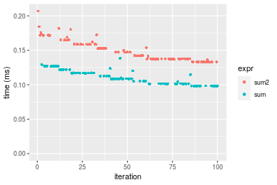
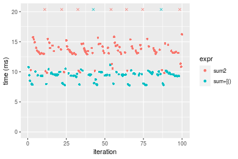

[matrixStats]: Benchmark report

---------------------------------------


# sum2() benchmarks

This report benchmark the performance of sum2() against alternative methods.

## Alternative methods

* sum() + [()

as below

```r
> sum2_R <- function(x, na.rm = FALSE, idxs) {
+     sum(x[idxs], na.rm = na.rm)
+ }
```


## Data type "integer"
### Data
```r
> rvector <- function(n, mode = c("logical", "double", "integer"), range = c(-100, +100), na_prob = 0) {
+     mode <- match.arg(mode)
+     if (mode == "logical") {
+         x <- sample(c(FALSE, TRUE), size = n, replace = TRUE)
+     }     else {
+         x <- runif(n, min = range[1], max = range[2])
+     }
+     storage.mode(x) <- mode
+     if (na_prob > 0) 
+         x[sample(n, size = na_prob * n)] <- NA
+     x
+ }
> rvectors <- function(scale = 10, seed = 1, ...) {
+     set.seed(seed)
+     data <- list()
+     data[[1]] <- rvector(n = scale * 100, ...)
+     data[[2]] <- rvector(n = scale * 1000, ...)
+     data[[3]] <- rvector(n = scale * 10000, ...)
+     data[[4]] <- rvector(n = scale * 1e+05, ...)
+     data[[5]] <- rvector(n = scale * 1e+06, ...)
+     names(data) <- sprintf("n = %d", sapply(data, FUN = length))
+     data
+ }
> data <- rvectors(mode = mode)
```

### Results

### n = 1000 vector


#### All elements
```r
> x <- data[["n = 1000"]]
> gc()
           used  (Mb) gc trigger  (Mb)  max used  (Mb)
Ncells  5340337 285.3    8529671 455.6   8529671 455.6
Vcells 37466993 285.9   62359815 475.8 101881463 777.3
> stats <- microbenchmark(sum2 = sum2(x), sum = sum(x), unit = "ms")
```

_Table: Benchmarking of sum2() and sum() on n = 1000+all data. The top panel shows times in milliseconds and the bottom panel shows relative times._


|   |expr |      min|        lq|      mean|    median|        uq|      max|
|:--|:----|--------:|---------:|---------:|---------:|---------:|--------:|
|2  |sum  | 0.001080| 0.0011120| 0.0012025| 0.0011670| 0.0011970| 0.005213|
|1  |sum2 | 0.004836| 0.0049205| 0.0054662| 0.0049965| 0.0051545| 0.035289|


|   |expr |      min|      lq|     mean|   median|       uq|      max|
|:--|:----|--------:|-------:|--------:|--------:|--------:|--------:|
|2  |sum  | 1.000000| 1.00000| 1.000000| 1.000000| 1.000000| 1.000000|
|1  |sum2 | 4.477778| 4.42491| 4.545864| 4.281491| 4.306182| 6.769423|

_Figure: Benchmarking of sum2() and sum() on n = 1000+all data.  Outliers are displayed as crosses.  Times are in milliseconds._


#### A 20% subset
```r
> x <- data[["n = 1000"]]
> subset
[1] 0.2
> idxs <- sort(sample(length(x), size = subset * length(x), replace = FALSE))
> gc()
           used  (Mb) gc trigger  (Mb)  max used  (Mb)
Ncells  5338175 285.1    8529671 455.6   8529671 455.6
Vcells 15832238 120.8   49887852 380.7 101881463 777.3
> stats <- microbenchmark(sum2 = sum2(x, idxs = idxs), `sum+[()` = sum2_R(x, idxs = idxs), unit = "ms")
```

_Table: Benchmarking of sum2() and sum+[()() on integer+n = 1000+0.2 data. The top panel shows times in milliseconds and the bottom panel shows relative times._


|   |expr    |      min|        lq|      mean|    median|       uq|      max|
|:--|:-------|--------:|---------:|---------:|---------:|--------:|--------:|
|2  |sum+[() | 0.002298| 0.0025450| 0.0028229| 0.0027095| 0.002846| 0.012645|
|1  |sum2    | 0.004501| 0.0047685| 0.0050898| 0.0049205| 0.005056| 0.020009|


|   |expr    |     min|       lq|     mean|   median|       uq|      max|
|:--|:-------|-------:|--------:|--------:|--------:|--------:|--------:|
|2  |sum+[() | 1.00000| 1.000000| 1.000000| 1.000000| 1.000000| 1.000000|
|1  |sum2    | 1.95866| 1.873674| 1.803052| 1.816018| 1.776528| 1.582365|

_Figure: Benchmarking of sum2() and sum+[()() on integer+n = 1000+0.2 data.  Outliers are displayed as crosses.  Times are in milliseconds._


#### A 40% subset
```r
> x <- data[["n = 1000"]]
> subset
[1] 0.4
> idxs <- sort(sample(length(x), size = subset * length(x), replace = FALSE))
> gc()
           used  (Mb) gc trigger  (Mb)  max used  (Mb)
Ncells  5338241 285.1    8529671 455.6   8529671 455.6
Vcells 15832390 120.8   49887852 380.7 101881463 777.3
> stats <- microbenchmark(sum2 = sum2(x, idxs = idxs), `sum+[()` = sum2_R(x, idxs = idxs), unit = "ms")
```

_Table: Benchmarking of sum2() and sum+[()() on integer+n = 1000+0.4 data. The top panel shows times in milliseconds and the bottom panel shows relative times._


|   |expr    |      min|        lq|      mean|    median|        uq|      max|
|:--|:-------|--------:|---------:|---------:|---------:|---------:|--------:|
|2  |sum+[() | 0.003173| 0.0033285| 0.0036057| 0.0034740| 0.0036150| 0.013935|
|1  |sum2    | 0.005667| 0.0058870| 0.0063276| 0.0060775| 0.0063005| 0.023069|


|   |expr    |      min|       lq|     mean|   median|       uq|      max|
|:--|:-------|--------:|--------:|--------:|--------:|--------:|--------:|
|2  |sum+[() | 1.000000| 1.000000| 1.000000| 1.000000| 1.000000| 1.000000|
|1  |sum2    | 1.786007| 1.768665| 1.754882| 1.749424| 1.742877| 1.655472|

_Figure: Benchmarking of sum2() and sum+[()() on integer+n = 1000+0.4 data.  Outliers are displayed as crosses.  Times are in milliseconds._


#### A 80% subset
```r
> x <- data[["n = 1000"]]
> subset
[1] 0.8
> idxs <- sort(sample(length(x), size = subset * length(x), replace = FALSE))
> gc()
           used  (Mb) gc trigger  (Mb)  max used  (Mb)
Ncells  5338304 285.1    8529671 455.6   8529671 455.6
Vcells 15833144 120.8   49887852 380.7 101881463 777.3
> stats <- microbenchmark(sum2 = sum2(x, idxs = idxs), `sum+[()` = sum2_R(x, idxs = idxs), unit = "ms")
```

_Table: Benchmarking of sum2() and sum+[()() on integer+n = 1000+0.8 data. The top panel shows times in milliseconds and the bottom panel shows relative times._


|   |expr    |      min|       lq|      mean|   median|        uq|      max|
|:--|:-------|--------:|--------:|---------:|--------:|---------:|--------:|
|2  |sum+[() | 0.004799| 0.005038| 0.0053652| 0.005231| 0.0054240| 0.017298|
|1  |sum2    | 0.008000| 0.008382| 0.0088059| 0.008612| 0.0088285| 0.027749|


|   |expr    |      min|       lq|     mean|   median|       uq|      max|
|:--|:-------|--------:|--------:|--------:|--------:|--------:|--------:|
|2  |sum+[() | 1.000000| 1.000000| 1.000000| 1.000000| 1.000000| 1.000000|
|1  |sum2    | 1.667014| 1.663755| 1.641309| 1.646339| 1.627673| 1.604174|

_Figure: Benchmarking of sum2() and sum+[()() on integer+n = 1000+0.8 data.  Outliers are displayed as crosses.  Times are in milliseconds._


### n = 10000 vector


#### All elements
```r
> x <- data[["n = 10000"]]
> gc()
           used  (Mb) gc trigger  (Mb)  max used  (Mb)
Ncells  5338302 285.1    8529671 455.6   8529671 455.6
Vcells 15832768 120.8   49887852 380.7 101881463 777.3
> stats <- microbenchmark(sum2 = sum2(x), sum = sum(x), unit = "ms")
```

_Table: Benchmarking of sum2() and sum() on n = 10000+all data. The top panel shows times in milliseconds and the bottom panel shows relative times._


|   |expr |      min|        lq|      mean|   median|        uq|      max|
|:--|:----|--------:|---------:|---------:|--------:|---------:|--------:|
|2  |sum  | 0.008386| 0.0086155| 0.0088378| 0.008770| 0.0088515| 0.019229|
|1  |sum2 | 0.023377| 0.0236815| 0.0246369| 0.024441| 0.0246135| 0.050206|


|   |expr |      min|       lq|     mean|   median|       uq|      max|
|:--|:----|--------:|--------:|--------:|--------:|--------:|--------:|
|2  |sum  | 1.000000| 1.000000| 1.000000| 1.000000| 1.000000| 1.000000|
|1  |sum2 | 2.787622| 2.748709| 2.787671| 2.786887| 2.780715| 2.610952|

_Figure: Benchmarking of sum2() and sum() on n = 10000+all data.  Outliers are displayed as crosses.  Times are in milliseconds._


#### A 20% subset
```r
> x <- data[["n = 10000"]]
> subset
[1] 0.2
> idxs <- sort(sample(length(x), size = subset * length(x), replace = FALSE))
> gc()
           used  (Mb) gc trigger  (Mb)  max used  (Mb)
Ncells  5338430 285.2    8529671 455.6   8529671 455.6
Vcells 15833826 120.9   49887852 380.7 101881463 777.3
> stats <- microbenchmark(sum2 = sum2(x, idxs = idxs), `sum+[()` = sum2_R(x, idxs = idxs), unit = "ms")
```

_Table: Benchmarking of sum2() and sum+[()() on integer+n = 10000+0.2 data. The top panel shows times in milliseconds and the bottom panel shows relative times._


|   |expr    |      min|        lq|      mean|    median|        uq|      max|
|:--|:-------|--------:|---------:|---------:|---------:|---------:|--------:|
|2  |sum+[() | 0.009527| 0.0099820| 0.0117364| 0.0102575| 0.0108405| 0.044110|
|1  |sum2    | 0.015059| 0.0154035| 0.0179442| 0.0161040| 0.0167765| 0.052554|


|   |expr    |      min|       lq|     mean|   median|       uq|      max|
|:--|:-------|--------:|--------:|--------:|--------:|--------:|--------:|
|2  |sum+[() | 1.000000| 1.000000| 1.000000| 1.000000| 1.000000| 1.000000|
|1  |sum2    | 1.580666| 1.543128| 1.528937| 1.569973| 1.547576| 1.191431|

_Figure: Benchmarking of sum2() and sum+[()() on integer+n = 10000+0.2 data.  Outliers are displayed as crosses.  Times are in milliseconds._


#### A 40% subset
```r
> x <- data[["n = 10000"]]
> subset
[1] 0.4
> idxs <- sort(sample(length(x), size = subset * length(x), replace = FALSE))
> gc()
           used  (Mb) gc trigger  (Mb)  max used  (Mb)
Ncells  5338493 285.2    8529671 455.6   8529671 455.6
Vcells 15835099 120.9   49887852 380.7 101881463 777.3
> stats <- microbenchmark(sum2 = sum2(x, idxs = idxs), `sum+[()` = sum2_R(x, idxs = idxs), unit = "ms")
```

_Table: Benchmarking of sum2() and sum+[()() on integer+n = 10000+0.4 data. The top panel shows times in milliseconds and the bottom panel shows relative times._


|   |expr    |      min|        lq|      mean|    median|        uq|      max|
|:--|:-------|--------:|---------:|---------:|---------:|---------:|--------:|
|2  |sum+[() | 0.016355| 0.0174320| 0.0186418| 0.0179175| 0.0186795| 0.042341|
|1  |sum2    | 0.024262| 0.0252945| 0.0269480| 0.0265455| 0.0273985| 0.046399|


|   |expr    |      min|       lq|     mean|  median|       uq|      max|
|:--|:-------|--------:|--------:|--------:|-------:|--------:|--------:|
|2  |sum+[() | 1.000000| 1.000000| 1.000000| 1.00000| 1.000000| 1.000000|
|1  |sum2    | 1.483461| 1.451038| 1.445568| 1.48154| 1.466768| 1.095841|

_Figure: Benchmarking of sum2() and sum+[()() on integer+n = 10000+0.4 data.  Outliers are displayed as crosses.  Times are in milliseconds._


#### A 80% subset
```r
> x <- data[["n = 10000"]]
> subset
[1] 0.8
> idxs <- sort(sample(length(x), size = subset * length(x), replace = FALSE))
> gc()
           used  (Mb) gc trigger  (Mb)  max used  (Mb)
Ncells  5338556 285.2    8529671 455.6   8529671 455.6
Vcells 15837402 120.9   49887852 380.7 101881463 777.3
> stats <- microbenchmark(sum2 = sum2(x, idxs = idxs), `sum+[()` = sum2_R(x, idxs = idxs), unit = "ms")
```

_Table: Benchmarking of sum2() and sum+[()() on integer+n = 10000+0.8 data. The top panel shows times in milliseconds and the bottom panel shows relative times._


|   |expr    |      min|        lq|      mean|    median|       uq|      max|
|:--|:-------|--------:|---------:|---------:|---------:|--------:|--------:|
|2  |sum+[() | 0.031270| 0.0318510| 0.0335354| 0.0329085| 0.034248| 0.049881|
|1  |sum2    | 0.044507| 0.0454465| 0.0476911| 0.0468330| 0.048695| 0.078203|


|   |expr    |      min|       lq|     mean|   median|       uq|      max|
|:--|:-------|--------:|--------:|--------:|--------:|--------:|--------:|
|2  |sum+[() | 1.000000| 1.000000| 1.000000| 1.000000| 1.000000| 1.000000|
|1  |sum2    | 1.423313| 1.426847| 1.422112| 1.423128| 1.421835| 1.567791|

_Figure: Benchmarking of sum2() and sum+[()() on integer+n = 10000+0.8 data.  Outliers are displayed as crosses.  Times are in milliseconds._


### n = 100000 vector


#### All elements
```r
> x <- data[["n = 100000"]]
> gc()
           used  (Mb) gc trigger  (Mb)  max used  (Mb)
Ncells  5338554 285.2    8529671 455.6   8529671 455.6
Vcells 15837334 120.9   49887852 380.7 101881463 777.3
> stats <- microbenchmark(sum2 = sum2(x), sum = sum(x), unit = "ms")
```

_Table: Benchmarking of sum2() and sum() on n = 100000+all data. The top panel shows times in milliseconds and the bottom panel shows relative times._


|   |expr |      min|       lq|      mean|    median|       uq|      max|
|:--|:----|--------:|--------:|---------:|---------:|--------:|--------:|
|2  |sum  | 0.065744| 0.067973| 0.0737974| 0.0717315| 0.078840| 0.089428|
|1  |sum2 | 0.165231| 0.170689| 0.1832806| 0.1766735| 0.197123| 0.237330|


|   |expr |      min|       lq|     mean|   median|       uq|      max|
|:--|:----|--------:|--------:|--------:|--------:|--------:|--------:|
|2  |sum  | 1.000000| 1.000000| 1.000000| 1.000000| 1.000000| 1.000000|
|1  |sum2 | 2.513248| 2.511129| 2.483565| 2.462983| 2.500292| 2.653867|

_Figure: Benchmarking of sum2() and sum() on n = 100000+all data.  Outliers are displayed as crosses.  Times are in milliseconds._




#### A 20% subset
```r
> x <- data[["n = 100000"]]
> subset
[1] 0.2
> idxs <- sort(sample(length(x), size = subset * length(x), replace = FALSE))
> gc()
           used  (Mb) gc trigger  (Mb)  max used  (Mb)
Ncells  5338682 285.2    8529671 455.6   8529671 455.6
Vcells 15843793 120.9   49887852 380.7 101881463 777.3
> stats <- microbenchmark(sum2 = sum2(x, idxs = idxs), `sum+[()` = sum2_R(x, idxs = idxs), unit = "ms")
```

_Table: Benchmarking of sum2() and sum+[()() on integer+n = 100000+0.2 data. The top panel shows times in milliseconds and the bottom panel shows relative times._


|   |expr    |      min|       lq|      mean|   median|        uq|      max|
|:--|:-------|--------:|--------:|---------:|--------:|---------:|--------:|
|2  |sum+[() | 0.063903| 0.067166| 0.0721924| 0.069458| 0.0746845| 0.109951|
|1  |sum2    | 0.088549| 0.092299| 0.1001226| 0.095327| 0.1030570| 0.155435|


|   |expr    |      min|       lq|     mean|   median|       uq|      max|
|:--|:-------|--------:|--------:|--------:|--------:|--------:|--------:|
|2  |sum+[() | 1.000000| 1.000000| 1.000000| 1.000000| 1.000000| 1.000000|
|1  |sum2    | 1.385678| 1.374192| 1.386887| 1.372441| 1.379898| 1.413675|

_Figure: Benchmarking of sum2() and sum+[()() on integer+n = 100000+0.2 data.  Outliers are displayed as crosses.  Times are in milliseconds._


#### A 40% subset
```r
> x <- data[["n = 100000"]]
> subset
[1] 0.4
> idxs <- sort(sample(length(x), size = subset * length(x), replace = FALSE))
> gc()
           used  (Mb) gc trigger  (Mb)  max used  (Mb)
Ncells  5338745 285.2    8529671 455.6   8529671 455.6
Vcells 15854204 121.0   49887852 380.7 101881463 777.3
> stats <- microbenchmark(sum2 = sum2(x, idxs = idxs), `sum+[()` = sum2_R(x, idxs = idxs), unit = "ms")
```

_Table: Benchmarking of sum2() and sum+[()() on integer+n = 100000+0.4 data. The top panel shows times in milliseconds and the bottom panel shows relative times._


|   |expr    |      min|        lq|      mean|   median|        uq|      max|
|:--|:-------|--------:|---------:|---------:|--------:|---------:|--------:|
|2  |sum+[() | 0.118642| 0.1276185| 0.1419532| 0.135050| 0.1500780| 0.212853|
|1  |sum2    | 0.162325| 0.1734950| 0.1920553| 0.183081| 0.2030225| 0.294414|


|   |expr    |      min|       lq|     mean|   median|      uq|     max|
|:--|:-------|--------:|--------:|--------:|--------:|-------:|-------:|
|2  |sum+[() | 1.000000| 1.000000| 1.000000| 1.000000| 1.00000| 1.00000|
|1  |sum2    | 1.368192| 1.359482| 1.352949| 1.355654| 1.35278| 1.38318|

_Figure: Benchmarking of sum2() and sum+[()() on integer+n = 100000+0.4 data.  Outliers are displayed as crosses.  Times are in milliseconds._


#### A 80% subset
```r
> x <- data[["n = 100000"]]
> subset
[1] 0.8
> idxs <- sort(sample(length(x), size = subset * length(x), replace = FALSE))
> gc()
           used  (Mb) gc trigger  (Mb)  max used  (Mb)
Ncells  5338808 285.2    8529671 455.6   8529671 455.6
Vcells 15874246 121.2   49887852 380.7 101881463 777.3
> stats <- microbenchmark(sum2 = sum2(x, idxs = idxs), `sum+[()` = sum2_R(x, idxs = idxs), unit = "ms")
```

_Table: Benchmarking of sum2() and sum+[()() on integer+n = 100000+0.8 data. The top panel shows times in milliseconds and the bottom panel shows relative times._


|   |expr    |      min|        lq|      mean|    median|       uq|      max|
|:--|:-------|--------:|---------:|---------:|---------:|--------:|--------:|
|2  |sum+[() | 0.197302| 0.2147235| 0.2483672| 0.2407505| 0.271971| 0.338193|
|1  |sum2    | 0.276557| 0.3030615| 0.3443118| 0.3294850| 0.370356| 0.565140|


|   |expr    |      min|       lq|     mean|   median|       uq|      max|
|:--|:-------|--------:|--------:|--------:|--------:|--------:|--------:|
|2  |sum+[() | 1.000000| 1.000000| 1.000000| 1.000000| 1.000000| 1.000000|
|1  |sum2    | 1.401694| 1.411404| 1.386301| 1.368575| 1.361748| 1.671058|

_Figure: Benchmarking of sum2() and sum+[()() on integer+n = 100000+0.8 data.  Outliers are displayed as crosses.  Times are in milliseconds._


### n = 1000000 vector


#### All elements
```r
> x <- data[["n = 1000000"]]
> gc()
           used  (Mb) gc trigger  (Mb)  max used  (Mb)
Ncells  5338806 285.2    8529671 455.6   8529671 455.6
Vcells 15874312 121.2   49887852 380.7 101881463 777.3
> stats <- microbenchmark(sum2 = sum2(x), sum = sum(x), unit = "ms")
```

_Table: Benchmarking of sum2() and sum() on n = 1000000+all data. The top panel shows times in milliseconds and the bottom panel shows relative times._


|   |expr |      min|       lq|      mean|   median|       uq|      max|
|:--|:----|--------:|--------:|---------:|--------:|--------:|--------:|
|2  |sum  | 0.521554| 0.524181| 0.5749577| 0.539465| 0.598880| 0.867486|
|1  |sum2 | 1.288353| 1.290860| 1.4028904| 1.323739| 1.414983| 2.198585|


|   |expr |     min|       lq|     mean| median|       uq|      max|
|:--|:----|-------:|--------:|--------:|------:|--------:|--------:|
|2  |sum  | 1.00000| 1.000000| 1.000000| 1.0000| 1.000000| 1.000000|
|1  |sum2 | 2.47022| 2.462624| 2.439989| 2.4538| 2.362715| 2.534433|

_Figure: Benchmarking of sum2() and sum() on n = 1000000+all data.  Outliers are displayed as crosses.  Times are in milliseconds._


#### A 20% subset
```r
> x <- data[["n = 1000000"]]
> subset
[1] 0.2
> idxs <- sort(sample(length(x), size = subset * length(x), replace = FALSE))
> gc()
           used  (Mb) gc trigger  (Mb)  max used  (Mb)
Ncells  5338934 285.2    8529671 455.6   8529671 455.6
Vcells 15934770 121.6   49887852 380.7 101881463 777.3
> stats <- microbenchmark(sum2 = sum2(x, idxs = idxs), `sum+[()` = sum2_R(x, idxs = idxs), unit = "ms")
```

_Table: Benchmarking of sum2() and sum+[()() on integer+n = 1000000+0.2 data. The top panel shows times in milliseconds and the bottom panel shows relative times._


|   |expr    |      min|        lq|      mean|   median|       uq|      max|
|:--|:-------|--------:|---------:|---------:|--------:|--------:|--------:|
|2  |sum+[() | 0.522885| 0.5585940| 0.7055779| 0.719080| 0.821523| 1.014041|
|1  |sum2    | 0.725518| 0.7857915| 1.0181303| 0.947988| 1.254359| 1.357609|


|   |expr    |      min|       lq|     mean|   median|      uq|      max|
|:--|:-------|--------:|--------:|--------:|--------:|-------:|--------:|
|2  |sum+[() | 1.000000| 1.000000| 1.000000| 1.000000| 1.00000| 1.000000|
|1  |sum2    | 1.387529| 1.406731| 1.442974| 1.318334| 1.52687| 1.338811|

_Figure: Benchmarking of sum2() and sum+[()() on integer+n = 1000000+0.2 data.  Outliers are displayed as crosses.  Times are in milliseconds._


#### A 40% subset
```r
> x <- data[["n = 1000000"]]
> subset
[1] 0.4
> idxs <- sort(sample(length(x), size = subset * length(x), replace = FALSE))
> gc()
           used  (Mb) gc trigger  (Mb)  max used  (Mb)
Ncells  5338997 285.2    8529671 455.6   8529671 455.6
Vcells 16034814 122.4   49887852 380.7 101881463 777.3
> stats <- microbenchmark(sum2 = sum2(x, idxs = idxs), `sum+[()` = sum2_R(x, idxs = idxs), unit = "ms")
```

_Table: Benchmarking of sum2() and sum+[()() on integer+n = 1000000+0.4 data. The top panel shows times in milliseconds and the bottom panel shows relative times._


|   |expr    |      min|       lq|     mean|   median|       uq|      max|
|:--|:-------|--------:|--------:|--------:|--------:|--------:|--------:|
|2  |sum+[() | 1.047207| 1.088124| 1.218961| 1.123151| 1.328041|  1.90907|
|1  |sum2    | 1.445381| 1.479166| 1.786106| 1.532172| 1.813354| 10.10205|


|   |expr    |      min|       lq|     mean|   median|       uq|      max|
|:--|:-------|--------:|--------:|--------:|--------:|--------:|--------:|
|2  |sum+[() | 1.000000| 1.000000| 1.000000| 1.000000| 1.000000| 1.000000|
|1  |sum2    | 1.380225| 1.359373| 1.465269| 1.364173| 1.365435| 5.291606|

_Figure: Benchmarking of sum2() and sum+[()() on integer+n = 1000000+0.4 data.  Outliers are displayed as crosses.  Times are in milliseconds._


#### A 80% subset
```r
> x <- data[["n = 1000000"]]
> subset
[1] 0.8
> idxs <- sort(sample(length(x), size = subset * length(x), replace = FALSE))
> gc()
           used  (Mb) gc trigger  (Mb)  max used  (Mb)
Ncells  5339060 285.2    8529671 455.6   8529671 455.6
Vcells 16235382 123.9   49887852 380.7 101881463 777.3
> stats <- microbenchmark(sum2 = sum2(x, idxs = idxs), `sum+[()` = sum2_R(x, idxs = idxs), unit = "ms")
```

_Table: Benchmarking of sum2() and sum+[()() on integer+n = 1000000+0.8 data. The top panel shows times in milliseconds and the bottom panel shows relative times._


|   |expr    |      min|       lq|     mean|   median|       uq|      max|
|:--|:-------|--------:|--------:|--------:|--------:|--------:|--------:|
|2  |sum+[() | 2.112259| 2.197957| 2.398759| 2.244506| 2.409871| 8.233795|
|1  |sum2    | 2.903906| 3.038551| 3.416180| 3.113480| 3.347508| 9.807027|


|   |expr    |      min|       lq|     mean|   median|       uq|     max|
|:--|:-------|--------:|--------:|--------:|--------:|--------:|-------:|
|2  |sum+[() | 1.000000| 1.000000| 1.000000| 1.000000| 1.000000| 1.00000|
|1  |sum2    | 1.374787| 1.382443| 1.424145| 1.387156| 1.389082| 1.19107|

_Figure: Benchmarking of sum2() and sum+[()() on integer+n = 1000000+0.8 data.  Outliers are displayed as crosses.  Times are in milliseconds._


### n = 10000000 vector


#### All elements
```r
> x <- data[["n = 10000000"]]
> gc()
           used  (Mb) gc trigger  (Mb)  max used  (Mb)
Ncells  5339058 285.2    8529671 455.6   8529671 455.6
Vcells 16235006 123.9   49887852 380.7 101881463 777.3
> stats <- microbenchmark(sum2 = sum2(x), sum = sum(x), unit = "ms")
```

_Table: Benchmarking of sum2() and sum() on n = 10000000+all data. The top panel shows times in milliseconds and the bottom panel shows relative times._


|   |expr |       min|       lq|      mean|    median|       uq|       max|
|:--|:----|---------:|--------:|---------:|---------:|--------:|---------:|
|2  |sum  |  6.020235|  6.29380|  6.410239|  6.402584|  6.44013|  8.621124|
|1  |sum2 | 13.624796| 14.35236| 14.468808| 14.441155| 14.53758| 17.598591|


|   |expr |      min|       lq|    mean|  median|       uq|      max|
|:--|:----|--------:|--------:|-------:|-------:|--------:|--------:|
|2  |sum  | 1.000000| 1.000000| 1.00000| 1.00000| 1.000000| 1.000000|
|1  |sum2 | 2.263167| 2.280396| 2.25714| 2.25552| 2.257342| 2.041334|

_Figure: Benchmarking of sum2() and sum() on n = 10000000+all data.  Outliers are displayed as crosses.  Times are in milliseconds._


#### A 20% subset
```r
> x <- data[["n = 10000000"]]
> subset
[1] 0.2
> idxs <- sort(sample(length(x), size = subset * length(x), replace = FALSE))
> gc()
           used  (Mb) gc trigger  (Mb)  max used  (Mb)
Ncells  5339186 285.2    8529671 455.6   8529671 455.6
Vcells 16835464 128.5   49887852 380.7 101881463 777.3
> stats <- microbenchmark(sum2 = sum2(x, idxs = idxs), `sum+[()` = sum2_R(x, idxs = idxs), unit = "ms")
```

_Table: Benchmarking of sum2() and sum+[()() on integer+n = 10000000+0.2 data. The top panel shows times in milliseconds and the bottom panel shows relative times._


|   |expr    |     min|        lq|      mean|    median|        uq|      max|
|:--|:-------|-------:|---------:|---------:|---------:|---------:|--------:|
|2  |sum+[() | 7.74858|  9.293142|  9.585663|  9.523988|  9.833519| 23.48308|
|1  |sum2    | 9.80373| 13.081651| 14.231241| 13.544375| 14.462466| 33.10655|


|   |expr    |      min|       lq|     mean|   median|       uq|      max|
|:--|:-------|--------:|--------:|--------:|--------:|--------:|--------:|
|2  |sum+[() | 1.000000| 1.000000| 1.000000| 1.000000| 1.000000| 1.000000|
|1  |sum2    | 1.265229| 1.407667| 1.484638| 1.422133| 1.470731| 1.409805|

_Figure: Benchmarking of sum2() and sum+[()() on integer+n = 10000000+0.2 data.  Outliers are displayed as crosses.  Times are in milliseconds._



#### A 40% subset
```r
> x <- data[["n = 10000000"]]
> subset
[1] 0.4
> idxs <- sort(sample(length(x), size = subset * length(x), replace = FALSE))
> gc()
           used  (Mb) gc trigger  (Mb)  max used  (Mb)
Ncells  5339249 285.2    8529671 455.6   8529671 455.6
Vcells 17836139 136.1   49887852 380.7 101881463 777.3
> stats <- microbenchmark(sum2 = sum2(x, idxs = idxs), `sum+[()` = sum2_R(x, idxs = idxs), unit = "ms")
```

_Table: Benchmarking of sum2() and sum+[()() on integer+n = 10000000+0.4 data. The top panel shows times in milliseconds and the bottom panel shows relative times._


|   |expr    |      min|       lq|     mean|   median|       uq|      max|
|:--|:-------|--------:|--------:|--------:|--------:|--------:|--------:|
|2  |sum+[() | 12.37166| 13.65880| 15.91483| 16.54473| 16.91556| 26.35991|
|1  |sum2    | 17.05854| 24.41128| 24.74192| 25.18623| 26.24817| 36.06298|


|   |expr    |     min|      lq|     mean|   median|       uq|    max|
|:--|:-------|-------:|-------:|--------:|--------:|--------:|------:|
|2  |sum+[() | 1.00000| 1.00000| 1.000000| 1.000000| 1.000000| 1.0000|
|1  |sum2    | 1.37884| 1.78722| 1.554646| 1.522311| 1.551718| 1.3681|

_Figure: Benchmarking of sum2() and sum+[()() on integer+n = 10000000+0.4 data.  Outliers are displayed as crosses.  Times are in milliseconds._


#### A 80% subset
```r
> x <- data[["n = 10000000"]]
> subset
[1] 0.8
> idxs <- sort(sample(length(x), size = subset * length(x), replace = FALSE))
> gc()
           used  (Mb) gc trigger  (Mb)  max used  (Mb)
Ncells  5339312 285.2    8529671 455.6   8529671 455.6
Vcells 19836181 151.4   49887852 380.7 101881463 777.3
> stats <- microbenchmark(sum2 = sum2(x, idxs = idxs), `sum+[()` = sum2_R(x, idxs = idxs), unit = "ms")
```

_Table: Benchmarking of sum2() and sum+[()() on integer+n = 10000000+0.8 data. The top panel shows times in milliseconds and the bottom panel shows relative times._


|   |expr    |      min|       lq|     mean|   median|       uq|      max|
|:--|:-------|--------:|--------:|--------:|--------:|--------:|--------:|
|2  |sum+[() | 23.37447| 24.59431| 28.03045| 25.54718| 32.55787| 37.81159|
|1  |sum2    | 31.73629| 45.11006| 47.10391| 49.35651| 50.27411| 61.88578|


|   |expr    |      min|       lq|     mean|   median|       uq|      max|
|:--|:-------|--------:|--------:|--------:|--------:|--------:|--------:|
|2  |sum+[() | 1.000000| 1.000000| 1.000000| 1.000000| 1.000000| 1.000000|
|1  |sum2    | 1.357733| 1.834167| 1.680455| 1.931975| 1.544146| 1.636688|

_Figure: Benchmarking of sum2() and sum+[()() on integer+n = 10000000+0.8 data.  Outliers are displayed as crosses.  Times are in milliseconds._


## Data type "double"
### Data
```r
> rvector <- function(n, mode = c("logical", "double", "integer"), range = c(-100, +100), na_prob = 0) {
+     mode <- match.arg(mode)
+     if (mode == "logical") {
+         x <- sample(c(FALSE, TRUE), size = n, replace = TRUE)
+     }     else {
+         x <- runif(n, min = range[1], max = range[2])
+     }
+     storage.mode(x) <- mode
+     if (na_prob > 0) 
+         x[sample(n, size = na_prob * n)] <- NA
+     x
+ }
> rvectors <- function(scale = 10, seed = 1, ...) {
+     set.seed(seed)
+     data <- list()
+     data[[1]] <- rvector(n = scale * 100, ...)
+     data[[2]] <- rvector(n = scale * 1000, ...)
+     data[[3]] <- rvector(n = scale * 10000, ...)
+     data[[4]] <- rvector(n = scale * 1e+05, ...)
+     data[[5]] <- rvector(n = scale * 1e+06, ...)
+     names(data) <- sprintf("n = %d", sapply(data, FUN = length))
+     data
+ }
> data <- rvectors(mode = mode)
```

### Results

### n = 1000 vector


#### All elements
```r
> x <- data[["n = 1000"]]
> gc()
           used  (Mb) gc trigger  (Mb)  max used  (Mb)
Ncells  5339310 285.2    8529671 455.6   8529671 455.6
Vcells 25391305 193.8   49887852 380.7 101881463 777.3
> stats <- microbenchmark(sum2 = sum2(x), sum = sum(x), unit = "ms")
```

_Table: Benchmarking of sum2() and sum() on n = 1000+all data. The top panel shows times in milliseconds and the bottom panel shows relative times._


|   |expr |      min|        lq|      mean|    median|       uq|      max|
|:--|:----|--------:|---------:|---------:|---------:|--------:|--------:|
|2  |sum  | 0.001527| 0.0015745| 0.0016713| 0.0016475| 0.001710| 0.004277|
|1  |sum2 | 0.004602| 0.0047165| 0.0049874| 0.0047680| 0.004897| 0.021078|


|   |expr |      min|       lq|     mean|   median|       uq|      max|
|:--|:----|--------:|--------:|--------:|--------:|--------:|--------:|
|2  |sum  | 1.000000| 1.000000| 1.000000| 1.000000| 1.000000| 1.000000|
|1  |sum2 | 3.013752| 2.995554| 2.984186| 2.894082| 2.863743| 4.928221|

_Figure: Benchmarking of sum2() and sum() on n = 1000+all data.  Outliers are displayed as crosses.  Times are in milliseconds._


#### A 20% subset
```r
> x <- data[["n = 1000"]]
> subset
[1] 0.2
> idxs <- sort(sample(length(x), size = subset * length(x), replace = FALSE))
> gc()
           used  (Mb) gc trigger  (Mb)  max used  (Mb)
Ncells  5339435 285.2    8529671 455.6   8529671 455.6
Vcells 21392619 163.3   49887852 380.7 101881463 777.3
> stats <- microbenchmark(sum2 = sum2(x, idxs = idxs), `sum+[()` = sum2_R(x, idxs = idxs), unit = "ms")
```

_Table: Benchmarking of sum2() and sum+[()() on double+n = 1000+0.2 data. The top panel shows times in milliseconds and the bottom panel shows relative times._


|   |expr    |      min|        lq|      mean|    median|        uq|      max|
|:--|:-------|--------:|---------:|---------:|---------:|---------:|--------:|
|2  |sum+[() | 0.002360| 0.0025725| 0.0028508| 0.0026895| 0.0027980| 0.017461|
|1  |sum2    | 0.004557| 0.0048975| 0.0051876| 0.0049900| 0.0051075| 0.021845|


|   |expr    |      min|      lq|     mean|   median|       uq|      max|
|:--|:-------|--------:|-------:|--------:|--------:|--------:|--------:|
|2  |sum+[() | 1.000000| 1.00000| 1.000000| 1.000000| 1.000000| 1.000000|
|1  |sum2    | 1.930932| 1.90379| 1.819675| 1.855363| 1.825411| 1.251074|

_Figure: Benchmarking of sum2() and sum+[()() on double+n = 1000+0.2 data.  Outliers are displayed as crosses.  Times are in milliseconds._


#### A 40% subset
```r
> x <- data[["n = 1000"]]
> subset
[1] 0.4
> idxs <- sort(sample(length(x), size = subset * length(x), replace = FALSE))
> gc()
           used  (Mb) gc trigger  (Mb)  max used  (Mb)
Ncells  5339501 285.2    8529671 455.6   8529671 455.6
Vcells 21392768 163.3   49887852 380.7 101881463 777.3
> stats <- microbenchmark(sum2 = sum2(x, idxs = idxs), `sum+[()` = sum2_R(x, idxs = idxs), unit = "ms")
```

_Table: Benchmarking of sum2() and sum+[()() on double+n = 1000+0.4 data. The top panel shows times in milliseconds and the bottom panel shows relative times._


|   |expr    |      min|        lq|      mean|    median|        uq|      max|
|:--|:-------|--------:|---------:|---------:|---------:|---------:|--------:|
|2  |sum+[() | 0.003100| 0.0032785| 0.0036107| 0.0034525| 0.0036215| 0.016606|
|1  |sum2    | 0.005823| 0.0060935| 0.0064466| 0.0062715| 0.0064365| 0.020972|


|   |expr    |      min|       lq|     mean|  median|       uq|      max|
|:--|:-------|--------:|--------:|--------:|-------:|--------:|--------:|
|2  |sum+[() | 1.000000| 1.000000| 1.000000| 1.00000| 1.000000| 1.000000|
|1  |sum2    | 1.878387| 1.858624| 1.785403| 1.81651| 1.777302| 1.262917|

_Figure: Benchmarking of sum2() and sum+[()() on double+n = 1000+0.4 data.  Outliers are displayed as crosses.  Times are in milliseconds._


#### A 80% subset
```r
> x <- data[["n = 1000"]]
> subset
[1] 0.8
> idxs <- sort(sample(length(x), size = subset * length(x), replace = FALSE))
> gc()
           used  (Mb) gc trigger  (Mb)  max used  (Mb)
Ncells  5339564 285.2    8529671 455.6   8529671 455.6
Vcells 21393010 163.3   49887852 380.7 101881463 777.3
> stats <- microbenchmark(sum2 = sum2(x, idxs = idxs), `sum+[()` = sum2_R(x, idxs = idxs), unit = "ms")
```

_Table: Benchmarking of sum2() and sum+[()() on double+n = 1000+0.8 data. The top panel shows times in milliseconds and the bottom panel shows relative times._


|   |expr    |      min|        lq|      mean|   median|        uq|      max|
|:--|:-------|--------:|---------:|---------:|--------:|---------:|--------:|
|2  |sum+[() | 0.004478| 0.0047255| 0.0051842| 0.004876| 0.0050400| 0.033111|
|1  |sum2    | 0.007943| 0.0082695| 0.0087572| 0.008471| 0.0086815| 0.033366|


|   |expr    |      min|       lq|     mean|   median|      uq|      max|
|:--|:-------|--------:|--------:|--------:|--------:|-------:|--------:|
|2  |sum+[() | 1.000000| 1.000000| 1.000000| 1.000000| 1.00000| 1.000000|
|1  |sum2    | 1.773783| 1.749974| 1.689207| 1.737285| 1.72252| 1.007701|

_Figure: Benchmarking of sum2() and sum+[()() on double+n = 1000+0.8 data.  Outliers are displayed as crosses.  Times are in milliseconds._


### n = 10000 vector


#### All elements
```r
> x <- data[["n = 10000"]]
> gc()
           used  (Mb) gc trigger  (Mb)  max used  (Mb)
Ncells  5339562 285.2    8529671 455.6   8529671 455.6
Vcells 21392634 163.3   49887852 380.7 101881463 777.3
> stats <- microbenchmark(sum2 = sum2(x), sum = sum(x), unit = "ms")
```

_Table: Benchmarking of sum2() and sum() on n = 10000+all data. The top panel shows times in milliseconds and the bottom panel shows relative times._


|   |expr |      min|        lq|      mean|    median|        uq|      max|
|:--|:----|--------:|---------:|---------:|---------:|---------:|--------:|
|2  |sum  | 0.012963| 0.0130415| 0.0131632| 0.0130935| 0.0131750| 0.018478|
|1  |sum2 | 0.020136| 0.0203890| 0.0206724| 0.0204945| 0.0206465| 0.034497|


|   |expr |      min|       lq|     mean|   median|       uq|      max|
|:--|:----|--------:|--------:|--------:|--------:|--------:|--------:|
|2  |sum  | 1.000000| 1.000000| 1.000000| 1.000000| 1.000000| 1.000000|
|1  |sum2 | 1.553344| 1.563394| 1.570472| 1.565242| 1.567097| 1.866923|

_Figure: Benchmarking of sum2() and sum() on n = 10000+all data.  Outliers are displayed as crosses.  Times are in milliseconds._


#### A 20% subset
```r
> x <- data[["n = 10000"]]
> subset
[1] 0.2
> idxs <- sort(sample(length(x), size = subset * length(x), replace = FALSE))
> gc()
           used  (Mb) gc trigger  (Mb)  max used  (Mb)
Ncells  5339687 285.2    8529671 455.6   8529671 455.6
Vcells 21393687 163.3   49887852 380.7 101881463 777.3
> stats <- microbenchmark(sum2 = sum2(x, idxs = idxs), `sum+[()` = sum2_R(x, idxs = idxs), unit = "ms")
```

_Table: Benchmarking of sum2() and sum+[()() on double+n = 10000+0.2 data. The top panel shows times in milliseconds and the bottom panel shows relative times._


|   |expr    |      min|        lq|      mean|   median|        uq|      max|
|:--|:-------|--------:|---------:|---------:|--------:|---------:|--------:|
|2  |sum+[() | 0.009948| 0.0103690| 0.0111516| 0.010542| 0.0107875| 0.040533|
|1  |sum2    | 0.015721| 0.0161145| 0.0166822| 0.016340| 0.0166380| 0.032135|


|   |expr    |      min|       lq|     mean|   median|       uq|       max|
|:--|:-------|--------:|--------:|--------:|--------:|--------:|---------:|
|2  |sum+[() | 1.000000| 1.000000| 1.000000| 1.000000| 1.000000| 1.0000000|
|1  |sum2    | 1.580318| 1.554104| 1.495953| 1.549991| 1.542341| 0.7928108|

_Figure: Benchmarking of sum2() and sum+[()() on double+n = 10000+0.2 data.  Outliers are displayed as crosses.  Times are in milliseconds._


#### A 40% subset
```r
> x <- data[["n = 10000"]]
> subset
[1] 0.4
> idxs <- sort(sample(length(x), size = subset * length(x), replace = FALSE))
> gc()
           used  (Mb) gc trigger  (Mb)  max used  (Mb)
Ncells  5339753 285.2    8529671 455.6   8529671 455.6
Vcells 21395661 163.3   49887852 380.7 101881463 777.3
> stats <- microbenchmark(sum2 = sum2(x, idxs = idxs), `sum+[()` = sum2_R(x, idxs = idxs), unit = "ms")
```

_Table: Benchmarking of sum2() and sum+[()() on double+n = 10000+0.4 data. The top panel shows times in milliseconds and the bottom panel shows relative times._


|   |expr    |      min|        lq|      mean|   median|        uq|      max|
|:--|:-------|--------:|---------:|---------:|--------:|---------:|--------:|
|2  |sum+[() | 0.016865| 0.0176325| 0.0188636| 0.018211| 0.0186700| 0.037426|
|1  |sum2    | 0.026689| 0.0273155| 0.0285793| 0.028219| 0.0286755| 0.042925|


|   |expr    |      min|       lq|     mean|   median|       uq|     max|
|:--|:-------|--------:|--------:|--------:|--------:|--------:|-------:|
|2  |sum+[() | 1.000000| 1.000000| 1.000000| 1.000000| 1.000000| 1.00000|
|1  |sum2    | 1.582508| 1.549156| 1.515051| 1.549558| 1.535913| 1.14693|

_Figure: Benchmarking of sum2() and sum+[()() on double+n = 10000+0.4 data.  Outliers are displayed as crosses.  Times are in milliseconds._


#### A 80% subset
```r
> x <- data[["n = 10000"]]
> subset
[1] 0.8
> idxs <- sort(sample(length(x), size = subset * length(x), replace = FALSE))
> gc()
           used  (Mb) gc trigger  (Mb)  max used  (Mb)
Ncells  5339816 285.2    8529671 455.6   8529671 455.6
Vcells 21397703 163.3   49887852 380.7 101881463 777.3
> stats <- microbenchmark(sum2 = sum2(x, idxs = idxs), `sum+[()` = sum2_R(x, idxs = idxs), unit = "ms")
```

_Table: Benchmarking of sum2() and sum+[()() on double+n = 10000+0.8 data. The top panel shows times in milliseconds and the bottom panel shows relative times._


|   |expr    |      min|        lq|      mean|    median|        uq|      max|
|:--|:-------|--------:|---------:|---------:|---------:|---------:|--------:|
|2  |sum+[() | 0.030188| 0.0312015| 0.0328614| 0.0323760| 0.0331525| 0.066086|
|1  |sum2    | 0.046036| 0.0479720| 0.0504642| 0.0499225| 0.0518280| 0.069338|


|   |expr    |      min|      lq|     mean|  median|       uq|      max|
|:--|:-------|--------:|-------:|--------:|-------:|--------:|--------:|
|2  |sum+[() | 1.000000| 1.00000| 1.000000| 1.00000| 1.000000| 1.000000|
|1  |sum2    | 1.524977| 1.53749| 1.535669| 1.54196| 1.563321| 1.049209|

_Figure: Benchmarking of sum2() and sum+[()() on double+n = 10000+0.8 data.  Outliers are displayed as crosses.  Times are in milliseconds._


### n = 100000 vector


#### All elements
```r
> x <- data[["n = 100000"]]
> gc()
           used  (Mb) gc trigger  (Mb)  max used  (Mb)
Ncells  5339814 285.2    8529671 455.6   8529671 455.6
Vcells 21397327 163.3   49887852 380.7 101881463 777.3
> stats <- microbenchmark(sum2 = sum2(x), sum = sum(x), unit = "ms")
```

_Table: Benchmarking of sum2() and sum() on n = 100000+all data. The top panel shows times in milliseconds and the bottom panel shows relative times._


|   |expr |      min|       lq|      mean|   median|        uq|      max|
|:--|:----|--------:|--------:|---------:|--------:|---------:|--------:|
|2  |sum  | 0.097902| 0.101419| 0.1110586| 0.108645| 0.1172055| 0.138381|
|1  |sum2 | 0.132707| 0.137319| 0.1486058| 0.142150| 0.1585965| 0.207001|


|   |expr |      min|       lq|     mean|  median|       uq|      max|
|:--|:----|--------:|--------:|--------:|-------:|--------:|--------:|
|2  |sum  | 1.000000| 1.000000| 1.000000| 1.00000| 1.000000| 1.000000|
|1  |sum2 | 1.355509| 1.353977| 1.338084| 1.30839| 1.353149| 1.495877|

_Figure: Benchmarking of sum2() and sum() on n = 100000+all data.  Outliers are displayed as crosses.  Times are in milliseconds._


#### A 20% subset
```r
> x <- data[["n = 100000"]]
> subset
[1] 0.2
> idxs <- sort(sample(length(x), size = subset * length(x), replace = FALSE))
> gc()
           used  (Mb) gc trigger  (Mb)  max used  (Mb)
Ncells  5339939 285.2    8529671 455.6   8529671 455.6
Vcells 21403781 163.3   49887852 380.7 101881463 777.3
> stats <- microbenchmark(sum2 = sum2(x, idxs = idxs), `sum+[()` = sum2_R(x, idxs = idxs), unit = "ms")
```

_Table: Benchmarking of sum2() and sum+[()() on double+n = 100000+0.2 data. The top panel shows times in milliseconds and the bottom panel shows relative times._


|   |expr    |      min|        lq|      mean|    median|       uq|      max|
|:--|:-------|--------:|---------:|---------:|---------:|--------:|--------:|
|2  |sum+[() | 0.072930| 0.0779365| 0.0829905| 0.0811135| 0.087062| 0.129356|
|1  |sum2    | 0.098074| 0.1053360| 0.1133689| 0.1097675| 0.119640| 0.182286|


|   |expr    |      min|       lq|     mean|   median|       uq|      max|
|:--|:-------|--------:|--------:|--------:|--------:|--------:|--------:|
|2  |sum+[() | 1.000000| 1.000000| 1.000000| 1.000000| 1.000000| 1.000000|
|1  |sum2    | 1.344769| 1.351562| 1.366047| 1.353258| 1.374193| 1.409181|

_Figure: Benchmarking of sum2() and sum+[()() on double+n = 100000+0.2 data.  Outliers are displayed as crosses.  Times are in milliseconds._


#### A 40% subset
```r
> x <- data[["n = 100000"]]
> subset
[1] 0.4
> idxs <- sort(sample(length(x), size = subset * length(x), replace = FALSE))
> gc()
           used  (Mb) gc trigger  (Mb)  max used  (Mb)
Ncells  5340005 285.2    8529671 455.6   8529671 455.6
Vcells 21413830 163.4   49887852 380.7 101881463 777.3
> stats <- microbenchmark(sum2 = sum2(x, idxs = idxs), `sum+[()` = sum2_R(x, idxs = idxs), unit = "ms")
```

_Table: Benchmarking of sum2() and sum+[()() on double+n = 100000+0.4 data. The top panel shows times in milliseconds and the bottom panel shows relative times._


|   |expr    |      min|        lq|      mean|    median|        uq|      max|
|:--|:-------|--------:|---------:|---------:|---------:|---------:|--------:|
|2  |sum+[() | 0.124989| 0.1334660| 0.1470526| 0.1424240| 0.1551605| 0.237338|
|1  |sum2    | 0.175266| 0.1867355| 0.2031613| 0.1930095| 0.2183635| 0.266677|


|   |expr    |      min|       lq|     mean|   median|       uq|      max|
|:--|:-------|--------:|--------:|--------:|--------:|--------:|--------:|
|2  |sum+[() | 1.000000| 1.000000| 1.000000| 1.000000| 1.000000| 1.000000|
|1  |sum2    | 1.402251| 1.399124| 1.381555| 1.355175| 1.407339| 1.123617|

_Figure: Benchmarking of sum2() and sum+[()() on double+n = 100000+0.4 data.  Outliers are displayed as crosses.  Times are in milliseconds._


#### A 80% subset
```r
> x <- data[["n = 100000"]]
> subset
[1] 0.8
> idxs <- sort(sample(length(x), size = subset * length(x), replace = FALSE))
> gc()
           used  (Mb) gc trigger  (Mb)  max used  (Mb)
Ncells  5340068 285.2    8529671 455.6   8529671 455.6
Vcells 21434970 163.6   49887852 380.7 101881463 777.3
> stats <- microbenchmark(sum2 = sum2(x, idxs = idxs), `sum+[()` = sum2_R(x, idxs = idxs), unit = "ms")
```

_Table: Benchmarking of sum2() and sum+[()() on double+n = 100000+0.8 data. The top panel shows times in milliseconds and the bottom panel shows relative times._


|   |expr    |      min|        lq|      mean|    median|       uq|      max|
|:--|:-------|--------:|---------:|---------:|---------:|--------:|--------:|
|2  |sum+[() | 0.201214| 0.2172525| 0.2546372| 0.2445735| 0.287387| 0.385431|
|1  |sum2    | 0.293808| 0.3306700| 0.3769303| 0.3700465| 0.419070| 0.529244|


|   |expr    |      min|       lq|     mean|   median|       uq|      max|
|:--|:-------|--------:|--------:|--------:|--------:|--------:|--------:|
|2  |sum+[() | 1.000000| 1.000000| 1.000000| 1.000000| 1.000000| 1.000000|
|1  |sum2    | 1.460177| 1.522054| 1.480264| 1.513028| 1.458208| 1.373123|

_Figure: Benchmarking of sum2() and sum+[()() on double+n = 100000+0.8 data.  Outliers are displayed as crosses.  Times are in milliseconds._


### n = 1000000 vector


#### All elements
```r
> x <- data[["n = 1000000"]]
> gc()
           used  (Mb) gc trigger  (Mb)  max used  (Mb)
Ncells  5340066 285.2    8529671 455.6   8529671 455.6
Vcells 21434594 163.6   49887852 380.7 101881463 777.3
> stats <- microbenchmark(sum2 = sum2(x), sum = sum(x), unit = "ms")
```

_Table: Benchmarking of sum2() and sum() on n = 1000000+all data. The top panel shows times in milliseconds and the bottom panel shows relative times._


|   |expr |      min|        lq|      mean|   median|       uq|      max|
|:--|:----|--------:|---------:|---------:|--------:|--------:|--------:|
|2  |sum  | 0.850235| 0.8728215| 0.9497212| 0.905692| 0.977403| 1.411579|
|1  |sum2 | 1.105976| 1.1242015| 1.2118393| 1.165135| 1.211707| 1.888446|


|   |expr |      min|       lq|     mean|   median|       uq|      max|
|:--|:----|--------:|--------:|--------:|--------:|--------:|--------:|
|2  |sum  | 1.000000| 1.000000| 1.000000| 1.000000| 1.000000| 1.000000|
|1  |sum2 | 1.300789| 1.288008| 1.275995| 1.286458| 1.239721| 1.337825|

_Figure: Benchmarking of sum2() and sum() on n = 1000000+all data.  Outliers are displayed as crosses.  Times are in milliseconds._


#### A 20% subset
```r
> x <- data[["n = 1000000"]]
> subset
[1] 0.2
> idxs <- sort(sample(length(x), size = subset * length(x), replace = FALSE))
> gc()
           used  (Mb) gc trigger  (Mb)  max used  (Mb)
Ncells  5340191 285.2    8529671 455.6   8529671 455.6
Vcells 21495047 164.0   49887852 380.7 101881463 777.3
> stats <- microbenchmark(sum2 = sum2(x, idxs = idxs), `sum+[()` = sum2_R(x, idxs = idxs), unit = "ms")
```

_Table: Benchmarking of sum2() and sum+[()() on double+n = 1000000+0.2 data. The top panel shows times in milliseconds and the bottom panel shows relative times._


|   |expr    |      min|       lq|     mean|   median|       uq|       max|
|:--|:-------|--------:|--------:|--------:|--------:|--------:|---------:|
|2  |sum+[() | 0.936315| 1.001854| 1.262010| 1.373705| 1.494080|  1.930367|
|1  |sum2    | 1.093936| 1.151403| 1.565472| 1.574640| 1.653115| 14.715051|


|   |expr    |      min|       lq|     mean|   median|       uq|      max|
|:--|:-------|--------:|--------:|--------:|--------:|--------:|--------:|
|2  |sum+[() | 1.000000| 1.000000| 1.000000| 1.000000| 1.000000| 1.000000|
|1  |sum2    | 1.168342| 1.149272| 1.240459| 1.146272| 1.106443| 7.622929|

_Figure: Benchmarking of sum2() and sum+[()() on double+n = 1000000+0.2 data.  Outliers are displayed as crosses.  Times are in milliseconds._


#### A 40% subset
```r
> x <- data[["n = 1000000"]]
> subset
[1] 0.4
> idxs <- sort(sample(length(x), size = subset * length(x), replace = FALSE))
> gc()
           used  (Mb) gc trigger  (Mb)  max used  (Mb)
Ncells  5340257 285.3    8529671 455.6   8529671 455.6
Vcells 21595096 164.8   49887852 380.7 101881463 777.3
> stats <- microbenchmark(sum2 = sum2(x, idxs = idxs), `sum+[()` = sum2_R(x, idxs = idxs), unit = "ms")
```

_Table: Benchmarking of sum2() and sum+[()() on double+n = 1000000+0.4 data. The top panel shows times in milliseconds and the bottom panel shows relative times._


|   |expr    |      min|       lq|     mean|   median|       uq|       max|
|:--|:-------|--------:|--------:|--------:|--------:|--------:|---------:|
|2  |sum+[() | 1.516914| 1.676809| 2.123159| 2.319498| 2.429150|  2.737486|
|1  |sum2    | 1.910090| 2.077495| 2.720005| 2.640342| 2.787462| 14.416758|


|   |expr    |      min|       lq|     mean|   median|       uq|      max|
|:--|:-------|--------:|--------:|--------:|--------:|--------:|--------:|
|2  |sum+[() | 1.000000| 1.000000| 1.000000| 1.000000| 1.000000| 1.000000|
|1  |sum2    | 1.259195| 1.238958| 1.281113| 1.138324| 1.147505| 5.266423|

_Figure: Benchmarking of sum2() and sum+[()() on double+n = 1000000+0.4 data.  Outliers are displayed as crosses.  Times are in milliseconds._


#### A 80% subset
```r
> x <- data[["n = 1000000"]]
> subset
[1] 0.8
> idxs <- sort(sample(length(x), size = subset * length(x), replace = FALSE))
> gc()
           used  (Mb) gc trigger  (Mb)  max used  (Mb)
Ncells  5340320 285.3    8529671 455.6   8529671 455.6
Vcells 21795138 166.3   49887852 380.7 101881463 777.3
> stats <- microbenchmark(sum2 = sum2(x, idxs = idxs), `sum+[()` = sum2_R(x, idxs = idxs), unit = "ms")
```

_Table: Benchmarking of sum2() and sum+[()() on double+n = 1000000+0.8 data. The top panel shows times in milliseconds and the bottom panel shows relative times._


|   |expr    |      min|       lq|     mean|   median|       uq|      max|
|:--|:-------|--------:|--------:|--------:|--------:|--------:|--------:|
|2  |sum+[() | 2.404899| 2.529921| 2.855942| 2.616100| 2.806102| 8.765525|
|1  |sum2    | 3.185238| 3.322214| 3.746452| 3.559729| 3.848832| 9.719662|


|   |expr    |      min|       lq|     mean|   median|       uq|      max|
|:--|:-------|--------:|--------:|--------:|--------:|--------:|--------:|
|2  |sum+[() | 1.000000| 1.000000| 1.000000| 1.000000| 1.000000| 1.000000|
|1  |sum2    | 1.324479| 1.313169| 1.311809| 1.360701| 1.371594| 1.108851|

_Figure: Benchmarking of sum2() and sum+[()() on double+n = 1000000+0.8 data.  Outliers are displayed as crosses.  Times are in milliseconds._


### n = 10000000 vector


#### All elements
```r
> x <- data[["n = 10000000"]]
> gc()
           used  (Mb) gc trigger  (Mb)  max used  (Mb)
Ncells  5340318 285.3    8529671 455.6   8529671 455.6
Vcells 21794762 166.3   49887852 380.7 101881463 777.3
> stats <- microbenchmark(sum2 = sum2(x), sum = sum(x), unit = "ms")
```

_Table: Benchmarking of sum2() and sum() on n = 10000000+all data. The top panel shows times in milliseconds and the bottom panel shows relative times._


|   |expr |       min|        lq|     mean|   median|       uq|      max|
|:--|:----|---------:|---------:|--------:|--------:|--------:|--------:|
|2  |sum  |  9.681279|  9.929535| 10.14037| 10.07972| 10.22335| 14.11726|
|1  |sum2 | 12.193736| 12.357595| 12.61751| 12.47128| 12.69246| 15.71873|


|   |expr |      min|       lq|     mean|   median|       uq|     max|
|:--|:----|--------:|--------:|--------:|--------:|--------:|-------:|
|2  |sum  | 1.000000| 1.000000| 1.000000| 1.000000| 1.000000| 1.00000|
|1  |sum2 | 1.259517| 1.244529| 1.244284| 1.237265| 1.241517| 1.11344|

_Figure: Benchmarking of sum2() and sum() on n = 10000000+all data.  Outliers are displayed as crosses.  Times are in milliseconds._


#### A 20% subset
```r
> x <- data[["n = 10000000"]]
> subset
[1] 0.2
> idxs <- sort(sample(length(x), size = subset * length(x), replace = FALSE))
> gc()
           used  (Mb) gc trigger  (Mb)  max used  (Mb)
Ncells  5340443 285.3    8529671 455.6   8529671 455.6
Vcells 22395215 170.9   49887852 380.7 101881463 777.3
> stats <- microbenchmark(sum2 = sum2(x, idxs = idxs), `sum+[()` = sum2_R(x, idxs = idxs), unit = "ms")
```

_Table: Benchmarking of sum2() and sum+[()() on double+n = 10000000+0.2 data. The top panel shows times in milliseconds and the bottom panel shows relative times._


|   |expr    |      min|       lq|     mean|   median|       uq|       max|
|:--|:-------|--------:|--------:|--------:|--------:|--------:|---------:|
|2  |sum+[() | 11.80129| 16.07928| 20.19376| 16.34097| 16.81130| 384.22761|
|1  |sum2    | 12.30583| 16.89651| 17.54230| 17.44373| 18.11617|  27.93323|


|   |expr    |      min|       lq|      mean|   median|       uq|       max|
|:--|:-------|--------:|--------:|---------:|--------:|--------:|---------:|
|2  |sum+[() | 1.000000| 1.000000| 1.0000000| 1.000000| 1.000000| 1.0000000|
|1  |sum2    | 1.042753| 1.050825| 0.8686989| 1.067485| 1.077619| 0.0726997|

_Figure: Benchmarking of sum2() and sum+[()() on double+n = 10000000+0.2 data.  Outliers are displayed as crosses.  Times are in milliseconds._


#### A 40% subset
```r
> x <- data[["n = 10000000"]]
> subset
[1] 0.4
> idxs <- sort(sample(length(x), size = subset * length(x), replace = FALSE))
> gc()
           used  (Mb) gc trigger  (Mb)  max used  (Mb)
Ncells  5340509 285.3    8529671 455.6   8529671 455.6
Vcells 23396616 178.6   49887852 380.7 101881463 777.3
> stats <- microbenchmark(sum2 = sum2(x, idxs = idxs), `sum+[()` = sum2_R(x, idxs = idxs), unit = "ms")
```

_Table: Benchmarking of sum2() and sum+[()() on double+n = 10000000+0.4 data. The top panel shows times in milliseconds and the bottom panel shows relative times._


|   |expr    |      min|       lq|     mean|   median|       uq|      max|
|:--|:-------|--------:|--------:|--------:|--------:|--------:|--------:|
|2  |sum+[() | 17.65581| 18.86862| 24.56920| 26.26744| 27.47351| 36.44340|
|1  |sum2    | 19.86932| 21.30012| 26.66337| 28.62519| 30.88175| 33.18996|


|   |expr    |     min|       lq|     mean|   median|       uq|       max|
|:--|:-------|-------:|--------:|--------:|--------:|--------:|---------:|
|2  |sum+[() | 1.00000| 1.000000| 1.000000| 1.000000| 1.000000| 1.0000000|
|1  |sum2    | 1.12537| 1.128865| 1.085236| 1.089759| 1.124056| 0.9107261|

_Figure: Benchmarking of sum2() and sum+[()() on double+n = 10000000+0.4 data.  Outliers are displayed as crosses.  Times are in milliseconds._


#### A 80% subset
```r
> x <- data[["n = 10000000"]]
> subset
[1] 0.8
> idxs <- sort(sample(length(x), size = subset * length(x), replace = FALSE))
> gc()
           used  (Mb) gc trigger  (Mb)  max used  (Mb)
Ncells  5340572 285.3    8529671 455.6   8529671 455.6
Vcells 25396658 193.8   49887852 380.7 101881463 777.3
> stats <- microbenchmark(sum2 = sum2(x, idxs = idxs), `sum+[()` = sum2_R(x, idxs = idxs), unit = "ms")
```

_Table: Benchmarking of sum2() and sum+[()() on double+n = 10000000+0.8 data. The top panel shows times in milliseconds and the bottom panel shows relative times._


|   |expr    |      min|       lq|    mean|   median|       uq|      max|
|:--|:-------|--------:|--------:|-------:|--------:|--------:|--------:|
|2  |sum+[() | 29.59719| 31.11344| 38.8408| 39.11995| 45.29290| 50.06338|
|1  |sum2    | 34.45029| 37.99091| 46.0696| 47.78903| 52.36147| 57.85133|


|   |expr    |      min|       lq|     mean|   median|       uq|      max|
|:--|:-------|--------:|--------:|--------:|--------:|--------:|--------:|
|2  |sum+[() | 1.000000| 1.000000| 1.000000| 1.000000| 1.000000| 1.000000|
|1  |sum2    | 1.163972| 1.221045| 1.186114| 1.221602| 1.156063| 1.155562|

_Figure: Benchmarking of sum2() and sum+[()() on double+n = 10000000+0.8 data.  Outliers are displayed as crosses.  Times are in milliseconds._


## Appendix

### Session information
```r
R version 4.1.1 Patched (2021-08-10 r80727)
Platform: x86_64-pc-linux-gnu (64-bit)
Running under: Ubuntu 18.04.5 LTS

Matrix products: default
BLAS:   /home/hb/software/R-devel/R-4-1-branch/lib/R/lib/libRblas.so
LAPACK: /home/hb/software/R-devel/R-4-1-branch/lib/R/lib/libRlapack.so

locale:
 [1] LC_CTYPE=en_US.UTF-8       LC_NUMERIC=C              
 [3] LC_TIME=en_US.UTF-8        LC_COLLATE=en_US.UTF-8    
 [5] LC_MONETARY=en_US.UTF-8    LC_MESSAGES=en_US.UTF-8   
 [7] LC_PAPER=en_US.UTF-8       LC_NAME=C                 
 [9] LC_ADDRESS=C               LC_TELEPHONE=C            
[11] LC_MEASUREMENT=en_US.UTF-8 LC_IDENTIFICATION=C       

attached base packages:
[1] stats     graphics  grDevices utils     datasets  methods   base     

other attached packages:
[1] microbenchmark_1.4-7   matrixStats_0.60.1     ggplot2_3.3.5         
[4] knitr_1.33             R.devices_2.17.0       R.utils_2.10.1        
[7] R.oo_1.24.0            R.methodsS3_1.8.1-9001 history_0.0.1-9000    

loaded via a namespace (and not attached):
 [1] Biobase_2.52.0          httr_1.4.2              splines_4.1.1          
 [4] bit64_4.0.5             network_1.17.1          assertthat_0.2.1       
 [7] highr_0.9               stats4_4.1.1            blob_1.2.2             
[10] GenomeInfoDbData_1.2.6  robustbase_0.93-8       pillar_1.6.2           
[13] RSQLite_2.2.8           lattice_0.20-44         glue_1.4.2             
[16] digest_0.6.27           XVector_0.32.0          colorspace_2.0-2       
[19] Matrix_1.3-4            XML_3.99-0.7            pkgconfig_2.0.3        
[22] zlibbioc_1.38.0         genefilter_1.74.0       purrr_0.3.4            
[25] ergm_4.1.2              xtable_1.8-4            scales_1.1.1           
[28] tibble_3.1.4            annotate_1.70.0         KEGGREST_1.32.0        
[31] farver_2.1.0            generics_0.1.0          IRanges_2.26.0         
[34] ellipsis_0.3.2          cachem_1.0.6            withr_2.4.2            
[37] BiocGenerics_0.38.0     mime_0.11               survival_3.2-13        
[40] magrittr_2.0.1          crayon_1.4.1            statnet.common_4.5.0   
[43] memoise_2.0.0           laeken_0.5.1            fansi_0.5.0            
[46] R.cache_0.15.0          MASS_7.3-54             R.rsp_0.44.0           
[49] progressr_0.8.0         tools_4.1.1             lifecycle_1.0.0        
[52] S4Vectors_0.30.0        trust_0.1-8             munsell_0.5.0          
[55] tabby_0.0.1-9001        AnnotationDbi_1.54.1    Biostrings_2.60.2      
[58] compiler_4.1.1          GenomeInfoDb_1.28.1     rlang_0.4.11           
[61] grid_4.1.1              RCurl_1.98-1.4          cwhmisc_6.6            
[64] rappdirs_0.3.3          startup_0.15.0          labeling_0.4.2         
[67] bitops_1.0-7            base64enc_0.1-3         boot_1.3-28            
[70] gtable_0.3.0            DBI_1.1.1               markdown_1.1           
[73] R6_2.5.1                lpSolveAPI_5.5.2.0-17.7 rle_0.9.2              
[76] dplyr_1.0.7             fastmap_1.1.0           bit_4.0.4              
[79] utf8_1.2.2              parallel_4.1.1          Rcpp_1.0.7             
[82] vctrs_0.3.8             png_0.1-7               DEoptimR_1.0-9         
[85] tidyselect_1.1.1        xfun_0.25               coda_0.19-4            
```
Total processing time was 1.45 mins.


### Reproducibility
To reproduce this report, do:
```r
html <- matrixStats:::benchmark('sum2')
```

[RSP]: https://cran.r-project.org/package=R.rsp
[matrixStats]: https://cran.r-project.org/package=matrixStats

[StackOverflow:colMins?]: https://stackoverflow.com/questions/13676878 "Stack Overflow: fastest way to get Min from every column in a matrix?"
[StackOverflow:colSds?]: https://stackoverflow.com/questions/17549762 "Stack Overflow: Is there such 'colsd' in R?"
[StackOverflow:rowProds?]: https://stackoverflow.com/questions/20198801/ "Stack Overflow: Row product of matrix and column sum of matrix"

---------------------------------------
Copyright Henrik Bengtsson. Last updated on 2021-08-25 19:29:09 (+0200 UTC). Powered by [RSP].

<script>
 var link = document.createElement('link');
 link.rel = 'icon';
 link.href = "data:image/png;base64,iVBORw0KGgoAAAANSUhEUgAAACAAAAAgCAMAAABEpIrGAAAA21BMVEUAAAAAAP8AAP8AAP8AAP8AAP8AAP8AAP8AAP8AAP8AAP8AAP8AAP8AAP8AAP8AAP8AAP8AAP8AAP8AAP8AAP8AAP8AAP8AAP8AAP8AAP8AAP8AAP8AAP8AAP8AAP8AAP8AAP8AAP8AAP8AAP8AAP8AAP8AAP8AAP8AAP8AAP8BAf4CAv0DA/wdHeIeHuEfH+AgIN8hId4lJdomJtknJ9g+PsE/P8BAQL9yco10dIt1dYp3d4h4eIeVlWqWlmmXl2iYmGeZmWabm2Tn5xjo6Bfp6Rb39wj4+Af//wA2M9hbAAAASXRSTlMAAQIJCgsMJSYnKD4/QGRlZmhpamtsbautrrCxuru8y8zN5ebn6Pn6+///////////////////////////////////////////LsUNcQAAAS9JREFUOI29k21XgkAQhVcFytdSMqMETU26UVqGmpaiFbL//xc1cAhhwVNf6n5i5z67M2dmYOyfJZUqlVLhkKucG7cgmUZTybDz6g0iDeq51PUr37Ds2cy2/C9NeES5puDjxuUk1xnToZsg8pfA3avHQ3lLIi7iWRrkv/OYtkScxBIMgDee0ALoyxHQBJ68JLCjOtQIMIANF7QG9G9fNnHvisCHBVMKgSJgiz7nE+AoBKrAPA3MgepvgR9TSCasrCKH0eB1wBGBFdCO+nAGjMVGPcQb5bd6mQRegN6+1axOs9nGfYcCtfi4NQosdtH7dB+txFIpXQqN1p9B/asRHToyS0jRgpV7nk4nwcq1BJ+x3Gl/v7S9Wmpp/aGquum7w3ZDyrADFYrl8vHBH+ev9AUASW1dmU4h4wAAAABJRU5ErkJggg=="
 document.getElementsByTagName('head')[0].appendChild(link);
</script>


