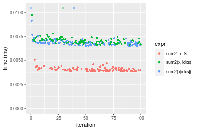
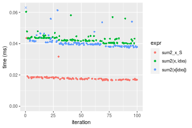
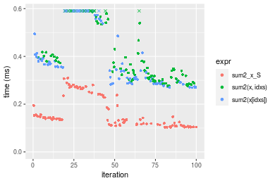
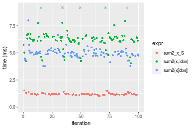
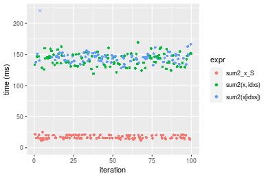
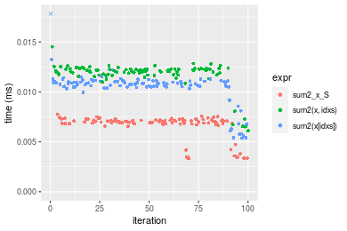
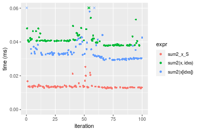
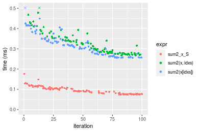
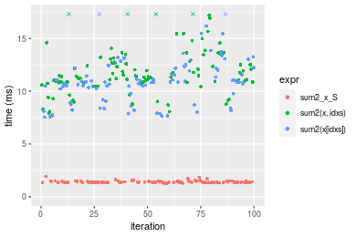
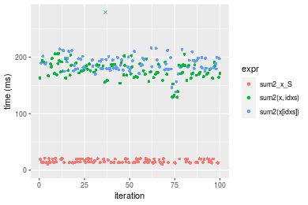

[matrixStats]: Benchmark report

---------------------------------------


# sum2() benchmarks on subsetted computation

This report benchmark the performance of sum2() on subsetted computation.


## Data type "integer"
### Data
```r
> rvector <- function(n, mode = c("logical", "double", "integer"), range = c(-100, +100), na_prob = 0) {
+     mode <- match.arg(mode)
+     if (mode == "logical") {
+         x <- sample(c(FALSE, TRUE), size = n, replace = TRUE)
+     }     else {
+         x <- runif(n, min = range[1], max = range[2])
+     }
+     storage.mode(x) <- mode
+     if (na_prob > 0) 
+         x[sample(n, size = na_prob * n)] <- NA
+     x
+ }
> rvectors <- function(scale = 10, seed = 1, ...) {
+     set.seed(seed)
+     data <- list()
+     data[[1]] <- rvector(n = scale * 100, ...)
+     data[[2]] <- rvector(n = scale * 1000, ...)
+     data[[3]] <- rvector(n = scale * 10000, ...)
+     data[[4]] <- rvector(n = scale * 1e+05, ...)
+     data[[5]] <- rvector(n = scale * 1e+06, ...)
+     names(data) <- sprintf("n = %d", sapply(data, FUN = length))
+     data
+ }
> data <- rvectors(mode = mode)
```

### Results

### n = 1000 vector


```r
> x <- data[["n = 1000"]]
> idxs <- sample.int(length(x), size = length(x) * 0.7)
> x_S <- x[idxs]
> gc()
           used  (Mb) gc trigger  (Mb)  max used  (Mb)
Ncells  5339042 285.2    8529671 455.6   8529671 455.6
Vcells 16966105 129.5   35919338 274.1 101881463 777.3
> stats <- microbenchmark(sum2_x_S = sum2(x_S), `sum2(x, idxs)` = sum2(x, idxs = idxs), `sum2(x[idxs])` = sum2(x[idxs]), 
+     unit = "ms")
```


_Table: Benchmarking of sum2_x_S(), sum2(x, idxs)() and sum2(x[idxs])() on integer+n = 1000 data. The top panel shows times in milliseconds and the bottom panel shows relative times._


|   |expr          |      min|       lq|      mean|    median|        uq|      max|
|:--|:-------------|--------:|--------:|---------:|---------:|---------:|--------:|
|1  |sum2_x_S      | 0.003888| 0.003944| 0.0041001| 0.0040685| 0.0041925| 0.005062|
|3  |sum2(x[idxs]) | 0.006465| 0.006634| 0.0090127| 0.0067995| 0.0069405| 0.211990|
|2  |sum2(x, idxs) | 0.006585| 0.006819| 0.0071780| 0.0069955| 0.0071600| 0.021329|


|   |expr          |      min|       lq|     mean|   median|       uq|       max|
|:--|:-------------|--------:|--------:|--------:|--------:|--------:|---------:|
|1  |sum2_x_S      | 1.000000| 1.000000| 1.000000| 1.000000| 1.000000|  1.000000|
|3  |sum2(x[idxs]) | 1.662809| 1.682049| 2.198174| 1.671255| 1.655456| 41.878704|
|2  |sum2(x, idxs) | 1.693673| 1.728955| 1.750705| 1.719430| 1.707812|  4.213552|

_Figure: Benchmarking of sum2_x_S(), sum2(x, idxs)() and sum2(x[idxs])() on integer+n = 1000 data.  Outliers are displayed as crosses.  Times are in milliseconds._



### n = 10000 vector


```r
> x <- data[["n = 10000"]]
> idxs <- sample.int(length(x), size = length(x) * 0.7)
> x_S <- x[idxs]
> gc()
           used  (Mb) gc trigger  (Mb)  max used  (Mb)
Ncells  5337016 285.1    8529671 455.6   8529671 455.6
Vcells 15836808 120.9   35919338 274.1 101881463 777.3
> stats <- microbenchmark(sum2_x_S = sum2(x_S), `sum2(x, idxs)` = sum2(x, idxs = idxs), `sum2(x[idxs])` = sum2(x[idxs]), 
+     unit = "ms")
```


_Table: Benchmarking of sum2_x_S(), sum2(x, idxs)() and sum2(x[idxs])() on integer+n = 10000 data. The top panel shows times in milliseconds and the bottom panel shows relative times._


|   |expr          |      min|        lq|      mean|    median|        uq|      max|
|:--|:-------------|--------:|---------:|---------:|---------:|---------:|--------:|
|1  |sum2_x_S      | 0.016542| 0.0171135| 0.0180283| 0.0175225| 0.0181555| 0.043571|
|3  |sum2(x[idxs]) | 0.037432| 0.0386760| 0.0411477| 0.0397415| 0.0410015| 0.082208|
|2  |sum2(x, idxs) | 0.039996| 0.0416600| 0.0431274| 0.0424055| 0.0436945| 0.060357|


|   |expr          |      min|       lq|     mean|   median|       uq|      max|
|:--|:-------------|--------:|--------:|--------:|--------:|--------:|--------:|
|1  |sum2_x_S      | 1.000000| 1.000000| 1.000000| 1.000000| 1.000000| 1.000000|
|3  |sum2(x[idxs]) | 2.262846| 2.259970| 2.282401| 2.268027| 2.258351| 1.886759|
|2  |sum2(x, idxs) | 2.417845| 2.434335| 2.392212| 2.420060| 2.406681| 1.385256|

_Figure: Benchmarking of sum2_x_S(), sum2(x, idxs)() and sum2(x[idxs])() on integer+n = 10000 data.  Outliers are displayed as crosses.  Times are in milliseconds._



### n = 100000 vector


```r
> x <- data[["n = 100000"]]
> idxs <- sample.int(length(x), size = length(x) * 0.7)
> x_S <- x[idxs]
> gc()
           used  (Mb) gc trigger  (Mb)  max used  (Mb)
Ncells  5337088 285.1    8529671 455.6   8529671 455.6
Vcells 15900368 121.4   35919338 274.1 101881463 777.3
> stats <- microbenchmark(sum2_x_S = sum2(x_S), `sum2(x, idxs)` = sum2(x, idxs = idxs), `sum2(x[idxs])` = sum2(x[idxs]), 
+     unit = "ms")
```


_Table: Benchmarking of sum2_x_S(), sum2(x, idxs)() and sum2(x[idxs])() on integer+n = 100000 data. The top panel shows times in milliseconds and the bottom panel shows relative times._


|   |expr          |      min|       lq|      mean|    median|        uq|      max|
|:--|:-------------|--------:|--------:|---------:|---------:|---------:|--------:|
|1  |sum2_x_S      | 0.103240| 0.111763| 0.1629306| 0.1360855| 0.2284565| 0.309776|
|2  |sum2(x, idxs) | 0.275884| 0.305763| 0.4091385| 0.3538015| 0.5390420| 0.732925|
|3  |sum2(x[idxs]) | 0.269274| 0.291527| 0.4129744| 0.3563350| 0.5721275| 0.699163|


|   |expr          |      min|       lq|     mean|   median|       uq|      max|
|:--|:-------------|--------:|--------:|--------:|--------:|--------:|--------:|
|1  |sum2_x_S      | 1.000000| 1.000000| 1.000000| 1.000000| 1.000000| 1.000000|
|2  |sum2(x, idxs) | 2.672259| 2.735816| 2.511121| 2.599847| 2.359495| 2.365984|
|3  |sum2(x[idxs]) | 2.608233| 2.608439| 2.534664| 2.618464| 2.504317| 2.256995|

_Figure: Benchmarking of sum2_x_S(), sum2(x, idxs)() and sum2(x[idxs])() on integer+n = 100000 data.  Outliers are displayed as crosses.  Times are in milliseconds._



### n = 1000000 vector


```r
> x <- data[["n = 1000000"]]
> idxs <- sample.int(length(x), size = length(x) * 0.7)
> x_S <- x[idxs]
> gc()
           used  (Mb) gc trigger  (Mb)  max used  (Mb)
Ncells  5337160 285.1    8529671 455.6   8529671 455.6
Vcells 16530417 126.2   35919338 274.1 101881463 777.3
> stats <- microbenchmark(sum2_x_S = sum2(x_S), `sum2(x, idxs)` = sum2(x, idxs = idxs), `sum2(x[idxs])` = sum2(x[idxs]), 
+     unit = "ms")
```


_Table: Benchmarking of sum2_x_S(), sum2(x, idxs)() and sum2(x[idxs])() on integer+n = 1000000 data. The top panel shows times in milliseconds and the bottom panel shows relative times._


|   |expr          |      min|       lq|      mean|   median|       uq|        max|
|:--|:-------------|--------:|--------:|---------:|--------:|--------:|----------:|
|1  |sum2_x_S      | 1.035728| 1.144772|  1.198305| 1.186244| 1.218014|   1.530576|
|3  |sum2(x[idxs]) | 3.770716| 4.764187|  5.140660| 4.982477| 5.170399|  18.618434|
|2  |sum2(x, idxs) | 4.045700| 6.052726| 10.287626| 6.256565| 6.515727| 388.068841|


|   |expr          |      min|       lq|     mean|   median|       uq|       max|
|:--|:-------------|--------:|--------:|--------:|--------:|--------:|---------:|
|1  |sum2_x_S      | 1.000000| 1.000000| 1.000000| 1.000000| 1.000000|   1.00000|
|3  |sum2(x[idxs]) | 3.640643| 4.161689| 4.289941| 4.200215| 4.244942|  12.16433|
|2  |sum2(x, idxs) | 3.906141| 5.287274| 8.585145| 5.274267| 5.349468| 253.54431|

_Figure: Benchmarking of sum2_x_S(), sum2(x, idxs)() and sum2(x[idxs])() on integer+n = 1000000 data.  Outliers are displayed as crosses.  Times are in milliseconds._



### n = 10000000 vector


```r
> x <- data[["n = 10000000"]]
> idxs <- sample.int(length(x), size = length(x) * 0.7)
> x_S <- x[idxs]
> gc()
           used  (Mb) gc trigger  (Mb)  max used  (Mb)
Ncells  5337232 285.1    8529671 455.6   8529671 455.6
Vcells 22830465 174.2   35919338 274.1 101881463 777.3
> stats <- microbenchmark(sum2_x_S = sum2(x_S), `sum2(x, idxs)` = sum2(x, idxs = idxs), `sum2(x[idxs])` = sum2(x[idxs]), 
+     unit = "ms")
```


_Table: Benchmarking of sum2_x_S(), sum2(x, idxs)() and sum2(x[idxs])() on integer+n = 10000000 data. The top panel shows times in milliseconds and the bottom panel shows relative times._


|   |expr          |       min|        lq|      mean|    median|        uq|       max|
|:--|:-------------|---------:|---------:|---------:|---------:|---------:|---------:|
|1  |sum2_x_S      |  11.93667|  15.40207|  17.26997|  16.03664|  20.18322|  25.04504|
|2  |sum2(x, idxs) | 119.20238| 133.66502| 142.01954| 143.87386| 149.18902| 169.49411|
|3  |sum2(x[idxs]) | 128.06503| 140.13187| 148.41911| 145.64447| 148.90959| 502.87241|


|   |expr          |      min|       lq|     mean|   median|       uq|       max|
|:--|:-------------|--------:|--------:|--------:|--------:|--------:|---------:|
|1  |sum2_x_S      |  1.00000| 1.000000| 1.000000| 1.000000| 1.000000|  1.000000|
|2  |sum2(x, idxs) |  9.98623| 8.678378| 8.223495| 8.971574| 7.391736|  6.767573|
|3  |sum2(x[idxs]) | 10.72870| 9.098246| 8.594056| 9.081984| 7.377891| 20.078725|

_Figure: Benchmarking of sum2_x_S(), sum2(x, idxs)() and sum2(x[idxs])() on integer+n = 10000000 data.  Outliers are displayed as crosses.  Times are in milliseconds._




## Data type "double"
### Data
```r
> rvector <- function(n, mode = c("logical", "double", "integer"), range = c(-100, +100), na_prob = 0) {
+     mode <- match.arg(mode)
+     if (mode == "logical") {
+         x <- sample(c(FALSE, TRUE), size = n, replace = TRUE)
+     }     else {
+         x <- runif(n, min = range[1], max = range[2])
+     }
+     storage.mode(x) <- mode
+     if (na_prob > 0) 
+         x[sample(n, size = na_prob * n)] <- NA
+     x
+ }
> rvectors <- function(scale = 10, seed = 1, ...) {
+     set.seed(seed)
+     data <- list()
+     data[[1]] <- rvector(n = scale * 100, ...)
+     data[[2]] <- rvector(n = scale * 1000, ...)
+     data[[3]] <- rvector(n = scale * 10000, ...)
+     data[[4]] <- rvector(n = scale * 1e+05, ...)
+     data[[5]] <- rvector(n = scale * 1e+06, ...)
+     names(data) <- sprintf("n = %d", sapply(data, FUN = length))
+     data
+ }
> data <- rvectors(mode = mode)
```

### Results

### n = 1000 vector


```r
> x <- data[["n = 1000"]]
> idxs <- sample.int(length(x), size = length(x) * 0.7)
> x_S <- x[idxs]
> gc()
           used  (Mb) gc trigger  (Mb)  max used  (Mb)
Ncells  5337304 285.1    8529671 455.6   8529671 455.6
Vcells 21387621 163.2   43183205 329.5 101881463 777.3
> stats <- microbenchmark(sum2_x_S = sum2(x_S), `sum2(x, idxs)` = sum2(x, idxs = idxs), `sum2(x[idxs])` = sum2(x[idxs]), 
+     unit = "ms")
```


_Table: Benchmarking of sum2_x_S(), sum2(x, idxs)() and sum2(x[idxs])() on double+n = 1000 data. The top panel shows times in milliseconds and the bottom panel shows relative times._


|   |expr          |      min|        lq|      mean|    median|        uq|      max|
|:--|:-------------|--------:|---------:|---------:|---------:|---------:|--------:|
|1  |sum2_x_S      | 0.003315| 0.0068155| 0.0065835| 0.0070115| 0.0071520| 0.007755|
|3  |sum2(x[idxs]) | 0.005372| 0.0105045| 0.0107345| 0.0108215| 0.0110625| 0.051268|
|2  |sum2(x, idxs) | 0.006120| 0.0117700| 0.0117878| 0.0121080| 0.0122820| 0.014512|


|   |expr          |      min|       lq|     mean|   median|       uq|      max|
|:--|:-------------|--------:|--------:|--------:|--------:|--------:|--------:|
|1  |sum2_x_S      | 1.000000| 1.000000| 1.000000| 1.000000| 1.000000| 1.000000|
|3  |sum2(x[idxs]) | 1.620513| 1.541266| 1.630519| 1.543393| 1.546770| 6.610961|
|2  |sum2(x, idxs) | 1.846154| 1.726946| 1.790510| 1.726877| 1.717282| 1.871309|

_Figure: Benchmarking of sum2_x_S(), sum2(x, idxs)() and sum2(x[idxs])() on double+n = 1000 data.  Outliers are displayed as crosses.  Times are in milliseconds._



### n = 10000 vector


```r
> x <- data[["n = 10000"]]
> idxs <- sample.int(length(x), size = length(x) * 0.7)
> x_S <- x[idxs]
> gc()
           used  (Mb) gc trigger  (Mb)  max used  (Mb)
Ncells  5337376 285.1    8529671 455.6   8529671 455.6
Vcells 21397118 163.3   43183205 329.5 101881463 777.3
> stats <- microbenchmark(sum2_x_S = sum2(x_S), `sum2(x, idxs)` = sum2(x, idxs = idxs), `sum2(x[idxs])` = sum2(x[idxs]), 
+     unit = "ms")
```


_Table: Benchmarking of sum2_x_S(), sum2(x, idxs)() and sum2(x[idxs])() on double+n = 10000 data. The top panel shows times in milliseconds and the bottom panel shows relative times._


|   |expr          |      min|       lq|      mean|    median|        uq|      max|
|:--|:-------------|--------:|--------:|---------:|---------:|---------:|--------:|
|1  |sum2_x_S      | 0.012539| 0.013029| 0.0138391| 0.0133220| 0.0136885| 0.025307|
|3  |sum2(x[idxs]) | 0.029324| 0.030377| 0.0344914| 0.0326805| 0.0351940| 0.098803|
|2  |sum2(x, idxs) | 0.037780| 0.038241| 0.0419622| 0.0406485| 0.0418245| 0.082499|


|   |expr          |      min|       lq|     mean|   median|       uq|      max|
|:--|:-------------|--------:|--------:|--------:|--------:|--------:|--------:|
|1  |sum2_x_S      | 1.000000| 1.000000| 1.000000| 1.000000| 1.000000| 1.000000|
|3  |sum2(x[idxs]) | 2.338624| 2.331491| 2.492310| 2.453123| 2.571063| 3.904177|
|2  |sum2(x, idxs) | 3.012999| 2.935068| 3.032139| 3.051231| 3.055448| 3.259928|

_Figure: Benchmarking of sum2_x_S(), sum2(x, idxs)() and sum2(x[idxs])() on double+n = 10000 data.  Outliers are displayed as crosses.  Times are in milliseconds._



### n = 100000 vector


```r
> x <- data[["n = 100000"]]
> idxs <- sample.int(length(x), size = length(x) * 0.7)
> x_S <- x[idxs]
> gc()
           used  (Mb) gc trigger  (Mb)  max used  (Mb)
Ncells  5337448 285.1    8529671 455.6   8529671 455.6
Vcells 21491986 164.0   43183205 329.5 101881463 777.3
> stats <- microbenchmark(sum2_x_S = sum2(x_S), `sum2(x, idxs)` = sum2(x, idxs = idxs), `sum2(x[idxs])` = sum2(x[idxs]), 
+     unit = "ms")
```


_Table: Benchmarking of sum2_x_S(), sum2(x, idxs)() and sum2(x[idxs])() on double+n = 100000 data. The top panel shows times in milliseconds and the bottom panel shows relative times._


|   |expr          |      min|        lq|      mean|    median|        uq|      max|
|:--|:-------------|--------:|---------:|---------:|---------:|---------:|--------:|
|1  |sum2_x_S      | 0.074775| 0.0787330| 0.0948227| 0.0911010| 0.1053205| 0.176324|
|2  |sum2(x, idxs) | 0.267652| 0.2787425| 0.3251536| 0.3077015| 0.3561590| 0.504595|
|3  |sum2(x[idxs]) | 0.255743| 0.2721100| 0.3210709| 0.3160875| 0.3490395| 0.603275|


|   |expr          |      min|       lq|     mean|   median|       uq|      max|
|:--|:-------------|--------:|--------:|--------:|--------:|--------:|--------:|
|1  |sum2_x_S      | 1.000000| 1.000000| 1.000000| 1.000000| 1.000000| 1.000000|
|2  |sum2(x, idxs) | 3.579432| 3.540352| 3.429068| 3.377586| 3.381668| 2.861749|
|3  |sum2(x[idxs]) | 3.420167| 3.456111| 3.386012| 3.469638| 3.314070| 3.421400|

_Figure: Benchmarking of sum2_x_S(), sum2(x, idxs)() and sum2(x[idxs])() on double+n = 100000 data.  Outliers are displayed as crosses.  Times are in milliseconds._



### n = 1000000 vector


```r
> x <- data[["n = 1000000"]]
> idxs <- sample.int(length(x), size = length(x) * 0.7)
> x_S <- x[idxs]
> gc()
           used  (Mb) gc trigger  (Mb)  max used  (Mb)
Ncells  5337520 285.1    8529671 455.6   8529671 455.6
Vcells 22437417 171.2   43183205 329.5 101881463 777.3
> stats <- microbenchmark(sum2_x_S = sum2(x_S), `sum2(x, idxs)` = sum2(x, idxs = idxs), `sum2(x[idxs])` = sum2(x[idxs]), 
+     unit = "ms")
```


_Table: Benchmarking of sum2_x_S(), sum2(x, idxs)() and sum2(x[idxs])() on double+n = 1000000 data. The top panel shows times in milliseconds and the bottom panel shows relative times._


|   |expr          |      min|        lq|      mean|    median|        uq|       max|
|:--|:-------------|--------:|---------:|---------:|---------:|---------:|---------:|
|1  |sum2_x_S      | 1.275939|  1.346394|  1.409058|  1.372686|  1.447218|  1.930537|
|3  |sum2(x[idxs]) | 7.534066|  9.775640| 10.968739| 10.861674| 12.071755| 22.010154|
|2  |sum2(x, idxs) | 7.902787| 10.818909| 12.123413| 11.409294| 12.962701| 25.696688|


|   |expr          |      min|       lq|     mean|   median|       uq|      max|
|:--|:-------------|--------:|--------:|--------:|--------:|--------:|--------:|
|1  |sum2_x_S      | 1.000000| 1.000000| 1.000000| 1.000000| 1.000000|  1.00000|
|3  |sum2(x[idxs]) | 5.904723| 7.260612| 7.784446| 7.912713| 8.341352| 11.40105|
|2  |sum2(x, idxs) | 6.193703| 8.035473| 8.603910| 8.311653| 8.956979| 13.31064|

_Figure: Benchmarking of sum2_x_S(), sum2(x, idxs)() and sum2(x[idxs])() on double+n = 1000000 data.  Outliers are displayed as crosses.  Times are in milliseconds._



### n = 10000000 vector


```r
> x <- data[["n = 10000000"]]
> idxs <- sample.int(length(x), size = length(x) * 0.7)
> x_S <- x[idxs]
> gc()
           used  (Mb) gc trigger  (Mb)  max used  (Mb)
Ncells  5337592 285.1    8529671 455.6   8529671 455.6
Vcells 31887465 243.3   51899846 396.0 101881463 777.3
> stats <- microbenchmark(sum2_x_S = sum2(x_S), `sum2(x, idxs)` = sum2(x, idxs = idxs), `sum2(x[idxs])` = sum2(x[idxs]), 
+     unit = "ms")
```


_Table: Benchmarking of sum2_x_S(), sum2(x, idxs)() and sum2(x[idxs])() on double+n = 10000000 data. The top panel shows times in milliseconds and the bottom panel shows relative times._


|   |expr          |       min|        lq|      mean|    median|        uq|       max|
|:--|:-------------|---------:|---------:|---------:|---------:|---------:|---------:|
|1  |sum2_x_S      |  10.47633|  13.53525|  16.05734|  14.62333|  19.78404|  21.19626|
|2  |sum2(x, idxs) | 129.07190| 168.06425| 180.12031| 175.49009| 187.25718| 571.11144|
|3  |sum2(x[idxs]) | 138.63391| 179.40518| 187.78671| 185.09707| 196.74914| 216.24259|


|   |expr          |      min|       lq|     mean|   median|       uq|      max|
|:--|:-------------|--------:|--------:|--------:|--------:|--------:|--------:|
|1  |sum2_x_S      |  1.00000|  1.00000|  1.00000|  1.00000| 1.000000|  1.00000|
|2  |sum2(x, idxs) | 12.32034| 12.41678| 11.21732| 12.00070| 9.465061| 26.94397|
|3  |sum2(x[idxs]) | 13.23306| 13.25466| 11.69476| 12.65766| 9.944840| 10.20192|

_Figure: Benchmarking of sum2_x_S(), sum2(x, idxs)() and sum2(x[idxs])() on double+n = 10000000 data.  Outliers are displayed as crosses.  Times are in milliseconds._




## Appendix

### Session information
```r
R version 4.1.1 Patched (2021-08-10 r80727)
Platform: x86_64-pc-linux-gnu (64-bit)
Running under: Ubuntu 18.04.5 LTS

Matrix products: default
BLAS:   /home/hb/software/R-devel/R-4-1-branch/lib/R/lib/libRblas.so
LAPACK: /home/hb/software/R-devel/R-4-1-branch/lib/R/lib/libRlapack.so

locale:
 [1] LC_CTYPE=en_US.UTF-8       LC_NUMERIC=C              
 [3] LC_TIME=en_US.UTF-8        LC_COLLATE=en_US.UTF-8    
 [5] LC_MONETARY=en_US.UTF-8    LC_MESSAGES=en_US.UTF-8   
 [7] LC_PAPER=en_US.UTF-8       LC_NAME=C                 
 [9] LC_ADDRESS=C               LC_TELEPHONE=C            
[11] LC_MEASUREMENT=en_US.UTF-8 LC_IDENTIFICATION=C       

attached base packages:
[1] stats     graphics  grDevices utils     datasets  methods   base     

other attached packages:
[1] microbenchmark_1.4-7   matrixStats_0.60.1     ggplot2_3.3.5         
[4] knitr_1.33             R.devices_2.17.0       R.utils_2.10.1        
[7] R.oo_1.24.0            R.methodsS3_1.8.1-9001 history_0.0.1-9000    

loaded via a namespace (and not attached):
 [1] Biobase_2.52.0          httr_1.4.2              splines_4.1.1          
 [4] bit64_4.0.5             network_1.17.1          assertthat_0.2.1       
 [7] highr_0.9               stats4_4.1.1            blob_1.2.2             
[10] GenomeInfoDbData_1.2.6  robustbase_0.93-8       pillar_1.6.2           
[13] RSQLite_2.2.8           lattice_0.20-44         glue_1.4.2             
[16] digest_0.6.27           XVector_0.32.0          colorspace_2.0-2       
[19] Matrix_1.3-4            XML_3.99-0.7            pkgconfig_2.0.3        
[22] zlibbioc_1.38.0         genefilter_1.74.0       purrr_0.3.4            
[25] ergm_4.1.2              xtable_1.8-4            scales_1.1.1           
[28] tibble_3.1.4            annotate_1.70.0         KEGGREST_1.32.0        
[31] farver_2.1.0            generics_0.1.0          IRanges_2.26.0         
[34] ellipsis_0.3.2          cachem_1.0.6            withr_2.4.2            
[37] BiocGenerics_0.38.0     mime_0.11               survival_3.2-13        
[40] magrittr_2.0.1          crayon_1.4.1            statnet.common_4.5.0   
[43] memoise_2.0.0           laeken_0.5.1            fansi_0.5.0            
[46] R.cache_0.15.0          MASS_7.3-54             R.rsp_0.44.0           
[49] progressr_0.8.0         tools_4.1.1             lifecycle_1.0.0        
[52] S4Vectors_0.30.0        trust_0.1-8             munsell_0.5.0          
[55] tabby_0.0.1-9001        AnnotationDbi_1.54.1    Biostrings_2.60.2      
[58] compiler_4.1.1          GenomeInfoDb_1.28.1     rlang_0.4.11           
[61] grid_4.1.1              RCurl_1.98-1.4          cwhmisc_6.6            
[64] rappdirs_0.3.3          startup_0.15.0          labeling_0.4.2         
[67] bitops_1.0-7            base64enc_0.1-3         boot_1.3-28            
[70] gtable_0.3.0            DBI_1.1.1               markdown_1.1           
[73] R6_2.5.1                lpSolveAPI_5.5.2.0-17.7 rle_0.9.2              
[76] dplyr_1.0.7             fastmap_1.1.0           bit_4.0.4              
[79] utf8_1.2.2              parallel_4.1.1          Rcpp_1.0.7             
[82] vctrs_0.3.8             png_0.1-7               DEoptimR_1.0-9         
[85] tidyselect_1.1.1        xfun_0.25               coda_0.19-4            
```
Total processing time was 1.51 mins.


### Reproducibility
To reproduce this report, do:
```r
html <- matrixStats:::benchmark('sum2_subset')
```

[RSP]: https://cran.r-project.org/package=R.rsp
[matrixStats]: https://cran.r-project.org/package=matrixStats

[StackOverflow:colMins?]: https://stackoverflow.com/questions/13676878 "Stack Overflow: fastest way to get Min from every column in a matrix?"
[StackOverflow:colSds?]: https://stackoverflow.com/questions/17549762 "Stack Overflow: Is there such 'colsd' in R?"
[StackOverflow:rowProds?]: https://stackoverflow.com/questions/20198801/ "Stack Overflow: Row product of matrix and column sum of matrix"

---------------------------------------
Copyright Dongcan Jiang. Last updated on 2021-08-25 19:27:41 (+0200 UTC). Powered by [RSP].

<script>
 var link = document.createElement('link');
 link.rel = 'icon';
 link.href = "data:image/png;base64,iVBORw0KGgoAAAANSUhEUgAAACAAAAAgCAMAAABEpIrGAAAA21BMVEUAAAAAAP8AAP8AAP8AAP8AAP8AAP8AAP8AAP8AAP8AAP8AAP8AAP8AAP8AAP8AAP8AAP8AAP8AAP8AAP8AAP8AAP8AAP8AAP8AAP8AAP8AAP8AAP8AAP8AAP8AAP8AAP8AAP8AAP8AAP8AAP8AAP8AAP8AAP8AAP8AAP8AAP8BAf4CAv0DA/wdHeIeHuEfH+AgIN8hId4lJdomJtknJ9g+PsE/P8BAQL9yco10dIt1dYp3d4h4eIeVlWqWlmmXl2iYmGeZmWabm2Tn5xjo6Bfp6Rb39wj4+Af//wA2M9hbAAAASXRSTlMAAQIJCgsMJSYnKD4/QGRlZmhpamtsbautrrCxuru8y8zN5ebn6Pn6+///////////////////////////////////////////LsUNcQAAAS9JREFUOI29k21XgkAQhVcFytdSMqMETU26UVqGmpaiFbL//xc1cAhhwVNf6n5i5z67M2dmYOyfJZUqlVLhkKucG7cgmUZTybDz6g0iDeq51PUr37Ds2cy2/C9NeES5puDjxuUk1xnToZsg8pfA3avHQ3lLIi7iWRrkv/OYtkScxBIMgDee0ALoyxHQBJ68JLCjOtQIMIANF7QG9G9fNnHvisCHBVMKgSJgiz7nE+AoBKrAPA3MgepvgR9TSCasrCKH0eB1wBGBFdCO+nAGjMVGPcQb5bd6mQRegN6+1axOs9nGfYcCtfi4NQosdtH7dB+txFIpXQqN1p9B/asRHToyS0jRgpV7nk4nwcq1BJ+x3Gl/v7S9Wmpp/aGquum7w3ZDyrADFYrl8vHBH+ev9AUASW1dmU4h4wAAAABJRU5ErkJggg=="
 document.getElementsByTagName('head')[0].appendChild(link);
</script>


