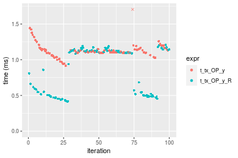

[matrixStats]: Benchmark report

---------------------------------------


# t_tx_OP_y() benchmarks

This report benchmark the performance of t_tx_OP_y() against alternative methods.

## Alternative methods

* t_tx_OP_y_R()

as below

```r
> t_tx_OP_y_R <- function(x, y, OP, na.rm = FALSE) {
+     x <- t(x)
+     if (na.rm) {
+         xnok <- is.na(x)
+         ynok <- is.na(y)
+         anok <- xnok & ynok
+         unit <- switch(OP, `+` = 0, `-` = NA_real_, `*` = 1, `/` = NA_real_, stop("Unknown 'OP' operator: ", 
+             OP))
+         x[xnok] <- unit
+         y[ynok] <- unit
+     }
+     ans <- switch(OP, `+` = x + y, `-` = x - y, `*` = x * y, `/` = x/y, stop("Unknown 'OP' operator: ", 
+         OP))
+     if (na.rm) {
+         ans[anok] <- NA_real_
+     }
+     t(ans)
+ }
```


## Data type "integer"
### Data
```r
> rmatrix <- function(nrow, ncol, mode = c("logical", "double", "integer", "index"), range = c(-100, 
+     +100), na_prob = 0) {
+     mode <- match.arg(mode)
+     n <- nrow * ncol
+     if (mode == "logical") {
+         x <- sample(c(FALSE, TRUE), size = n, replace = TRUE)
+     }     else if (mode == "index") {
+         x <- seq_len(n)
+         mode <- "integer"
+     }     else {
+         x <- runif(n, min = range[1], max = range[2])
+     }
+     storage.mode(x) <- mode
+     if (na_prob > 0) 
+         x[sample(n, size = na_prob * n)] <- NA
+     dim(x) <- c(nrow, ncol)
+     x
+ }
> rmatrices <- function(scale = 10, seed = 1, ...) {
+     set.seed(seed)
+     data <- list()
+     data[[1]] <- rmatrix(nrow = scale * 1, ncol = scale * 1, ...)
+     data[[2]] <- rmatrix(nrow = scale * 10, ncol = scale * 10, ...)
+     data[[3]] <- rmatrix(nrow = scale * 100, ncol = scale * 1, ...)
+     data[[4]] <- t(data[[3]])
+     data[[5]] <- rmatrix(nrow = scale * 10, ncol = scale * 100, ...)
+     data[[6]] <- t(data[[5]])
+     names(data) <- sapply(data, FUN = function(x) paste(dim(x), collapse = "x"))
+     data
+ }
> data <- rmatrices(mode = mode)
```

### Results

### 10x10 vector

#### All elements
```r
> x <- data[["10x10"]]
> y <- x[, 1L]
```

```r
> OP
[1] "+"
> stats <- microbenchmark(t_tx_OP_y = t_tx_OP_y(x, y, OP = OP, na.rm = FALSE), t_tx_OP_y_R = t_tx_OP_y_R(x, 
+     y, OP = OP, na.rm = FALSE), unit = "ms")
> gc()
           used  (Mb) gc trigger  (Mb)  max used  (Mb)
Ncells  5347427 285.6    8529671 455.6   8529671 455.6
Vcells 10709330  81.8   39910282 304.5 101881463 777.3
```

_Table: Benchmarking of t_tx_OP_y() and t_tx_OP_y_R() on integer+10x10+add data. The top panel shows times in milliseconds and the bottom panel shows relative times._


|   |expr        |      min|       lq|      mean|   median|        uq|      max|
|:--|:-----------|--------:|--------:|---------:|--------:|---------:|--------:|
|1  |t_tx_OP_y   | 0.004983| 0.005279| 0.0056798| 0.005475| 0.0056840|  0.01901|
|2  |t_tx_OP_y_R | 0.007547| 0.008338| 0.1349789| 0.008664| 0.0090305| 12.59405|


|   |expr        |      min|       lq|     mean|   median|       uq|      max|
|:--|:-----------|--------:|--------:|--------:|--------:|--------:|--------:|
|1  |t_tx_OP_y   | 1.000000| 1.000000|  1.00000| 1.000000| 1.000000|   1.0000|
|2  |t_tx_OP_y_R | 1.514549| 1.579466| 23.76457| 1.582466| 1.588758| 662.4961|

_Figure: Benchmarking of t_tx_OP_y() and t_tx_OP_y_R() on integer+10x10+add data.  Outliers are displayed as crosses.  Times are in milliseconds._


```r
> OP
[1] "-"
> stats <- microbenchmark(t_tx_OP_y = t_tx_OP_y(x, y, OP = OP, na.rm = FALSE), t_tx_OP_y_R = t_tx_OP_y_R(x, 
+     y, OP = OP, na.rm = FALSE), unit = "ms")
> gc()
           used  (Mb) gc trigger  (Mb)  max used  (Mb)
Ncells  5345038 285.5    8529671 455.6   8529671 455.6
Vcells 10400465  79.4   39910282 304.5 101881463 777.3
```

_Table: Benchmarking of t_tx_OP_y() and t_tx_OP_y_R() on integer+10x10+sub data. The top panel shows times in milliseconds and the bottom panel shows relative times._


|   |expr        |      min|        lq|      mean|   median|        uq|      max|
|:--|:-----------|--------:|---------:|---------:|--------:|---------:|--------:|
|1  |t_tx_OP_y   | 0.005664| 0.0060235| 0.0064878| 0.006254| 0.0065040| 0.023962|
|2  |t_tx_OP_y_R | 0.008637| 0.0094145| 0.0103448| 0.009834| 0.0102425| 0.046976|


|   |expr        |      min|       lq|     mean|   median|     uq|      max|
|:--|:-----------|--------:|--------:|--------:|--------:|------:|--------:|
|1  |t_tx_OP_y   | 1.000000| 1.000000| 1.000000| 1.000000| 1.0000| 1.000000|
|2  |t_tx_OP_y_R | 1.524894| 1.562962| 1.594488| 1.572434| 1.5748| 1.960437|

_Figure: Benchmarking of t_tx_OP_y() and t_tx_OP_y_R() on integer+10x10+sub data.  Outliers are displayed as crosses.  Times are in milliseconds._


```r
> OP
[1] "*"
> stats <- microbenchmark(t_tx_OP_y = t_tx_OP_y(x, y, OP = OP, na.rm = FALSE), t_tx_OP_y_R = t_tx_OP_y_R(x, 
+     y, OP = OP, na.rm = FALSE), unit = "ms")
> gc()
           used  (Mb) gc trigger  (Mb)  max used  (Mb)
Ncells  5345101 285.5    8529671 455.6   8529671 455.6
Vcells 10401019  79.4   39910282 304.5 101881463 777.3
```

_Table: Benchmarking of t_tx_OP_y() and t_tx_OP_y_R() on integer+10x10+mul data. The top panel shows times in milliseconds and the bottom panel shows relative times._


|   |expr        |      min|        lq|      mean|   median|       uq|      max|
|:--|:-----------|--------:|---------:|---------:|--------:|--------:|--------:|
|1  |t_tx_OP_y   | 0.005545| 0.0058525| 0.0063719| 0.006114| 0.006258| 0.028545|
|2  |t_tx_OP_y_R | 0.008728| 0.0096525| 0.0103266| 0.010018| 0.010333| 0.038994|


|   |expr        |      min|       lq|     mean|   median|       uq|      max|
|:--|:-----------|--------:|--------:|--------:|--------:|--------:|--------:|
|1  |t_tx_OP_y   | 1.000000| 1.000000| 1.000000| 1.000000| 1.000000| 1.000000|
|2  |t_tx_OP_y_R | 1.574031| 1.649295| 1.620653| 1.638535| 1.651166| 1.366054|

_Figure: Benchmarking of t_tx_OP_y() and t_tx_OP_y_R() on integer+10x10+mul data.  Outliers are displayed as crosses.  Times are in milliseconds._


```r
> OP
[1] "/"
> stats <- microbenchmark(t_tx_OP_y = t_tx_OP_y(x, y, OP = OP, na.rm = FALSE), t_tx_OP_y_R = t_tx_OP_y_R(x, 
+     y, OP = OP, na.rm = FALSE), unit = "ms")
> gc()
           used  (Mb) gc trigger  (Mb)  max used  (Mb)
Ncells  5345164 285.5    8529671 455.6   8529671 455.6
Vcells 10401061  79.4   39910282 304.5 101881463 777.3
```

_Table: Benchmarking of t_tx_OP_y() and t_tx_OP_y_R() on integer+10x10+div data. The top panel shows times in milliseconds and the bottom panel shows relative times._


|   |expr        |      min|       lq|      mean|    median|        uq|      max|
|:--|:-----------|--------:|--------:|---------:|---------:|---------:|--------:|
|1  |t_tx_OP_y   | 0.005692| 0.005940| 0.0065432| 0.0061915| 0.0064425| 0.023614|
|2  |t_tx_OP_y_R | 0.008903| 0.009336| 0.0104996| 0.0097680| 0.0102045| 0.044990|


|   |expr        |      min|       lq|     mean|   median|       uq|      max|
|:--|:-----------|--------:|--------:|--------:|--------:|--------:|--------:|
|1  |t_tx_OP_y   | 1.000000| 1.000000| 1.000000| 1.000000| 1.000000| 1.000000|
|2  |t_tx_OP_y_R | 1.564125| 1.571717| 1.604658| 1.577647| 1.583935| 1.905226|

_Figure: Benchmarking of t_tx_OP_y() and t_tx_OP_y_R() on integer+10x10+div data.  Outliers are displayed as crosses.  Times are in milliseconds._


### 100x100 vector

#### All elements
```r
> x <- data[["100x100"]]
> y <- x[, 1L]
```

```r
> OP
[1] "+"
> stats <- microbenchmark(t_tx_OP_y = t_tx_OP_y(x, y, OP = OP, na.rm = FALSE), t_tx_OP_y_R = t_tx_OP_y_R(x, 
+     y, OP = OP, na.rm = FALSE), unit = "ms")
> gc()
           used  (Mb) gc trigger  (Mb)  max used  (Mb)
Ncells  5345227 285.5    8529671 455.6   8529671 455.6
Vcells 10401145  79.4   39910282 304.5 101881463 777.3
```

_Table: Benchmarking of t_tx_OP_y() and t_tx_OP_y_R() on integer+100x100+add data. The top panel shows times in milliseconds and the bottom panel shows relative times._


|   |expr        |      min|        lq|      mean|    median|       uq|      max|
|:--|:-----------|--------:|---------:|---------:|---------:|--------:|--------:|
|2  |t_tx_OP_y_R | 0.061055| 0.0634935| 0.0695768| 0.0674600| 0.073376| 0.109567|
|1  |t_tx_OP_y   | 0.131513| 0.1367450| 0.1499521| 0.1466425| 0.158129| 0.196721|


|   |expr        |      min|       lq|     mean|  median|       uq|     max|
|:--|:-----------|--------:|--------:|--------:|-------:|--------:|-------:|
|2  |t_tx_OP_y_R | 1.000000| 1.000000| 1.000000| 1.00000| 1.000000| 1.00000|
|1  |t_tx_OP_y   | 2.154009| 2.153685| 2.155204| 2.17377| 2.155051| 1.79544|

_Figure: Benchmarking of t_tx_OP_y() and t_tx_OP_y_R() on integer+100x100+add data.  Outliers are displayed as crosses.  Times are in milliseconds._


```r
> OP
[1] "-"
> stats <- microbenchmark(t_tx_OP_y = t_tx_OP_y(x, y, OP = OP, na.rm = FALSE), t_tx_OP_y_R = t_tx_OP_y_R(x, 
+     y, OP = OP, na.rm = FALSE), unit = "ms")
> gc()
           used  (Mb) gc trigger  (Mb)  max used  (Mb)
Ncells  5345290 285.5    8529671 455.6   8529671 455.6
Vcells 10401394  79.4   39910282 304.5 101881463 777.3
```

_Table: Benchmarking of t_tx_OP_y() and t_tx_OP_y_R() on integer+100x100+sub data. The top panel shows times in milliseconds and the bottom panel shows relative times._


|   |expr        |      min|        lq|      mean|    median|        uq|      max|
|:--|:-----------|--------:|---------:|---------:|---------:|---------:|--------:|
|2  |t_tx_OP_y_R | 0.060371| 0.0628145| 0.0693277| 0.0677580| 0.0738335| 0.108615|
|1  |t_tx_OP_y   | 0.131984| 0.1376405| 0.1514367| 0.1500385| 0.1604225| 0.202590|


|   |expr        |      min|       lq|     mean|   median|      uq|      max|
|:--|:-----------|--------:|--------:|--------:|--------:|-------:|--------:|
|2  |t_tx_OP_y_R | 1.000000| 1.000000| 1.000000| 1.000000| 1.00000| 1.000000|
|1  |t_tx_OP_y   | 2.186215| 2.191222| 2.184359| 2.214329| 2.17276| 1.865212|

_Figure: Benchmarking of t_tx_OP_y() and t_tx_OP_y_R() on integer+100x100+sub data.  Outliers are displayed as crosses.  Times are in milliseconds._


```r
> OP
[1] "*"
> stats <- microbenchmark(t_tx_OP_y = t_tx_OP_y(x, y, OP = OP, na.rm = FALSE), t_tx_OP_y_R = t_tx_OP_y_R(x, 
+     y, OP = OP, na.rm = FALSE), unit = "ms")
> gc()
           used  (Mb) gc trigger  (Mb)  max used  (Mb)
Ncells  5345353 285.5    8529671 455.6   8529671 455.6
Vcells 10401691  79.4   39910282 304.5 101881463 777.3
```

_Table: Benchmarking of t_tx_OP_y() and t_tx_OP_y_R() on integer+100x100+mul data. The top panel shows times in milliseconds and the bottom panel shows relative times._


|   |expr        |      min|       lq|      mean|    median|        uq|      max|
|:--|:-----------|--------:|--------:|---------:|---------:|---------:|--------:|
|2  |t_tx_OP_y_R | 0.074205| 0.078724| 0.0858203| 0.0835490| 0.0900225| 0.136397|
|1  |t_tx_OP_y   | 0.123745| 0.128419| 0.1416537| 0.1399055| 0.1514950| 0.176588|


|   |expr        |     min|       lq|     mean|   median|       uq|      max|
|:--|:-----------|-------:|--------:|--------:|--------:|--------:|--------:|
|2  |t_tx_OP_y_R | 1.00000| 1.000000| 1.000000| 1.000000| 1.000000| 1.000000|
|1  |t_tx_OP_y   | 1.66761| 1.631256| 1.650585| 1.674532| 1.682857| 1.294662|

_Figure: Benchmarking of t_tx_OP_y() and t_tx_OP_y_R() on integer+100x100+mul data.  Outliers are displayed as crosses.  Times are in milliseconds._


```r
> OP
[1] "/"
> stats <- microbenchmark(t_tx_OP_y = t_tx_OP_y(x, y, OP = OP, na.rm = FALSE), t_tx_OP_y_R = t_tx_OP_y_R(x, 
+     y, OP = OP, na.rm = FALSE), unit = "ms")
> gc()
           used  (Mb) gc trigger  (Mb)  max used  (Mb)
Ncells  5345416 285.5    8529671 455.6   8529671 455.6
Vcells 10401733  79.4   39910282 304.5 101881463 777.3
```

_Table: Benchmarking of t_tx_OP_y() and t_tx_OP_y_R() on integer+100x100+div data. The top panel shows times in milliseconds and the bottom panel shows relative times._


|   |expr        |      min|        lq|      mean|    median|       uq|      max|
|:--|:-----------|--------:|---------:|---------:|---------:|--------:|--------:|
|2  |t_tx_OP_y_R | 0.058448| 0.0603865| 0.0661994| 0.0637955| 0.070090| 0.123605|
|1  |t_tx_OP_y   | 0.124958| 0.1303255| 0.1421488| 0.1396770| 0.151172| 0.180366|


|   |expr        |      min|       lq|     mean|   median|       uq|      max|
|:--|:-----------|--------:|--------:|--------:|--------:|--------:|--------:|
|2  |t_tx_OP_y_R | 1.000000| 1.000000| 1.000000| 1.000000| 1.000000| 1.000000|
|1  |t_tx_OP_y   | 2.137935| 2.158189| 2.147283| 2.189449| 2.156827| 1.459213|

_Figure: Benchmarking of t_tx_OP_y() and t_tx_OP_y_R() on integer+100x100+div data.  Outliers are displayed as crosses.  Times are in milliseconds._


### 1000x10 vector

#### All elements
```r
> x <- data[["1000x10"]]
> y <- x[, 1L]
```

```r
> OP
[1] "+"
> stats <- microbenchmark(t_tx_OP_y = t_tx_OP_y(x, y, OP = OP, na.rm = FALSE), t_tx_OP_y_R = t_tx_OP_y_R(x, 
+     y, OP = OP, na.rm = FALSE), unit = "ms")
> gc()
           used  (Mb) gc trigger  (Mb)  max used  (Mb)
Ncells  5345479 285.5    8529671 455.6   8529671 455.6
Vcells 10402562  79.4   39910282 304.5 101881463 777.3
```

_Table: Benchmarking of t_tx_OP_y() and t_tx_OP_y_R() on integer+1000x10+add data. The top panel shows times in milliseconds and the bottom panel shows relative times._


|   |expr        |      min|        lq|      mean|    median|       uq|      max|
|:--|:-----------|--------:|---------:|---------:|---------:|--------:|--------:|
|2  |t_tx_OP_y_R | 0.062701| 0.0642275| 0.0715736| 0.0694975| 0.076245| 0.129545|
|1  |t_tx_OP_y   | 0.135152| 0.1394690| 0.1505490| 0.1495850| 0.162141| 0.186400|


|   |expr        |    min|       lq|     mean|  median|       uq|      max|
|:--|:-----------|------:|--------:|--------:|-------:|--------:|--------:|
|2  |t_tx_OP_y_R | 1.0000| 1.000000| 1.000000| 1.00000| 1.000000| 1.000000|
|1  |t_tx_OP_y   | 2.1555| 2.171484| 2.103417| 2.15238| 2.126579| 1.438882|

_Figure: Benchmarking of t_tx_OP_y() and t_tx_OP_y_R() on integer+1000x10+add data.  Outliers are displayed as crosses.  Times are in milliseconds._


```r
> OP
[1] "-"
> stats <- microbenchmark(t_tx_OP_y = t_tx_OP_y(x, y, OP = OP, na.rm = FALSE), t_tx_OP_y_R = t_tx_OP_y_R(x, 
+     y, OP = OP, na.rm = FALSE), unit = "ms")
> gc()
           used  (Mb) gc trigger  (Mb)  max used  (Mb)
Ncells  5345542 285.5    8529671 455.6   8529671 455.6
Vcells 10402968  79.4   39910282 304.5 101881463 777.3
```

_Table: Benchmarking of t_tx_OP_y() and t_tx_OP_y_R() on integer+1000x10+sub data. The top panel shows times in milliseconds and the bottom panel shows relative times._


|   |expr        |      min|        lq|      mean|    median|        uq|      max|
|:--|:-----------|--------:|---------:|---------:|---------:|---------:|--------:|
|2  |t_tx_OP_y_R | 0.065232| 0.0701835| 0.0768766| 0.0754960| 0.0824515| 0.136001|
|1  |t_tx_OP_y   | 0.135227| 0.1403765| 0.1520034| 0.1508315| 0.1618130| 0.193719|


|   |expr        |      min|       lq|     mean|   median|       uq|      max|
|:--|:-----------|--------:|--------:|--------:|--------:|--------:|--------:|
|2  |t_tx_OP_y_R | 1.000000| 1.000000| 1.000000| 1.000000| 1.000000| 1.000000|
|1  |t_tx_OP_y   | 2.073016| 2.000135| 1.977237| 1.997874| 1.962523| 1.424394|

_Figure: Benchmarking of t_tx_OP_y() and t_tx_OP_y_R() on integer+1000x10+sub data.  Outliers are displayed as crosses.  Times are in milliseconds._


```r
> OP
[1] "*"
> stats <- microbenchmark(t_tx_OP_y = t_tx_OP_y(x, y, OP = OP, na.rm = FALSE), t_tx_OP_y_R = t_tx_OP_y_R(x, 
+     y, OP = OP, na.rm = FALSE), unit = "ms")
> gc()
           used  (Mb) gc trigger  (Mb)  max used  (Mb)
Ncells  5345605 285.5    8529671 455.6   8529671 455.6
Vcells 10403010  79.4   39910282 304.5 101881463 777.3
```

_Table: Benchmarking of t_tx_OP_y() and t_tx_OP_y_R() on integer+1000x10+mul data. The top panel shows times in milliseconds and the bottom panel shows relative times._


|   |expr        |      min|        lq|      mean|   median|        uq|      max|
|:--|:-----------|--------:|---------:|---------:|--------:|---------:|--------:|
|2  |t_tx_OP_y_R | 0.074346| 0.0781305| 0.0871916| 0.085119| 0.0933965| 0.129177|
|1  |t_tx_OP_y   | 0.126527| 0.1272910| 0.1399157| 0.138084| 0.1467150| 0.187362|


|   |expr        |      min|      lq|     mean|   median|       uq|      max|
|:--|:-----------|--------:|-------:|--------:|--------:|--------:|--------:|
|2  |t_tx_OP_y_R | 1.000000| 1.00000| 1.000000| 1.000000| 1.000000| 1.000000|
|1  |t_tx_OP_y   | 1.701867| 1.62921| 1.604692| 1.622246| 1.570883| 1.450428|

_Figure: Benchmarking of t_tx_OP_y() and t_tx_OP_y_R() on integer+1000x10+mul data.  Outliers are displayed as crosses.  Times are in milliseconds._


```r
> OP
[1] "/"
> stats <- microbenchmark(t_tx_OP_y = t_tx_OP_y(x, y, OP = OP, na.rm = FALSE), t_tx_OP_y_R = t_tx_OP_y_R(x, 
+     y, OP = OP, na.rm = FALSE), unit = "ms")
> gc()
           used  (Mb) gc trigger  (Mb)  max used  (Mb)
Ncells  5345668 285.5    8529671 455.6   8529671 455.6
Vcells 10403052  79.4   39910282 304.5 101881463 777.3
```

_Table: Benchmarking of t_tx_OP_y() and t_tx_OP_y_R() on integer+1000x10+div data. The top panel shows times in milliseconds and the bottom panel shows relative times._


|   |expr        |      min|        lq|      mean|   median|        uq|      max|
|:--|:-----------|--------:|---------:|---------:|--------:|---------:|--------:|
|2  |t_tx_OP_y_R | 0.057455| 0.0603140| 0.0663456| 0.064329| 0.0699235| 0.117929|
|1  |t_tx_OP_y   | 0.128089| 0.1330535| 0.1434063| 0.142823| 0.1537220| 0.175953|


|   |expr        |      min|       lq|     mean|   median|       uq|      max|
|:--|:-----------|--------:|--------:|--------:|--------:|--------:|--------:|
|2  |t_tx_OP_y_R | 1.000000| 1.000000| 1.000000| 1.000000| 1.000000| 1.000000|
|1  |t_tx_OP_y   | 2.229379| 2.206014| 2.161505| 2.220196| 2.198431| 1.492025|

_Figure: Benchmarking of t_tx_OP_y() and t_tx_OP_y_R() on integer+1000x10+div data.  Outliers are displayed as crosses.  Times are in milliseconds._


### 10x1000 vector

#### All elements
```r
> x <- data[["10x1000"]]
> y <- x[, 1L]
```

```r
> OP
[1] "+"
> stats <- microbenchmark(t_tx_OP_y = t_tx_OP_y(x, y, OP = OP, na.rm = FALSE), t_tx_OP_y_R = t_tx_OP_y_R(x, 
+     y, OP = OP, na.rm = FALSE), unit = "ms")
> gc()
           used  (Mb) gc trigger  (Mb)  max used  (Mb)
Ncells  5345731 285.5    8529671 455.6   8529671 455.6
Vcells 10403076  79.4   39910282 304.5 101881463 777.3
```

_Table: Benchmarking of t_tx_OP_y() and t_tx_OP_y_R() on integer+10x1000+add data. The top panel shows times in milliseconds and the bottom panel shows relative times._


|   |expr        |      min|        lq|      mean|    median|        uq|      max|
|:--|:-----------|--------:|---------:|---------:|---------:|---------:|--------:|
|2  |t_tx_OP_y_R | 0.060642| 0.0648365| 0.0705814| 0.0681025| 0.0756035| 0.107864|
|1  |t_tx_OP_y   | 0.134803| 0.1415020| 0.1550631| 0.1545525| 0.1669140| 0.201749|


|   |expr        |      min|       lq|     mean|  median|       uq|      max|
|:--|:-----------|--------:|--------:|--------:|-------:|--------:|--------:|
|2  |t_tx_OP_y_R | 1.000000| 1.000000| 1.000000| 1.00000| 1.000000| 1.000000|
|1  |t_tx_OP_y   | 2.222931| 2.182444| 2.196939| 2.26941| 2.207755| 1.870402|

_Figure: Benchmarking of t_tx_OP_y() and t_tx_OP_y_R() on integer+10x1000+add data.  Outliers are displayed as crosses.  Times are in milliseconds._


```r
> OP
[1] "-"
> stats <- microbenchmark(t_tx_OP_y = t_tx_OP_y(x, y, OP = OP, na.rm = FALSE), t_tx_OP_y_R = t_tx_OP_y_R(x, 
+     y, OP = OP, na.rm = FALSE), unit = "ms")
> gc()
           used  (Mb) gc trigger  (Mb)  max used  (Mb)
Ncells  5345794 285.5    8529671 455.6   8529671 455.6
Vcells 10403118  79.4   39910282 304.5 101881463 777.3
```

_Table: Benchmarking of t_tx_OP_y() and t_tx_OP_y_R() on integer+10x1000+sub data. The top panel shows times in milliseconds and the bottom panel shows relative times._


|   |expr        |      min|        lq|      mean|    median|        uq|      max|
|:--|:-----------|--------:|---------:|---------:|---------:|---------:|--------:|
|2  |t_tx_OP_y_R | 0.060060| 0.0626605| 0.0679827| 0.0649995| 0.0725225| 0.113947|
|1  |t_tx_OP_y   | 0.134188| 0.1394350| 0.1524524| 0.1494770| 0.1608630| 0.196263|


|   |expr        |      min|       lq|     mean|   median|       uq|      max|
|:--|:-----------|--------:|--------:|--------:|--------:|--------:|--------:|
|2  |t_tx_OP_y_R | 1.000000| 1.000000| 1.000000| 1.000000| 1.000000| 1.000000|
|1  |t_tx_OP_y   | 2.234232| 2.225246| 2.242519| 2.299664| 2.218112| 1.722406|

_Figure: Benchmarking of t_tx_OP_y() and t_tx_OP_y_R() on integer+10x1000+sub data.  Outliers are displayed as crosses.  Times are in milliseconds._


```r
> OP
[1] "*"
> stats <- microbenchmark(t_tx_OP_y = t_tx_OP_y(x, y, OP = OP, na.rm = FALSE), t_tx_OP_y_R = t_tx_OP_y_R(x, 
+     y, OP = OP, na.rm = FALSE), unit = "ms")
> gc()
           used  (Mb) gc trigger  (Mb)  max used  (Mb)
Ncells  5345857 285.5    8529671 455.6   8529671 455.6
Vcells 10403699  79.4   39910282 304.5 101881463 777.3
```

_Table: Benchmarking of t_tx_OP_y() and t_tx_OP_y_R() on integer+10x1000+mul data. The top panel shows times in milliseconds and the bottom panel shows relative times._


|   |expr        |      min|        lq|      mean|    median|       uq|      max|
|:--|:-----------|--------:|---------:|---------:|---------:|--------:|--------:|
|2  |t_tx_OP_y_R | 0.074524| 0.0785795| 0.0869808| 0.0837915| 0.096217| 0.124918|
|1  |t_tx_OP_y   | 0.125315| 0.1302115| 0.1429299| 0.1394780| 0.151504| 0.183558|


|   |expr        |      min|       lq|     mean|   median|       uq|      max|
|:--|:-----------|--------:|--------:|--------:|--------:|--------:|--------:|
|2  |t_tx_OP_y_R | 1.000000| 1.000000| 1.000000| 1.000000| 1.000000| 1.000000|
|1  |t_tx_OP_y   | 1.681539| 1.657067| 1.643234| 1.664584| 1.574607| 1.469428|

_Figure: Benchmarking of t_tx_OP_y() and t_tx_OP_y_R() on integer+10x1000+mul data.  Outliers are displayed as crosses.  Times are in milliseconds._


```r
> OP
[1] "/"
> stats <- microbenchmark(t_tx_OP_y = t_tx_OP_y(x, y, OP = OP, na.rm = FALSE), t_tx_OP_y_R = t_tx_OP_y_R(x, 
+     y, OP = OP, na.rm = FALSE), unit = "ms")
> gc()
           used  (Mb) gc trigger  (Mb)  max used  (Mb)
Ncells  5345920 285.6    8529671 455.6   8529671 455.6
Vcells 10403741  79.4   39910282 304.5 101881463 777.3
```

_Table: Benchmarking of t_tx_OP_y() and t_tx_OP_y_R() on integer+10x1000+div data. The top panel shows times in milliseconds and the bottom panel shows relative times._


|   |expr        |      min|        lq|      mean|    median|       uq|      max|
|:--|:-----------|--------:|---------:|---------:|---------:|--------:|--------:|
|2  |t_tx_OP_y_R | 0.055967| 0.0604850| 0.0657797| 0.0644070| 0.070647| 0.101531|
|1  |t_tx_OP_y   | 0.128301| 0.1338435| 0.1446149| 0.1431405| 0.153900| 0.187839|


|   |expr        |     min|       lq|     mean|   median|       uq|      max|
|:--|:-----------|-------:|--------:|--------:|--------:|--------:|--------:|
|2  |t_tx_OP_y_R | 1.00000| 1.000000| 1.000000| 1.000000| 1.000000| 1.000000|
|1  |t_tx_OP_y   | 2.29244| 2.212838| 2.198473| 2.222437| 2.178437| 1.850065|

_Figure: Benchmarking of t_tx_OP_y() and t_tx_OP_y_R() on integer+10x1000+div data.  Outliers are displayed as crosses.  Times are in milliseconds._


### 100x1000 vector

#### All elements
```r
> x <- data[["100x1000"]]
> y <- x[, 1L]
```

```r
> OP
[1] "+"
> stats <- microbenchmark(t_tx_OP_y = t_tx_OP_y(x, y, OP = OP, na.rm = FALSE), t_tx_OP_y_R = t_tx_OP_y_R(x, 
+     y, OP = OP, na.rm = FALSE), unit = "ms")
> gc()
           used  (Mb) gc trigger  (Mb)  max used  (Mb)
Ncells  5345983 285.6    8529671 455.6   8529671 455.6
Vcells 10403825  79.4   39910282 304.5 101881463 777.3
```

_Table: Benchmarking of t_tx_OP_y() and t_tx_OP_y_R() on integer+100x1000+add data. The top panel shows times in milliseconds and the bottom panel shows relative times._


|   |expr        |      min|       lq|      mean|    median|       uq|      max|
|:--|:-----------|--------:|--------:|---------:|---------:|--------:|--------:|
|2  |t_tx_OP_y_R | 0.435940| 0.497190| 0.6985335| 0.8027805| 0.835507| 1.318825|
|1  |t_tx_OP_y   | 1.017713| 1.045521| 1.1695583| 1.1657810| 1.207005| 1.671379|


|   |expr        |      min|       lq|     mean|   median|       uq|      max|
|:--|:-----------|--------:|--------:|--------:|--------:|--------:|--------:|
|2  |t_tx_OP_y_R | 1.000000| 1.000000| 1.000000| 1.000000| 1.000000| 1.000000|
|1  |t_tx_OP_y   | 2.334525| 2.102859| 1.674305| 1.452179| 1.444638| 1.267324|

_Figure: Benchmarking of t_tx_OP_y() and t_tx_OP_y_R() on integer+100x1000+add data.  Outliers are displayed as crosses.  Times are in milliseconds._


```r
> OP
[1] "-"
> stats <- microbenchmark(t_tx_OP_y = t_tx_OP_y(x, y, OP = OP, na.rm = FALSE), t_tx_OP_y_R = t_tx_OP_y_R(x, 
+     y, OP = OP, na.rm = FALSE), unit = "ms")
> gc()
           used  (Mb) gc trigger  (Mb)  max used  (Mb)
Ncells  5346046 285.6    8529671 455.6   8529671 455.6
Vcells 10404512  79.4   39910282 304.5 101881463 777.3
```

_Table: Benchmarking of t_tx_OP_y() and t_tx_OP_y_R() on integer+100x1000+sub data. The top panel shows times in milliseconds and the bottom panel shows relative times._


|   |expr        |      min|        lq|      mean|    median|       uq|      max|
|:--|:-----------|--------:|---------:|---------:|---------:|--------:|--------:|
|2  |t_tx_OP_y_R | 0.428122| 0.4538365| 0.6683583| 0.7873465| 0.814496| 0.893482|
|1  |t_tx_OP_y   | 1.018072| 1.0488740| 1.1658298| 1.1675695| 1.193373| 1.690468|


|   |expr        |      min|       lq|     mean|   median|       uq|   max|
|:--|:-----------|--------:|--------:|--------:|--------:|--------:|-----:|
|2  |t_tx_OP_y_R | 1.000000| 1.000000| 1.000000| 1.000000| 1.000000| 1.000|
|1  |t_tx_OP_y   | 2.377995| 2.311128| 1.744319| 1.482917| 1.465167| 1.892|

_Figure: Benchmarking of t_tx_OP_y() and t_tx_OP_y_R() on integer+100x1000+sub data.  Outliers are displayed as crosses.  Times are in milliseconds._


```r
> OP
[1] "*"
> stats <- microbenchmark(t_tx_OP_y = t_tx_OP_y(x, y, OP = OP, na.rm = FALSE), t_tx_OP_y_R = t_tx_OP_y_R(x, 
+     y, OP = OP, na.rm = FALSE), unit = "ms")
> gc()
           used  (Mb) gc trigger  (Mb)  max used  (Mb)
Ncells  5346109 285.6    8529671 455.6   8529671 455.6
Vcells 10404554  79.4   39910282 304.5 101881463 777.3
```

_Table: Benchmarking of t_tx_OP_y() and t_tx_OP_y_R() on integer+100x1000+mul data. The top panel shows times in milliseconds and the bottom panel shows relative times._


|   |expr        |      min|        lq|      mean|    median|       uq|      max|
|:--|:-----------|--------:|---------:|---------:|---------:|--------:|--------:|
|2  |t_tx_OP_y_R | 0.545050| 0.5943725| 0.8017725| 0.9041235| 0.947387| 1.044934|
|1  |t_tx_OP_y   | 0.953348| 1.0081735| 1.0901686| 1.1026545| 1.134078| 1.453030|


|   |expr        |      min|       lq|     mean|   median|       uq|      max|
|:--|:-----------|--------:|--------:|--------:|--------:|--------:|--------:|
|2  |t_tx_OP_y_R | 1.000000| 1.000000| 1.000000| 1.000000| 1.000000| 1.000000|
|1  |t_tx_OP_y   | 1.749102| 1.696198| 1.359698| 1.219584| 1.197058| 1.390547|

_Figure: Benchmarking of t_tx_OP_y() and t_tx_OP_y_R() on integer+100x1000+mul data.  Outliers are displayed as crosses.  Times are in milliseconds._


```r
> OP
[1] "/"
> stats <- microbenchmark(t_tx_OP_y = t_tx_OP_y(x, y, OP = OP, na.rm = FALSE), t_tx_OP_y_R = t_tx_OP_y_R(x, 
+     y, OP = OP, na.rm = FALSE), unit = "ms")
> gc()
           used  (Mb) gc trigger  (Mb)  max used  (Mb)
Ncells  5346172 285.6    8529671 455.6   8529671 455.6
Vcells 10404596  79.4   39910282 304.5 101881463 777.3
```

_Table: Benchmarking of t_tx_OP_y() and t_tx_OP_y_R() on integer+100x1000+div data. The top panel shows times in milliseconds and the bottom panel shows relative times._


|   |expr        |      min|       lq|      mean|    median|        uq|       max|
|:--|:-----------|--------:|--------:|---------:|---------:|---------:|---------:|
|2  |t_tx_OP_y_R | 0.435902| 0.526530| 0.9233374| 0.8792105| 0.9903645| 14.289470|
|1  |t_tx_OP_y   | 1.044746| 1.195492| 1.2115370| 1.2020195| 1.2269765|  1.601834|


|   |expr        |      min|       lq|     mean|   median|       uq|       max|
|:--|:-----------|--------:|--------:|--------:|--------:|--------:|---------:|
|2  |t_tx_OP_y_R | 1.000000| 1.000000| 1.000000| 1.000000| 1.000000| 1.0000000|
|1  |t_tx_OP_y   | 2.396745| 2.270511| 1.312128| 1.367158| 1.238914| 0.1120989|

_Figure: Benchmarking of t_tx_OP_y() and t_tx_OP_y_R() on integer+100x1000+div data.  Outliers are displayed as crosses.  Times are in milliseconds._


### 1000x100 vector

#### All elements
```r
> x <- data[["1000x100"]]
> y <- x[, 1L]
```

```r
> OP
[1] "+"
> stats <- microbenchmark(t_tx_OP_y = t_tx_OP_y(x, y, OP = OP, na.rm = FALSE), t_tx_OP_y_R = t_tx_OP_y_R(x, 
+     y, OP = OP, na.rm = FALSE), unit = "ms")
> gc()
           used  (Mb) gc trigger  (Mb)  max used  (Mb)
Ncells  5346235 285.6    8529671 455.6   8529671 455.6
Vcells 10405088  79.4   39910282 304.5 101881463 777.3
```

_Table: Benchmarking of t_tx_OP_y() and t_tx_OP_y_R() on integer+1000x100+add data. The top panel shows times in milliseconds and the bottom panel shows relative times._


|   |expr        |      min|       lq|      mean|   median|       uq|      max|
|:--|:-----------|--------:|--------:|---------:|--------:|--------:|--------:|
|2  |t_tx_OP_y_R | 0.431692| 0.474321| 0.6781517| 0.804342| 0.837447| 0.907436|
|1  |t_tx_OP_y   | 1.009793| 1.082068| 1.1671711| 1.166275| 1.193581| 1.680233|


|   |expr        |      min|       lq|     mean|   median|       uq|      max|
|:--|:-----------|--------:|--------:|--------:|--------:|--------:|--------:|
|2  |t_tx_OP_y_R | 1.000000| 1.000000| 1.000000| 1.000000| 1.000000| 1.000000|
|1  |t_tx_OP_y   | 2.339151| 2.281299| 1.721106| 1.449974| 1.425261| 1.851627|

_Figure: Benchmarking of t_tx_OP_y() and t_tx_OP_y_R() on integer+1000x100+add data.  Outliers are displayed as crosses.  Times are in milliseconds._


```r
> OP
[1] "-"
> stats <- microbenchmark(t_tx_OP_y = t_tx_OP_y(x, y, OP = OP, na.rm = FALSE), t_tx_OP_y_R = t_tx_OP_y_R(x, 
+     y, OP = OP, na.rm = FALSE), unit = "ms")
> gc()
           used  (Mb) gc trigger  (Mb)  max used  (Mb)
Ncells  5346298 285.6    8529671 455.6   8529671 455.6
Vcells 10405898  79.4   39910282 304.5 101881463 777.3
```

_Table: Benchmarking of t_tx_OP_y() and t_tx_OP_y_R() on integer+1000x100+sub data. The top panel shows times in milliseconds and the bottom panel shows relative times._


|   |expr        |      min|       lq|      mean|    median|       uq|      max|
|:--|:-----------|--------:|--------:|---------:|---------:|--------:|--------:|
|2  |t_tx_OP_y_R | 0.469884| 0.482479| 0.7005398| 0.8192285| 0.859843| 0.933895|
|1  |t_tx_OP_y   | 1.010496| 1.121287| 1.1767411| 1.1677850| 1.219901| 1.729062|


|   |expr        |      min|       lq|     mean|   median|       uq|      max|
|:--|:-----------|--------:|--------:|--------:|--------:|--------:|--------:|
|2  |t_tx_OP_y_R | 1.000000| 1.000000| 1.000000| 1.000000| 1.000000| 1.000000|
|1  |t_tx_OP_y   | 2.150522| 2.324012| 1.679763| 1.425469| 1.418749| 1.851452|

_Figure: Benchmarking of t_tx_OP_y() and t_tx_OP_y_R() on integer+1000x100+sub data.  Outliers are displayed as crosses.  Times are in milliseconds._


```r
> OP
[1] "*"
> stats <- microbenchmark(t_tx_OP_y = t_tx_OP_y(x, y, OP = OP, na.rm = FALSE), t_tx_OP_y_R = t_tx_OP_y_R(x, 
+     y, OP = OP, na.rm = FALSE), unit = "ms")
> gc()
           used  (Mb) gc trigger  (Mb)  max used  (Mb)
Ncells  5346361 285.6    8529671 455.6   8529671 455.6
Vcells 10405940  79.4   39910282 304.5 101881463 777.3
```

_Table: Benchmarking of t_tx_OP_y() and t_tx_OP_y_R() on integer+1000x100+mul data. The top panel shows times in milliseconds and the bottom panel shows relative times._


|   |expr        |      min|       lq|      mean|    median|        uq|      max|
|:--|:-----------|--------:|--------:|---------:|---------:|---------:|--------:|
|2  |t_tx_OP_y_R | 0.539310| 0.587284| 0.7971859| 0.9108645| 0.9490335| 1.014637|
|1  |t_tx_OP_y   | 0.945263| 0.992387| 1.0882033| 1.0942330| 1.1284150| 1.453397|


|   |expr        |      min|       lq|     mean|   median|       uq|     max|
|:--|:-----------|--------:|--------:|--------:|--------:|--------:|-------:|
|2  |t_tx_OP_y_R | 1.000000| 1.000000| 1.000000| 1.000000| 1.000000| 1.00000|
|1  |t_tx_OP_y   | 1.752727| 1.689791| 1.365056| 1.201313| 1.189015| 1.43243|

_Figure: Benchmarking of t_tx_OP_y() and t_tx_OP_y_R() on integer+1000x100+mul data.  Outliers are displayed as crosses.  Times are in milliseconds._


```r
> OP
[1] "/"
> stats <- microbenchmark(t_tx_OP_y = t_tx_OP_y(x, y, OP = OP, na.rm = FALSE), t_tx_OP_y_R = t_tx_OP_y_R(x, 
+     y, OP = OP, na.rm = FALSE), unit = "ms")
> gc()
           used  (Mb) gc trigger  (Mb)  max used  (Mb)
Ncells  5346424 285.6    8529671 455.6   8529671 455.6
Vcells 10405982  79.4   39910282 304.5 101881463 777.3
```

_Table: Benchmarking of t_tx_OP_y() and t_tx_OP_y_R() on integer+1000x100+div data. The top panel shows times in milliseconds and the bottom panel shows relative times._


|   |expr        |      min|       lq|      mean|   median|        uq|      max|
|:--|:-----------|--------:|--------:|---------:|--------:|---------:|--------:|
|2  |t_tx_OP_y_R | 0.412670| 0.505700| 0.8495244| 0.883659| 0.9953975| 7.427088|
|1  |t_tx_OP_y   | 1.043154| 1.188196| 1.2030077| 1.196073| 1.2164060| 1.544931|


|   |expr        |      min|       lq|     mean|   median|      uq|      max|
|:--|:-----------|--------:|--------:|--------:|--------:|-------:|--------:|
|2  |t_tx_OP_y_R | 1.000000| 1.000000| 1.000000| 1.000000| 1.00000| 1.000000|
|1  |t_tx_OP_y   | 2.527816| 2.349607| 1.416096| 1.353546| 1.22203| 0.208013|

_Figure: Benchmarking of t_tx_OP_y() and t_tx_OP_y_R() on integer+1000x100+div data.  Outliers are displayed as crosses.  Times are in milliseconds._


## Data type "double"
### Data
```r
> rmatrix <- function(nrow, ncol, mode = c("logical", "double", "integer", "index"), range = c(-100, 
+     +100), na_prob = 0) {
+     mode <- match.arg(mode)
+     n <- nrow * ncol
+     if (mode == "logical") {
+         x <- sample(c(FALSE, TRUE), size = n, replace = TRUE)
+     }     else if (mode == "index") {
+         x <- seq_len(n)
+         mode <- "integer"
+     }     else {
+         x <- runif(n, min = range[1], max = range[2])
+     }
+     storage.mode(x) <- mode
+     if (na_prob > 0) 
+         x[sample(n, size = na_prob * n)] <- NA
+     dim(x) <- c(nrow, ncol)
+     x
+ }
> rmatrices <- function(scale = 10, seed = 1, ...) {
+     set.seed(seed)
+     data <- list()
+     data[[1]] <- rmatrix(nrow = scale * 1, ncol = scale * 1, ...)
+     data[[2]] <- rmatrix(nrow = scale * 10, ncol = scale * 10, ...)
+     data[[3]] <- rmatrix(nrow = scale * 100, ncol = scale * 1, ...)
+     data[[4]] <- t(data[[3]])
+     data[[5]] <- rmatrix(nrow = scale * 10, ncol = scale * 100, ...)
+     data[[6]] <- t(data[[5]])
+     names(data) <- sapply(data, FUN = function(x) paste(dim(x), collapse = "x"))
+     data
+ }
> data <- rmatrices(mode = mode)
```

### Results

### 10x10 vector

#### All elements
```r
> x <- data[["10x10"]]
> y <- x[, 1L]
```

```r
> OP
[1] "+"
> stats <- microbenchmark(t_tx_OP_y = t_tx_OP_y(x, y, OP = OP, na.rm = FALSE), t_tx_OP_y_R = t_tx_OP_y_R(x, 
+     y, OP = OP, na.rm = FALSE), unit = "ms")
> gc()
           used  (Mb) gc trigger  (Mb)  max used  (Mb)
Ncells  5346487 285.6    8529671 455.6   8529671 455.6
Vcells 10520590  80.3   39910282 304.5 101881463 777.3
```

_Table: Benchmarking of t_tx_OP_y() and t_tx_OP_y_R() on double+10x10+add data. The top panel shows times in milliseconds and the bottom panel shows relative times._


|   |expr        |      min|        lq|      mean|    median|       uq|      max|
|:--|:-----------|--------:|---------:|---------:|---------:|--------:|--------:|
|1  |t_tx_OP_y   | 0.005459| 0.0057035| 0.0061170| 0.0059140| 0.006135| 0.022790|
|2  |t_tx_OP_y_R | 0.009066| 0.0094900| 0.0101417| 0.0097875| 0.010136| 0.041912|


|   |expr        |      min|       lq|     mean|   median|      uq|      max|
|:--|:-----------|--------:|--------:|--------:|--------:|-------:|--------:|
|1  |t_tx_OP_y   | 1.000000| 1.000000| 1.000000| 1.000000| 1.00000| 1.000000|
|2  |t_tx_OP_y_R | 1.660744| 1.663891| 1.657957| 1.654971| 1.65216| 1.839052|

_Figure: Benchmarking of t_tx_OP_y() and t_tx_OP_y_R() on double+10x10+add data.  Outliers are displayed as crosses.  Times are in milliseconds._


```r
> OP
[1] "-"
> stats <- microbenchmark(t_tx_OP_y = t_tx_OP_y(x, y, OP = OP, na.rm = FALSE), t_tx_OP_y_R = t_tx_OP_y_R(x, 
+     y, OP = OP, na.rm = FALSE), unit = "ms")
> gc()
           used  (Mb) gc trigger  (Mb)  max used  (Mb)
Ncells  5346550 285.6    8529671 455.6   8529671 455.6
Vcells 10521603  80.3   39910282 304.5 101881463 777.3
```

_Table: Benchmarking of t_tx_OP_y() and t_tx_OP_y_R() on double+10x10+sub data. The top panel shows times in milliseconds and the bottom panel shows relative times._


|   |expr        |      min|        lq|      mean|    median|       uq|      max|
|:--|:-----------|--------:|---------:|---------:|---------:|--------:|--------:|
|1  |t_tx_OP_y   | 0.005451| 0.0060930| 0.0068629| 0.0065165| 0.007105| 0.026828|
|2  |t_tx_OP_y_R | 0.009310| 0.0104975| 0.0119148| 0.0111375| 0.011880| 0.053518|


|   |expr        |      min|       lq|     mean|   median|       uq|      max|
|:--|:-----------|--------:|--------:|--------:|--------:|--------:|--------:|
|1  |t_tx_OP_y   | 1.000000| 1.000000| 1.000000| 1.000000| 1.000000| 1.000000|
|2  |t_tx_OP_y_R | 1.707944| 1.722879| 1.736114| 1.709123| 1.672062| 1.994856|

_Figure: Benchmarking of t_tx_OP_y() and t_tx_OP_y_R() on double+10x10+sub data.  Outliers are displayed as crosses.  Times are in milliseconds._


```r
> OP
[1] "*"
> stats <- microbenchmark(t_tx_OP_y = t_tx_OP_y(x, y, OP = OP, na.rm = FALSE), t_tx_OP_y_R = t_tx_OP_y_R(x, 
+     y, OP = OP, na.rm = FALSE), unit = "ms")
> gc()
           used  (Mb) gc trigger  (Mb)  max used  (Mb)
Ncells  5346613 285.6    8529671 455.6   8529671 455.6
Vcells 10521645  80.3   39910282 304.5 101881463 777.3
```

_Table: Benchmarking of t_tx_OP_y() and t_tx_OP_y_R() on double+10x10+mul data. The top panel shows times in milliseconds and the bottom panel shows relative times._


|   |expr        |      min|       lq|      mean|    median|        uq|      max|
|:--|:-----------|--------:|--------:|---------:|---------:|---------:|--------:|
|1  |t_tx_OP_y   | 0.005129| 0.005423| 0.0060183| 0.0056055| 0.0057470| 0.043785|
|2  |t_tx_OP_y_R | 0.008262| 0.008998| 0.0096557| 0.0092815| 0.0094955| 0.044500|


|   |expr        |     min|       lq|    mean|   median|       uq|     max|
|:--|:-----------|-------:|--------:|-------:|--------:|--------:|-------:|
|1  |t_tx_OP_y   | 1.00000| 1.000000| 1.00000| 1.000000| 1.000000| 1.00000|
|2  |t_tx_OP_y_R | 1.61084| 1.659229| 1.60439| 1.655784| 1.652253| 1.01633|

_Figure: Benchmarking of t_tx_OP_y() and t_tx_OP_y_R() on double+10x10+mul data.  Outliers are displayed as crosses.  Times are in milliseconds._


```r
> OP
[1] "/"
> stats <- microbenchmark(t_tx_OP_y = t_tx_OP_y(x, y, OP = OP, na.rm = FALSE), t_tx_OP_y_R = t_tx_OP_y_R(x, 
+     y, OP = OP, na.rm = FALSE), unit = "ms")
> gc()
           used  (Mb) gc trigger  (Mb)  max used  (Mb)
Ncells  5346676 285.6    8529671 455.6   8529671 455.6
Vcells 10521687  80.3   39910282 304.5 101881463 777.3
```

_Table: Benchmarking of t_tx_OP_y() and t_tx_OP_y_R() on double+10x10+div data. The top panel shows times in milliseconds and the bottom panel shows relative times._


|   |expr        |      min|        lq|      mean|    median|        uq|      max|
|:--|:-----------|--------:|---------:|---------:|---------:|---------:|--------:|
|1  |t_tx_OP_y   | 0.005392| 0.0056825| 0.0060908| 0.0059350| 0.0061090| 0.021312|
|2  |t_tx_OP_y_R | 0.009053| 0.0095185| 0.0102307| 0.0098335| 0.0102035| 0.043142|


|   |expr        |      min|       lq|     mean|   median|       uq|      max|
|:--|:-----------|--------:|--------:|--------:|--------:|--------:|--------:|
|1  |t_tx_OP_y   | 1.000000| 1.000000| 1.000000| 1.000000| 1.000000| 1.000000|
|2  |t_tx_OP_y_R | 1.678969| 1.675055| 1.679694| 1.656866| 1.670241| 2.024306|

_Figure: Benchmarking of t_tx_OP_y() and t_tx_OP_y_R() on double+10x10+div data.  Outliers are displayed as crosses.  Times are in milliseconds._


### 100x100 vector

#### All elements
```r
> x <- data[["100x100"]]
> y <- x[, 1L]
```

```r
> OP
[1] "+"
> stats <- microbenchmark(t_tx_OP_y = t_tx_OP_y(x, y, OP = OP, na.rm = FALSE), t_tx_OP_y_R = t_tx_OP_y_R(x, 
+     y, OP = OP, na.rm = FALSE), unit = "ms")
> gc()
           used  (Mb) gc trigger  (Mb)  max used  (Mb)
Ncells  5346739 285.6    8529671 455.6   8529671 455.6
Vcells 10521813  80.3   39910282 304.5 101881463 777.3
```

_Table: Benchmarking of t_tx_OP_y() and t_tx_OP_y_R() on double+100x100+add data. The top panel shows times in milliseconds and the bottom panel shows relative times._


|   |expr        |      min|        lq|      mean|    median|        uq|      max|
|:--|:-----------|--------:|---------:|---------:|---------:|---------:|--------:|
|2  |t_tx_OP_y_R | 0.057347| 0.0626875| 0.0683666| 0.0675210| 0.0721960| 0.116248|
|1  |t_tx_OP_y   | 0.120752| 0.1284740| 0.1376355| 0.1355545| 0.1470275| 0.189630|


|   |expr        |      min|       lq|     mean|  median|       uq|      max|
|:--|:-----------|--------:|--------:|--------:|-------:|--------:|--------:|
|2  |t_tx_OP_y_R | 1.000000| 1.000000| 1.000000| 1.00000| 1.000000| 1.000000|
|1  |t_tx_OP_y   | 2.105638| 2.049436| 2.013199| 2.00759| 2.036505| 1.631254|

_Figure: Benchmarking of t_tx_OP_y() and t_tx_OP_y_R() on double+100x100+add data.  Outliers are displayed as crosses.  Times are in milliseconds._


```r
> OP
[1] "-"
> stats <- microbenchmark(t_tx_OP_y = t_tx_OP_y(x, y, OP = OP, na.rm = FALSE), t_tx_OP_y_R = t_tx_OP_y_R(x, 
+     y, OP = OP, na.rm = FALSE), unit = "ms")
> gc()
           used  (Mb) gc trigger  (Mb)  max used  (Mb)
Ncells  5346802 285.6    8529671 455.6   8529671 455.6
Vcells 10521855  80.3   39910282 304.5 101881463 777.3
```

_Table: Benchmarking of t_tx_OP_y() and t_tx_OP_y_R() on double+100x100+sub data. The top panel shows times in milliseconds and the bottom panel shows relative times._


|   |expr        |      min|        lq|      mean|    median|        uq|      max|
|:--|:-----------|--------:|---------:|---------:|---------:|---------:|--------:|
|2  |t_tx_OP_y_R | 0.056972| 0.0605075| 0.0666111| 0.0658565| 0.0699435| 0.108408|
|1  |t_tx_OP_y   | 0.117365| 0.1224530| 0.1325448| 0.1310960| 0.1419405| 0.178648|


|   |expr        |      min|       lq|     mean|   median|       uq|      max|
|:--|:-----------|--------:|--------:|--------:|--------:|--------:|--------:|
|2  |t_tx_OP_y_R | 1.000000| 1.000000| 1.000000| 1.000000| 1.000000| 1.000000|
|1  |t_tx_OP_y   | 2.060047| 2.023766| 1.989831| 1.990631| 2.029359| 1.647923|

_Figure: Benchmarking of t_tx_OP_y() and t_tx_OP_y_R() on double+100x100+sub data.  Outliers are displayed as crosses.  Times are in milliseconds._


```r
> OP
[1] "*"
> stats <- microbenchmark(t_tx_OP_y = t_tx_OP_y(x, y, OP = OP, na.rm = FALSE), t_tx_OP_y_R = t_tx_OP_y_R(x, 
+     y, OP = OP, na.rm = FALSE), unit = "ms")
> gc()
           used  (Mb) gc trigger  (Mb)  max used  (Mb)
Ncells  5346865 285.6    8529671 455.6   8529671 455.6
Vcells 10523025  80.3   39910282 304.5 101881463 777.3
```

_Table: Benchmarking of t_tx_OP_y() and t_tx_OP_y_R() on double+100x100+mul data. The top panel shows times in milliseconds and the bottom panel shows relative times._


|   |expr        |      min|        lq|      mean|   median|        uq|      max|
|:--|:-----------|--------:|---------:|---------:|--------:|---------:|--------:|
|2  |t_tx_OP_y_R | 0.055723| 0.0607015| 0.0653311| 0.064564| 0.0689845| 0.123239|
|1  |t_tx_OP_y   | 0.110620| 0.1182030| 0.1264467| 0.124564| 0.1344270| 0.157232|


|   |expr        |      min|       lq|     mean|  median|       uq|     max|
|:--|:-----------|--------:|--------:|--------:|-------:|--------:|-------:|
|2  |t_tx_OP_y_R | 1.000000| 1.000000| 1.000000| 1.00000| 1.000000| 1.00000|
|1  |t_tx_OP_y   | 1.985177| 1.947283| 1.935474| 1.92931| 1.948655| 1.27583|

_Figure: Benchmarking of t_tx_OP_y() and t_tx_OP_y_R() on double+100x100+mul data.  Outliers are displayed as crosses.  Times are in milliseconds._


```r
> OP
[1] "/"
> stats <- microbenchmark(t_tx_OP_y = t_tx_OP_y(x, y, OP = OP, na.rm = FALSE), t_tx_OP_y_R = t_tx_OP_y_R(x, 
+     y, OP = OP, na.rm = FALSE), unit = "ms")
> gc()
           used  (Mb) gc trigger  (Mb)  max used  (Mb)
Ncells  5346928 285.6    8529671 455.6   8529671 455.6
Vcells 10523067  80.3   39910282 304.5 101881463 777.3
```

_Table: Benchmarking of t_tx_OP_y() and t_tx_OP_y_R() on double+100x100+div data. The top panel shows times in milliseconds and the bottom panel shows relative times._


|   |expr        |      min|        lq|      mean|    median|        uq|      max|
|:--|:-----------|--------:|---------:|---------:|---------:|---------:|--------:|
|2  |t_tx_OP_y_R | 0.057257| 0.0618795| 0.0686627| 0.0667695| 0.0712090| 0.125461|
|1  |t_tx_OP_y   | 0.110634| 0.1157625| 0.1248591| 0.1241510| 0.1310625| 0.160809|


|   |expr        |      min|       lq|     mean|   median|       uq|      max|
|:--|:-----------|--------:|--------:|--------:|--------:|--------:|--------:|
|2  |t_tx_OP_y_R | 1.000000| 1.000000| 1.000000| 1.000000| 1.000000| 1.000000|
|1  |t_tx_OP_y   | 1.932235| 1.870773| 1.818442| 1.859397| 1.840533| 1.281745|

_Figure: Benchmarking of t_tx_OP_y() and t_tx_OP_y_R() on double+100x100+div data.  Outliers are displayed as crosses.  Times are in milliseconds._


### 1000x10 vector

#### All elements
```r
> x <- data[["1000x10"]]
> y <- x[, 1L]
```

```r
> OP
[1] "+"
> stats <- microbenchmark(t_tx_OP_y = t_tx_OP_y(x, y, OP = OP, na.rm = FALSE), t_tx_OP_y_R = t_tx_OP_y_R(x, 
+     y, OP = OP, na.rm = FALSE), unit = "ms")
> gc()
           used  (Mb) gc trigger  (Mb)  max used  (Mb)
Ncells  5346991 285.6    8529671 455.6   8529671 455.6
Vcells 10524009  80.3   39910282 304.5 101881463 777.3
```

_Table: Benchmarking of t_tx_OP_y() and t_tx_OP_y_R() on double+1000x10+add data. The top panel shows times in milliseconds and the bottom panel shows relative times._


|   |expr        |      min|        lq|      mean|   median|       uq|      max|
|:--|:-----------|--------:|---------:|---------:|--------:|--------:|--------:|
|2  |t_tx_OP_y_R | 0.055683| 0.0590115| 0.0643410| 0.062696| 0.066275| 0.114057|
|1  |t_tx_OP_y   | 0.115857| 0.1198140| 0.1286409| 0.125181| 0.139882| 0.163571|


|   |expr        |      min|      lq|     mean|   median|      uq|      max|
|:--|:-----------|--------:|-------:|--------:|--------:|-------:|--------:|
|2  |t_tx_OP_y_R | 1.000000| 1.00000| 1.000000| 1.000000| 1.00000| 1.000000|
|1  |t_tx_OP_y   | 2.080653| 2.03035| 1.999363| 1.996635| 2.11063| 1.434116|

_Figure: Benchmarking of t_tx_OP_y() and t_tx_OP_y_R() on double+1000x10+add data.  Outliers are displayed as crosses.  Times are in milliseconds._


```r
> OP
[1] "-"
> stats <- microbenchmark(t_tx_OP_y = t_tx_OP_y(x, y, OP = OP, na.rm = FALSE), t_tx_OP_y_R = t_tx_OP_y_R(x, 
+     y, OP = OP, na.rm = FALSE), unit = "ms")
> gc()
           used  (Mb) gc trigger  (Mb)  max used  (Mb)
Ncells  5347054 285.6    8529671 455.6   8529671 455.6
Vcells 10524051  80.3   39910282 304.5 101881463 777.3
```

_Table: Benchmarking of t_tx_OP_y() and t_tx_OP_y_R() on double+1000x10+sub data. The top panel shows times in milliseconds and the bottom panel shows relative times._


|   |expr        |      min|        lq|      mean|    median|        uq|      max|
|:--|:-----------|--------:|---------:|---------:|---------:|---------:|--------:|
|2  |t_tx_OP_y_R | 0.057374| 0.0622975| 0.0677297| 0.0664790| 0.0712600| 0.119041|
|1  |t_tx_OP_y   | 0.116619| 0.1209530| 0.1307375| 0.1300765| 0.1405705| 0.164055|


|   |expr        |      min|       lq|     mean|   median|       uq|      max|
|:--|:-----------|--------:|--------:|--------:|--------:|--------:|--------:|
|2  |t_tx_OP_y_R | 1.000000| 1.000000| 1.000000| 1.000000| 1.000000| 1.000000|
|1  |t_tx_OP_y   | 2.032611| 1.941539| 1.930282| 1.956656| 1.972642| 1.378139|

_Figure: Benchmarking of t_tx_OP_y() and t_tx_OP_y_R() on double+1000x10+sub data.  Outliers are displayed as crosses.  Times are in milliseconds._


```r
> OP
[1] "*"
> stats <- microbenchmark(t_tx_OP_y = t_tx_OP_y(x, y, OP = OP, na.rm = FALSE), t_tx_OP_y_R = t_tx_OP_y_R(x, 
+     y, OP = OP, na.rm = FALSE), unit = "ms")
> gc()
           used  (Mb) gc trigger  (Mb)  max used  (Mb)
Ncells  5347117 285.6    8529671 455.6   8529671 455.6
Vcells 10524093  80.3   39910282 304.5 101881463 777.3
```

_Table: Benchmarking of t_tx_OP_y() and t_tx_OP_y_R() on double+1000x10+mul data. The top panel shows times in milliseconds and the bottom panel shows relative times._


|   |expr        |      min|        lq|      mean|    median|        uq|      max|
|:--|:-----------|--------:|---------:|---------:|---------:|---------:|--------:|
|2  |t_tx_OP_y_R | 0.055697| 0.0596275| 0.0653551| 0.0642965| 0.0692240| 0.108379|
|1  |t_tx_OP_y   | 0.109868| 0.1141450| 0.1222848| 0.1221065| 0.1276875| 0.170224|


|   |expr        |      min|       lq|     mean|   median|       uq|      max|
|:--|:-----------|--------:|--------:|--------:|--------:|--------:|--------:|
|2  |t_tx_OP_y_R | 1.000000| 1.000000| 1.000000| 1.000000| 1.000000| 1.000000|
|1  |t_tx_OP_y   | 1.972602| 1.914301| 1.871082| 1.899116| 1.844555| 1.570636|

_Figure: Benchmarking of t_tx_OP_y() and t_tx_OP_y_R() on double+1000x10+mul data.  Outliers are displayed as crosses.  Times are in milliseconds._


```r
> OP
[1] "/"
> stats <- microbenchmark(t_tx_OP_y = t_tx_OP_y(x, y, OP = OP, na.rm = FALSE), t_tx_OP_y_R = t_tx_OP_y_R(x, 
+     y, OP = OP, na.rm = FALSE), unit = "ms")
> gc()
           used  (Mb) gc trigger  (Mb)  max used  (Mb)
Ncells  5347180 285.6    8529671 455.6   8529671 455.6
Vcells 10524135  80.3   39910282 304.5 101881463 777.3
```

_Table: Benchmarking of t_tx_OP_y() and t_tx_OP_y_R() on double+1000x10+div data. The top panel shows times in milliseconds and the bottom panel shows relative times._


|   |expr        |      min|        lq|      mean|   median|        uq|      max|
|:--|:-----------|--------:|---------:|---------:|--------:|---------:|--------:|
|2  |t_tx_OP_y_R | 0.057417| 0.0615945| 0.0670763| 0.065023| 0.0709420| 0.120609|
|1  |t_tx_OP_y   | 0.110178| 0.1154895| 0.1252119| 0.123758| 0.1332785| 0.169451|


|   |expr        |      min|       lq|     mean|   median|       uq|      max|
|:--|:-----------|--------:|--------:|--------:|--------:|--------:|--------:|
|2  |t_tx_OP_y_R | 1.000000| 1.000000| 1.000000| 1.000000| 1.000000| 1.000000|
|1  |t_tx_OP_y   | 1.918909| 1.874997| 1.866707| 1.903296| 1.878697| 1.404961|

_Figure: Benchmarking of t_tx_OP_y() and t_tx_OP_y_R() on double+1000x10+div data.  Outliers are displayed as crosses.  Times are in milliseconds._


### 10x1000 vector

#### All elements
```r
> x <- data[["10x1000"]]
> y <- x[, 1L]
```

```r
> OP
[1] "+"
> stats <- microbenchmark(t_tx_OP_y = t_tx_OP_y(x, y, OP = OP, na.rm = FALSE), t_tx_OP_y_R = t_tx_OP_y_R(x, 
+     y, OP = OP, na.rm = FALSE), unit = "ms")
> gc()
           used  (Mb) gc trigger  (Mb)  max used  (Mb)
Ncells  5347243 285.6    8529671 455.6   8529671 455.6
Vcells 10523193  80.3   39910282 304.5 101881463 777.3
```

_Table: Benchmarking of t_tx_OP_y() and t_tx_OP_y_R() on double+10x1000+add data. The top panel shows times in milliseconds and the bottom panel shows relative times._


|   |expr        |      min|        lq|      mean|   median|       uq|      max|
|:--|:-----------|--------:|---------:|---------:|--------:|--------:|--------:|
|2  |t_tx_OP_y_R | 0.055494| 0.0605835| 0.0670083| 0.065171| 0.071558| 0.100157|
|1  |t_tx_OP_y   | 0.118505| 0.1231200| 0.1353603| 0.132598| 0.144270| 0.183526|


|   |expr        |      min|       lq|     mean|   median|       uq|      max|
|:--|:-----------|--------:|--------:|--------:|--------:|--------:|--------:|
|2  |t_tx_OP_y_R | 1.000000| 1.000000| 1.000000| 1.000000| 1.000000| 1.000000|
|1  |t_tx_OP_y   | 2.135456| 2.032236| 2.020053| 2.034617| 2.016127| 1.832383|

_Figure: Benchmarking of t_tx_OP_y() and t_tx_OP_y_R() on double+10x1000+add data.  Outliers are displayed as crosses.  Times are in milliseconds._


```r
> OP
[1] "-"
> stats <- microbenchmark(t_tx_OP_y = t_tx_OP_y(x, y, OP = OP, na.rm = FALSE), t_tx_OP_y_R = t_tx_OP_y_R(x, 
+     y, OP = OP, na.rm = FALSE), unit = "ms")
> gc()
           used  (Mb) gc trigger  (Mb)  max used  (Mb)
Ncells  5347306 285.6    8529671 455.6   8529671 455.6
Vcells 10524616  80.3   39910282 304.5 101881463 777.3
```

_Table: Benchmarking of t_tx_OP_y() and t_tx_OP_y_R() on double+10x1000+sub data. The top panel shows times in milliseconds and the bottom panel shows relative times._


|   |expr        |      min|        lq|      mean|    median|       uq|      max|
|:--|:-----------|--------:|---------:|---------:|---------:|--------:|--------:|
|2  |t_tx_OP_y_R | 0.057125| 0.0605635| 0.0662315| 0.0643605| 0.068340| 0.119904|
|1  |t_tx_OP_y   | 0.118209| 0.1225260| 0.1331453| 0.1322005| 0.142176| 0.171543|


|   |expr        |      min|     lq|     mean|   median|       uq|     max|
|:--|:-----------|--------:|------:|--------:|--------:|--------:|-------:|
|2  |t_tx_OP_y_R | 1.000000| 1.0000| 1.000000| 1.000000| 1.000000| 1.00000|
|1  |t_tx_OP_y   | 2.069304| 2.0231| 2.010301| 2.054063| 2.080421| 1.43067|

_Figure: Benchmarking of t_tx_OP_y() and t_tx_OP_y_R() on double+10x1000+sub data.  Outliers are displayed as crosses.  Times are in milliseconds._


```r
> OP
[1] "*"
> stats <- microbenchmark(t_tx_OP_y = t_tx_OP_y(x, y, OP = OP, na.rm = FALSE), t_tx_OP_y_R = t_tx_OP_y_R(x, 
+     y, OP = OP, na.rm = FALSE), unit = "ms")
> gc()
           used  (Mb) gc trigger  (Mb)  max used  (Mb)
Ncells  5347369 285.6    8529671 455.6   8529671 455.6
Vcells 10524658  80.3   39910282 304.5 101881463 777.3
```

_Table: Benchmarking of t_tx_OP_y() and t_tx_OP_y_R() on double+10x1000+mul data. The top panel shows times in milliseconds and the bottom panel shows relative times._


|   |expr        |      min|       lq|      mean|   median|        uq|      max|
|:--|:-----------|--------:|--------:|---------:|--------:|---------:|--------:|
|2  |t_tx_OP_y_R | 0.056160| 0.060844| 0.0659427| 0.064927| 0.0711255| 0.110125|
|1  |t_tx_OP_y   | 0.118343| 0.122830| 0.1339023| 0.132397| 0.1430455| 0.183498|


|   |expr        |      min|       lq|     mean|   median|      uq|     max|
|:--|:-----------|--------:|--------:|--------:|--------:|-------:|-------:|
|2  |t_tx_OP_y_R | 1.000000| 1.000000| 1.000000| 1.000000| 1.00000| 1.00000|
|1  |t_tx_OP_y   | 2.107247| 2.018769| 2.030587| 2.039167| 2.01117| 1.66627|

_Figure: Benchmarking of t_tx_OP_y() and t_tx_OP_y_R() on double+10x1000+mul data.  Outliers are displayed as crosses.  Times are in milliseconds._


```r
> OP
[1] "/"
> stats <- microbenchmark(t_tx_OP_y = t_tx_OP_y(x, y, OP = OP, na.rm = FALSE), t_tx_OP_y_R = t_tx_OP_y_R(x, 
+     y, OP = OP, na.rm = FALSE), unit = "ms")
> gc()
           used  (Mb) gc trigger  (Mb)  max used  (Mb)
Ncells  5347432 285.6    8529671 455.6   8529671 455.6
Vcells 10524700  80.3   39910282 304.5 101881463 777.3
```

_Table: Benchmarking of t_tx_OP_y() and t_tx_OP_y_R() on double+10x1000+div data. The top panel shows times in milliseconds and the bottom panel shows relative times._


|   |expr        |      min|        lq|      mean|    median|        uq|      max|
|:--|:-----------|--------:|---------:|---------:|---------:|---------:|--------:|
|2  |t_tx_OP_y_R | 0.056323| 0.0608125| 0.0650540| 0.0632835| 0.0669205| 0.104343|
|1  |t_tx_OP_y   | 0.108495| 0.1128955| 0.1212958| 0.1183870| 0.1255740| 0.166169|


|   |expr        |    min|       lq|    mean|  median|       uq|      max|
|:--|:-----------|------:|--------:|-------:|-------:|--------:|--------:|
|2  |t_tx_OP_y_R | 1.0000| 1.000000| 1.00000| 1.00000| 1.000000| 1.000000|
|1  |t_tx_OP_y   | 1.9263| 1.856452| 1.86454| 1.87074| 1.876465| 1.592527|

_Figure: Benchmarking of t_tx_OP_y() and t_tx_OP_y_R() on double+10x1000+div data.  Outliers are displayed as crosses.  Times are in milliseconds._


### 100x1000 vector

#### All elements
```r
> x <- data[["100x1000"]]
> y <- x[, 1L]
```

```r
> OP
[1] "+"
> stats <- microbenchmark(t_tx_OP_y = t_tx_OP_y(x, y, OP = OP, na.rm = FALSE), t_tx_OP_y_R = t_tx_OP_y_R(x, 
+     y, OP = OP, na.rm = FALSE), unit = "ms")
> gc()
           used  (Mb) gc trigger  (Mb)  max used  (Mb)
Ncells  5347495 285.6    8529671 455.6   8529671 455.6
Vcells 10524826  80.3   39910282 304.5 101881463 777.3
```

_Table: Benchmarking of t_tx_OP_y() and t_tx_OP_y_R() on double+100x1000+add data. The top panel shows times in milliseconds and the bottom panel shows relative times._


|   |expr        |      min|       lq|      mean|   median|       uq|      max|
|:--|:-----------|--------:|--------:|---------:|--------:|--------:|--------:|
|2  |t_tx_OP_y_R | 0.411295| 0.497083| 0.8821514| 1.061525| 1.099533| 7.145404|
|1  |t_tx_OP_y   | 0.921263| 1.100072| 1.1279309| 1.104899| 1.136356| 1.453441|


|   |expr        |      min|       lq|     mean|   median|      uq|       max|
|:--|:-----------|--------:|--------:|--------:|--------:|-------:|---------:|
|2  |t_tx_OP_y_R | 1.000000| 1.000000| 1.000000| 1.000000| 1.00000| 1.0000000|
|1  |t_tx_OP_y   | 2.239908| 2.213055| 1.278614| 1.040861| 1.03349| 0.2034092|

_Figure: Benchmarking of t_tx_OP_y() and t_tx_OP_y_R() on double+100x1000+add data.  Outliers are displayed as crosses.  Times are in milliseconds._


```r
> OP
[1] "-"
> stats <- microbenchmark(t_tx_OP_y = t_tx_OP_y(x, y, OP = OP, na.rm = FALSE), t_tx_OP_y_R = t_tx_OP_y_R(x, 
+     y, OP = OP, na.rm = FALSE), unit = "ms")
> gc()
           used  (Mb) gc trigger  (Mb)  max used  (Mb)
Ncells  5347558 285.6    8529671 455.6   8529671 455.6
Vcells 10524868  80.3   39910282 304.5 101881463 777.3
```

_Table: Benchmarking of t_tx_OP_y() and t_tx_OP_y_R() on double+100x1000+sub data. The top panel shows times in milliseconds and the bottom panel shows relative times._


|   |expr        |      min|       lq|      mean|    median|       uq|      max|
|:--|:-----------|--------:|--------:|---------:|---------:|--------:|--------:|
|2  |t_tx_OP_y_R | 0.414535| 0.470233| 0.8473406| 0.6286205| 1.107009| 7.730513|
|1  |t_tx_OP_y   | 0.900467| 1.066302| 1.0982466| 1.1104705| 1.123477| 1.465273|


|   |expr        |      min|       lq|    mean|  median|       uq|       max|
|:--|:-----------|--------:|--------:|-------:|-------:|--------:|---------:|
|2  |t_tx_OP_y_R | 1.000000| 1.000000| 1.00000| 1.00000| 1.000000| 1.0000000|
|1  |t_tx_OP_y   | 2.172234| 2.267602| 1.29611| 1.76652| 1.014877| 0.1895441|

_Figure: Benchmarking of t_tx_OP_y() and t_tx_OP_y_R() on double+100x1000+sub data.  Outliers are displayed as crosses.  Times are in milliseconds._


```r
> OP
[1] "*"
> stats <- microbenchmark(t_tx_OP_y = t_tx_OP_y(x, y, OP = OP, na.rm = FALSE), t_tx_OP_y_R = t_tx_OP_y_R(x, 
+     y, OP = OP, na.rm = FALSE), unit = "ms")
> gc()
           used  (Mb) gc trigger  (Mb)  max used  (Mb)
Ncells  5347621 285.6    8529671 455.6   8529671 455.6
Vcells 10524910  80.3   39910282 304.5 101881463 777.3
```

_Table: Benchmarking of t_tx_OP_y() and t_tx_OP_y_R() on double+100x1000+mul data. The top panel shows times in milliseconds and the bottom panel shows relative times._


|   |expr        |      min|       lq|      mean|   median|       uq|       max|
|:--|:-----------|--------:|--------:|---------:|--------:|--------:|---------:|
|1  |t_tx_OP_y   | 0.892535| 1.027650| 1.2045111| 1.064426| 1.082613| 15.580454|
|2  |t_tx_OP_y_R | 0.414181| 0.539297| 0.8622419| 1.069664| 1.098082|  1.172186|


|   |expr        |       min|        lq|      mean|   median|       uq|       max|
|:--|:-----------|---------:|---------:|---------:|--------:|--------:|---------:|
|1  |t_tx_OP_y   | 1.0000000| 1.0000000| 1.0000000| 1.000000| 1.000000| 1.0000000|
|2  |t_tx_OP_y_R | 0.4640501| 0.5247866| 0.7158439| 1.004921| 1.014289| 0.0752344|

_Figure: Benchmarking of t_tx_OP_y() and t_tx_OP_y_R() on double+100x1000+mul data.  Outliers are displayed as crosses.  Times are in milliseconds._


```r
> OP
[1] "/"
> stats <- microbenchmark(t_tx_OP_y = t_tx_OP_y(x, y, OP = OP, na.rm = FALSE), t_tx_OP_y_R = t_tx_OP_y_R(x, 
+     y, OP = OP, na.rm = FALSE), unit = "ms")
> gc()
           used  (Mb) gc trigger  (Mb)  max used  (Mb)
Ncells  5347684 285.6    8529671 455.6   8529671 455.6
Vcells 10524952  80.3   39910282 304.5 101881463 777.3
```

_Table: Benchmarking of t_tx_OP_y() and t_tx_OP_y_R() on double+100x1000+div data. The top panel shows times in milliseconds and the bottom panel shows relative times._


|   |expr        |      min|       lq|      mean|    median|       uq|      max|
|:--|:-----------|--------:|--------:|---------:|---------:|--------:|--------:|
|2  |t_tx_OP_y_R | 0.403157| 0.496001| 0.8609197| 0.6719925| 1.108582| 7.477739|
|1  |t_tx_OP_y   | 0.825380| 1.015748| 1.0404657| 1.0615775| 1.076559| 1.368619|


|   |expr        |      min|       lq|     mean|   median|        uq|       max|
|:--|:-----------|--------:|--------:|--------:|--------:|---------:|---------:|
|2  |t_tx_OP_y_R | 1.000000| 1.000000| 1.000000| 1.000000| 1.0000000| 1.0000000|
|1  |t_tx_OP_y   | 2.047292| 2.047876| 1.208551| 1.579746| 0.9711144| 0.1830258|

_Figure: Benchmarking of t_tx_OP_y() and t_tx_OP_y_R() on double+100x1000+div data.  Outliers are displayed as crosses.  Times are in milliseconds._


### 1000x100 vector

#### All elements
```r
> x <- data[["1000x100"]]
> y <- x[, 1L]
```

```r
> OP
[1] "+"
> stats <- microbenchmark(t_tx_OP_y = t_tx_OP_y(x, y, OP = OP, na.rm = FALSE), t_tx_OP_y_R = t_tx_OP_y_R(x, 
+     y, OP = OP, na.rm = FALSE), unit = "ms")
> gc()
           used  (Mb) gc trigger  (Mb)  max used  (Mb)
Ncells  5347747 285.7    8529671 455.6   8529671 455.6
Vcells 10527515  80.4   39910282 304.5 101881463 777.3
```

_Table: Benchmarking of t_tx_OP_y() and t_tx_OP_y_R() on double+1000x100+add data. The top panel shows times in milliseconds and the bottom panel shows relative times._


|   |expr        |      min|        lq|      mean|   median|       uq|       max|
|:--|:-----------|--------:|---------:|---------:|--------:|--------:|---------:|
|2  |t_tx_OP_y_R | 0.416752| 0.4953595| 0.8527143| 1.078172| 1.127511|  1.308924|
|1  |t_tx_OP_y   | 0.936707| 1.0874465| 1.2634021| 1.122507| 1.150861| 15.698562|


|   |expr        |      min|       lq|     mean|   median|       uq|      max|
|:--|:-----------|--------:|--------:|--------:|--------:|--------:|--------:|
|2  |t_tx_OP_y_R | 1.000000| 1.000000| 1.000000| 1.000000| 1.000000|  1.00000|
|1  |t_tx_OP_y   | 2.247637| 2.195267| 1.481624| 1.041121| 1.020709| 11.99349|

_Figure: Benchmarking of t_tx_OP_y() and t_tx_OP_y_R() on double+1000x100+add data.  Outliers are displayed as crosses.  Times are in milliseconds._


```r
> OP
[1] "-"
> stats <- microbenchmark(t_tx_OP_y = t_tx_OP_y(x, y, OP = OP, na.rm = FALSE), t_tx_OP_y_R = t_tx_OP_y_R(x, 
+     y, OP = OP, na.rm = FALSE), unit = "ms")
> gc()
           used  (Mb) gc trigger  (Mb)  max used  (Mb)
Ncells  5347810 285.7    8529671 455.6   8529671 455.6
Vcells 10527557  80.4   39910282 304.5 101881463 777.3
```

_Table: Benchmarking of t_tx_OP_y() and t_tx_OP_y_R() on double+1000x100+sub data. The top panel shows times in milliseconds and the bottom panel shows relative times._


|   |expr        |      min|        lq|      mean|   median|       uq|       max|
|:--|:-----------|--------:|---------:|---------:|--------:|--------:|---------:|
|2  |t_tx_OP_y_R | 0.415826| 0.5023805| 0.8606416| 1.095862| 1.129530|  1.208345|
|1  |t_tx_OP_y   | 0.916296| 1.0948055| 1.2728903| 1.108809| 1.145771| 16.209781|


|   |expr        |      min|       lq|     mean|   median|       uq|      max|
|:--|:-----------|--------:|--------:|--------:|--------:|--------:|--------:|
|2  |t_tx_OP_y_R | 1.000000| 1.000000| 1.000000| 1.000000| 1.000000|  1.00000|
|1  |t_tx_OP_y   | 2.203556| 2.179236| 1.479002| 1.011815| 1.014378| 13.41486|

_Figure: Benchmarking of t_tx_OP_y() and t_tx_OP_y_R() on double+1000x100+sub data.  Outliers are displayed as crosses.  Times are in milliseconds._



```r
> OP
[1] "*"
> stats <- microbenchmark(t_tx_OP_y = t_tx_OP_y(x, y, OP = OP, na.rm = FALSE), t_tx_OP_y_R = t_tx_OP_y_R(x, 
+     y, OP = OP, na.rm = FALSE), unit = "ms")
> gc()
           used  (Mb) gc trigger  (Mb)  max used  (Mb)
Ncells  5347873 285.7    8529671 455.6   8529671 455.6
Vcells 10527599  80.4   39910282 304.5 101881463 777.3
```

_Table: Benchmarking of t_tx_OP_y() and t_tx_OP_y_R() on double+1000x100+mul data. The top panel shows times in milliseconds and the bottom panel shows relative times._


|   |expr        |      min|        lq|      mean|   median|       uq|      max|
|:--|:-----------|--------:|---------:|---------:|--------:|--------:|--------:|
|2  |t_tx_OP_y_R | 0.399634| 0.4649385| 0.8480145| 0.622698| 1.112753| 7.305406|
|1  |t_tx_OP_y   | 0.840513| 0.9969675| 1.0304693| 1.048032| 1.064135| 1.309959|


|   |expr        |      min|     lq|     mean|   median|        uq|       max|
|:--|:-----------|--------:|------:|--------:|--------:|---------:|---------:|
|2  |t_tx_OP_y_R | 1.000000| 1.0000| 1.000000| 1.000000| 1.0000000| 1.0000000|
|1  |t_tx_OP_y   | 2.103207| 2.1443| 1.215155| 1.683049| 0.9563084| 0.1793136|

_Figure: Benchmarking of t_tx_OP_y() and t_tx_OP_y_R() on double+1000x100+mul data.  Outliers are displayed as crosses.  Times are in milliseconds._


```r
> OP
[1] "/"
> stats <- microbenchmark(t_tx_OP_y = t_tx_OP_y(x, y, OP = OP, na.rm = FALSE), t_tx_OP_y_R = t_tx_OP_y_R(x, 
+     y, OP = OP, na.rm = FALSE), unit = "ms")
> gc()
           used  (Mb) gc trigger  (Mb)  max used  (Mb)
Ncells  5347936 285.7    8529671 455.6   8529671 455.6
Vcells 10527641  80.4   39910282 304.5 101881463 777.3
```

_Table: Benchmarking of t_tx_OP_y() and t_tx_OP_y_R() on double+1000x100+div data. The top panel shows times in milliseconds and the bottom panel shows relative times._


|   |expr        |      min|        lq|     mean|   median|       uq|       max|
|:--|:-----------|--------:|---------:|--------:|--------:|--------:|---------:|
|1  |t_tx_OP_y   | 0.914562| 1.0463580| 1.076590| 1.064105| 1.118907|  1.383694|
|2  |t_tx_OP_y_R | 0.442452| 0.5215435| 1.023678| 1.095954| 1.143723| 15.151286|


|   |expr        |       min|       lq|      mean|  median|       uq|      max|
|:--|:-----------|---------:|--------:|---------:|-------:|--------:|--------:|
|1  |t_tx_OP_y   | 1.0000000| 1.000000| 1.0000000| 1.00000| 1.000000|  1.00000|
|2  |t_tx_OP_y_R | 0.4837857| 0.498437| 0.9508519| 1.02993| 1.022179| 10.94988|

_Figure: Benchmarking of t_tx_OP_y() and t_tx_OP_y_R() on double+1000x100+div data.  Outliers are displayed as crosses.  Times are in milliseconds._


## Appendix

### Session information
```r
R version 4.1.1 Patched (2021-08-10 r80727)
Platform: x86_64-pc-linux-gnu (64-bit)
Running under: Ubuntu 18.04.5 LTS

Matrix products: default
BLAS:   /home/hb/software/R-devel/R-4-1-branch/lib/R/lib/libRblas.so
LAPACK: /home/hb/software/R-devel/R-4-1-branch/lib/R/lib/libRlapack.so

locale:
 [1] LC_CTYPE=en_US.UTF-8       LC_NUMERIC=C              
 [3] LC_TIME=en_US.UTF-8        LC_COLLATE=en_US.UTF-8    
 [5] LC_MONETARY=en_US.UTF-8    LC_MESSAGES=en_US.UTF-8   
 [7] LC_PAPER=en_US.UTF-8       LC_NAME=C                 
 [9] LC_ADDRESS=C               LC_TELEPHONE=C            
[11] LC_MEASUREMENT=en_US.UTF-8 LC_IDENTIFICATION=C       

attached base packages:
[1] stats     graphics  grDevices utils     datasets  methods   base     

other attached packages:
[1] microbenchmark_1.4-7   matrixStats_0.60.1     ggplot2_3.3.5         
[4] knitr_1.33             R.devices_2.17.0       R.utils_2.10.1        
[7] R.oo_1.24.0            R.methodsS3_1.8.1-9001 history_0.0.1-9000    

loaded via a namespace (and not attached):
 [1] Biobase_2.52.0          httr_1.4.2              splines_4.1.1          
 [4] bit64_4.0.5             network_1.17.1          assertthat_0.2.1       
 [7] highr_0.9               stats4_4.1.1            blob_1.2.2             
[10] GenomeInfoDbData_1.2.6  robustbase_0.93-8       pillar_1.6.2           
[13] RSQLite_2.2.8           lattice_0.20-44         glue_1.4.2             
[16] digest_0.6.27           XVector_0.32.0          colorspace_2.0-2       
[19] Matrix_1.3-4            XML_3.99-0.7            pkgconfig_2.0.3        
[22] zlibbioc_1.38.0         genefilter_1.74.0       purrr_0.3.4            
[25] ergm_4.1.2              xtable_1.8-4            scales_1.1.1           
[28] tibble_3.1.4            annotate_1.70.0         KEGGREST_1.32.0        
[31] farver_2.1.0            generics_0.1.0          IRanges_2.26.0         
[34] ellipsis_0.3.2          cachem_1.0.6            withr_2.4.2            
[37] BiocGenerics_0.38.0     mime_0.11               survival_3.2-13        
[40] magrittr_2.0.1          crayon_1.4.1            statnet.common_4.5.0   
[43] memoise_2.0.0           laeken_0.5.1            fansi_0.5.0            
[46] R.cache_0.15.0          MASS_7.3-54             R.rsp_0.44.0           
[49] progressr_0.8.0         tools_4.1.1             lifecycle_1.0.0        
[52] S4Vectors_0.30.0        trust_0.1-8             munsell_0.5.0          
[55] tabby_0.0.1-9001        AnnotationDbi_1.54.1    Biostrings_2.60.2      
[58] compiler_4.1.1          GenomeInfoDb_1.28.1     rlang_0.4.11           
[61] grid_4.1.1              RCurl_1.98-1.4          cwhmisc_6.6            
[64] rappdirs_0.3.3          startup_0.15.0          labeling_0.4.2         
[67] bitops_1.0-7            base64enc_0.1-3         boot_1.3-28            
[70] gtable_0.3.0            DBI_1.1.1               markdown_1.1           
[73] R6_2.5.1                lpSolveAPI_5.5.2.0-17.7 rle_0.9.2              
[76] dplyr_1.0.7             fastmap_1.1.0           bit_4.0.4              
[79] utf8_1.2.2              parallel_4.1.1          Rcpp_1.0.7             
[82] vctrs_0.3.8             png_0.1-7               DEoptimR_1.0-9         
[85] tidyselect_1.1.1        xfun_0.25               coda_0.19-4            
```
Total processing time was 1.17 mins.


### Reproducibility
To reproduce this report, do:
```r
html <- matrixStats:::benchmark('t_tx_OP_y')
```

[RSP]: https://cran.r-project.org/package=R.rsp
[matrixStats]: https://cran.r-project.org/package=matrixStats

[StackOverflow:colMins?]: https://stackoverflow.com/questions/13676878 "Stack Overflow: fastest way to get Min from every column in a matrix?"
[StackOverflow:colSds?]: https://stackoverflow.com/questions/17549762 "Stack Overflow: Is there such 'colsd' in R?"
[StackOverflow:rowProds?]: https://stackoverflow.com/questions/20198801/ "Stack Overflow: Row product of matrix and column sum of matrix"

---------------------------------------
Copyright Henrik Bengtsson. Last updated on 2021-08-25 19:31:08 (+0200 UTC). Powered by [RSP].

<script>
 var link = document.createElement('link');
 link.rel = 'icon';
 link.href = "data:image/png;base64,iVBORw0KGgoAAAANSUhEUgAAACAAAAAgCAMAAABEpIrGAAAA21BMVEUAAAAAAP8AAP8AAP8AAP8AAP8AAP8AAP8AAP8AAP8AAP8AAP8AAP8AAP8AAP8AAP8AAP8AAP8AAP8AAP8AAP8AAP8AAP8AAP8AAP8AAP8AAP8AAP8AAP8AAP8AAP8AAP8AAP8AAP8AAP8AAP8AAP8AAP8AAP8AAP8AAP8AAP8BAf4CAv0DA/wdHeIeHuEfH+AgIN8hId4lJdomJtknJ9g+PsE/P8BAQL9yco10dIt1dYp3d4h4eIeVlWqWlmmXl2iYmGeZmWabm2Tn5xjo6Bfp6Rb39wj4+Af//wA2M9hbAAAASXRSTlMAAQIJCgsMJSYnKD4/QGRlZmhpamtsbautrrCxuru8y8zN5ebn6Pn6+///////////////////////////////////////////LsUNcQAAAS9JREFUOI29k21XgkAQhVcFytdSMqMETU26UVqGmpaiFbL//xc1cAhhwVNf6n5i5z67M2dmYOyfJZUqlVLhkKucG7cgmUZTybDz6g0iDeq51PUr37Ds2cy2/C9NeES5puDjxuUk1xnToZsg8pfA3avHQ3lLIi7iWRrkv/OYtkScxBIMgDee0ALoyxHQBJ68JLCjOtQIMIANF7QG9G9fNnHvisCHBVMKgSJgiz7nE+AoBKrAPA3MgepvgR9TSCasrCKH0eB1wBGBFdCO+nAGjMVGPcQb5bd6mQRegN6+1axOs9nGfYcCtfi4NQosdtH7dB+txFIpXQqN1p9B/asRHToyS0jRgpV7nk4nwcq1BJ+x3Gl/v7S9Wmpp/aGquum7w3ZDyrADFYrl8vHBH+ev9AUASW1dmU4h4wAAAABJRU5ErkJggg=="
 document.getElementsByTagName('head')[0].appendChild(link);
</script>


