[matrixStats]: Benchmark report

---------------------------------------


# t_tx_OP_y() benchmarks on subsetted computation

This report benchmark the performance of t_tx_OP_y() on subsetted computation.


## Data type "integer"
### Data
```r
> rmatrix <- function(nrow, ncol, mode = c("logical", "double", "integer", "index"), range = c(-100, 
+     +100), na_prob = 0) {
+     mode <- match.arg(mode)
+     n <- nrow * ncol
+     if (mode == "logical") {
+         x <- sample(c(FALSE, TRUE), size = n, replace = TRUE)
+     }     else if (mode == "index") {
+         x <- seq_len(n)
+         mode <- "integer"
+     }     else {
+         x <- runif(n, min = range[1], max = range[2])
+     }
+     storage.mode(x) <- mode
+     if (na_prob > 0) 
+         x[sample(n, size = na_prob * n)] <- NA
+     dim(x) <- c(nrow, ncol)
+     x
+ }
> rmatrices <- function(scale = 10, seed = 1, ...) {
+     set.seed(seed)
+     data <- list()
+     data[[1]] <- rmatrix(nrow = scale * 1, ncol = scale * 1, ...)
+     data[[2]] <- rmatrix(nrow = scale * 10, ncol = scale * 10, ...)
+     data[[3]] <- rmatrix(nrow = scale * 100, ncol = scale * 1, ...)
+     data[[4]] <- t(data[[3]])
+     data[[5]] <- rmatrix(nrow = scale * 10, ncol = scale * 100, ...)
+     data[[6]] <- t(data[[5]])
+     names(data) <- sapply(data, FUN = function(x) paste(dim(x), collapse = "x"))
+     data
+ }
> data <- rmatrices(mode = mode)
```

### Results

### 10x10 vector


```r
> x <- data[["10x10"]]
> y <- x[, 1L]
> xrows <- sample.int(nrow(x), size = nrow(x) * 0.7)
> xcols <- sample.int(ncol(x), size = ncol(x) * 0.7)
> x_S <- x[xrows, xcols]
> yidxs <- xrows
> y_S <- y[yidxs]
```

```r
> OP
[1] "+"
> stats <- microbenchmark(t_tx_OP_y_x_y_S = t_tx_OP_y(x_S, y_S, OP = OP, na.rm = FALSE), `t_tx_OP_y(x, y, OP, xrows, xcols, yidxs)` = t_tx_OP_y(x, 
+     y, OP = OP, xrows = xrows, xcols = xcols, yidxs = yidxs, na.rm = FALSE), `t_tx_OP_y(x[xrows, xcols], y[yidxs], OP)` = t_tx_OP_y(x[xrows, 
+     xcols], y[yidxs], OP = OP, na.rm = FALSE), unit = "ms")
```

_Table: Benchmarking of t_tx_OP_y_x_y_S(), t_tx_OP_y(x, y, OP, xrows, xcols, yidxs)() and t_tx_OP_y(x[xrows, xcols], y[yidxs], OP)() on integer+10x10+add data. The top panel shows times in milliseconds and the bottom panel shows relative times._


|   |expr                                     |      min|       lq|      mean|    median|        uq|      max|
|:--|:----------------------------------------|--------:|--------:|---------:|---------:|---------:|--------:|
|1  |t_tx_OP_y_x_y_S                          | 0.008006| 0.008522| 0.0091496| 0.0088645| 0.0090175| 0.041126|
|2  |t_tx_OP_y(x, y, OP, xrows, xcols, yidxs) | 0.008484| 0.009713| 0.0100697| 0.0099435| 0.0102665| 0.017104|
|3  |t_tx_OP_y(x[xrows, xcols], y[yidxs], OP) | 0.010507| 0.011278| 0.0116504| 0.0115740| 0.0118230| 0.019484|


|   |expr                                     |      min|       lq|     mean|   median|       uq|       max|
|:--|:----------------------------------------|--------:|--------:|--------:|--------:|--------:|---------:|
|1  |t_tx_OP_y_x_y_S                          | 1.000000| 1.000000| 1.000000| 1.000000| 1.000000| 1.0000000|
|2  |t_tx_OP_y(x, y, OP, xrows, xcols, yidxs) | 1.059705| 1.139756| 1.100565| 1.121722| 1.138508| 0.4158926|
|3  |t_tx_OP_y(x[xrows, xcols], y[yidxs], OP) | 1.312391| 1.323398| 1.273325| 1.305657| 1.311117| 0.4737636|

_Figure: Benchmarking of t_tx_OP_y_x_y_S(), t_tx_OP_y(x, y, OP, xrows, xcols, yidxs)() and t_tx_OP_y(x[xrows, xcols], y[yidxs], OP)() on integer+10x10+add data.  Outliers are displayed as crosses.  Times are in milliseconds._

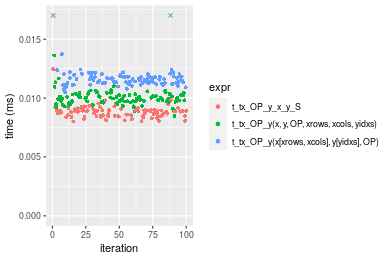

```r
> OP
[1] "-"
> stats <- microbenchmark(t_tx_OP_y_x_y_S = t_tx_OP_y(x_S, y_S, OP = OP, na.rm = FALSE), `t_tx_OP_y(x, y, OP, xrows, xcols, yidxs)` = t_tx_OP_y(x, 
+     y, OP = OP, xrows = xrows, xcols = xcols, yidxs = yidxs, na.rm = FALSE), `t_tx_OP_y(x[xrows, xcols], y[yidxs], OP)` = t_tx_OP_y(x[xrows, 
+     xcols], y[yidxs], OP = OP, na.rm = FALSE), unit = "ms")
```

_Table: Benchmarking of t_tx_OP_y_x_y_S(), t_tx_OP_y(x, y, OP, xrows, xcols, yidxs)() and t_tx_OP_y(x[xrows, xcols], y[yidxs], OP)() on integer+10x10+sub data. The top panel shows times in milliseconds and the bottom panel shows relative times._


|   |expr                                     |      min|        lq|      mean|    median|       uq|      max|
|:--|:----------------------------------------|--------:|---------:|---------:|---------:|--------:|--------:|
|1  |t_tx_OP_y_x_y_S                          | 0.004784| 0.0051055| 0.0052904| 0.0052105| 0.005376| 0.007792|
|2  |t_tx_OP_y(x, y, OP, xrows, xcols, yidxs) | 0.005463| 0.0058210| 0.0062530| 0.0059385| 0.006095| 0.031446|
|3  |t_tx_OP_y(x[xrows, xcols], y[yidxs], OP) | 0.006135| 0.0066710| 0.0068426| 0.0067835| 0.006934| 0.009898|


|   |expr                                     |      min|       lq|     mean|   median|       uq|      max|
|:--|:----------------------------------------|--------:|--------:|--------:|--------:|--------:|--------:|
|1  |t_tx_OP_y_x_y_S                          | 1.000000| 1.000000| 1.000000| 1.000000| 1.000000| 1.000000|
|2  |t_tx_OP_y(x, y, OP, xrows, xcols, yidxs) | 1.141931| 1.140143| 1.181954| 1.139718| 1.133743| 4.035678|
|3  |t_tx_OP_y(x[xrows, xcols], y[yidxs], OP) | 1.282400| 1.306630| 1.293411| 1.301890| 1.289807| 1.270277|

_Figure: Benchmarking of t_tx_OP_y_x_y_S(), t_tx_OP_y(x, y, OP, xrows, xcols, yidxs)() and t_tx_OP_y(x[xrows, xcols], y[yidxs], OP)() on integer+10x10+sub data.  Outliers are displayed as crosses.  Times are in milliseconds._

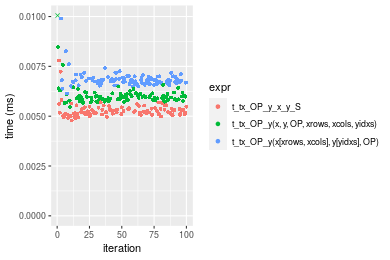

```r
> OP
[1] "*"
> stats <- microbenchmark(t_tx_OP_y_x_y_S = t_tx_OP_y(x_S, y_S, OP = OP, na.rm = FALSE), `t_tx_OP_y(x, y, OP, xrows, xcols, yidxs)` = t_tx_OP_y(x, 
+     y, OP = OP, xrows = xrows, xcols = xcols, yidxs = yidxs, na.rm = FALSE), `t_tx_OP_y(x[xrows, xcols], y[yidxs], OP)` = t_tx_OP_y(x[xrows, 
+     xcols], y[yidxs], OP = OP, na.rm = FALSE), unit = "ms")
```

_Table: Benchmarking of t_tx_OP_y_x_y_S(), t_tx_OP_y(x, y, OP, xrows, xcols, yidxs)() and t_tx_OP_y(x[xrows, xcols], y[yidxs], OP)() on integer+10x10+mul data. The top panel shows times in milliseconds and the bottom panel shows relative times._


|   |expr                                     |      min|        lq|      mean|    median|        uq|      max|
|:--|:----------------------------------------|--------:|---------:|---------:|---------:|---------:|--------:|
|1  |t_tx_OP_y_x_y_S                          | 0.004678| 0.0049855| 0.0051638| 0.0051175| 0.0052555| 0.006907|
|2  |t_tx_OP_y(x, y, OP, xrows, xcols, yidxs) | 0.005428| 0.0057410| 0.0059596| 0.0058375| 0.0060240| 0.010690|
|3  |t_tx_OP_y(x[xrows, xcols], y[yidxs], OP) | 0.006130| 0.0064965| 0.0069076| 0.0065970| 0.0067250| 0.030523|


|   |expr                                     |      min|       lq|     mean|   median|       uq|      max|
|:--|:----------------------------------------|--------:|--------:|--------:|--------:|--------:|--------:|
|1  |t_tx_OP_y_x_y_S                          | 1.000000| 1.000000| 1.000000| 1.000000| 1.000000| 1.000000|
|2  |t_tx_OP_y(x, y, OP, xrows, xcols, yidxs) | 1.160325| 1.151539| 1.154107| 1.140694| 1.146228| 1.547705|
|3  |t_tx_OP_y(x[xrows, xcols], y[yidxs], OP) | 1.310389| 1.303079| 1.337689| 1.289106| 1.279612| 4.419140|

_Figure: Benchmarking of t_tx_OP_y_x_y_S(), t_tx_OP_y(x, y, OP, xrows, xcols, yidxs)() and t_tx_OP_y(x[xrows, xcols], y[yidxs], OP)() on integer+10x10+mul data.  Outliers are displayed as crosses.  Times are in milliseconds._

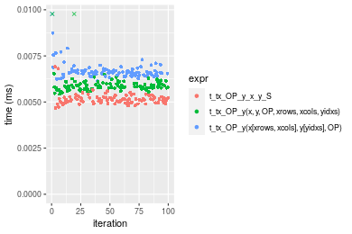

```r
> OP
[1] "/"
> stats <- microbenchmark(t_tx_OP_y_x_y_S = t_tx_OP_y(x_S, y_S, OP = OP, na.rm = FALSE), `t_tx_OP_y(x, y, OP, xrows, xcols, yidxs)` = t_tx_OP_y(x, 
+     y, OP = OP, xrows = xrows, xcols = xcols, yidxs = yidxs, na.rm = FALSE), `t_tx_OP_y(x[xrows, xcols], y[yidxs], OP)` = t_tx_OP_y(x[xrows, 
+     xcols], y[yidxs], OP = OP, na.rm = FALSE), unit = "ms")
```

_Table: Benchmarking of t_tx_OP_y_x_y_S(), t_tx_OP_y(x, y, OP, xrows, xcols, yidxs)() and t_tx_OP_y(x[xrows, xcols], y[yidxs], OP)() on integer+10x10+div data. The top panel shows times in milliseconds and the bottom panel shows relative times._


|   |expr                                     |      min|        lq|      mean|    median|        uq|      max|
|:--|:----------------------------------------|--------:|---------:|---------:|---------:|---------:|--------:|
|1  |t_tx_OP_y_x_y_S                          | 0.004330| 0.0046460| 0.0050623| 0.0047290| 0.0048250| 0.032442|
|2  |t_tx_OP_y(x, y, OP, xrows, xcols, yidxs) | 0.004937| 0.0052585| 0.0054215| 0.0053510| 0.0054715| 0.010890|
|3  |t_tx_OP_y(x[xrows, xcols], y[yidxs], OP) | 0.005641| 0.0058870| 0.0061697| 0.0060455| 0.0062050| 0.012675|


|   |expr                                     |      min|       lq|     mean|   median|      uq|       max|
|:--|:----------------------------------------|--------:|--------:|--------:|--------:|-------:|---------:|
|1  |t_tx_OP_y_x_y_S                          | 1.000000| 1.000000| 1.000000| 1.000000| 1.00000| 1.0000000|
|2  |t_tx_OP_y(x, y, OP, xrows, xcols, yidxs) | 1.140185| 1.131834| 1.070954| 1.131529| 1.13399| 0.3356760|
|3  |t_tx_OP_y(x[xrows, xcols], y[yidxs], OP) | 1.302771| 1.267111| 1.218748| 1.278389| 1.28601| 0.3906972|

_Figure: Benchmarking of t_tx_OP_y_x_y_S(), t_tx_OP_y(x, y, OP, xrows, xcols, yidxs)() and t_tx_OP_y(x[xrows, xcols], y[yidxs], OP)() on integer+10x10+div data.  Outliers are displayed as crosses.  Times are in milliseconds._

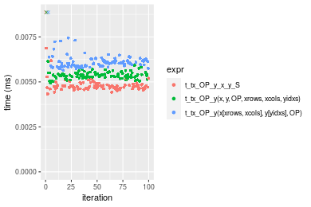


### 100x100 vector


```r
> x <- data[["100x100"]]
> y <- x[, 1L]
> xrows <- sample.int(nrow(x), size = nrow(x) * 0.7)
> xcols <- sample.int(ncol(x), size = ncol(x) * 0.7)
> x_S <- x[xrows, xcols]
> yidxs <- xrows
> y_S <- y[yidxs]
```

```r
> OP
[1] "+"
> stats <- microbenchmark(t_tx_OP_y_x_y_S = t_tx_OP_y(x_S, y_S, OP = OP, na.rm = FALSE), `t_tx_OP_y(x, y, OP, xrows, xcols, yidxs)` = t_tx_OP_y(x, 
+     y, OP = OP, xrows = xrows, xcols = xcols, yidxs = yidxs, na.rm = FALSE), `t_tx_OP_y(x[xrows, xcols], y[yidxs], OP)` = t_tx_OP_y(x[xrows, 
+     xcols], y[yidxs], OP = OP, na.rm = FALSE), unit = "ms")
```

_Table: Benchmarking of t_tx_OP_y_x_y_S(), t_tx_OP_y(x, y, OP, xrows, xcols, yidxs)() and t_tx_OP_y(x[xrows, xcols], y[yidxs], OP)() on integer+100x100+add data. The top panel shows times in milliseconds and the bottom panel shows relative times._


|   |expr                                     |      min|        lq|      mean|    median|        uq|      max|
|:--|:----------------------------------------|--------:|---------:|---------:|---------:|---------:|--------:|
|1  |t_tx_OP_y_x_y_S                          | 0.066932| 0.0691910| 0.0757164| 0.0741085| 0.0801365| 0.112217|
|2  |t_tx_OP_y(x, y, OP, xrows, xcols, yidxs) | 0.070416| 0.0728570| 0.0800701| 0.0782990| 0.0872430| 0.103558|
|3  |t_tx_OP_y(x[xrows, xcols], y[yidxs], OP) | 0.076689| 0.0792455| 0.0877412| 0.0875550| 0.0947040| 0.108898|


|   |expr                                     |      min|       lq|     mean|   median|       uq|       max|
|:--|:----------------------------------------|--------:|--------:|--------:|--------:|--------:|---------:|
|1  |t_tx_OP_y_x_y_S                          | 1.000000| 1.000000| 1.000000| 1.000000| 1.000000| 1.0000000|
|2  |t_tx_OP_y(x, y, OP, xrows, xcols, yidxs) | 1.052053| 1.052984| 1.057500| 1.056545| 1.088680| 0.9228370|
|3  |t_tx_OP_y(x[xrows, xcols], y[yidxs], OP) | 1.145775| 1.145315| 1.158813| 1.181443| 1.181784| 0.9704234|

_Figure: Benchmarking of t_tx_OP_y_x_y_S(), t_tx_OP_y(x, y, OP, xrows, xcols, yidxs)() and t_tx_OP_y(x[xrows, xcols], y[yidxs], OP)() on integer+100x100+add data.  Outliers are displayed as crosses.  Times are in milliseconds._

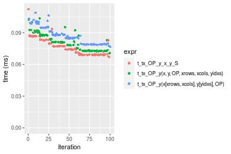

```r
> OP
[1] "-"
> stats <- microbenchmark(t_tx_OP_y_x_y_S = t_tx_OP_y(x_S, y_S, OP = OP, na.rm = FALSE), `t_tx_OP_y(x, y, OP, xrows, xcols, yidxs)` = t_tx_OP_y(x, 
+     y, OP = OP, xrows = xrows, xcols = xcols, yidxs = yidxs, na.rm = FALSE), `t_tx_OP_y(x[xrows, xcols], y[yidxs], OP)` = t_tx_OP_y(x[xrows, 
+     xcols], y[yidxs], OP = OP, na.rm = FALSE), unit = "ms")
```

_Table: Benchmarking of t_tx_OP_y_x_y_S(), t_tx_OP_y(x, y, OP, xrows, xcols, yidxs)() and t_tx_OP_y(x[xrows, xcols], y[yidxs], OP)() on integer+100x100+sub data. The top panel shows times in milliseconds and the bottom panel shows relative times._


|   |expr                                     |      min|        lq|      mean|    median|        uq|      max|
|:--|:----------------------------------------|--------:|---------:|---------:|---------:|---------:|--------:|
|1  |t_tx_OP_y_x_y_S                          | 0.066694| 0.0691330| 0.0746998| 0.0741305| 0.0797685| 0.098784|
|2  |t_tx_OP_y(x, y, OP, xrows, xcols, yidxs) | 0.072225| 0.0750385| 0.0816482| 0.0806880| 0.0861390| 0.100509|
|3  |t_tx_OP_y(x[xrows, xcols], y[yidxs], OP) | 0.076281| 0.0791210| 0.0866068| 0.0847035| 0.0914165| 0.133863|


|   |expr                                     |      min|       lq|     mean|   median|       uq|      max|
|:--|:----------------------------------------|--------:|--------:|--------:|--------:|--------:|--------:|
|1  |t_tx_OP_y_x_y_S                          | 1.000000| 1.000000| 1.000000| 1.000000| 1.000000| 1.000000|
|2  |t_tx_OP_y(x, y, OP, xrows, xcols, yidxs) | 1.082931| 1.085422| 1.093019| 1.088459| 1.079862| 1.017462|
|3  |t_tx_OP_y(x[xrows, xcols], y[yidxs], OP) | 1.143746| 1.144475| 1.159399| 1.142627| 1.146023| 1.355108|

_Figure: Benchmarking of t_tx_OP_y_x_y_S(), t_tx_OP_y(x, y, OP, xrows, xcols, yidxs)() and t_tx_OP_y(x[xrows, xcols], y[yidxs], OP)() on integer+100x100+sub data.  Outliers are displayed as crosses.  Times are in milliseconds._

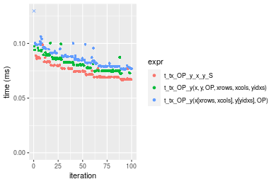

```r
> OP
[1] "*"
> stats <- microbenchmark(t_tx_OP_y_x_y_S = t_tx_OP_y(x_S, y_S, OP = OP, na.rm = FALSE), `t_tx_OP_y(x, y, OP, xrows, xcols, yidxs)` = t_tx_OP_y(x, 
+     y, OP = OP, xrows = xrows, xcols = xcols, yidxs = yidxs, na.rm = FALSE), `t_tx_OP_y(x[xrows, xcols], y[yidxs], OP)` = t_tx_OP_y(x[xrows, 
+     xcols], y[yidxs], OP = OP, na.rm = FALSE), unit = "ms")
```

_Table: Benchmarking of t_tx_OP_y_x_y_S(), t_tx_OP_y(x, y, OP, xrows, xcols, yidxs)() and t_tx_OP_y(x[xrows, xcols], y[yidxs], OP)() on integer+100x100+mul data. The top panel shows times in milliseconds and the bottom panel shows relative times._


|   |expr                                     |      min|        lq|      mean|    median|        uq|      max|
|:--|:----------------------------------------|--------:|---------:|---------:|---------:|---------:|--------:|
|1  |t_tx_OP_y_x_y_S                          | 0.064442| 0.0651885| 0.0721604| 0.0719295| 0.0750505| 0.107329|
|2  |t_tx_OP_y(x, y, OP, xrows, xcols, yidxs) | 0.070768| 0.0747400| 0.0814489| 0.0817405| 0.0851090| 0.103906|
|3  |t_tx_OP_y(x[xrows, xcols], y[yidxs], OP) | 0.072476| 0.0749195| 0.0832792| 0.0834460| 0.0873930| 0.100930|


|   |expr                                     |      min|       lq|     mean|   median|       uq|       max|
|:--|:----------------------------------------|--------:|--------:|--------:|--------:|--------:|---------:|
|1  |t_tx_OP_y_x_y_S                          | 1.000000| 1.000000| 1.000000| 1.000000| 1.000000| 1.0000000|
|2  |t_tx_OP_y(x, y, OP, xrows, xcols, yidxs) | 1.098166| 1.146521| 1.128721| 1.136397| 1.134023| 0.9681074|
|3  |t_tx_OP_y(x[xrows, xcols], y[yidxs], OP) | 1.124670| 1.149275| 1.154086| 1.160108| 1.164456| 0.9403796|

_Figure: Benchmarking of t_tx_OP_y_x_y_S(), t_tx_OP_y(x, y, OP, xrows, xcols, yidxs)() and t_tx_OP_y(x[xrows, xcols], y[yidxs], OP)() on integer+100x100+mul data.  Outliers are displayed as crosses.  Times are in milliseconds._

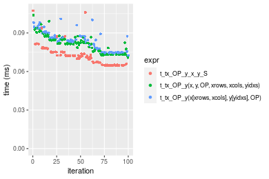

```r
> OP
[1] "/"
> stats <- microbenchmark(t_tx_OP_y_x_y_S = t_tx_OP_y(x_S, y_S, OP = OP, na.rm = FALSE), `t_tx_OP_y(x, y, OP, xrows, xcols, yidxs)` = t_tx_OP_y(x, 
+     y, OP = OP, xrows = xrows, xcols = xcols, yidxs = yidxs, na.rm = FALSE), `t_tx_OP_y(x[xrows, xcols], y[yidxs], OP)` = t_tx_OP_y(x[xrows, 
+     xcols], y[yidxs], OP = OP, na.rm = FALSE), unit = "ms")
```

_Table: Benchmarking of t_tx_OP_y_x_y_S(), t_tx_OP_y(x, y, OP, xrows, xcols, yidxs)() and t_tx_OP_y(x[xrows, xcols], y[yidxs], OP)() on integer+100x100+div data. The top panel shows times in milliseconds and the bottom panel shows relative times._


|   |expr                                     |      min|        lq|      mean|    median|        uq|      max|
|:--|:----------------------------------------|--------:|---------:|---------:|---------:|---------:|--------:|
|1  |t_tx_OP_y_x_y_S                          | 0.065146| 0.0679705| 0.0740844| 0.0728435| 0.0795950| 0.095315|
|2  |t_tx_OP_y(x, y, OP, xrows, xcols, yidxs) | 0.068269| 0.0708355| 0.0766363| 0.0757170| 0.0795515| 0.119250|
|3  |t_tx_OP_y(x[xrows, xcols], y[yidxs], OP) | 0.075583| 0.0789350| 0.0861331| 0.0841975| 0.0909300| 0.130286|


|   |expr                                     |      min|       lq|     mean|   median|        uq|      max|
|:--|:----------------------------------------|--------:|--------:|--------:|--------:|---------:|--------:|
|1  |t_tx_OP_y_x_y_S                          | 1.000000| 1.000000| 1.000000| 1.000000| 1.0000000| 1.000000|
|2  |t_tx_OP_y(x, y, OP, xrows, xcols, yidxs) | 1.047939| 1.042151| 1.034446| 1.039448| 0.9994535| 1.251115|
|3  |t_tx_OP_y(x[xrows, xcols], y[yidxs], OP) | 1.160209| 1.161313| 1.162635| 1.155868| 1.1424084| 1.366899|

_Figure: Benchmarking of t_tx_OP_y_x_y_S(), t_tx_OP_y(x, y, OP, xrows, xcols, yidxs)() and t_tx_OP_y(x[xrows, xcols], y[yidxs], OP)() on integer+100x100+div data.  Outliers are displayed as crosses.  Times are in milliseconds._

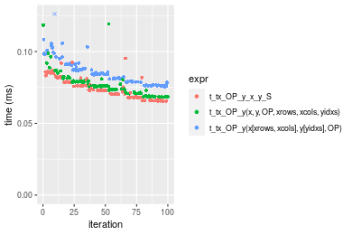


### 1000x10 vector


```r
> x <- data[["1000x10"]]
> y <- x[, 1L]
> xrows <- sample.int(nrow(x), size = nrow(x) * 0.7)
> xcols <- sample.int(ncol(x), size = ncol(x) * 0.7)
> x_S <- x[xrows, xcols]
> yidxs <- xrows
> y_S <- y[yidxs]
```

```r
> OP
[1] "+"
> stats <- microbenchmark(t_tx_OP_y_x_y_S = t_tx_OP_y(x_S, y_S, OP = OP, na.rm = FALSE), `t_tx_OP_y(x, y, OP, xrows, xcols, yidxs)` = t_tx_OP_y(x, 
+     y, OP = OP, xrows = xrows, xcols = xcols, yidxs = yidxs, na.rm = FALSE), `t_tx_OP_y(x[xrows, xcols], y[yidxs], OP)` = t_tx_OP_y(x[xrows, 
+     xcols], y[yidxs], OP = OP, na.rm = FALSE), unit = "ms")
```

_Table: Benchmarking of t_tx_OP_y_x_y_S(), t_tx_OP_y(x, y, OP, xrows, xcols, yidxs)() and t_tx_OP_y(x[xrows, xcols], y[yidxs], OP)() on integer+1000x10+add data. The top panel shows times in milliseconds and the bottom panel shows relative times._


|   |expr                                     |      min|        lq|      mean|   median|        uq|      max|
|:--|:----------------------------------------|--------:|---------:|---------:|--------:|---------:|--------:|
|1  |t_tx_OP_y_x_y_S                          | 0.066057| 0.0686000| 0.0760130| 0.073529| 0.0820135| 0.095486|
|2  |t_tx_OP_y(x, y, OP, xrows, xcols, yidxs) | 0.074034| 0.0755145| 0.0823536| 0.080933| 0.0877415| 0.100243|
|3  |t_tx_OP_y(x[xrows, xcols], y[yidxs], OP) | 0.078112| 0.0805820| 0.0899518| 0.089463| 0.0967520| 0.134497|


|   |expr                                     |      min|       lq|     mean|   median|       uq|      max|
|:--|:----------------------------------------|--------:|--------:|--------:|--------:|--------:|--------:|
|1  |t_tx_OP_y_x_y_S                          | 1.000000| 1.000000| 1.000000| 1.000000| 1.000000| 1.000000|
|2  |t_tx_OP_y(x, y, OP, xrows, xcols, yidxs) | 1.120759| 1.100794| 1.083415| 1.100695| 1.069842| 1.049819|
|3  |t_tx_OP_y(x[xrows, xcols], y[yidxs], OP) | 1.182494| 1.174665| 1.183374| 1.216704| 1.179708| 1.408552|

_Figure: Benchmarking of t_tx_OP_y_x_y_S(), t_tx_OP_y(x, y, OP, xrows, xcols, yidxs)() and t_tx_OP_y(x[xrows, xcols], y[yidxs], OP)() on integer+1000x10+add data.  Outliers are displayed as crosses.  Times are in milliseconds._

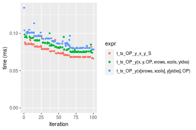

```r
> OP
[1] "-"
> stats <- microbenchmark(t_tx_OP_y_x_y_S = t_tx_OP_y(x_S, y_S, OP = OP, na.rm = FALSE), `t_tx_OP_y(x, y, OP, xrows, xcols, yidxs)` = t_tx_OP_y(x, 
+     y, OP = OP, xrows = xrows, xcols = xcols, yidxs = yidxs, na.rm = FALSE), `t_tx_OP_y(x[xrows, xcols], y[yidxs], OP)` = t_tx_OP_y(x[xrows, 
+     xcols], y[yidxs], OP = OP, na.rm = FALSE), unit = "ms")
```

_Table: Benchmarking of t_tx_OP_y_x_y_S(), t_tx_OP_y(x, y, OP, xrows, xcols, yidxs)() and t_tx_OP_y(x[xrows, xcols], y[yidxs], OP)() on integer+1000x10+sub data. The top panel shows times in milliseconds and the bottom panel shows relative times._


|   |expr                                     |      min|        lq|      mean|    median|        uq|      max|
|:--|:----------------------------------------|--------:|---------:|---------:|---------:|---------:|--------:|
|1  |t_tx_OP_y_x_y_S                          | 0.066100| 0.0684990| 0.0740375| 0.0734035| 0.0793115| 0.087635|
|2  |t_tx_OP_y(x, y, OP, xrows, xcols, yidxs) | 0.074534| 0.0769560| 0.0834896| 0.0832155| 0.0885980| 0.104208|
|3  |t_tx_OP_y(x[xrows, xcols], y[yidxs], OP) | 0.077728| 0.0805895| 0.0891141| 0.0868380| 0.0932925| 0.135669|


|   |expr                                     |      min|       lq|     mean|   median|       uq|      max|
|:--|:----------------------------------------|--------:|--------:|--------:|--------:|--------:|--------:|
|1  |t_tx_OP_y_x_y_S                          | 1.000000| 1.000000| 1.000000| 1.000000| 1.000000| 1.000000|
|2  |t_tx_OP_y(x, y, OP, xrows, xcols, yidxs) | 1.127595| 1.123462| 1.127667| 1.133672| 1.117089| 1.189114|
|3  |t_tx_OP_y(x[xrows, xcols], y[yidxs], OP) | 1.175915| 1.176506| 1.203634| 1.183023| 1.176280| 1.548114|

_Figure: Benchmarking of t_tx_OP_y_x_y_S(), t_tx_OP_y(x, y, OP, xrows, xcols, yidxs)() and t_tx_OP_y(x[xrows, xcols], y[yidxs], OP)() on integer+1000x10+sub data.  Outliers are displayed as crosses.  Times are in milliseconds._


```r
> OP
[1] "*"
> stats <- microbenchmark(t_tx_OP_y_x_y_S = t_tx_OP_y(x_S, y_S, OP = OP, na.rm = FALSE), `t_tx_OP_y(x, y, OP, xrows, xcols, yidxs)` = t_tx_OP_y(x, 
+     y, OP = OP, xrows = xrows, xcols = xcols, yidxs = yidxs, na.rm = FALSE), `t_tx_OP_y(x[xrows, xcols], y[yidxs], OP)` = t_tx_OP_y(x[xrows, 
+     xcols], y[yidxs], OP = OP, na.rm = FALSE), unit = "ms")
```

_Table: Benchmarking of t_tx_OP_y_x_y_S(), t_tx_OP_y(x, y, OP, xrows, xcols, yidxs)() and t_tx_OP_y(x[xrows, xcols], y[yidxs], OP)() on integer+1000x10+mul data. The top panel shows times in milliseconds and the bottom panel shows relative times._


|   |expr                                     |      min|       lq|      mean|    median|        uq|      max|
|:--|:----------------------------------------|--------:|--------:|---------:|---------:|---------:|--------:|
|1  |t_tx_OP_y_x_y_S                          | 0.061880| 0.064128| 0.0682230| 0.0665320| 0.0716065| 0.084668|
|2  |t_tx_OP_y(x, y, OP, xrows, xcols, yidxs) | 0.073213| 0.075902| 0.0828148| 0.0816315| 0.0880925| 0.102955|
|3  |t_tx_OP_y(x[xrows, xcols], y[yidxs], OP) | 0.073674| 0.076598| 0.0854856| 0.0850130| 0.0916370| 0.128992|


|   |expr                                     |      min|       lq|     mean|   median|       uq|      max|
|:--|:----------------------------------------|--------:|--------:|--------:|--------:|--------:|--------:|
|1  |t_tx_OP_y_x_y_S                          | 1.000000| 1.000000| 1.000000| 1.000000| 1.000000| 1.000000|
|2  |t_tx_OP_y(x, y, OP, xrows, xcols, yidxs) | 1.183145| 1.183601| 1.213885| 1.226951| 1.230231| 1.215985|
|3  |t_tx_OP_y(x[xrows, xcols], y[yidxs], OP) | 1.190595| 1.194455| 1.253032| 1.277776| 1.279730| 1.523504|

_Figure: Benchmarking of t_tx_OP_y_x_y_S(), t_tx_OP_y(x, y, OP, xrows, xcols, yidxs)() and t_tx_OP_y(x[xrows, xcols], y[yidxs], OP)() on integer+1000x10+mul data.  Outliers are displayed as crosses.  Times are in milliseconds._

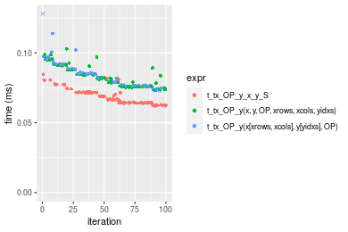

```r
> OP
[1] "/"
> stats <- microbenchmark(t_tx_OP_y_x_y_S = t_tx_OP_y(x_S, y_S, OP = OP, na.rm = FALSE), `t_tx_OP_y(x, y, OP, xrows, xcols, yidxs)` = t_tx_OP_y(x, 
+     y, OP = OP, xrows = xrows, xcols = xcols, yidxs = yidxs, na.rm = FALSE), `t_tx_OP_y(x[xrows, xcols], y[yidxs], OP)` = t_tx_OP_y(x[xrows, 
+     xcols], y[yidxs], OP = OP, na.rm = FALSE), unit = "ms")
```

_Table: Benchmarking of t_tx_OP_y_x_y_S(), t_tx_OP_y(x, y, OP, xrows, xcols, yidxs)() and t_tx_OP_y(x[xrows, xcols], y[yidxs], OP)() on integer+1000x10+div data. The top panel shows times in milliseconds and the bottom panel shows relative times._


|   |expr                                     |      min|        lq|      mean|    median|        uq|      max|
|:--|:----------------------------------------|--------:|---------:|---------:|---------:|---------:|--------:|
|1  |t_tx_OP_y_x_y_S                          | 0.062798| 0.0651920| 0.0706914| 0.0682175| 0.0752170| 0.107769|
|2  |t_tx_OP_y(x, y, OP, xrows, xcols, yidxs) | 0.068570| 0.0711480| 0.0772243| 0.0759180| 0.0818905| 0.120033|
|3  |t_tx_OP_y(x[xrows, xcols], y[yidxs], OP) | 0.074435| 0.0778645| 0.0850382| 0.0833675| 0.0904330| 0.108263|


|   |expr                                     |      min|       lq|     mean|   median|       uq|      max|
|:--|:----------------------------------------|--------:|--------:|--------:|--------:|--------:|--------:|
|1  |t_tx_OP_y_x_y_S                          | 1.000000| 1.000000| 1.000000| 1.000000| 1.000000| 1.000000|
|2  |t_tx_OP_y(x, y, OP, xrows, xcols, yidxs) | 1.091914| 1.091361| 1.092415| 1.112882| 1.088723| 1.113799|
|3  |t_tx_OP_y(x[xrows, xcols], y[yidxs], OP) | 1.185308| 1.194387| 1.202951| 1.222084| 1.202295| 1.004584|

_Figure: Benchmarking of t_tx_OP_y_x_y_S(), t_tx_OP_y(x, y, OP, xrows, xcols, yidxs)() and t_tx_OP_y(x[xrows, xcols], y[yidxs], OP)() on integer+1000x10+div data.  Outliers are displayed as crosses.  Times are in milliseconds._

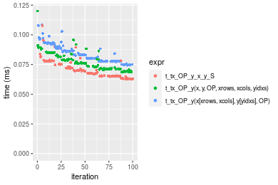


### 10x1000 vector


```r
> x <- data[["10x1000"]]
> y <- x[, 1L]
> xrows <- sample.int(nrow(x), size = nrow(x) * 0.7)
> xcols <- sample.int(ncol(x), size = ncol(x) * 0.7)
> x_S <- x[xrows, xcols]
> yidxs <- xrows
> y_S <- y[yidxs]
```

```r
> OP
[1] "+"
> stats <- microbenchmark(t_tx_OP_y_x_y_S = t_tx_OP_y(x_S, y_S, OP = OP, na.rm = FALSE), `t_tx_OP_y(x, y, OP, xrows, xcols, yidxs)` = t_tx_OP_y(x, 
+     y, OP = OP, xrows = xrows, xcols = xcols, yidxs = yidxs, na.rm = FALSE), `t_tx_OP_y(x[xrows, xcols], y[yidxs], OP)` = t_tx_OP_y(x[xrows, 
+     xcols], y[yidxs], OP = OP, na.rm = FALSE), unit = "ms")
```

_Table: Benchmarking of t_tx_OP_y_x_y_S(), t_tx_OP_y(x, y, OP, xrows, xcols, yidxs)() and t_tx_OP_y(x[xrows, xcols], y[yidxs], OP)() on integer+10x1000+add data. The top panel shows times in milliseconds and the bottom panel shows relative times._


|   |expr                                     |      min|        lq|      mean|    median|        uq|      max|
|:--|:----------------------------------------|--------:|---------:|---------:|---------:|---------:|--------:|
|1  |t_tx_OP_y_x_y_S                          | 0.068107| 0.0709745| 0.0788262| 0.0785585| 0.0854270| 0.100325|
|2  |t_tx_OP_y(x, y, OP, xrows, xcols, yidxs) | 0.072232| 0.0748330| 0.0810451| 0.0802755| 0.0862975| 0.101410|
|3  |t_tx_OP_y(x[xrows, xcols], y[yidxs], OP) | 0.079395| 0.0826220| 0.0908979| 0.0887095| 0.0954435| 0.138446|


|   |expr                                     |      min|       lq|     mean|   median|       uq|      max|
|:--|:----------------------------------------|--------:|--------:|--------:|--------:|--------:|--------:|
|1  |t_tx_OP_y_x_y_S                          | 1.000000| 1.000000| 1.000000| 1.000000| 1.000000| 1.000000|
|2  |t_tx_OP_y(x, y, OP, xrows, xcols, yidxs) | 1.060566| 1.054365| 1.028148| 1.021856| 1.010190| 1.010815|
|3  |t_tx_OP_y(x[xrows, xcols], y[yidxs], OP) | 1.165739| 1.164108| 1.153143| 1.129216| 1.117252| 1.379975|

_Figure: Benchmarking of t_tx_OP_y_x_y_S(), t_tx_OP_y(x, y, OP, xrows, xcols, yidxs)() and t_tx_OP_y(x[xrows, xcols], y[yidxs], OP)() on integer+10x1000+add data.  Outliers are displayed as crosses.  Times are in milliseconds._

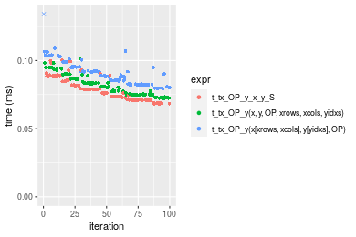

```r
> OP
[1] "-"
> stats <- microbenchmark(t_tx_OP_y_x_y_S = t_tx_OP_y(x_S, y_S, OP = OP, na.rm = FALSE), `t_tx_OP_y(x, y, OP, xrows, xcols, yidxs)` = t_tx_OP_y(x, 
+     y, OP = OP, xrows = xrows, xcols = xcols, yidxs = yidxs, na.rm = FALSE), `t_tx_OP_y(x[xrows, xcols], y[yidxs], OP)` = t_tx_OP_y(x[xrows, 
+     xcols], y[yidxs], OP = OP, na.rm = FALSE), unit = "ms")
```

_Table: Benchmarking of t_tx_OP_y_x_y_S(), t_tx_OP_y(x, y, OP, xrows, xcols, yidxs)() and t_tx_OP_y(x[xrows, xcols], y[yidxs], OP)() on integer+10x1000+sub data. The top panel shows times in milliseconds and the bottom panel shows relative times._


|   |expr                                     |      min|        lq|      mean|    median|        uq|      max|
|:--|:----------------------------------------|--------:|---------:|---------:|---------:|---------:|--------:|
|1  |t_tx_OP_y_x_y_S                          | 0.068036| 0.0709310| 0.0771976| 0.0759415| 0.0792530| 0.114920|
|2  |t_tx_OP_y(x, y, OP, xrows, xcols, yidxs) | 0.073841| 0.0765895| 0.0857178| 0.0850455| 0.0919800| 0.134720|
|3  |t_tx_OP_y(x[xrows, xcols], y[yidxs], OP) | 0.079270| 0.0822740| 0.0889209| 0.0858770| 0.0951435| 0.112973|


|   |expr                                     |      min|       lq|     mean|   median|       uq|       max|
|:--|:----------------------------------------|--------:|--------:|--------:|--------:|--------:|---------:|
|1  |t_tx_OP_y_x_y_S                          | 1.000000| 1.000000| 1.000000| 1.000000| 1.000000| 1.0000000|
|2  |t_tx_OP_y(x, y, OP, xrows, xcols, yidxs) | 1.085322| 1.079775| 1.110369| 1.119882| 1.160587| 1.1722938|
|3  |t_tx_OP_y(x[xrows, xcols], y[yidxs], OP) | 1.165118| 1.159916| 1.151862| 1.130831| 1.200503| 0.9830578|

_Figure: Benchmarking of t_tx_OP_y_x_y_S(), t_tx_OP_y(x, y, OP, xrows, xcols, yidxs)() and t_tx_OP_y(x[xrows, xcols], y[yidxs], OP)() on integer+10x1000+sub data.  Outliers are displayed as crosses.  Times are in milliseconds._


```r
> OP
[1] "*"
> stats <- microbenchmark(t_tx_OP_y_x_y_S = t_tx_OP_y(x_S, y_S, OP = OP, na.rm = FALSE), `t_tx_OP_y(x, y, OP, xrows, xcols, yidxs)` = t_tx_OP_y(x, 
+     y, OP = OP, xrows = xrows, xcols = xcols, yidxs = yidxs, na.rm = FALSE), `t_tx_OP_y(x[xrows, xcols], y[yidxs], OP)` = t_tx_OP_y(x[xrows, 
+     xcols], y[yidxs], OP = OP, na.rm = FALSE), unit = "ms")
```

_Table: Benchmarking of t_tx_OP_y_x_y_S(), t_tx_OP_y(x, y, OP, xrows, xcols, yidxs)() and t_tx_OP_y(x[xrows, xcols], y[yidxs], OP)() on integer+10x1000+mul data. The top panel shows times in milliseconds and the bottom panel shows relative times._


|   |expr                                     |      min|       lq|      mean|   median|       uq|      max|
|:--|:----------------------------------------|--------:|--------:|---------:|--------:|--------:|--------:|
|1  |t_tx_OP_y_x_y_S                          | 0.063739| 0.065959| 0.0717249| 0.068604| 0.076329| 0.111245|
|3  |t_tx_OP_y(x[xrows, xcols], y[yidxs], OP) | 0.074685| 0.077823| 0.0848930| 0.083335| 0.089863| 0.116042|
|2  |t_tx_OP_y(x, y, OP, xrows, xcols, yidxs) | 0.073283| 0.076066| 0.0834703| 0.084213| 0.091037| 0.098852|


|   |expr                                     |      min|       lq|     mean|   median|       uq|       max|
|:--|:----------------------------------------|--------:|--------:|--------:|--------:|--------:|---------:|
|1  |t_tx_OP_y_x_y_S                          | 1.000000| 1.000000| 1.000000| 1.000000| 1.000000| 1.0000000|
|3  |t_tx_OP_y(x[xrows, xcols], y[yidxs], OP) | 1.171732| 1.179869| 1.183592| 1.214725| 1.177311| 1.0431210|
|2  |t_tx_OP_y(x, y, OP, xrows, xcols, yidxs) | 1.149736| 1.153232| 1.163757| 1.227523| 1.192692| 0.8885972|

_Figure: Benchmarking of t_tx_OP_y_x_y_S(), t_tx_OP_y(x, y, OP, xrows, xcols, yidxs)() and t_tx_OP_y(x[xrows, xcols], y[yidxs], OP)() on integer+10x1000+mul data.  Outliers are displayed as crosses.  Times are in milliseconds._

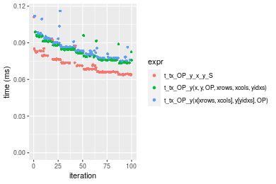

```r
> OP
[1] "/"
> stats <- microbenchmark(t_tx_OP_y_x_y_S = t_tx_OP_y(x_S, y_S, OP = OP, na.rm = FALSE), `t_tx_OP_y(x, y, OP, xrows, xcols, yidxs)` = t_tx_OP_y(x, 
+     y, OP = OP, xrows = xrows, xcols = xcols, yidxs = yidxs, na.rm = FALSE), `t_tx_OP_y(x[xrows, xcols], y[yidxs], OP)` = t_tx_OP_y(x[xrows, 
+     xcols], y[yidxs], OP = OP, na.rm = FALSE), unit = "ms")
```

_Table: Benchmarking of t_tx_OP_y_x_y_S(), t_tx_OP_y(x, y, OP, xrows, xcols, yidxs)() and t_tx_OP_y(x[xrows, xcols], y[yidxs], OP)() on integer+10x1000+div data. The top panel shows times in milliseconds and the bottom panel shows relative times._


|   |expr                                     |      min|        lq|      mean|    median|        uq|      max|
|:--|:----------------------------------------|--------:|---------:|---------:|---------:|---------:|--------:|
|1  |t_tx_OP_y_x_y_S                          | 0.065512| 0.0681810| 0.0729350| 0.0706970| 0.0783065| 0.089225|
|2  |t_tx_OP_y(x, y, OP, xrows, xcols, yidxs) | 0.070127| 0.0729015| 0.0791056| 0.0780485| 0.0840500| 0.100898|
|3  |t_tx_OP_y(x[xrows, xcols], y[yidxs], OP) | 0.076770| 0.0802085| 0.0874565| 0.0844550| 0.0930050| 0.139358|


|   |expr                                     |      min|       lq|     mean|   median|       uq|      max|
|:--|:----------------------------------------|--------:|--------:|--------:|--------:|--------:|--------:|
|1  |t_tx_OP_y_x_y_S                          | 1.000000| 1.000000| 1.000000| 1.000000| 1.000000| 1.000000|
|2  |t_tx_OP_y(x, y, OP, xrows, xcols, yidxs) | 1.070445| 1.069235| 1.084603| 1.103986| 1.073346| 1.130827|
|3  |t_tx_OP_y(x[xrows, xcols], y[yidxs], OP) | 1.171846| 1.176405| 1.199102| 1.194605| 1.187705| 1.561872|

_Figure: Benchmarking of t_tx_OP_y_x_y_S(), t_tx_OP_y(x, y, OP, xrows, xcols, yidxs)() and t_tx_OP_y(x[xrows, xcols], y[yidxs], OP)() on integer+10x1000+div data.  Outliers are displayed as crosses.  Times are in milliseconds._


### 100x1000 vector


```r
> x <- data[["100x1000"]]
> y <- x[, 1L]
> xrows <- sample.int(nrow(x), size = nrow(x) * 0.7)
> xcols <- sample.int(ncol(x), size = ncol(x) * 0.7)
> x_S <- x[xrows, xcols]
> yidxs <- xrows
> y_S <- y[yidxs]
```

```r
> OP
[1] "+"
> stats <- microbenchmark(t_tx_OP_y_x_y_S = t_tx_OP_y(x_S, y_S, OP = OP, na.rm = FALSE), `t_tx_OP_y(x, y, OP, xrows, xcols, yidxs)` = t_tx_OP_y(x, 
+     y, OP = OP, xrows = xrows, xcols = xcols, yidxs = yidxs, na.rm = FALSE), `t_tx_OP_y(x[xrows, xcols], y[yidxs], OP)` = t_tx_OP_y(x[xrows, 
+     xcols], y[yidxs], OP = OP, na.rm = FALSE), unit = "ms")
```

_Table: Benchmarking of t_tx_OP_y_x_y_S(), t_tx_OP_y(x, y, OP, xrows, xcols, yidxs)() and t_tx_OP_y(x[xrows, xcols], y[yidxs], OP)() on integer+100x1000+add data. The top panel shows times in milliseconds and the bottom panel shows relative times._


|   |expr                                     |      min|        lq|      mean|   median|        uq|      max|
|:--|:----------------------------------------|--------:|---------:|---------:|--------:|---------:|--------:|
|1  |t_tx_OP_y_x_y_S                          | 0.502257| 0.5069655| 0.5480154| 0.529796| 0.5446245| 0.828126|
|2  |t_tx_OP_y(x, y, OP, xrows, xcols, yidxs) | 0.520385| 0.5219525| 0.5623897| 0.549449| 0.5642035| 0.858174|
|3  |t_tx_OP_y(x[xrows, xcols], y[yidxs], OP) | 0.568957| 0.5843420| 0.6247666| 0.600109| 0.6169895| 1.022752|


|   |expr                                     |      min|       lq|     mean|   median|       uq|      max|
|:--|:----------------------------------------|--------:|--------:|--------:|--------:|--------:|--------:|
|1  |t_tx_OP_y_x_y_S                          | 1.000000| 1.000000| 1.000000| 1.000000| 1.000000| 1.000000|
|2  |t_tx_OP_y(x, y, OP, xrows, xcols, yidxs) | 1.036093| 1.029562| 1.026230| 1.037095| 1.035950| 1.036284|
|3  |t_tx_OP_y(x[xrows, xcols], y[yidxs], OP) | 1.132801| 1.152627| 1.140053| 1.132717| 1.132871| 1.235020|

_Figure: Benchmarking of t_tx_OP_y_x_y_S(), t_tx_OP_y(x, y, OP, xrows, xcols, yidxs)() and t_tx_OP_y(x[xrows, xcols], y[yidxs], OP)() on integer+100x1000+add data.  Outliers are displayed as crosses.  Times are in milliseconds._

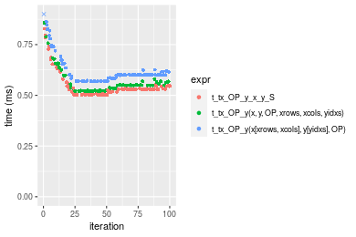

```r
> OP
[1] "-"
> stats <- microbenchmark(t_tx_OP_y_x_y_S = t_tx_OP_y(x_S, y_S, OP = OP, na.rm = FALSE), `t_tx_OP_y(x, y, OP, xrows, xcols, yidxs)` = t_tx_OP_y(x, 
+     y, OP = OP, xrows = xrows, xcols = xcols, yidxs = yidxs, na.rm = FALSE), `t_tx_OP_y(x[xrows, xcols], y[yidxs], OP)` = t_tx_OP_y(x[xrows, 
+     xcols], y[yidxs], OP = OP, na.rm = FALSE), unit = "ms")
```

_Table: Benchmarking of t_tx_OP_y_x_y_S(), t_tx_OP_y(x, y, OP, xrows, xcols, yidxs)() and t_tx_OP_y(x[xrows, xcols], y[yidxs], OP)() on integer+100x1000+sub data. The top panel shows times in milliseconds and the bottom panel shows relative times._


|   |expr                                     |      min|        lq|      mean|    median|        uq|      max|
|:--|:----------------------------------------|--------:|---------:|---------:|---------:|---------:|--------:|
|1  |t_tx_OP_y_x_y_S                          | 0.502344| 0.5160055| 0.5506338| 0.5300335| 0.5465385| 0.832716|
|2  |t_tx_OP_y(x, y, OP, xrows, xcols, yidxs) | 0.532940| 0.5364720| 0.5759884| 0.5625485| 0.5730170| 0.813455|
|3  |t_tx_OP_y(x[xrows, xcols], y[yidxs], OP) | 0.569139| 0.5725060| 0.6207185| 0.6005045| 0.6183275| 1.020565|


|   |expr                                     |      min|       lq|     mean|   median|       uq|       max|
|:--|:----------------------------------------|--------:|--------:|--------:|--------:|--------:|---------:|
|1  |t_tx_OP_y_x_y_S                          | 1.000000| 1.000000| 1.000000| 1.000000| 1.000000| 1.0000000|
|2  |t_tx_OP_y(x, y, OP, xrows, xcols, yidxs) | 1.060906| 1.039663| 1.046046| 1.061345| 1.048448| 0.9768697|
|3  |t_tx_OP_y(x[xrows, xcols], y[yidxs], OP) | 1.132967| 1.109496| 1.127280| 1.132956| 1.131352| 1.2255859|

_Figure: Benchmarking of t_tx_OP_y_x_y_S(), t_tx_OP_y(x, y, OP, xrows, xcols, yidxs)() and t_tx_OP_y(x[xrows, xcols], y[yidxs], OP)() on integer+100x1000+sub data.  Outliers are displayed as crosses.  Times are in milliseconds._

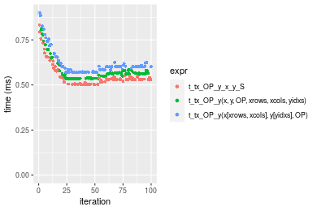

```r
> OP
[1] "*"
> stats <- microbenchmark(t_tx_OP_y_x_y_S = t_tx_OP_y(x_S, y_S, OP = OP, na.rm = FALSE), `t_tx_OP_y(x, y, OP, xrows, xcols, yidxs)` = t_tx_OP_y(x, 
+     y, OP = OP, xrows = xrows, xcols = xcols, yidxs = yidxs, na.rm = FALSE), `t_tx_OP_y(x[xrows, xcols], y[yidxs], OP)` = t_tx_OP_y(x[xrows, 
+     xcols], y[yidxs], OP = OP, na.rm = FALSE), unit = "ms")
```

_Table: Benchmarking of t_tx_OP_y_x_y_S(), t_tx_OP_y(x, y, OP, xrows, xcols, yidxs)() and t_tx_OP_y(x[xrows, xcols], y[yidxs], OP)() on integer+100x1000+mul data. The top panel shows times in milliseconds and the bottom panel shows relative times._


|   |expr                                     |      min|        lq|      mean|    median|        uq|      max|
|:--|:----------------------------------------|--------:|---------:|---------:|---------:|---------:|--------:|
|1  |t_tx_OP_y_x_y_S                          | 0.470624| 0.4726730| 0.5089969| 0.4963045| 0.5050730| 0.763992|
|2  |t_tx_OP_y(x, y, OP, xrows, xcols, yidxs) | 0.525082| 0.5265205| 0.5784193| 0.5543410| 0.5869120| 0.910976|
|3  |t_tx_OP_y(x[xrows, xcols], y[yidxs], OP) | 0.536984| 0.5395150| 0.5788292| 0.5626990| 0.5760505| 0.847790|


|   |expr                                     |      min|       lq|     mean|   median|       uq|      max|
|:--|:----------------------------------------|--------:|--------:|--------:|--------:|--------:|--------:|
|1  |t_tx_OP_y_x_y_S                          | 1.000000| 1.000000| 1.000000| 1.000000| 1.000000| 1.000000|
|2  |t_tx_OP_y(x, y, OP, xrows, xcols, yidxs) | 1.115714| 1.113921| 1.136391| 1.116937| 1.162034| 1.192389|
|3  |t_tx_OP_y(x[xrows, xcols], y[yidxs], OP) | 1.141004| 1.141413| 1.137196| 1.133778| 1.140529| 1.109684|

_Figure: Benchmarking of t_tx_OP_y_x_y_S(), t_tx_OP_y(x, y, OP, xrows, xcols, yidxs)() and t_tx_OP_y(x[xrows, xcols], y[yidxs], OP)() on integer+100x1000+mul data.  Outliers are displayed as crosses.  Times are in milliseconds._

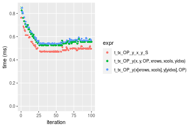

```r
> OP
[1] "/"
> stats <- microbenchmark(t_tx_OP_y_x_y_S = t_tx_OP_y(x_S, y_S, OP = OP, na.rm = FALSE), `t_tx_OP_y(x, y, OP, xrows, xcols, yidxs)` = t_tx_OP_y(x, 
+     y, OP = OP, xrows = xrows, xcols = xcols, yidxs = yidxs, na.rm = FALSE), `t_tx_OP_y(x[xrows, xcols], y[yidxs], OP)` = t_tx_OP_y(x[xrows, 
+     xcols], y[yidxs], OP = OP, na.rm = FALSE), unit = "ms")
```

_Table: Benchmarking of t_tx_OP_y_x_y_S(), t_tx_OP_y(x, y, OP, xrows, xcols, yidxs)() and t_tx_OP_y(x[xrows, xcols], y[yidxs], OP)() on integer+100x1000+div data. The top panel shows times in milliseconds and the bottom panel shows relative times._


|   |expr                                     |      min|        lq|      mean|    median|       uq|      max|
|:--|:----------------------------------------|--------:|---------:|---------:|---------:|--------:|--------:|
|1  |t_tx_OP_y_x_y_S                          | 0.475115| 0.4761720| 0.5130269| 0.4881745| 0.511375| 0.799978|
|2  |t_tx_OP_y(x, y, OP, xrows, xcols, yidxs) | 0.486354| 0.4874705| 0.5305048| 0.4915220| 0.546298| 0.886417|
|3  |t_tx_OP_y(x[xrows, xcols], y[yidxs], OP) | 0.542580| 0.5456425| 0.5820149| 0.5566305| 0.572625| 0.895267|


|   |expr                                     |      min|       lq|     mean|   median|       uq|      max|
|:--|:----------------------------------------|--------:|--------:|--------:|--------:|--------:|--------:|
|1  |t_tx_OP_y_x_y_S                          | 1.000000| 1.000000| 1.000000| 1.000000| 1.000000| 1.000000|
|2  |t_tx_OP_y(x, y, OP, xrows, xcols, yidxs) | 1.023655| 1.023728| 1.034068| 1.006857| 1.068292| 1.108052|
|3  |t_tx_OP_y(x[xrows, xcols], y[yidxs], OP) | 1.141997| 1.145894| 1.134472| 1.140229| 1.119775| 1.119115|

_Figure: Benchmarking of t_tx_OP_y_x_y_S(), t_tx_OP_y(x, y, OP, xrows, xcols, yidxs)() and t_tx_OP_y(x[xrows, xcols], y[yidxs], OP)() on integer+100x1000+div data.  Outliers are displayed as crosses.  Times are in milliseconds._

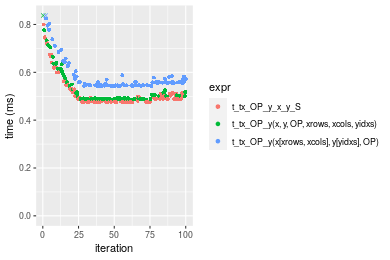


### 1000x100 vector


```r
> x <- data[["1000x100"]]
> y <- x[, 1L]
> xrows <- sample.int(nrow(x), size = nrow(x) * 0.7)
> xcols <- sample.int(ncol(x), size = ncol(x) * 0.7)
> x_S <- x[xrows, xcols]
> yidxs <- xrows
> y_S <- y[yidxs]
```

```r
> OP
[1] "+"
> stats <- microbenchmark(t_tx_OP_y_x_y_S = t_tx_OP_y(x_S, y_S, OP = OP, na.rm = FALSE), `t_tx_OP_y(x, y, OP, xrows, xcols, yidxs)` = t_tx_OP_y(x, 
+     y, OP = OP, xrows = xrows, xcols = xcols, yidxs = yidxs, na.rm = FALSE), `t_tx_OP_y(x[xrows, xcols], y[yidxs], OP)` = t_tx_OP_y(x[xrows, 
+     xcols], y[yidxs], OP = OP, na.rm = FALSE), unit = "ms")
```

_Table: Benchmarking of t_tx_OP_y_x_y_S(), t_tx_OP_y(x, y, OP, xrows, xcols, yidxs)() and t_tx_OP_y(x[xrows, xcols], y[yidxs], OP)() on integer+1000x100+add data. The top panel shows times in milliseconds and the bottom panel shows relative times._


|   |expr                                     |      min|        lq|      mean|   median|        uq|      max|
|:--|:----------------------------------------|--------:|---------:|---------:|--------:|---------:|--------:|
|1  |t_tx_OP_y_x_y_S                          | 0.496798| 0.4978660| 0.5430382| 0.523656| 0.5364555| 0.827474|
|2  |t_tx_OP_y(x, y, OP, xrows, xcols, yidxs) | 0.517647| 0.5206975| 0.5614016| 0.546105| 0.5558825| 0.847570|
|3  |t_tx_OP_y(x[xrows, xcols], y[yidxs], OP) | 0.561919| 0.5636265| 0.6169219| 0.592539| 0.6093920| 0.992817|


|   |expr                                     |      min|       lq|     mean|   median|       uq|      max|
|:--|:----------------------------------------|--------:|--------:|--------:|--------:|--------:|--------:|
|1  |t_tx_OP_y_x_y_S                          | 1.000000| 1.000000| 1.000000| 1.000000| 1.000000| 1.000000|
|2  |t_tx_OP_y(x, y, OP, xrows, xcols, yidxs) | 1.041967| 1.045859| 1.033816| 1.042870| 1.036214| 1.024286|
|3  |t_tx_OP_y(x[xrows, xcols], y[yidxs], OP) | 1.131081| 1.132085| 1.136056| 1.131542| 1.135960| 1.199817|

_Figure: Benchmarking of t_tx_OP_y_x_y_S(), t_tx_OP_y(x, y, OP, xrows, xcols, yidxs)() and t_tx_OP_y(x[xrows, xcols], y[yidxs], OP)() on integer+1000x100+add data.  Outliers are displayed as crosses.  Times are in milliseconds._

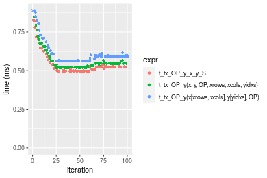

```r
> OP
[1] "-"
> stats <- microbenchmark(t_tx_OP_y_x_y_S = t_tx_OP_y(x_S, y_S, OP = OP, na.rm = FALSE), `t_tx_OP_y(x, y, OP, xrows, xcols, yidxs)` = t_tx_OP_y(x, 
+     y, OP = OP, xrows = xrows, xcols = xcols, yidxs = yidxs, na.rm = FALSE), `t_tx_OP_y(x[xrows, xcols], y[yidxs], OP)` = t_tx_OP_y(x[xrows, 
+     xcols], y[yidxs], OP = OP, na.rm = FALSE), unit = "ms")
```

_Table: Benchmarking of t_tx_OP_y_x_y_S(), t_tx_OP_y(x, y, OP, xrows, xcols, yidxs)() and t_tx_OP_y(x[xrows, xcols], y[yidxs], OP)() on integer+1000x100+sub data. The top panel shows times in milliseconds and the bottom panel shows relative times._


|   |expr                                     |      min|        lq|      mean|   median|        uq|      max|
|:--|:----------------------------------------|--------:|---------:|---------:|--------:|---------:|--------:|
|1  |t_tx_OP_y_x_y_S                          | 0.496900| 0.4980255| 0.5427837| 0.524102| 0.5349890| 0.834041|
|2  |t_tx_OP_y(x, y, OP, xrows, xcols, yidxs) | 0.528310| 0.5359485| 0.5739539| 0.551276| 0.5680115| 0.928818|
|3  |t_tx_OP_y(x[xrows, xcols], y[yidxs], OP) | 0.561811| 0.5650790| 0.6093841| 0.587129| 0.5971750| 0.936307|


|   |expr                                     |      min|       lq|     mean|   median|       uq|      max|
|:--|:----------------------------------------|--------:|--------:|--------:|--------:|--------:|--------:|
|1  |t_tx_OP_y_x_y_S                          | 1.000000| 1.000000| 1.000000| 1.000000| 1.000000| 1.000000|
|2  |t_tx_OP_y(x, y, OP, xrows, xcols, yidxs) | 1.063212| 1.076147| 1.057426| 1.051849| 1.061726| 1.113636|
|3  |t_tx_OP_y(x[xrows, xcols], y[yidxs], OP) | 1.130632| 1.134639| 1.122701| 1.120257| 1.116238| 1.122615|

_Figure: Benchmarking of t_tx_OP_y_x_y_S(), t_tx_OP_y(x, y, OP, xrows, xcols, yidxs)() and t_tx_OP_y(x[xrows, xcols], y[yidxs], OP)() on integer+1000x100+sub data.  Outliers are displayed as crosses.  Times are in milliseconds._

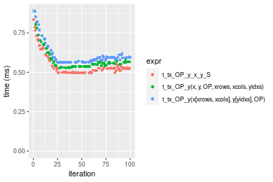

```r
> OP
[1] "*"
> stats <- microbenchmark(t_tx_OP_y_x_y_S = t_tx_OP_y(x_S, y_S, OP = OP, na.rm = FALSE), `t_tx_OP_y(x, y, OP, xrows, xcols, yidxs)` = t_tx_OP_y(x, 
+     y, OP = OP, xrows = xrows, xcols = xcols, yidxs = yidxs, na.rm = FALSE), `t_tx_OP_y(x[xrows, xcols], y[yidxs], OP)` = t_tx_OP_y(x[xrows, 
+     xcols], y[yidxs], OP = OP, na.rm = FALSE), unit = "ms")
```

_Table: Benchmarking of t_tx_OP_y_x_y_S(), t_tx_OP_y(x, y, OP, xrows, xcols, yidxs)() and t_tx_OP_y(x[xrows, xcols], y[yidxs], OP)() on integer+1000x100+mul data. The top panel shows times in milliseconds and the bottom panel shows relative times._


|   |expr                                     |      min|        lq|      mean|    median|        uq|      max|
|:--|:----------------------------------------|--------:|---------:|---------:|---------:|---------:|--------:|
|1  |t_tx_OP_y_x_y_S                          | 0.465137| 0.4658305| 0.5089532| 0.4875805| 0.5150545| 0.767161|
|2  |t_tx_OP_y(x, y, OP, xrows, xcols, yidxs) | 0.521206| 0.5243455| 0.5638187| 0.5501035| 0.5629515| 0.828756|
|3  |t_tx_OP_y(x[xrows, xcols], y[yidxs], OP) | 0.529879| 0.5354060| 0.5808337| 0.5591105| 0.5732210| 0.940286|


|   |expr                                     |      min|       lq|     mean|   median|       uq|      max|
|:--|:----------------------------------------|--------:|--------:|--------:|--------:|--------:|--------:|
|1  |t_tx_OP_y_x_y_S                          | 1.000000| 1.000000| 1.000000| 1.000000| 1.000000| 1.000000|
|2  |t_tx_OP_y(x, y, OP, xrows, xcols, yidxs) | 1.120543| 1.125614| 1.107800| 1.128231| 1.092994| 1.080289|
|3  |t_tx_OP_y(x[xrows, xcols], y[yidxs], OP) | 1.139189| 1.149358| 1.141232| 1.146704| 1.112933| 1.225670|

_Figure: Benchmarking of t_tx_OP_y_x_y_S(), t_tx_OP_y(x, y, OP, xrows, xcols, yidxs)() and t_tx_OP_y(x[xrows, xcols], y[yidxs], OP)() on integer+1000x100+mul data.  Outliers are displayed as crosses.  Times are in milliseconds._


```r
> OP
[1] "/"
> stats <- microbenchmark(t_tx_OP_y_x_y_S = t_tx_OP_y(x_S, y_S, OP = OP, na.rm = FALSE), `t_tx_OP_y(x, y, OP, xrows, xcols, yidxs)` = t_tx_OP_y(x, 
+     y, OP = OP, xrows = xrows, xcols = xcols, yidxs = yidxs, na.rm = FALSE), `t_tx_OP_y(x[xrows, xcols], y[yidxs], OP)` = t_tx_OP_y(x[xrows, 
+     xcols], y[yidxs], OP = OP, na.rm = FALSE), unit = "ms")
```

_Table: Benchmarking of t_tx_OP_y_x_y_S(), t_tx_OP_y(x, y, OP, xrows, xcols, yidxs)() and t_tx_OP_y(x[xrows, xcols], y[yidxs], OP)() on integer+1000x100+div data. The top panel shows times in milliseconds and the bottom panel shows relative times._


|   |expr                                     |      min|        lq|      mean|    median|        uq|      max|
|:--|:----------------------------------------|--------:|---------:|---------:|---------:|---------:|--------:|
|1  |t_tx_OP_y_x_y_S                          | 0.468640| 0.4701740| 0.5026976| 0.4740015| 0.4985415| 0.744639|
|2  |t_tx_OP_y(x, y, OP, xrows, xcols, yidxs) | 0.482614| 0.4842225| 0.5205958| 0.4955650| 0.5110430| 0.821722|
|3  |t_tx_OP_y(x[xrows, xcols], y[yidxs], OP) | 0.534387| 0.5383485| 0.5859340| 0.5507170| 0.5784035| 0.954191|


|   |expr                                     |      min|       lq|     mean|   median|       uq|      max|
|:--|:----------------------------------------|--------:|--------:|--------:|--------:|--------:|--------:|
|1  |t_tx_OP_y_x_y_S                          | 1.000000| 1.000000| 1.000000| 1.000000| 1.000000| 1.000000|
|2  |t_tx_OP_y(x, y, OP, xrows, xcols, yidxs) | 1.029818| 1.029879| 1.035604| 1.045492| 1.025076| 1.103517|
|3  |t_tx_OP_y(x[xrows, xcols], y[yidxs], OP) | 1.140293| 1.144998| 1.165579| 1.161847| 1.160191| 1.281414|

_Figure: Benchmarking of t_tx_OP_y_x_y_S(), t_tx_OP_y(x, y, OP, xrows, xcols, yidxs)() and t_tx_OP_y(x[xrows, xcols], y[yidxs], OP)() on integer+1000x100+div data.  Outliers are displayed as crosses.  Times are in milliseconds._

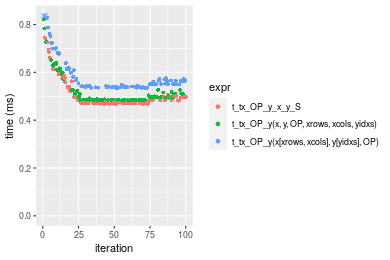


## Data type "double"
### Data
```r
> rmatrix <- function(nrow, ncol, mode = c("logical", "double", "integer", "index"), range = c(-100, 
+     +100), na_prob = 0) {
+     mode <- match.arg(mode)
+     n <- nrow * ncol
+     if (mode == "logical") {
+         x <- sample(c(FALSE, TRUE), size = n, replace = TRUE)
+     }     else if (mode == "index") {
+         x <- seq_len(n)
+         mode <- "integer"
+     }     else {
+         x <- runif(n, min = range[1], max = range[2])
+     }
+     storage.mode(x) <- mode
+     if (na_prob > 0) 
+         x[sample(n, size = na_prob * n)] <- NA
+     dim(x) <- c(nrow, ncol)
+     x
+ }
> rmatrices <- function(scale = 10, seed = 1, ...) {
+     set.seed(seed)
+     data <- list()
+     data[[1]] <- rmatrix(nrow = scale * 1, ncol = scale * 1, ...)
+     data[[2]] <- rmatrix(nrow = scale * 10, ncol = scale * 10, ...)
+     data[[3]] <- rmatrix(nrow = scale * 100, ncol = scale * 1, ...)
+     data[[4]] <- t(data[[3]])
+     data[[5]] <- rmatrix(nrow = scale * 10, ncol = scale * 100, ...)
+     data[[6]] <- t(data[[5]])
+     names(data) <- sapply(data, FUN = function(x) paste(dim(x), collapse = "x"))
+     data
+ }
> data <- rmatrices(mode = mode)
```

### Results

### 10x10 vector


```r
> x <- data[["10x10"]]
> y <- x[, 1L]
> xrows <- sample.int(nrow(x), size = nrow(x) * 0.7)
> xcols <- sample.int(ncol(x), size = ncol(x) * 0.7)
> x_S <- x[xrows, xcols]
> yidxs <- xrows
> y_S <- y[yidxs]
```

```r
> OP
[1] "+"
> stats <- microbenchmark(t_tx_OP_y_x_y_S = t_tx_OP_y(x_S, y_S, OP = OP, na.rm = FALSE), `t_tx_OP_y(x, y, OP, xrows, xcols, yidxs)` = t_tx_OP_y(x, 
+     y, OP = OP, xrows = xrows, xcols = xcols, yidxs = yidxs, na.rm = FALSE), `t_tx_OP_y(x[xrows, xcols], y[yidxs], OP)` = t_tx_OP_y(x[xrows, 
+     xcols], y[yidxs], OP = OP, na.rm = FALSE), unit = "ms")
```

_Table: Benchmarking of t_tx_OP_y_x_y_S(), t_tx_OP_y(x, y, OP, xrows, xcols, yidxs)() and t_tx_OP_y(x[xrows, xcols], y[yidxs], OP)() on double+10x10+add data. The top panel shows times in milliseconds and the bottom panel shows relative times._


|   |expr                                     |      min|        lq|      mean|    median|        uq|      max|
|:--|:----------------------------------------|--------:|---------:|---------:|---------:|---------:|--------:|
|1  |t_tx_OP_y_x_y_S                          | 0.004714| 0.0049125| 0.0056089| 0.0050425| 0.0052415| 0.025612|
|2  |t_tx_OP_y(x, y, OP, xrows, xcols, yidxs) | 0.005237| 0.0055450| 0.0059314| 0.0056770| 0.0058665| 0.012713|
|3  |t_tx_OP_y(x[xrows, xcols], y[yidxs], OP) | 0.006214| 0.0064250| 0.0068116| 0.0065260| 0.0066465| 0.027010|


|   |expr                                     |      min|       lq|     mean|   median|       uq|       max|
|:--|:----------------------------------------|--------:|--------:|--------:|--------:|--------:|---------:|
|1  |t_tx_OP_y_x_y_S                          | 1.000000| 1.000000| 1.000000| 1.000000| 1.000000| 1.0000000|
|2  |t_tx_OP_y(x, y, OP, xrows, xcols, yidxs) | 1.110946| 1.128753| 1.057500| 1.125830| 1.119241| 0.4963689|
|3  |t_tx_OP_y(x[xrows, xcols], y[yidxs], OP) | 1.318201| 1.307888| 1.214421| 1.294199| 1.268053| 1.0545838|

_Figure: Benchmarking of t_tx_OP_y_x_y_S(), t_tx_OP_y(x, y, OP, xrows, xcols, yidxs)() and t_tx_OP_y(x[xrows, xcols], y[yidxs], OP)() on double+10x10+add data.  Outliers are displayed as crosses.  Times are in milliseconds._

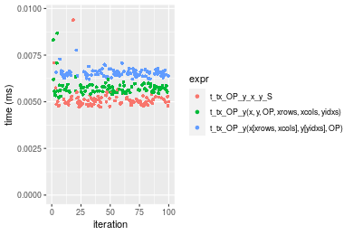

```r
> OP
[1] "-"
> stats <- microbenchmark(t_tx_OP_y_x_y_S = t_tx_OP_y(x_S, y_S, OP = OP, na.rm = FALSE), `t_tx_OP_y(x, y, OP, xrows, xcols, yidxs)` = t_tx_OP_y(x, 
+     y, OP = OP, xrows = xrows, xcols = xcols, yidxs = yidxs, na.rm = FALSE), `t_tx_OP_y(x[xrows, xcols], y[yidxs], OP)` = t_tx_OP_y(x[xrows, 
+     xcols], y[yidxs], OP = OP, na.rm = FALSE), unit = "ms")
```

_Table: Benchmarking of t_tx_OP_y_x_y_S(), t_tx_OP_y(x, y, OP, xrows, xcols, yidxs)() and t_tx_OP_y(x[xrows, xcols], y[yidxs], OP)() on double+10x10+sub data. The top panel shows times in milliseconds and the bottom panel shows relative times._


|   |expr                                     |      min|        lq|      mean|    median|        uq|      max|
|:--|:----------------------------------------|--------:|---------:|---------:|---------:|---------:|--------:|
|1  |t_tx_OP_y_x_y_S                          | 0.004498| 0.0047280| 0.0051242| 0.0048265| 0.0050470| 0.011457|
|2  |t_tx_OP_y(x, y, OP, xrows, xcols, yidxs) | 0.005087| 0.0054125| 0.0059918| 0.0055160| 0.0056965| 0.031069|
|3  |t_tx_OP_y(x[xrows, xcols], y[yidxs], OP) | 0.005697| 0.0062290| 0.0066761| 0.0063600| 0.0065630| 0.017041|


|   |expr                                     |      min|       lq|     mean|   median|       uq|      max|
|:--|:----------------------------------------|--------:|--------:|--------:|--------:|--------:|--------:|
|1  |t_tx_OP_y_x_y_S                          | 1.000000| 1.000000| 1.000000| 1.000000| 1.000000| 1.000000|
|2  |t_tx_OP_y(x, y, OP, xrows, xcols, yidxs) | 1.130947| 1.144776| 1.169331| 1.142857| 1.128690| 2.711792|
|3  |t_tx_OP_y(x[xrows, xcols], y[yidxs], OP) | 1.266563| 1.317470| 1.302876| 1.317725| 1.300377| 1.487388|

_Figure: Benchmarking of t_tx_OP_y_x_y_S(), t_tx_OP_y(x, y, OP, xrows, xcols, yidxs)() and t_tx_OP_y(x[xrows, xcols], y[yidxs], OP)() on double+10x10+sub data.  Outliers are displayed as crosses.  Times are in milliseconds._

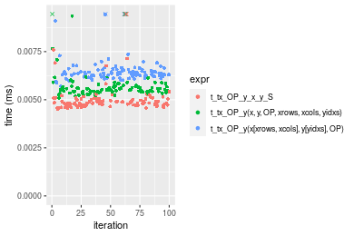

```r
> OP
[1] "*"
> stats <- microbenchmark(t_tx_OP_y_x_y_S = t_tx_OP_y(x_S, y_S, OP = OP, na.rm = FALSE), `t_tx_OP_y(x, y, OP, xrows, xcols, yidxs)` = t_tx_OP_y(x, 
+     y, OP = OP, xrows = xrows, xcols = xcols, yidxs = yidxs, na.rm = FALSE), `t_tx_OP_y(x[xrows, xcols], y[yidxs], OP)` = t_tx_OP_y(x[xrows, 
+     xcols], y[yidxs], OP = OP, na.rm = FALSE), unit = "ms")
```

_Table: Benchmarking of t_tx_OP_y_x_y_S(), t_tx_OP_y(x, y, OP, xrows, xcols, yidxs)() and t_tx_OP_y(x[xrows, xcols], y[yidxs], OP)() on double+10x10+mul data. The top panel shows times in milliseconds and the bottom panel shows relative times._


|   |expr                                     |      min|       lq|      mean|    median|        uq|      max|
|:--|:----------------------------------------|--------:|--------:|---------:|---------:|---------:|--------:|
|1  |t_tx_OP_y_x_y_S                          | 0.004548| 0.004943| 0.0055518| 0.0050475| 0.0051940| 0.014705|
|2  |t_tx_OP_y(x, y, OP, xrows, xcols, yidxs) | 0.005265| 0.005580| 0.0062827| 0.0057295| 0.0059225| 0.017764|
|3  |t_tx_OP_y(x[xrows, xcols], y[yidxs], OP) | 0.006151| 0.006441| 0.0074242| 0.0066065| 0.0068025| 0.042068|


|   |expr                                     |      min|       lq|     mean|   median|       uq|      max|
|:--|:----------------------------------------|--------:|--------:|--------:|--------:|--------:|--------:|
|1  |t_tx_OP_y_x_y_S                          | 1.000000| 1.000000| 1.000000| 1.000000| 1.000000| 1.000000|
|2  |t_tx_OP_y(x, y, OP, xrows, xcols, yidxs) | 1.157652| 1.128869| 1.131650| 1.135116| 1.140258| 1.208025|
|3  |t_tx_OP_y(x[xrows, xcols], y[yidxs], OP) | 1.352463| 1.303055| 1.337262| 1.308866| 1.309684| 2.860796|

_Figure: Benchmarking of t_tx_OP_y_x_y_S(), t_tx_OP_y(x, y, OP, xrows, xcols, yidxs)() and t_tx_OP_y(x[xrows, xcols], y[yidxs], OP)() on double+10x10+mul data.  Outliers are displayed as crosses.  Times are in milliseconds._

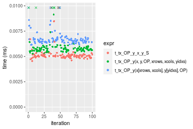

```r
> OP
[1] "/"
> stats <- microbenchmark(t_tx_OP_y_x_y_S = t_tx_OP_y(x_S, y_S, OP = OP, na.rm = FALSE), `t_tx_OP_y(x, y, OP, xrows, xcols, yidxs)` = t_tx_OP_y(x, 
+     y, OP = OP, xrows = xrows, xcols = xcols, yidxs = yidxs, na.rm = FALSE), `t_tx_OP_y(x[xrows, xcols], y[yidxs], OP)` = t_tx_OP_y(x[xrows, 
+     xcols], y[yidxs], OP = OP, na.rm = FALSE), unit = "ms")
```

_Table: Benchmarking of t_tx_OP_y_x_y_S(), t_tx_OP_y(x, y, OP, xrows, xcols, yidxs)() and t_tx_OP_y(x[xrows, xcols], y[yidxs], OP)() on double+10x10+div data. The top panel shows times in milliseconds and the bottom panel shows relative times._


|   |expr                                     |      min|        lq|      mean|    median|        uq|      max|
|:--|:----------------------------------------|--------:|---------:|---------:|---------:|---------:|--------:|
|1  |t_tx_OP_y_x_y_S                          | 0.004626| 0.0048910| 0.0052836| 0.0050145| 0.0051195| 0.029232|
|2  |t_tx_OP_y(x, y, OP, xrows, xcols, yidxs) | 0.005337| 0.0056015| 0.0057957| 0.0056970| 0.0058640| 0.011271|
|3  |t_tx_OP_y(x[xrows, xcols], y[yidxs], OP) | 0.005829| 0.0064110| 0.0065931| 0.0065175| 0.0066550| 0.011833|


|   |expr                                     |      min|       lq|     mean|   median|       uq|       max|
|:--|:----------------------------------------|--------:|--------:|--------:|--------:|--------:|---------:|
|1  |t_tx_OP_y_x_y_S                          | 1.000000| 1.000000| 1.000000| 1.000000| 1.000000| 1.0000000|
|2  |t_tx_OP_y(x, y, OP, xrows, xcols, yidxs) | 1.153696| 1.145267| 1.096911| 1.136105| 1.145424| 0.3855706|
|3  |t_tx_OP_y(x[xrows, xcols], y[yidxs], OP) | 1.260052| 1.310775| 1.247843| 1.299731| 1.299932| 0.4047961|

_Figure: Benchmarking of t_tx_OP_y_x_y_S(), t_tx_OP_y(x, y, OP, xrows, xcols, yidxs)() and t_tx_OP_y(x[xrows, xcols], y[yidxs], OP)() on double+10x10+div data.  Outliers are displayed as crosses.  Times are in milliseconds._

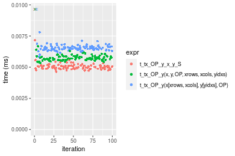


### 100x100 vector


```r
> x <- data[["100x100"]]
> y <- x[, 1L]
> xrows <- sample.int(nrow(x), size = nrow(x) * 0.7)
> xcols <- sample.int(ncol(x), size = ncol(x) * 0.7)
> x_S <- x[xrows, xcols]
> yidxs <- xrows
> y_S <- y[yidxs]
```

```r
> OP
[1] "+"
> stats <- microbenchmark(t_tx_OP_y_x_y_S = t_tx_OP_y(x_S, y_S, OP = OP, na.rm = FALSE), `t_tx_OP_y(x, y, OP, xrows, xcols, yidxs)` = t_tx_OP_y(x, 
+     y, OP = OP, xrows = xrows, xcols = xcols, yidxs = yidxs, na.rm = FALSE), `t_tx_OP_y(x[xrows, xcols], y[yidxs], OP)` = t_tx_OP_y(x[xrows, 
+     xcols], y[yidxs], OP = OP, na.rm = FALSE), unit = "ms")
```

_Table: Benchmarking of t_tx_OP_y_x_y_S(), t_tx_OP_y(x, y, OP, xrows, xcols, yidxs)() and t_tx_OP_y(x[xrows, xcols], y[yidxs], OP)() on double+100x100+add data. The top panel shows times in milliseconds and the bottom panel shows relative times._


|   |expr                                     |      min|        lq|      mean|    median|        uq|      max|
|:--|:----------------------------------------|--------:|---------:|---------:|---------:|---------:|--------:|
|1  |t_tx_OP_y_x_y_S                          | 0.059405| 0.0618665| 0.0665810| 0.0645725| 0.0697065| 0.099230|
|2  |t_tx_OP_y(x, y, OP, xrows, xcols, yidxs) | 0.061235| 0.0634700| 0.0688189| 0.0663420| 0.0737245| 0.094231|
|3  |t_tx_OP_y(x[xrows, xcols], y[yidxs], OP) | 0.073301| 0.0774260| 0.0838199| 0.0846460| 0.0884860| 0.102893|


|   |expr                                     |      min|       lq|     mean|   median|       uq|       max|
|:--|:----------------------------------------|--------:|--------:|--------:|--------:|--------:|---------:|
|1  |t_tx_OP_y_x_y_S                          | 1.000000| 1.000000| 1.000000| 1.000000| 1.000000| 1.0000000|
|2  |t_tx_OP_y(x, y, OP, xrows, xcols, yidxs) | 1.030806| 1.025919| 1.033611| 1.027403| 1.057642| 0.9496221|
|3  |t_tx_OP_y(x[xrows, xcols], y[yidxs], OP) | 1.233920| 1.251501| 1.258915| 1.310868| 1.269408| 1.0369142|

_Figure: Benchmarking of t_tx_OP_y_x_y_S(), t_tx_OP_y(x, y, OP, xrows, xcols, yidxs)() and t_tx_OP_y(x[xrows, xcols], y[yidxs], OP)() on double+100x100+add data.  Outliers are displayed as crosses.  Times are in milliseconds._

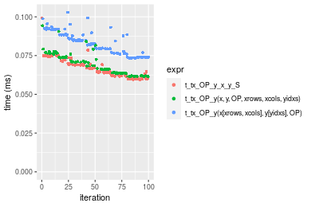

```r
> OP
[1] "-"
> stats <- microbenchmark(t_tx_OP_y_x_y_S = t_tx_OP_y(x_S, y_S, OP = OP, na.rm = FALSE), `t_tx_OP_y(x, y, OP, xrows, xcols, yidxs)` = t_tx_OP_y(x, 
+     y, OP = OP, xrows = xrows, xcols = xcols, yidxs = yidxs, na.rm = FALSE), `t_tx_OP_y(x[xrows, xcols], y[yidxs], OP)` = t_tx_OP_y(x[xrows, 
+     xcols], y[yidxs], OP = OP, na.rm = FALSE), unit = "ms")
```

_Table: Benchmarking of t_tx_OP_y_x_y_S(), t_tx_OP_y(x, y, OP, xrows, xcols, yidxs)() and t_tx_OP_y(x[xrows, xcols], y[yidxs], OP)() on double+100x100+sub data. The top panel shows times in milliseconds and the bottom panel shows relative times._


|   |expr                                     |      min|        lq|      mean|    median|       uq|      max|
|:--|:----------------------------------------|--------:|---------:|---------:|---------:|--------:|--------:|
|1  |t_tx_OP_y_x_y_S                          | 0.059666| 0.0606825| 0.0664459| 0.0648065| 0.071760| 0.079209|
|2  |t_tx_OP_y(x, y, OP, xrows, xcols, yidxs) | 0.060902| 0.0636540| 0.0686206| 0.0680325| 0.072908| 0.090080|
|3  |t_tx_OP_y(x[xrows, xcols], y[yidxs], OP) | 0.073679| 0.0746640| 0.0822978| 0.0804925| 0.088672| 0.127537|


|   |expr                                     |      min|       lq|     mean|   median|       uq|      max|
|:--|:----------------------------------------|--------:|--------:|--------:|--------:|--------:|--------:|
|1  |t_tx_OP_y_x_y_S                          | 1.000000| 1.000000| 1.000000| 1.000000| 1.000000| 1.000000|
|2  |t_tx_OP_y(x, y, OP, xrows, xcols, yidxs) | 1.020715| 1.048968| 1.032729| 1.049779| 1.015998| 1.137244|
|3  |t_tx_OP_y(x[xrows, xcols], y[yidxs], OP) | 1.234857| 1.230404| 1.238568| 1.242044| 1.235675| 1.610133|

_Figure: Benchmarking of t_tx_OP_y_x_y_S(), t_tx_OP_y(x, y, OP, xrows, xcols, yidxs)() and t_tx_OP_y(x[xrows, xcols], y[yidxs], OP)() on double+100x100+sub data.  Outliers are displayed as crosses.  Times are in milliseconds._

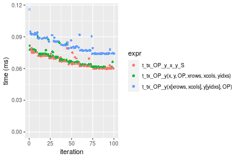

```r
> OP
[1] "*"
> stats <- microbenchmark(t_tx_OP_y_x_y_S = t_tx_OP_y(x_S, y_S, OP = OP, na.rm = FALSE), `t_tx_OP_y(x, y, OP, xrows, xcols, yidxs)` = t_tx_OP_y(x, 
+     y, OP = OP, xrows = xrows, xcols = xcols, yidxs = yidxs, na.rm = FALSE), `t_tx_OP_y(x[xrows, xcols], y[yidxs], OP)` = t_tx_OP_y(x[xrows, 
+     xcols], y[yidxs], OP = OP, na.rm = FALSE), unit = "ms")
```

_Table: Benchmarking of t_tx_OP_y_x_y_S(), t_tx_OP_y(x, y, OP, xrows, xcols, yidxs)() and t_tx_OP_y(x[xrows, xcols], y[yidxs], OP)() on double+100x100+mul data. The top panel shows times in milliseconds and the bottom panel shows relative times._


|   |expr                                     |      min|        lq|      mean|    median|       uq|      max|
|:--|:----------------------------------------|--------:|---------:|---------:|---------:|--------:|--------:|
|1  |t_tx_OP_y_x_y_S                          | 0.056496| 0.0574745| 0.0632066| 0.0627115| 0.067402| 0.092435|
|2  |t_tx_OP_y(x, y, OP, xrows, xcols, yidxs) | 0.059595| 0.0604020| 0.0665880| 0.0662960| 0.071627| 0.091246|
|3  |t_tx_OP_y(x[xrows, xcols], y[yidxs], OP) | 0.070294| 0.0712405| 0.0792767| 0.0784340| 0.085293| 0.101729|


|   |expr                                     |      min|       lq|     mean|   median|       uq|       max|
|:--|:----------------------------------------|--------:|--------:|--------:|--------:|--------:|---------:|
|1  |t_tx_OP_y_x_y_S                          | 1.000000| 1.000000| 1.000000| 1.000000| 1.000000| 1.0000000|
|2  |t_tx_OP_y(x, y, OP, xrows, xcols, yidxs) | 1.054853| 1.050936| 1.053496| 1.057159| 1.062684| 0.9871369|
|3  |t_tx_OP_y(x[xrows, xcols], y[yidxs], OP) | 1.244230| 1.239515| 1.254246| 1.250712| 1.265437| 1.1005463|

_Figure: Benchmarking of t_tx_OP_y_x_y_S(), t_tx_OP_y(x, y, OP, xrows, xcols, yidxs)() and t_tx_OP_y(x[xrows, xcols], y[yidxs], OP)() on double+100x100+mul data.  Outliers are displayed as crosses.  Times are in milliseconds._

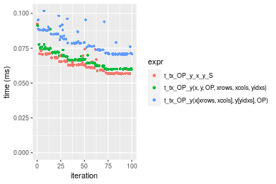

```r
> OP
[1] "/"
> stats <- microbenchmark(t_tx_OP_y_x_y_S = t_tx_OP_y(x_S, y_S, OP = OP, na.rm = FALSE), `t_tx_OP_y(x, y, OP, xrows, xcols, yidxs)` = t_tx_OP_y(x, 
+     y, OP = OP, xrows = xrows, xcols = xcols, yidxs = yidxs, na.rm = FALSE), `t_tx_OP_y(x[xrows, xcols], y[yidxs], OP)` = t_tx_OP_y(x[xrows, 
+     xcols], y[yidxs], OP = OP, na.rm = FALSE), unit = "ms")
```

_Table: Benchmarking of t_tx_OP_y_x_y_S(), t_tx_OP_y(x, y, OP, xrows, xcols, yidxs)() and t_tx_OP_y(x[xrows, xcols], y[yidxs], OP)() on double+100x100+div data. The top panel shows times in milliseconds and the bottom panel shows relative times._


|   |expr                                     |      min|        lq|      mean|    median|        uq|      max|
|:--|:----------------------------------------|--------:|---------:|---------:|---------:|---------:|--------:|
|1  |t_tx_OP_y_x_y_S                          | 0.056509| 0.0571605| 0.0625492| 0.0616135| 0.0677975| 0.082179|
|2  |t_tx_OP_y(x, y, OP, xrows, xcols, yidxs) | 0.058420| 0.0592415| 0.0651659| 0.0651560| 0.0685880| 0.109635|
|3  |t_tx_OP_y(x[xrows, xcols], y[yidxs], OP) | 0.070515| 0.0736210| 0.0786674| 0.0785320| 0.0830820| 0.101507|


|   |expr                                     |      min|       lq|     mean|   median|       uq|      max|
|:--|:----------------------------------------|--------:|--------:|--------:|--------:|--------:|--------:|
|1  |t_tx_OP_y_x_y_S                          | 1.000000| 1.000000| 1.000000| 1.000000| 1.000000| 1.000000|
|2  |t_tx_OP_y(x, y, OP, xrows, xcols, yidxs) | 1.033818| 1.036406| 1.041834| 1.057495| 1.011660| 1.334100|
|3  |t_tx_OP_y(x[xrows, xcols], y[yidxs], OP) | 1.247854| 1.287970| 1.257688| 1.274591| 1.225443| 1.235194|

_Figure: Benchmarking of t_tx_OP_y_x_y_S(), t_tx_OP_y(x, y, OP, xrows, xcols, yidxs)() and t_tx_OP_y(x[xrows, xcols], y[yidxs], OP)() on double+100x100+div data.  Outliers are displayed as crosses.  Times are in milliseconds._

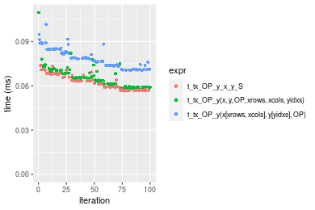


### 1000x10 vector


```r
> x <- data[["1000x10"]]
> y <- x[, 1L]
> xrows <- sample.int(nrow(x), size = nrow(x) * 0.7)
> xcols <- sample.int(ncol(x), size = ncol(x) * 0.7)
> x_S <- x[xrows, xcols]
> yidxs <- xrows
> y_S <- y[yidxs]
```

```r
> OP
[1] "+"
> stats <- microbenchmark(t_tx_OP_y_x_y_S = t_tx_OP_y(x_S, y_S, OP = OP, na.rm = FALSE), `t_tx_OP_y(x, y, OP, xrows, xcols, yidxs)` = t_tx_OP_y(x, 
+     y, OP = OP, xrows = xrows, xcols = xcols, yidxs = yidxs, na.rm = FALSE), `t_tx_OP_y(x[xrows, xcols], y[yidxs], OP)` = t_tx_OP_y(x[xrows, 
+     xcols], y[yidxs], OP = OP, na.rm = FALSE), unit = "ms")
```

_Table: Benchmarking of t_tx_OP_y_x_y_S(), t_tx_OP_y(x, y, OP, xrows, xcols, yidxs)() and t_tx_OP_y(x[xrows, xcols], y[yidxs], OP)() on double+1000x10+add data. The top panel shows times in milliseconds and the bottom panel shows relative times._


|   |expr                                     |      min|       lq|      mean|    median|        uq|      max|
|:--|:----------------------------------------|--------:|--------:|---------:|---------:|---------:|--------:|
|1  |t_tx_OP_y_x_y_S                          | 0.057157| 0.059307| 0.0624272| 0.0611975| 0.0645890| 0.091373|
|2  |t_tx_OP_y(x, y, OP, xrows, xcols, yidxs) | 0.061953| 0.062901| 0.0666082| 0.0652140| 0.0690740| 0.082430|
|3  |t_tx_OP_y(x[xrows, xcols], y[yidxs], OP) | 0.072429| 0.074459| 0.0795758| 0.0777880| 0.0830935| 0.135063|


|   |expr                                     |      min|       lq|     mean|   median|       uq|       max|
|:--|:----------------------------------------|--------:|--------:|--------:|--------:|--------:|---------:|
|1  |t_tx_OP_y_x_y_S                          | 1.000000| 1.000000| 1.000000| 1.000000| 1.000000| 1.0000000|
|2  |t_tx_OP_y(x, y, OP, xrows, xcols, yidxs) | 1.083909| 1.060600| 1.066974| 1.065632| 1.069439| 0.9021264|
|3  |t_tx_OP_y(x[xrows, xcols], y[yidxs], OP) | 1.267194| 1.255484| 1.274698| 1.271098| 1.286496| 1.4781500|

_Figure: Benchmarking of t_tx_OP_y_x_y_S(), t_tx_OP_y(x, y, OP, xrows, xcols, yidxs)() and t_tx_OP_y(x[xrows, xcols], y[yidxs], OP)() on double+1000x10+add data.  Outliers are displayed as crosses.  Times are in milliseconds._

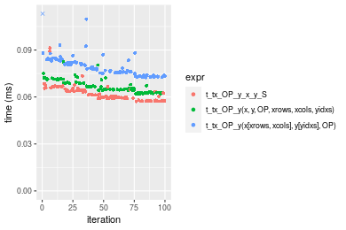

```r
> OP
[1] "-"
> stats <- microbenchmark(t_tx_OP_y_x_y_S = t_tx_OP_y(x_S, y_S, OP = OP, na.rm = FALSE), `t_tx_OP_y(x, y, OP, xrows, xcols, yidxs)` = t_tx_OP_y(x, 
+     y, OP = OP, xrows = xrows, xcols = xcols, yidxs = yidxs, na.rm = FALSE), `t_tx_OP_y(x[xrows, xcols], y[yidxs], OP)` = t_tx_OP_y(x[xrows, 
+     xcols], y[yidxs], OP = OP, na.rm = FALSE), unit = "ms")
```

_Table: Benchmarking of t_tx_OP_y_x_y_S(), t_tx_OP_y(x, y, OP, xrows, xcols, yidxs)() and t_tx_OP_y(x[xrows, xcols], y[yidxs], OP)() on double+1000x10+sub data. The top panel shows times in milliseconds and the bottom panel shows relative times._


|   |expr                                     |      min|        lq|      mean|    median|        uq|      max|
|:--|:----------------------------------------|--------:|---------:|---------:|---------:|---------:|--------:|
|1  |t_tx_OP_y_x_y_S                          | 0.057743| 0.0597300| 0.0640394| 0.0625225| 0.0676810| 0.081327|
|2  |t_tx_OP_y(x, y, OP, xrows, xcols, yidxs) | 0.062836| 0.0648925| 0.0696485| 0.0682905| 0.0741095| 0.084641|
|3  |t_tx_OP_y(x[xrows, xcols], y[yidxs], OP) | 0.072923| 0.0759840| 0.0824823| 0.0808950| 0.0876560| 0.126929|


|   |expr                                     |      min|       lq|     mean|   median|       uq|      max|
|:--|:----------------------------------------|--------:|--------:|--------:|--------:|--------:|--------:|
|1  |t_tx_OP_y_x_y_S                          | 1.000000| 1.000000| 1.000000| 1.000000| 1.000000| 1.000000|
|2  |t_tx_OP_y(x, y, OP, xrows, xcols, yidxs) | 1.088201| 1.086431| 1.087588| 1.092255| 1.094982| 1.040749|
|3  |t_tx_OP_y(x[xrows, xcols], y[yidxs], OP) | 1.262889| 1.272125| 1.287994| 1.293854| 1.295135| 1.560724|

_Figure: Benchmarking of t_tx_OP_y_x_y_S(), t_tx_OP_y(x, y, OP, xrows, xcols, yidxs)() and t_tx_OP_y(x[xrows, xcols], y[yidxs], OP)() on double+1000x10+sub data.  Outliers are displayed as crosses.  Times are in milliseconds._


```r
> OP
[1] "*"
> stats <- microbenchmark(t_tx_OP_y_x_y_S = t_tx_OP_y(x_S, y_S, OP = OP, na.rm = FALSE), `t_tx_OP_y(x, y, OP, xrows, xcols, yidxs)` = t_tx_OP_y(x, 
+     y, OP = OP, xrows = xrows, xcols = xcols, yidxs = yidxs, na.rm = FALSE), `t_tx_OP_y(x[xrows, xcols], y[yidxs], OP)` = t_tx_OP_y(x[xrows, 
+     xcols], y[yidxs], OP = OP, na.rm = FALSE), unit = "ms")
```

_Table: Benchmarking of t_tx_OP_y_x_y_S(), t_tx_OP_y(x, y, OP, xrows, xcols, yidxs)() and t_tx_OP_y(x[xrows, xcols], y[yidxs], OP)() on double+1000x10+mul data. The top panel shows times in milliseconds and the bottom panel shows relative times._


|   |expr                                     |      min|        lq|      mean|    median|        uq|      max|
|:--|:----------------------------------------|--------:|---------:|---------:|---------:|---------:|--------:|
|1  |t_tx_OP_y_x_y_S                          | 0.055858| 0.0564525| 0.0605266| 0.0603505| 0.0625115| 0.076095|
|2  |t_tx_OP_y(x, y, OP, xrows, xcols, yidxs) | 0.062579| 0.0636030| 0.0694847| 0.0679820| 0.0733450| 0.092625|
|3  |t_tx_OP_y(x[xrows, xcols], y[yidxs], OP) | 0.071663| 0.0754435| 0.0816792| 0.0801010| 0.0865350| 0.129606|


|   |expr                                     |      min|       lq|     mean|   median|       uq|      max|
|:--|:----------------------------------------|--------:|--------:|--------:|--------:|--------:|--------:|
|1  |t_tx_OP_y_x_y_S                          | 1.000000| 1.000000| 1.000000| 1.000000| 1.000000| 1.000000|
|2  |t_tx_OP_y(x, y, OP, xrows, xcols, yidxs) | 1.120323| 1.126664| 1.148003| 1.126453| 1.173304| 1.217229|
|3  |t_tx_OP_y(x[xrows, xcols], y[yidxs], OP) | 1.282950| 1.336407| 1.349476| 1.327263| 1.384305| 1.703213|

_Figure: Benchmarking of t_tx_OP_y_x_y_S(), t_tx_OP_y(x, y, OP, xrows, xcols, yidxs)() and t_tx_OP_y(x[xrows, xcols], y[yidxs], OP)() on double+1000x10+mul data.  Outliers are displayed as crosses.  Times are in milliseconds._

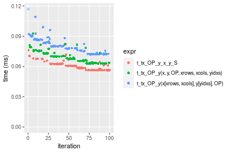

```r
> OP
[1] "/"
> stats <- microbenchmark(t_tx_OP_y_x_y_S = t_tx_OP_y(x_S, y_S, OP = OP, na.rm = FALSE), `t_tx_OP_y(x, y, OP, xrows, xcols, yidxs)` = t_tx_OP_y(x, 
+     y, OP = OP, xrows = xrows, xcols = xcols, yidxs = yidxs, na.rm = FALSE), `t_tx_OP_y(x[xrows, xcols], y[yidxs], OP)` = t_tx_OP_y(x[xrows, 
+     xcols], y[yidxs], OP = OP, na.rm = FALSE), unit = "ms")
```

_Table: Benchmarking of t_tx_OP_y_x_y_S(), t_tx_OP_y(x, y, OP, xrows, xcols, yidxs)() and t_tx_OP_y(x[xrows, xcols], y[yidxs], OP)() on double+1000x10+div data. The top panel shows times in milliseconds and the bottom panel shows relative times._


|   |expr                                     |      min|        lq|      mean|    median|        uq|      max|
|:--|:----------------------------------------|--------:|---------:|---------:|---------:|---------:|--------:|
|1  |t_tx_OP_y_x_y_S                          | 0.055835| 0.0564040| 0.0614545| 0.0605510| 0.0651060| 0.088472|
|2  |t_tx_OP_y(x, y, OP, xrows, xcols, yidxs) | 0.061474| 0.0628315| 0.0686917| 0.0669705| 0.0719815| 0.117751|
|3  |t_tx_OP_y(x[xrows, xcols], y[yidxs], OP) | 0.071874| 0.0743395| 0.0802377| 0.0797800| 0.0859925| 0.095653|


|   |expr                                     |      min|       lq|     mean|   median|       uq|      max|
|:--|:----------------------------------------|--------:|--------:|--------:|--------:|--------:|--------:|
|1  |t_tx_OP_y_x_y_S                          | 1.000000| 1.000000| 1.000000| 1.000000| 1.000000| 1.000000|
|2  |t_tx_OP_y(x, y, OP, xrows, xcols, yidxs) | 1.100994| 1.113955| 1.117765| 1.106018| 1.105605| 1.330941|
|3  |t_tx_OP_y(x[xrows, xcols], y[yidxs], OP) | 1.287257| 1.317983| 1.305644| 1.317567| 1.320808| 1.081167|

_Figure: Benchmarking of t_tx_OP_y_x_y_S(), t_tx_OP_y(x, y, OP, xrows, xcols, yidxs)() and t_tx_OP_y(x[xrows, xcols], y[yidxs], OP)() on double+1000x10+div data.  Outliers are displayed as crosses.  Times are in milliseconds._

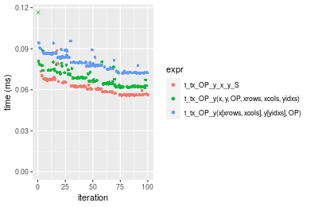


### 10x1000 vector


```r
> x <- data[["10x1000"]]
> y <- x[, 1L]
> xrows <- sample.int(nrow(x), size = nrow(x) * 0.7)
> xcols <- sample.int(ncol(x), size = ncol(x) * 0.7)
> x_S <- x[xrows, xcols]
> yidxs <- xrows
> y_S <- y[yidxs]
```

```r
> OP
[1] "+"
> stats <- microbenchmark(t_tx_OP_y_x_y_S = t_tx_OP_y(x_S, y_S, OP = OP, na.rm = FALSE), `t_tx_OP_y(x, y, OP, xrows, xcols, yidxs)` = t_tx_OP_y(x, 
+     y, OP = OP, xrows = xrows, xcols = xcols, yidxs = yidxs, na.rm = FALSE), `t_tx_OP_y(x[xrows, xcols], y[yidxs], OP)` = t_tx_OP_y(x[xrows, 
+     xcols], y[yidxs], OP = OP, na.rm = FALSE), unit = "ms")
```

_Table: Benchmarking of t_tx_OP_y_x_y_S(), t_tx_OP_y(x, y, OP, xrows, xcols, yidxs)() and t_tx_OP_y(x[xrows, xcols], y[yidxs], OP)() on double+10x1000+add data. The top panel shows times in milliseconds and the bottom panel shows relative times._


|   |expr                                     |      min|        lq|      mean|    median|        uq|      max|
|:--|:----------------------------------------|--------:|---------:|---------:|---------:|---------:|--------:|
|1  |t_tx_OP_y_x_y_S                          | 0.058458| 0.0611545| 0.0666242| 0.0655860| 0.0715000| 0.086094|
|2  |t_tx_OP_y(x, y, OP, xrows, xcols, yidxs) | 0.060351| 0.0629610| 0.0687001| 0.0688980| 0.0727810| 0.085164|
|3  |t_tx_OP_y(x[xrows, xcols], y[yidxs], OP) | 0.074641| 0.0773930| 0.0847887| 0.0832835| 0.0893485| 0.133132|


|   |expr                                     |      min|       lq|     mean|   median|       uq|       max|
|:--|:----------------------------------------|--------:|--------:|--------:|--------:|--------:|---------:|
|1  |t_tx_OP_y_x_y_S                          | 1.000000| 1.000000| 1.000000| 1.000000| 1.000000| 1.0000000|
|2  |t_tx_OP_y(x, y, OP, xrows, xcols, yidxs) | 1.032382| 1.029540| 1.031159| 1.050499| 1.017916| 0.9891979|
|3  |t_tx_OP_y(x[xrows, xcols], y[yidxs], OP) | 1.276831| 1.265532| 1.272642| 1.269837| 1.249629| 1.5463563|

_Figure: Benchmarking of t_tx_OP_y_x_y_S(), t_tx_OP_y(x, y, OP, xrows, xcols, yidxs)() and t_tx_OP_y(x[xrows, xcols], y[yidxs], OP)() on double+10x1000+add data.  Outliers are displayed as crosses.  Times are in milliseconds._

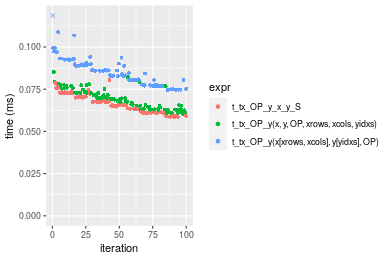

```r
> OP
[1] "-"
> stats <- microbenchmark(t_tx_OP_y_x_y_S = t_tx_OP_y(x_S, y_S, OP = OP, na.rm = FALSE), `t_tx_OP_y(x, y, OP, xrows, xcols, yidxs)` = t_tx_OP_y(x, 
+     y, OP = OP, xrows = xrows, xcols = xcols, yidxs = yidxs, na.rm = FALSE), `t_tx_OP_y(x[xrows, xcols], y[yidxs], OP)` = t_tx_OP_y(x[xrows, 
+     xcols], y[yidxs], OP = OP, na.rm = FALSE), unit = "ms")
```

_Table: Benchmarking of t_tx_OP_y_x_y_S(), t_tx_OP_y(x, y, OP, xrows, xcols, yidxs)() and t_tx_OP_y(x[xrows, xcols], y[yidxs], OP)() on double+10x1000+sub data. The top panel shows times in milliseconds and the bottom panel shows relative times._


|   |expr                                     |      min|        lq|      mean|    median|        uq|      max|
|:--|:----------------------------------------|--------:|---------:|---------:|---------:|---------:|--------:|
|1  |t_tx_OP_y_x_y_S                          | 0.058380| 0.0608580| 0.0671174| 0.0648325| 0.0715235| 0.104256|
|2  |t_tx_OP_y(x, y, OP, xrows, xcols, yidxs) | 0.061885| 0.0640030| 0.0707960| 0.0689855| 0.0756160| 0.102276|
|3  |t_tx_OP_y(x[xrows, xcols], y[yidxs], OP) | 0.074839| 0.0773815| 0.0845697| 0.0824650| 0.0892275| 0.133227|


|   |expr                                     |      min|       lq|     mean|   median|       uq|       max|
|:--|:----------------------------------------|--------:|--------:|--------:|--------:|--------:|---------:|
|1  |t_tx_OP_y_x_y_S                          | 1.000000| 1.000000| 1.000000| 1.000000| 1.000000| 1.0000000|
|2  |t_tx_OP_y(x, y, OP, xrows, xcols, yidxs) | 1.060038| 1.051678| 1.054808| 1.064057| 1.057219| 0.9810083|
|3  |t_tx_OP_y(x[xrows, xcols], y[yidxs], OP) | 1.281929| 1.271509| 1.260026| 1.271970| 1.247527| 1.2778833|

_Figure: Benchmarking of t_tx_OP_y_x_y_S(), t_tx_OP_y(x, y, OP, xrows, xcols, yidxs)() and t_tx_OP_y(x[xrows, xcols], y[yidxs], OP)() on double+10x1000+sub data.  Outliers are displayed as crosses.  Times are in milliseconds._

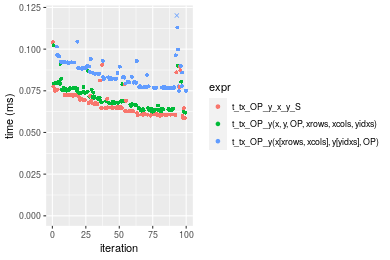

```r
> OP
[1] "*"
> stats <- microbenchmark(t_tx_OP_y_x_y_S = t_tx_OP_y(x_S, y_S, OP = OP, na.rm = FALSE), `t_tx_OP_y(x, y, OP, xrows, xcols, yidxs)` = t_tx_OP_y(x, 
+     y, OP = OP, xrows = xrows, xcols = xcols, yidxs = yidxs, na.rm = FALSE), `t_tx_OP_y(x[xrows, xcols], y[yidxs], OP)` = t_tx_OP_y(x[xrows, 
+     xcols], y[yidxs], OP = OP, na.rm = FALSE), unit = "ms")
```

_Table: Benchmarking of t_tx_OP_y_x_y_S(), t_tx_OP_y(x, y, OP, xrows, xcols, yidxs)() and t_tx_OP_y(x[xrows, xcols], y[yidxs], OP)() on double+10x1000+mul data. The top panel shows times in milliseconds and the bottom panel shows relative times._


|   |expr                                     |      min|        lq|      mean|    median|        uq|      max|
|:--|:----------------------------------------|--------:|---------:|---------:|---------:|---------:|--------:|
|1  |t_tx_OP_y_x_y_S                          | 0.056406| 0.0586555| 0.0632272| 0.0621860| 0.0670475| 0.091878|
|2  |t_tx_OP_y(x, y, OP, xrows, xcols, yidxs) | 0.060612| 0.0630995| 0.0685041| 0.0674890| 0.0726550| 0.083026|
|3  |t_tx_OP_y(x[xrows, xcols], y[yidxs], OP) | 0.073175| 0.0747265| 0.0812757| 0.0798125| 0.0858800| 0.107787|


|   |expr                                     |      min|       lq|     mean|   median|       uq|       max|
|:--|:----------------------------------------|--------:|--------:|--------:|--------:|--------:|---------:|
|1  |t_tx_OP_y_x_y_S                          | 1.000000| 1.000000| 1.000000| 1.000000| 1.000000| 1.0000000|
|2  |t_tx_OP_y(x, y, OP, xrows, xcols, yidxs) | 1.074566| 1.075764| 1.083459| 1.085276| 1.083635| 0.9036548|
|3  |t_tx_OP_y(x[xrows, xcols], y[yidxs], OP) | 1.297291| 1.273990| 1.285454| 1.283448| 1.280883| 1.1731535|

_Figure: Benchmarking of t_tx_OP_y_x_y_S(), t_tx_OP_y(x, y, OP, xrows, xcols, yidxs)() and t_tx_OP_y(x[xrows, xcols], y[yidxs], OP)() on double+10x1000+mul data.  Outliers are displayed as crosses.  Times are in milliseconds._

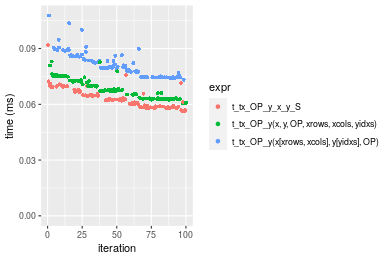

```r
> OP
[1] "/"
> stats <- microbenchmark(t_tx_OP_y_x_y_S = t_tx_OP_y(x_S, y_S, OP = OP, na.rm = FALSE), `t_tx_OP_y(x, y, OP, xrows, xcols, yidxs)` = t_tx_OP_y(x, 
+     y, OP = OP, xrows = xrows, xcols = xcols, yidxs = yidxs, na.rm = FALSE), `t_tx_OP_y(x[xrows, xcols], y[yidxs], OP)` = t_tx_OP_y(x[xrows, 
+     xcols], y[yidxs], OP = OP, na.rm = FALSE), unit = "ms")
```

_Table: Benchmarking of t_tx_OP_y_x_y_S(), t_tx_OP_y(x, y, OP, xrows, xcols, yidxs)() and t_tx_OP_y(x[xrows, xcols], y[yidxs], OP)() on double+10x1000+div data. The top panel shows times in milliseconds and the bottom panel shows relative times._


|   |expr                                     |      min|        lq|      mean|    median|        uq|      max|
|:--|:----------------------------------------|--------:|---------:|---------:|---------:|---------:|--------:|
|1  |t_tx_OP_y_x_y_S                          | 0.055728| 0.0580025| 0.0624254| 0.0615695| 0.0661410| 0.087024|
|2  |t_tx_OP_y(x, y, OP, xrows, xcols, yidxs) | 0.059503| 0.0613890| 0.0664289| 0.0651885| 0.0704515| 0.085297|
|3  |t_tx_OP_y(x[xrows, xcols], y[yidxs], OP) | 0.072403| 0.0743080| 0.0816066| 0.0794055| 0.0880050| 0.128598|


|   |expr                                     |      min|       lq|     mean|   median|       uq|       max|
|:--|:----------------------------------------|--------:|--------:|--------:|--------:|--------:|---------:|
|1  |t_tx_OP_y_x_y_S                          | 1.000000| 1.000000| 1.000000| 1.000000| 1.000000| 1.0000000|
|2  |t_tx_OP_y(x, y, OP, xrows, xcols, yidxs) | 1.067740| 1.058385| 1.064132| 1.058779| 1.065171| 0.9801549|
|3  |t_tx_OP_y(x[xrows, xcols], y[yidxs], OP) | 1.299221| 1.281117| 1.307264| 1.289689| 1.330566| 1.4777303|

_Figure: Benchmarking of t_tx_OP_y_x_y_S(), t_tx_OP_y(x, y, OP, xrows, xcols, yidxs)() and t_tx_OP_y(x[xrows, xcols], y[yidxs], OP)() on double+10x1000+div data.  Outliers are displayed as crosses.  Times are in milliseconds._

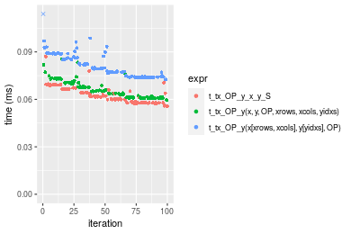


### 100x1000 vector


```r
> x <- data[["100x1000"]]
> y <- x[, 1L]
> xrows <- sample.int(nrow(x), size = nrow(x) * 0.7)
> xcols <- sample.int(ncol(x), size = ncol(x) * 0.7)
> x_S <- x[xrows, xcols]
> yidxs <- xrows
> y_S <- y[yidxs]
```

```r
> OP
[1] "+"
> stats <- microbenchmark(t_tx_OP_y_x_y_S = t_tx_OP_y(x_S, y_S, OP = OP, na.rm = FALSE), `t_tx_OP_y(x, y, OP, xrows, xcols, yidxs)` = t_tx_OP_y(x, 
+     y, OP = OP, xrows = xrows, xcols = xcols, yidxs = yidxs, na.rm = FALSE), `t_tx_OP_y(x[xrows, xcols], y[yidxs], OP)` = t_tx_OP_y(x[xrows, 
+     xcols], y[yidxs], OP = OP, na.rm = FALSE), unit = "ms")
```

_Table: Benchmarking of t_tx_OP_y_x_y_S(), t_tx_OP_y(x, y, OP, xrows, xcols, yidxs)() and t_tx_OP_y(x[xrows, xcols], y[yidxs], OP)() on double+100x1000+add data. The top panel shows times in milliseconds and the bottom panel shows relative times._


|   |expr                                     |      min|       lq|      mean|    median|        uq|      max|
|:--|:----------------------------------------|--------:|--------:|---------:|---------:|---------:|--------:|
|2  |t_tx_OP_y(x, y, OP, xrows, xcols, yidxs) | 0.432330| 0.433116| 0.4732650| 0.4370160| 0.5003515| 0.735591|
|1  |t_tx_OP_y_x_y_S                          | 0.429102| 0.430526| 0.4806906| 0.4421985| 0.5321930| 0.714597|
|3  |t_tx_OP_y(x[xrows, xcols], y[yidxs], OP) | 0.524408| 0.527738| 0.6071238| 0.5442675| 0.6784020| 0.984593|


|   |expr                                     |       min|        lq|     mean|   median|       uq|       max|
|:--|:----------------------------------------|---------:|---------:|--------:|--------:|--------:|---------:|
|2  |t_tx_OP_y(x, y, OP, xrows, xcols, yidxs) | 1.0000000| 1.0000000| 1.000000| 1.000000| 1.000000| 1.0000000|
|1  |t_tx_OP_y_x_y_S                          | 0.9925335| 0.9940201| 1.015690| 1.011859| 1.063638| 0.9714597|
|3  |t_tx_OP_y(x[xrows, xcols], y[yidxs], OP) | 1.2129808| 1.2184680| 1.282841| 1.245418| 1.355851| 1.3385060|

_Figure: Benchmarking of t_tx_OP_y_x_y_S(), t_tx_OP_y(x, y, OP, xrows, xcols, yidxs)() and t_tx_OP_y(x[xrows, xcols], y[yidxs], OP)() on double+100x1000+add data.  Outliers are displayed as crosses.  Times are in milliseconds._

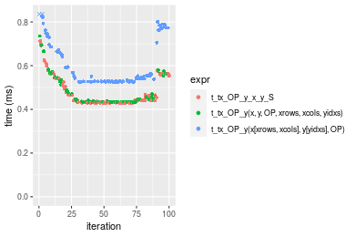

```r
> OP
[1] "-"
> stats <- microbenchmark(t_tx_OP_y_x_y_S = t_tx_OP_y(x_S, y_S, OP = OP, na.rm = FALSE), `t_tx_OP_y(x, y, OP, xrows, xcols, yidxs)` = t_tx_OP_y(x, 
+     y, OP = OP, xrows = xrows, xcols = xcols, yidxs = yidxs, na.rm = FALSE), `t_tx_OP_y(x[xrows, xcols], y[yidxs], OP)` = t_tx_OP_y(x[xrows, 
+     xcols], y[yidxs], OP = OP, na.rm = FALSE), unit = "ms")
```

_Table: Benchmarking of t_tx_OP_y_x_y_S(), t_tx_OP_y(x, y, OP, xrows, xcols, yidxs)() and t_tx_OP_y(x[xrows, xcols], y[yidxs], OP)() on double+100x1000+sub data. The top panel shows times in milliseconds and the bottom panel shows relative times._


|   |expr                                     |      min|        lq|      mean|    median|        uq|      max|
|:--|:----------------------------------------|--------:|---------:|---------:|---------:|---------:|--------:|
|1  |t_tx_OP_y_x_y_S                          | 0.431633| 0.4326715| 0.4726695| 0.4436840| 0.4694535| 0.720843|
|2  |t_tx_OP_y(x, y, OP, xrows, xcols, yidxs) | 0.432074| 0.4335790| 0.4656297| 0.4443340| 0.4568640| 0.695127|
|3  |t_tx_OP_y(x[xrows, xcols], y[yidxs], OP) | 0.528133| 0.5297385| 0.5790080| 0.5428995| 0.5837540| 1.005175|


|   |expr                                     |      min|       lq|      mean|   median|        uq|       max|
|:--|:----------------------------------------|--------:|--------:|---------:|--------:|---------:|---------:|
|1  |t_tx_OP_y_x_y_S                          | 1.000000| 1.000000| 1.0000000| 1.000000| 1.0000000| 1.0000000|
|2  |t_tx_OP_y(x, y, OP, xrows, xcols, yidxs) | 1.001022| 1.002097| 0.9851062| 1.001465| 0.9731826| 0.9643251|
|3  |t_tx_OP_y(x[xrows, xcols], y[yidxs], OP) | 1.223570| 1.224343| 1.2249742| 1.223618| 1.2434757| 1.3944437|

_Figure: Benchmarking of t_tx_OP_y_x_y_S(), t_tx_OP_y(x, y, OP, xrows, xcols, yidxs)() and t_tx_OP_y(x[xrows, xcols], y[yidxs], OP)() on double+100x1000+sub data.  Outliers are displayed as crosses.  Times are in milliseconds._


```r
> OP
[1] "*"
> stats <- microbenchmark(t_tx_OP_y_x_y_S = t_tx_OP_y(x_S, y_S, OP = OP, na.rm = FALSE), `t_tx_OP_y(x, y, OP, xrows, xcols, yidxs)` = t_tx_OP_y(x, 
+     y, OP = OP, xrows = xrows, xcols = xcols, yidxs = yidxs, na.rm = FALSE), `t_tx_OP_y(x[xrows, xcols], y[yidxs], OP)` = t_tx_OP_y(x[xrows, 
+     xcols], y[yidxs], OP = OP, na.rm = FALSE), unit = "ms")
```

_Table: Benchmarking of t_tx_OP_y_x_y_S(), t_tx_OP_y(x, y, OP, xrows, xcols, yidxs)() and t_tx_OP_y(x[xrows, xcols], y[yidxs], OP)() on double+100x1000+mul data. The top panel shows times in milliseconds and the bottom panel shows relative times._


|   |expr                                     |      min|        lq|      mean|    median|        uq|      max|
|:--|:----------------------------------------|--------:|---------:|---------:|---------:|---------:|--------:|
|1  |t_tx_OP_y_x_y_S                          | 0.406550| 0.4075720| 0.4421570| 0.4184760| 0.4458260| 0.693402|
|2  |t_tx_OP_y(x, y, OP, xrows, xcols, yidxs) | 0.421291| 0.4224940| 0.4691252| 0.4348985| 0.5016745| 0.818105|
|3  |t_tx_OP_y(x[xrows, xcols], y[yidxs], OP) | 0.503035| 0.5048115| 0.5477064| 0.5174640| 0.5481755| 0.833620|


|   |expr                                     |      min|       lq|     mean|   median|       uq|      max|
|:--|:----------------------------------------|--------:|--------:|--------:|--------:|--------:|--------:|
|1  |t_tx_OP_y_x_y_S                          | 1.000000| 1.000000| 1.000000| 1.000000| 1.000000| 1.000000|
|2  |t_tx_OP_y(x, y, OP, xrows, xcols, yidxs) | 1.036259| 1.036612| 1.060992| 1.039244| 1.125270| 1.179842|
|3  |t_tx_OP_y(x[xrows, xcols], y[yidxs], OP) | 1.237326| 1.238582| 1.238715| 1.236544| 1.229573| 1.202217|

_Figure: Benchmarking of t_tx_OP_y_x_y_S(), t_tx_OP_y(x, y, OP, xrows, xcols, yidxs)() and t_tx_OP_y(x[xrows, xcols], y[yidxs], OP)() on double+100x1000+mul data.  Outliers are displayed as crosses.  Times are in milliseconds._

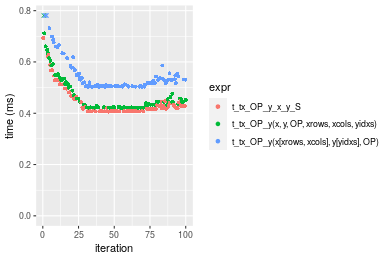

```r
> OP
[1] "/"
> stats <- microbenchmark(t_tx_OP_y_x_y_S = t_tx_OP_y(x_S, y_S, OP = OP, na.rm = FALSE), `t_tx_OP_y(x, y, OP, xrows, xcols, yidxs)` = t_tx_OP_y(x, 
+     y, OP = OP, xrows = xrows, xcols = xcols, yidxs = yidxs, na.rm = FALSE), `t_tx_OP_y(x[xrows, xcols], y[yidxs], OP)` = t_tx_OP_y(x[xrows, 
+     xcols], y[yidxs], OP = OP, na.rm = FALSE), unit = "ms")
```

_Table: Benchmarking of t_tx_OP_y_x_y_S(), t_tx_OP_y(x, y, OP, xrows, xcols, yidxs)() and t_tx_OP_y(x[xrows, xcols], y[yidxs], OP)() on double+100x1000+div data. The top panel shows times in milliseconds and the bottom panel shows relative times._


|   |expr                                     |      min|       lq|      mean|    median|        uq|      max|
|:--|:----------------------------------------|--------:|--------:|---------:|---------:|---------:|--------:|
|2  |t_tx_OP_y(x, y, OP, xrows, xcols, yidxs) | 0.412818| 0.413487| 0.4546329| 0.4153910| 0.4882285| 0.825380|
|1  |t_tx_OP_y_x_y_S                          | 0.407737| 0.408645| 0.4425742| 0.4185355| 0.4407200| 0.680413|
|3  |t_tx_OP_y(x[xrows, xcols], y[yidxs], OP) | 0.503711| 0.505875| 0.5433715| 0.5177320| 0.5357835| 0.799942|


|   |expr                                     |       min|        lq|      mean|   median|        uq|       max|
|:--|:----------------------------------------|---------:|---------:|---------:|--------:|---------:|---------:|
|2  |t_tx_OP_y(x, y, OP, xrows, xcols, yidxs) | 1.0000000| 1.0000000| 1.0000000| 1.000000| 1.0000000| 1.0000000|
|1  |t_tx_OP_y_x_y_S                          | 0.9876919| 0.9882898| 0.9734761| 1.007570| 0.9026921| 0.8243633|
|3  |t_tx_OP_y(x[xrows, xcols], y[yidxs], OP) | 1.2201769| 1.2234363| 1.1951874| 1.246373| 1.0974032| 0.9691803|

_Figure: Benchmarking of t_tx_OP_y_x_y_S(), t_tx_OP_y(x, y, OP, xrows, xcols, yidxs)() and t_tx_OP_y(x[xrows, xcols], y[yidxs], OP)() on double+100x1000+div data.  Outliers are displayed as crosses.  Times are in milliseconds._


### 1000x100 vector


```r
> x <- data[["1000x100"]]
> y <- x[, 1L]
> xrows <- sample.int(nrow(x), size = nrow(x) * 0.7)
> xcols <- sample.int(ncol(x), size = ncol(x) * 0.7)
> x_S <- x[xrows, xcols]
> yidxs <- xrows
> y_S <- y[yidxs]
```

```r
> OP
[1] "+"
> stats <- microbenchmark(t_tx_OP_y_x_y_S = t_tx_OP_y(x_S, y_S, OP = OP, na.rm = FALSE), `t_tx_OP_y(x, y, OP, xrows, xcols, yidxs)` = t_tx_OP_y(x, 
+     y, OP = OP, xrows = xrows, xcols = xcols, yidxs = yidxs, na.rm = FALSE), `t_tx_OP_y(x[xrows, xcols], y[yidxs], OP)` = t_tx_OP_y(x[xrows, 
+     xcols], y[yidxs], OP = OP, na.rm = FALSE), unit = "ms")
```

_Table: Benchmarking of t_tx_OP_y_x_y_S(), t_tx_OP_y(x, y, OP, xrows, xcols, yidxs)() and t_tx_OP_y(x[xrows, xcols], y[yidxs], OP)() on double+1000x100+add data. The top panel shows times in milliseconds and the bottom panel shows relative times._


|   |expr                                     |      min|        lq|      mean|    median|        uq|      max|
|:--|:----------------------------------------|--------:|---------:|---------:|---------:|---------:|--------:|
|1  |t_tx_OP_y_x_y_S                          | 0.424907| 0.4263200| 0.4688398| 0.4367385| 0.4662495| 0.710059|
|2  |t_tx_OP_y(x, y, OP, xrows, xcols, yidxs) | 0.431651| 0.4334905| 0.4705902| 0.4455935| 0.4693495| 0.708392|
|3  |t_tx_OP_y(x[xrows, xcols], y[yidxs], OP) | 0.521345| 0.5237510| 0.5799121| 0.5468185| 0.5955425| 0.985367|


|   |expr                                     |      min|       lq|     mean|   median|       uq|       max|
|:--|:----------------------------------------|--------:|--------:|--------:|--------:|--------:|---------:|
|1  |t_tx_OP_y_x_y_S                          | 1.000000| 1.000000| 1.000000| 1.000000| 1.000000| 1.0000000|
|2  |t_tx_OP_y(x, y, OP, xrows, xcols, yidxs) | 1.015872| 1.016819| 1.003734| 1.020275| 1.006649| 0.9976523|
|3  |t_tx_OP_y(x[xrows, xcols], y[yidxs], OP) | 1.226963| 1.228540| 1.236909| 1.252050| 1.277304| 1.3877255|

_Figure: Benchmarking of t_tx_OP_y_x_y_S(), t_tx_OP_y(x, y, OP, xrows, xcols, yidxs)() and t_tx_OP_y(x[xrows, xcols], y[yidxs], OP)() on double+1000x100+add data.  Outliers are displayed as crosses.  Times are in milliseconds._


```r
> OP
[1] "-"
> stats <- microbenchmark(t_tx_OP_y_x_y_S = t_tx_OP_y(x_S, y_S, OP = OP, na.rm = FALSE), `t_tx_OP_y(x, y, OP, xrows, xcols, yidxs)` = t_tx_OP_y(x, 
+     y, OP = OP, xrows = xrows, xcols = xcols, yidxs = yidxs, na.rm = FALSE), `t_tx_OP_y(x[xrows, xcols], y[yidxs], OP)` = t_tx_OP_y(x[xrows, 
+     xcols], y[yidxs], OP = OP, na.rm = FALSE), unit = "ms")
```

_Table: Benchmarking of t_tx_OP_y_x_y_S(), t_tx_OP_y(x, y, OP, xrows, xcols, yidxs)() and t_tx_OP_y(x[xrows, xcols], y[yidxs], OP)() on double+1000x100+sub data. The top panel shows times in milliseconds and the bottom panel shows relative times._


|   |expr                                     |      min|        lq|      mean|    median|        uq|      max|
|:--|:----------------------------------------|--------:|---------:|---------:|---------:|---------:|--------:|
|2  |t_tx_OP_y(x, y, OP, xrows, xcols, yidxs) | 0.432042| 0.4348405| 0.4762044| 0.4510435| 0.4877480| 0.847998|
|1  |t_tx_OP_y_x_y_S                          | 0.427418| 0.4298330| 0.4730982| 0.4511940| 0.4646825| 0.730370|
|3  |t_tx_OP_y(x[xrows, xcols], y[yidxs], OP) | 0.523119| 0.5282610| 0.5789253| 0.5526905| 0.5880585| 0.928281|


|   |expr                                     |       min|        lq|      mean|   median|        uq|       max|
|:--|:----------------------------------------|---------:|---------:|---------:|--------:|---------:|---------:|
|2  |t_tx_OP_y(x, y, OP, xrows, xcols, yidxs) | 1.0000000| 1.0000000| 1.0000000| 1.000000| 1.0000000| 1.0000000|
|1  |t_tx_OP_y_x_y_S                          | 0.9892973| 0.9884843| 0.9934771| 1.000334| 0.9527102| 0.8612874|
|3  |t_tx_OP_y(x[xrows, xcols], y[yidxs], OP) | 1.2108059| 1.2148385| 1.2157074| 1.225360| 1.2056605| 1.0946736|

_Figure: Benchmarking of t_tx_OP_y_x_y_S(), t_tx_OP_y(x, y, OP, xrows, xcols, yidxs)() and t_tx_OP_y(x[xrows, xcols], y[yidxs], OP)() on double+1000x100+sub data.  Outliers are displayed as crosses.  Times are in milliseconds._

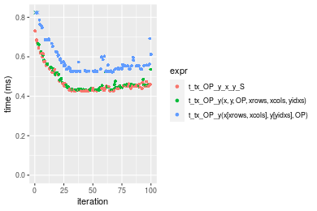

```r
> OP
[1] "*"
> stats <- microbenchmark(t_tx_OP_y_x_y_S = t_tx_OP_y(x_S, y_S, OP = OP, na.rm = FALSE), `t_tx_OP_y(x, y, OP, xrows, xcols, yidxs)` = t_tx_OP_y(x, 
+     y, OP = OP, xrows = xrows, xcols = xcols, yidxs = yidxs, na.rm = FALSE), `t_tx_OP_y(x[xrows, xcols], y[yidxs], OP)` = t_tx_OP_y(x[xrows, 
+     xcols], y[yidxs], OP = OP, na.rm = FALSE), unit = "ms")
```

_Table: Benchmarking of t_tx_OP_y_x_y_S(), t_tx_OP_y(x, y, OP, xrows, xcols, yidxs)() and t_tx_OP_y(x[xrows, xcols], y[yidxs], OP)() on double+1000x100+mul data. The top panel shows times in milliseconds and the bottom panel shows relative times._


|   |expr                                     |      min|        lq|      mean|    median|        uq|      max|
|:--|:----------------------------------------|--------:|---------:|---------:|---------:|---------:|--------:|
|1  |t_tx_OP_y_x_y_S                          | 0.402175| 0.4033580| 0.4513188| 0.4249460| 0.4736370| 0.683383|
|2  |t_tx_OP_y(x, y, OP, xrows, xcols, yidxs) | 0.421028| 0.4235420| 0.4635841| 0.4449125| 0.4656605| 0.679354|
|3  |t_tx_OP_y(x[xrows, xcols], y[yidxs], OP) | 0.499376| 0.5066195| 0.5584307| 0.5267170| 0.5751920| 0.959359|


|   |expr                                     |      min|       lq|     mean|   median|       uq|       max|
|:--|:----------------------------------------|--------:|--------:|--------:|--------:|--------:|---------:|
|1  |t_tx_OP_y_x_y_S                          | 1.000000| 1.000000| 1.000000| 1.000000| 1.000000| 1.0000000|
|2  |t_tx_OP_y(x, y, OP, xrows, xcols, yidxs) | 1.046878| 1.050040| 1.027177| 1.046986| 0.983159| 0.9941043|
|3  |t_tx_OP_y(x[xrows, xcols], y[yidxs], OP) | 1.241688| 1.256005| 1.237331| 1.239492| 1.214415| 1.4038380|

_Figure: Benchmarking of t_tx_OP_y_x_y_S(), t_tx_OP_y(x, y, OP, xrows, xcols, yidxs)() and t_tx_OP_y(x[xrows, xcols], y[yidxs], OP)() on double+1000x100+mul data.  Outliers are displayed as crosses.  Times are in milliseconds._

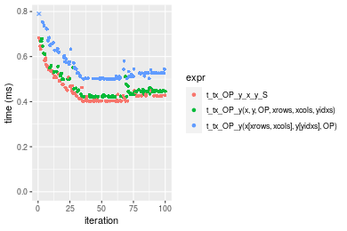

```r
> OP
[1] "/"
> stats <- microbenchmark(t_tx_OP_y_x_y_S = t_tx_OP_y(x_S, y_S, OP = OP, na.rm = FALSE), `t_tx_OP_y(x, y, OP, xrows, xcols, yidxs)` = t_tx_OP_y(x, 
+     y, OP = OP, xrows = xrows, xcols = xcols, yidxs = yidxs, na.rm = FALSE), `t_tx_OP_y(x[xrows, xcols], y[yidxs], OP)` = t_tx_OP_y(x[xrows, 
+     xcols], y[yidxs], OP = OP, na.rm = FALSE), unit = "ms")
```

_Table: Benchmarking of t_tx_OP_y_x_y_S(), t_tx_OP_y(x, y, OP, xrows, xcols, yidxs)() and t_tx_OP_y(x[xrows, xcols], y[yidxs], OP)() on double+1000x100+div data. The top panel shows times in milliseconds and the bottom panel shows relative times._


|   |expr                                     |      min|        lq|      mean|    median|        uq|      max|
|:--|:----------------------------------------|--------:|---------:|---------:|---------:|---------:|--------:|
|1  |t_tx_OP_y_x_y_S                          | 0.402566| 0.4038925| 0.4436665| 0.4166555| 0.4505205| 0.867445|
|2  |t_tx_OP_y(x, y, OP, xrows, xcols, yidxs) | 0.414122| 0.4162915| 0.4613479| 0.4291695| 0.4527780| 0.932231|
|3  |t_tx_OP_y(x[xrows, xcols], y[yidxs], OP) | 0.499078| 0.5057565| 0.5706905| 0.5272940| 0.5823695| 1.103565|


|   |expr                                     |      min|       lq|     mean|   median|       uq|      max|
|:--|:----------------------------------------|--------:|--------:|--------:|--------:|--------:|--------:|
|1  |t_tx_OP_y_x_y_S                          | 1.000000| 1.000000| 1.000000| 1.000000| 1.000000| 1.000000|
|2  |t_tx_OP_y(x, y, OP, xrows, xcols, yidxs) | 1.028706| 1.030699| 1.039853| 1.030034| 1.005011| 1.074686|
|3  |t_tx_OP_y(x[xrows, xcols], y[yidxs], OP) | 1.239742| 1.252206| 1.286305| 1.265540| 1.292659| 1.272202|

_Figure: Benchmarking of t_tx_OP_y_x_y_S(), t_tx_OP_y(x, y, OP, xrows, xcols, yidxs)() and t_tx_OP_y(x[xrows, xcols], y[yidxs], OP)() on double+1000x100+div data.  Outliers are displayed as crosses.  Times are in milliseconds._

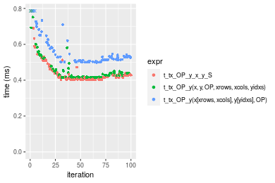


## Appendix

### Session information
```r
R version 4.1.1 Patched (2021-08-10 r80727)
Platform: x86_64-pc-linux-gnu (64-bit)
Running under: Ubuntu 18.04.5 LTS

Matrix products: default
BLAS:   /home/hb/software/R-devel/R-4-1-branch/lib/R/lib/libRblas.so
LAPACK: /home/hb/software/R-devel/R-4-1-branch/lib/R/lib/libRlapack.so

locale:
 [1] LC_CTYPE=en_US.UTF-8       LC_NUMERIC=C              
 [3] LC_TIME=en_US.UTF-8        LC_COLLATE=en_US.UTF-8    
 [5] LC_MONETARY=en_US.UTF-8    LC_MESSAGES=en_US.UTF-8   
 [7] LC_PAPER=en_US.UTF-8       LC_NAME=C                 
 [9] LC_ADDRESS=C               LC_TELEPHONE=C            
[11] LC_MEASUREMENT=en_US.UTF-8 LC_IDENTIFICATION=C       

attached base packages:
[1] stats     graphics  grDevices utils     datasets  methods   base     

other attached packages:
[1] microbenchmark_1.4-7   matrixStats_0.60.1     ggplot2_3.3.5         
[4] knitr_1.33             R.devices_2.17.0       R.utils_2.10.1        
[7] R.oo_1.24.0            R.methodsS3_1.8.1-9001 history_0.0.1-9000    

loaded via a namespace (and not attached):
 [1] Biobase_2.52.0          httr_1.4.2              splines_4.1.1          
 [4] bit64_4.0.5             network_1.17.1          assertthat_0.2.1       
 [7] highr_0.9               stats4_4.1.1            blob_1.2.2             
[10] GenomeInfoDbData_1.2.6  robustbase_0.93-8       pillar_1.6.2           
[13] RSQLite_2.2.8           lattice_0.20-44         glue_1.4.2             
[16] digest_0.6.27           XVector_0.32.0          colorspace_2.0-2       
[19] Matrix_1.3-4            XML_3.99-0.7            pkgconfig_2.0.3        
[22] zlibbioc_1.38.0         genefilter_1.74.0       purrr_0.3.4            
[25] ergm_4.1.2              xtable_1.8-4            scales_1.1.1           
[28] tibble_3.1.4            annotate_1.70.0         KEGGREST_1.32.0        
[31] farver_2.1.0            generics_0.1.0          IRanges_2.26.0         
[34] ellipsis_0.3.2          cachem_1.0.6            withr_2.4.2            
[37] BiocGenerics_0.38.0     mime_0.11               survival_3.2-13        
[40] magrittr_2.0.1          crayon_1.4.1            statnet.common_4.5.0   
[43] memoise_2.0.0           laeken_0.5.1            fansi_0.5.0            
[46] R.cache_0.15.0          MASS_7.3-54             R.rsp_0.44.0           
[49] progressr_0.8.0         tools_4.1.1             lifecycle_1.0.0        
[52] S4Vectors_0.30.0        trust_0.1-8             munsell_0.5.0          
[55] tabby_0.0.1-9001        AnnotationDbi_1.54.1    Biostrings_2.60.2      
[58] compiler_4.1.1          GenomeInfoDb_1.28.1     rlang_0.4.11           
[61] grid_4.1.1              RCurl_1.98-1.4          cwhmisc_6.6            
[64] rappdirs_0.3.3          startup_0.15.0          labeling_0.4.2         
[67] bitops_1.0-7            base64enc_0.1-3         boot_1.3-28            
[70] gtable_0.3.0            DBI_1.1.1               markdown_1.1           
[73] R6_2.5.1                lpSolveAPI_5.5.2.0-17.7 rle_0.9.2              
[76] dplyr_1.0.7             fastmap_1.1.0           bit_4.0.4              
[79] utf8_1.2.2              parallel_4.1.1          Rcpp_1.0.7             
[82] vctrs_0.3.8             png_0.1-7               DEoptimR_1.0-9         
[85] tidyselect_1.1.1        xfun_0.25               coda_0.19-4            
```
Total processing time was 46.66 secs.


### Reproducibility
To reproduce this report, do:
```r
html <- matrixStats:::benchmark('t_tx_OP_y_subset')
```

[RSP]: https://cran.r-project.org/package=R.rsp
[matrixStats]: https://cran.r-project.org/package=matrixStats

[StackOverflow:colMins?]: https://stackoverflow.com/questions/13676878 "Stack Overflow: fastest way to get Min from every column in a matrix?"
[StackOverflow:colSds?]: https://stackoverflow.com/questions/17549762 "Stack Overflow: Is there such 'colsd' in R?"
[StackOverflow:rowProds?]: https://stackoverflow.com/questions/20198801/ "Stack Overflow: Row product of matrix and column sum of matrix"

---------------------------------------
Copyright Dongcan Jiang. Last updated on 2021-08-25 19:29:57 (+0200 UTC). Powered by [RSP].

<script>
 var link = document.createElement('link');
 link.rel = 'icon';
 link.href = "data:image/png;base64,iVBORw0KGgoAAAANSUhEUgAAACAAAAAgCAMAAABEpIrGAAAA21BMVEUAAAAAAP8AAP8AAP8AAP8AAP8AAP8AAP8AAP8AAP8AAP8AAP8AAP8AAP8AAP8AAP8AAP8AAP8AAP8AAP8AAP8AAP8AAP8AAP8AAP8AAP8AAP8AAP8AAP8AAP8AAP8AAP8AAP8AAP8AAP8AAP8AAP8AAP8AAP8AAP8AAP8AAP8BAf4CAv0DA/wdHeIeHuEfH+AgIN8hId4lJdomJtknJ9g+PsE/P8BAQL9yco10dIt1dYp3d4h4eIeVlWqWlmmXl2iYmGeZmWabm2Tn5xjo6Bfp6Rb39wj4+Af//wA2M9hbAAAASXRSTlMAAQIJCgsMJSYnKD4/QGRlZmhpamtsbautrrCxuru8y8zN5ebn6Pn6+///////////////////////////////////////////LsUNcQAAAS9JREFUOI29k21XgkAQhVcFytdSMqMETU26UVqGmpaiFbL//xc1cAhhwVNf6n5i5z67M2dmYOyfJZUqlVLhkKucG7cgmUZTybDz6g0iDeq51PUr37Ds2cy2/C9NeES5puDjxuUk1xnToZsg8pfA3avHQ3lLIi7iWRrkv/OYtkScxBIMgDee0ALoyxHQBJ68JLCjOtQIMIANF7QG9G9fNnHvisCHBVMKgSJgiz7nE+AoBKrAPA3MgepvgR9TSCasrCKH0eB1wBGBFdCO+nAGjMVGPcQb5bd6mQRegN6+1axOs9nGfYcCtfi4NQosdtH7dB+txFIpXQqN1p9B/asRHToyS0jRgpV7nk4nwcq1BJ+x3Gl/v7S9Wmpp/aGquum7w3ZDyrADFYrl8vHBH+ev9AUASW1dmU4h4wAAAABJRU5ErkJggg=="
 document.getElementsByTagName('head')[0].appendChild(link);
</script>


