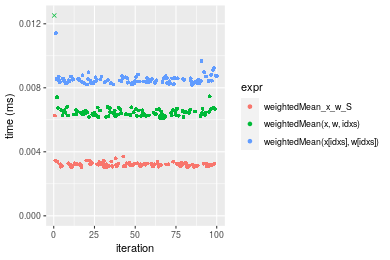
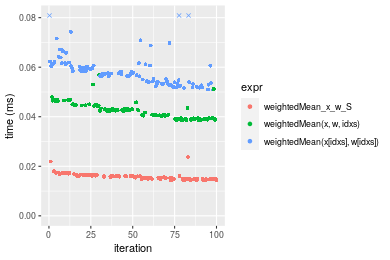
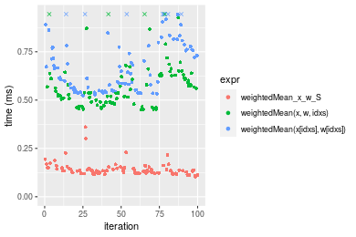
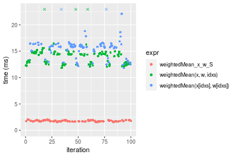
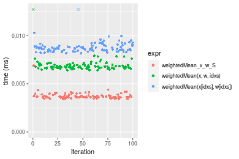
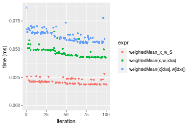
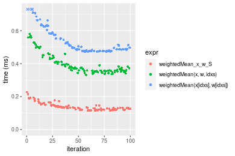
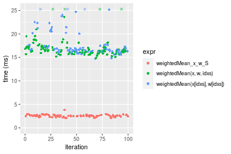

[matrixStats]: Benchmark report

---------------------------------------


# weightedMean() benchmarks on subsetted computation

This report benchmark the performance of weightedMean() on subsetted computation.


## Data type "integer"
### Data
```r
> rvector <- function(n, mode = c("logical", "double", "integer"), range = c(-100, +100), na_prob = 0) {
+     mode <- match.arg(mode)
+     if (mode == "logical") {
+         x <- sample(c(FALSE, TRUE), size = n, replace = TRUE)
+     }     else {
+         x <- runif(n, min = range[1], max = range[2])
+     }
+     storage.mode(x) <- mode
+     if (na_prob > 0) 
+         x[sample(n, size = na_prob * n)] <- NA
+     x
+ }
> rvectors <- function(scale = 10, seed = 1, ...) {
+     set.seed(seed)
+     data <- list()
+     data[[1]] <- rvector(n = scale * 100, ...)
+     data[[2]] <- rvector(n = scale * 1000, ...)
+     data[[3]] <- rvector(n = scale * 10000, ...)
+     data[[4]] <- rvector(n = scale * 1e+05, ...)
+     data[[5]] <- rvector(n = scale * 1e+06, ...)
+     names(data) <- sprintf("n = %d", sapply(data, FUN = length))
+     data
+ }
> data <- rvectors(mode = mode)
> data <- data[1:4]
```

## Results

### n = 1000 vector


```r
> x <- data[["n = 1000"]]
> idxs <- sample.int(length(x), size = length(x) * 0.7)
> x_S <- x[idxs]
> w <- runif(length(x))
> w_S <- w[idxs]
> gc()
           used  (Mb) gc trigger  (Mb)  max used  (Mb)
Ncells  5361703 286.4    8529671 455.6   8529671 455.6
Vcells 12013100  91.7   39910282 304.5 101881463 777.3
> stats <- microbenchmark(weightedMean_x_w_S = weightedMean(x_S, w = w_S, na.rm = FALSE), `weightedMean(x, w, idxs)` = weightedMean(x, 
+     w = w, idxs = idxs, na.rm = FALSE), `weightedMean(x[idxs], w[idxs])` = weightedMean(x[idxs], 
+     w = w[idxs], na.rm = FALSE), unit = "ms")
```

_Table: Benchmarking of weightedMean_x_w_S(), weightedMean(x, w, idxs)() and weightedMean(x[idxs], w[idxs])() on integer+n = 1000 data. The top panel shows times in milliseconds and the bottom panel shows relative times._


|   |expr                           |      min|        lq|      mean|   median|        uq|      max|
|:--|:------------------------------|--------:|---------:|---------:|--------:|---------:|--------:|
|1  |weightedMean_x_w_S             | 0.003030| 0.0031235| 0.0032381| 0.003199| 0.0032590| 0.006265|
|2  |weightedMean(x, w, idxs)       | 0.006109| 0.0062925| 0.0075168| 0.006445| 0.0065945| 0.112131|
|3  |weightedMean(x[idxs], w[idxs]) | 0.008183| 0.0083415| 0.0085273| 0.008460| 0.0085940| 0.011408|


|   |expr                           |      min|       lq|     mean|   median|       uq|      max|
|:--|:------------------------------|--------:|--------:|--------:|--------:|--------:|--------:|
|1  |weightedMean_x_w_S             | 1.000000| 1.000000| 1.000000| 1.000000| 1.000000|  1.00000|
|2  |weightedMean(x, w, idxs)       | 2.016172| 2.014567| 2.321338| 2.014692| 2.023474| 17.89800|
|3  |weightedMean(x[idxs], w[idxs]) | 2.700660| 2.670562| 2.633411| 2.644576| 2.637005|  1.82091|

_Figure: Benchmarking of weightedMean_x_w_S(), weightedMean(x, w, idxs)() and weightedMean(x[idxs], w[idxs])() on integer+n = 1000 data.  Outliers are displayed as crosses.  Times are in milliseconds._



### n = 10000 vector


```r
> x <- data[["n = 10000"]]
> idxs <- sample.int(length(x), size = length(x) * 0.7)
> x_S <- x[idxs]
> w <- runif(length(x))
> w_S <- w[idxs]
> gc()
           used  (Mb) gc trigger  (Mb)  max used  (Mb)
Ncells  5349309 285.7    8529671 455.6   8529671 455.6
Vcells 10865967  83.0   39910282 304.5 101881463 777.3
> stats <- microbenchmark(weightedMean_x_w_S = weightedMean(x_S, w = w_S, na.rm = FALSE), `weightedMean(x, w, idxs)` = weightedMean(x, 
+     w = w, idxs = idxs, na.rm = FALSE), `weightedMean(x[idxs], w[idxs])` = weightedMean(x[idxs], 
+     w = w[idxs], na.rm = FALSE), unit = "ms")
```

_Table: Benchmarking of weightedMean_x_w_S(), weightedMean(x, w, idxs)() and weightedMean(x[idxs], w[idxs])() on integer+n = 10000 data. The top panel shows times in milliseconds and the bottom panel shows relative times._


|   |expr                           |      min|        lq|      mean|    median|       uq|      max|
|:--|:------------------------------|--------:|---------:|---------:|---------:|--------:|--------:|
|1  |weightedMean_x_w_S             | 0.014392| 0.0148975| 0.0158303| 0.0156915| 0.016372| 0.023731|
|2  |weightedMean(x, w, idxs)       | 0.038463| 0.0394330| 0.0424078| 0.0425210| 0.044238| 0.056879|
|3  |weightedMean(x[idxs], w[idxs]) | 0.050966| 0.0539020| 0.0589082| 0.0575475| 0.060693| 0.107980|


|   |expr                           |      min|       lq|     mean|   median|       uq|      max|
|:--|:------------------------------|--------:|--------:|--------:|--------:|--------:|--------:|
|1  |weightedMean_x_w_S             | 1.000000| 1.000000| 1.000000| 1.000000| 1.000000| 1.000000|
|2  |weightedMean(x, w, idxs)       | 2.672526| 2.646954| 2.678908| 2.709811| 2.702052| 2.396823|
|3  |weightedMean(x[idxs], w[idxs]) | 3.541273| 3.618191| 3.721243| 3.667431| 3.707122| 4.550166|

_Figure: Benchmarking of weightedMean_x_w_S(), weightedMean(x, w, idxs)() and weightedMean(x[idxs], w[idxs])() on integer+n = 10000 data.  Outliers are displayed as crosses.  Times are in milliseconds._



### n = 100000 vector


```r
> x <- data[["n = 100000"]]
> idxs <- sample.int(length(x), size = length(x) * 0.7)
> x_S <- x[idxs]
> w <- runif(length(x))
> w_S <- w[idxs]
> gc()
           used  (Mb) gc trigger  (Mb)  max used  (Mb)
Ncells  5349381 285.7    8529671 455.6   8529671 455.6
Vcells 11082527  84.6   39910282 304.5 101881463 777.3
> stats <- microbenchmark(weightedMean_x_w_S = weightedMean(x_S, w = w_S, na.rm = FALSE), `weightedMean(x, w, idxs)` = weightedMean(x, 
+     w = w, idxs = idxs, na.rm = FALSE), `weightedMean(x[idxs], w[idxs])` = weightedMean(x[idxs], 
+     w = w[idxs], na.rm = FALSE), unit = "ms")
```

_Table: Benchmarking of weightedMean_x_w_S(), weightedMean(x, w, idxs)() and weightedMean(x[idxs], w[idxs])() on integer+n = 100000 data. The top panel shows times in milliseconds and the bottom panel shows relative times._


|   |expr                           |      min|       lq|      mean|    median|        uq|      max|
|:--|:------------------------------|--------:|--------:|---------:|---------:|---------:|--------:|
|1  |weightedMean_x_w_S             | 0.103117| 0.120849| 0.1409248| 0.1335115| 0.1461600| 0.360549|
|2  |weightedMean(x, w, idxs)       | 0.450204| 0.488171| 0.5840349| 0.5497170| 0.6286915| 1.223040|
|3  |weightedMean(x[idxs], w[idxs]) | 0.522812| 0.551163| 0.6967387| 0.6436165| 0.7789510| 1.360351|


|   |expr                           |      min|       lq|     mean|   median|       uq|      max|
|:--|:------------------------------|--------:|--------:|--------:|--------:|--------:|--------:|
|1  |weightedMean_x_w_S             | 1.000000| 1.000000| 1.000000| 1.000000| 1.000000| 1.000000|
|2  |weightedMean(x, w, idxs)       | 4.365953| 4.039512| 4.144302| 4.117376| 4.301392| 3.392160|
|3  |weightedMean(x[idxs], w[idxs]) | 5.070085| 4.560758| 4.944045| 4.820682| 5.329440| 3.772999|

_Figure: Benchmarking of weightedMean_x_w_S(), weightedMean(x, w, idxs)() and weightedMean(x[idxs], w[idxs])() on integer+n = 100000 data.  Outliers are displayed as crosses.  Times are in milliseconds._



### n = 1000000 vector


```r
> x <- data[["n = 1000000"]]
> idxs <- sample.int(length(x), size = length(x) * 0.7)
> x_S <- x[idxs]
> w <- runif(length(x))
> w_S <- w[idxs]
> gc()
           used  (Mb) gc trigger  (Mb)  max used  (Mb)
Ncells  5349453 285.7    8529671 455.6   8529671 455.6
Vcells 13242576 101.1   39910282 304.5 101881463 777.3
> stats <- microbenchmark(weightedMean_x_w_S = weightedMean(x_S, w = w_S, na.rm = FALSE), `weightedMean(x, w, idxs)` = weightedMean(x, 
+     w = w, idxs = idxs, na.rm = FALSE), `weightedMean(x[idxs], w[idxs])` = weightedMean(x[idxs], 
+     w = w[idxs], na.rm = FALSE), unit = "ms")
```

_Table: Benchmarking of weightedMean_x_w_S(), weightedMean(x, w, idxs)() and weightedMean(x[idxs], w[idxs])() on integer+n = 1000000 data. The top panel shows times in milliseconds and the bottom panel shows relative times._


|   |expr                           |       min|        lq|      mean|    median|        uq|       max|
|:--|:------------------------------|---------:|---------:|---------:|---------:|---------:|---------:|
|1  |weightedMean_x_w_S             |  1.543149|  1.672434|  1.767486|  1.738379|  1.876264|  2.088636|
|2  |weightedMean(x, w, idxs)       | 11.815077| 12.703033| 14.230083| 14.345170| 14.757426| 29.054454|
|3  |weightedMean(x[idxs], w[idxs]) | 11.839894| 14.813293| 15.541099| 15.826799| 16.222686| 28.754855|


|   |expr                           |      min|       lq|     mean|   median|       uq|      max|
|:--|:------------------------------|--------:|--------:|--------:|--------:|--------:|--------:|
|1  |weightedMean_x_w_S             | 1.000000| 1.000000| 1.000000| 1.000000| 1.000000|  1.00000|
|2  |weightedMean(x, w, idxs)       | 7.656472| 7.595536| 8.051030| 8.252041| 7.865325| 13.91073|
|3  |weightedMean(x[idxs], w[idxs]) | 7.672554| 8.857326| 8.792771| 9.104346| 8.646271| 13.76729|

_Figure: Benchmarking of weightedMean_x_w_S(), weightedMean(x, w, idxs)() and weightedMean(x[idxs], w[idxs])() on integer+n = 1000000 data.  Outliers are displayed as crosses.  Times are in milliseconds._




## Data type "double"
### Data
```r
> rvector <- function(n, mode = c("logical", "double", "integer"), range = c(-100, +100), na_prob = 0) {
+     mode <- match.arg(mode)
+     if (mode == "logical") {
+         x <- sample(c(FALSE, TRUE), size = n, replace = TRUE)
+     }     else {
+         x <- runif(n, min = range[1], max = range[2])
+     }
+     storage.mode(x) <- mode
+     if (na_prob > 0) 
+         x[sample(n, size = na_prob * n)] <- NA
+     x
+ }
> rvectors <- function(scale = 10, seed = 1, ...) {
+     set.seed(seed)
+     data <- list()
+     data[[1]] <- rvector(n = scale * 100, ...)
+     data[[2]] <- rvector(n = scale * 1000, ...)
+     data[[3]] <- rvector(n = scale * 10000, ...)
+     data[[4]] <- rvector(n = scale * 1e+05, ...)
+     data[[5]] <- rvector(n = scale * 1e+06, ...)
+     names(data) <- sprintf("n = %d", sapply(data, FUN = length))
+     data
+ }
> data <- rvectors(mode = mode)
> data <- data[1:4]
```

## Results

### n = 1000 vector


```r
> x <- data[["n = 1000"]]
> idxs <- sample.int(length(x), size = length(x) * 0.7)
> x_S <- x[idxs]
> w <- runif(length(x))
> w_S <- w[idxs]
> gc()
           used  (Mb) gc trigger  (Mb)  max used  (Mb)
Ncells  5349528 285.7    8529671 455.6   8529671 455.6
Vcells 11401451  87.0   39910282 304.5 101881463 777.3
> stats <- microbenchmark(weightedMean_x_w_S = weightedMean(x_S, w = w_S, na.rm = FALSE), `weightedMean(x, w, idxs)` = weightedMean(x, 
+     w = w, idxs = idxs, na.rm = FALSE), `weightedMean(x[idxs], w[idxs])` = weightedMean(x[idxs], 
+     w = w[idxs], na.rm = FALSE), unit = "ms")
```

_Table: Benchmarking of weightedMean_x_w_S(), weightedMean(x, w, idxs)() and weightedMean(x[idxs], w[idxs])() on double+n = 1000 data. The top panel shows times in milliseconds and the bottom panel shows relative times._


|   |expr                           |      min|        lq|      mean|    median|        uq|      max|
|:--|:------------------------------|--------:|---------:|---------:|---------:|---------:|--------:|
|1  |weightedMean_x_w_S             | 0.003421| 0.0035815| 0.0037345| 0.0036360| 0.0037865| 0.006879|
|2  |weightedMean(x, w, idxs)       | 0.006397| 0.0066325| 0.0070208| 0.0067615| 0.0069680| 0.024667|
|3  |weightedMean(x[idxs], w[idxs]) | 0.008167| 0.0084590| 0.0087905| 0.0086590| 0.0089525| 0.013348|


|   |expr                           |      min|       lq|     mean|   median|       uq|      max|
|:--|:------------------------------|--------:|--------:|--------:|--------:|--------:|--------:|
|1  |weightedMean_x_w_S             | 1.000000| 1.000000| 1.000000| 1.000000| 1.000000| 1.000000|
|2  |weightedMean(x, w, idxs)       | 1.869921| 1.851878| 1.879982| 1.859598| 1.840222| 3.585841|
|3  |weightedMean(x[idxs], w[idxs]) | 2.387314| 2.361860| 2.353845| 2.381463| 2.364321| 1.940398|

_Figure: Benchmarking of weightedMean_x_w_S(), weightedMean(x, w, idxs)() and weightedMean(x[idxs], w[idxs])() on double+n = 1000 data.  Outliers are displayed as crosses.  Times are in milliseconds._



### n = 10000 vector


```r
> x <- data[["n = 10000"]]
> idxs <- sample.int(length(x), size = length(x) * 0.7)
> x_S <- x[idxs]
> w <- runif(length(x))
> w_S <- w[idxs]
> gc()
           used  (Mb) gc trigger  (Mb)  max used  (Mb)
Ncells  5349597 285.7    8529671 455.6   8529671 455.6
Vcells 11426563  87.2   39910282 304.5 101881463 777.3
> stats <- microbenchmark(weightedMean_x_w_S = weightedMean(x_S, w = w_S, na.rm = FALSE), `weightedMean(x, w, idxs)` = weightedMean(x, 
+     w = w, idxs = idxs, na.rm = FALSE), `weightedMean(x[idxs], w[idxs])` = weightedMean(x[idxs], 
+     w = w[idxs], na.rm = FALSE), unit = "ms")
```

_Table: Benchmarking of weightedMean_x_w_S(), weightedMean(x, w, idxs)() and weightedMean(x[idxs], w[idxs])() on double+n = 10000 data. The top panel shows times in milliseconds and the bottom panel shows relative times._


|   |expr                           |      min|        lq|      mean|    median|        uq|      max|
|:--|:------------------------------|--------:|---------:|---------:|---------:|---------:|--------:|
|1  |weightedMean_x_w_S             | 0.018424| 0.0189400| 0.0208679| 0.0205745| 0.0215095| 0.028179|
|2  |weightedMean(x, w, idxs)       | 0.042496| 0.0430270| 0.0466539| 0.0459825| 0.0491950| 0.065586|
|3  |weightedMean(x[idxs], w[idxs]) | 0.055149| 0.0574275| 0.0623475| 0.0613545| 0.0647675| 0.117008|


|   |expr                           |      min|       lq|     mean|   median|       uq|      max|
|:--|:------------------------------|--------:|--------:|--------:|--------:|--------:|--------:|
|1  |weightedMean_x_w_S             | 1.000000| 1.000000| 1.000000| 1.000000| 1.000000| 1.000000|
|2  |weightedMean(x, w, idxs)       | 2.306557| 2.271753| 2.235682| 2.234927| 2.287129| 2.327478|
|3  |weightedMean(x[idxs], w[idxs]) | 2.993324| 3.032075| 2.987730| 2.982065| 3.011111| 4.152312|

_Figure: Benchmarking of weightedMean_x_w_S(), weightedMean(x, w, idxs)() and weightedMean(x[idxs], w[idxs])() on double+n = 10000 data.  Outliers are displayed as crosses.  Times are in milliseconds._



### n = 100000 vector


```r
> x <- data[["n = 100000"]]
> idxs <- sample.int(length(x), size = length(x) * 0.7)
> x_S <- x[idxs]
> w <- runif(length(x))
> w_S <- w[idxs]
> gc()
           used  (Mb) gc trigger  (Mb)  max used  (Mb)
Ncells  5349669 285.8    8529671 455.6   8529671 455.6
Vcells 11674111  89.1   39910282 304.5 101881463 777.3
> stats <- microbenchmark(weightedMean_x_w_S = weightedMean(x_S, w = w_S, na.rm = FALSE), `weightedMean(x, w, idxs)` = weightedMean(x, 
+     w = w, idxs = idxs, na.rm = FALSE), `weightedMean(x[idxs], w[idxs])` = weightedMean(x[idxs], 
+     w = w[idxs], na.rm = FALSE), unit = "ms")
```

_Table: Benchmarking of weightedMean_x_w_S(), weightedMean(x, w, idxs)() and weightedMean(x[idxs], w[idxs])() on double+n = 100000 data. The top panel shows times in milliseconds and the bottom panel shows relative times._


|   |expr                           |      min|        lq|      mean|   median|        uq|      max|
|:--|:------------------------------|--------:|---------:|---------:|--------:|---------:|--------:|
|1  |weightedMean_x_w_S             | 0.115510| 0.1206845| 0.1385982| 0.132096| 0.1470275| 0.227056|
|2  |weightedMean(x, w, idxs)       | 0.330913| 0.3529380| 0.3964054| 0.371142| 0.4198300| 0.579781|
|3  |weightedMean(x[idxs], w[idxs]) | 0.471444| 0.4774910| 0.5490967| 0.496952| 0.6147105| 1.133490|


|   |expr                           |      min|       lq|     mean|   median|       uq|      max|
|:--|:------------------------------|--------:|--------:|--------:|--------:|--------:|--------:|
|1  |weightedMean_x_w_S             | 1.000000| 1.000000| 1.000000| 1.000000| 1.000000| 1.000000|
|2  |weightedMean(x, w, idxs)       | 2.864800| 2.924468| 2.860104| 2.809638| 2.855452| 2.553471|
|3  |weightedMean(x[idxs], w[idxs]) | 4.081413| 3.956523| 3.961787| 3.762052| 4.180922| 4.992116|

_Figure: Benchmarking of weightedMean_x_w_S(), weightedMean(x, w, idxs)() and weightedMean(x[idxs], w[idxs])() on double+n = 100000 data.  Outliers are displayed as crosses.  Times are in milliseconds._



### n = 1000000 vector


```r
> x <- data[["n = 1000000"]]
> idxs <- sample.int(length(x), size = length(x) * 0.7)
> x_S <- x[idxs]
> w <- runif(length(x))
> w_S <- w[idxs]
> gc()
           used  (Mb) gc trigger  (Mb)  max used  (Mb)
Ncells  5349741 285.8    8529671 455.6   8529671 455.6
Vcells 14149573 108.0   39910282 304.5 101881463 777.3
> stats <- microbenchmark(weightedMean_x_w_S = weightedMean(x_S, w = w_S, na.rm = FALSE), `weightedMean(x, w, idxs)` = weightedMean(x, 
+     w = w, idxs = idxs, na.rm = FALSE), `weightedMean(x[idxs], w[idxs])` = weightedMean(x[idxs], 
+     w = w[idxs], na.rm = FALSE), unit = "ms")
```

_Table: Benchmarking of weightedMean_x_w_S(), weightedMean(x, w, idxs)() and weightedMean(x[idxs], w[idxs])() on double+n = 1000000 data. The top panel shows times in milliseconds and the bottom panel shows relative times._


|   |expr                           |       min|        lq|      mean|    median|        uq|       max|
|:--|:------------------------------|---------:|---------:|---------:|---------:|---------:|---------:|
|1  |weightedMean_x_w_S             |  2.071744|  2.387315|  2.542025|  2.550411|  2.697675|  3.819459|
|2  |weightedMean(x, w, idxs)       | 14.878945| 16.011812| 17.164947| 16.538214| 17.235565| 30.703660|
|3  |weightedMean(x[idxs], w[idxs]) | 14.769285| 16.204172| 17.735854| 16.547055| 17.570960| 29.165115|


|   |expr                           |      min|       lq|     mean|   median|       uq|      max|
|:--|:------------------------------|--------:|--------:|--------:|--------:|--------:|--------:|
|1  |weightedMean_x_w_S             | 1.000000| 1.000000| 1.000000| 1.000000| 1.000000| 1.000000|
|2  |weightedMean(x, w, idxs)       | 7.181845| 6.707039| 6.752469| 6.484529| 6.389044| 8.038746|
|3  |weightedMean(x[idxs], w[idxs]) | 7.128914| 6.787615| 6.977057| 6.487996| 6.513372| 7.635928|

_Figure: Benchmarking of weightedMean_x_w_S(), weightedMean(x, w, idxs)() and weightedMean(x[idxs], w[idxs])() on double+n = 1000000 data.  Outliers are displayed as crosses.  Times are in milliseconds._




## Appendix

### Session information
```r
R version 4.1.1 Patched (2021-08-10 r80727)
Platform: x86_64-pc-linux-gnu (64-bit)
Running under: Ubuntu 18.04.5 LTS

Matrix products: default
BLAS:   /home/hb/software/R-devel/R-4-1-branch/lib/R/lib/libRblas.so
LAPACK: /home/hb/software/R-devel/R-4-1-branch/lib/R/lib/libRlapack.so

locale:
 [1] LC_CTYPE=en_US.UTF-8       LC_NUMERIC=C              
 [3] LC_TIME=en_US.UTF-8        LC_COLLATE=en_US.UTF-8    
 [5] LC_MONETARY=en_US.UTF-8    LC_MESSAGES=en_US.UTF-8   
 [7] LC_PAPER=en_US.UTF-8       LC_NAME=C                 
 [9] LC_ADDRESS=C               LC_TELEPHONE=C            
[11] LC_MEASUREMENT=en_US.UTF-8 LC_IDENTIFICATION=C       

attached base packages:
[1] stats     graphics  grDevices utils     datasets  methods   base     

other attached packages:
[1] microbenchmark_1.4-7   matrixStats_0.60.1     ggplot2_3.3.5         
[4] knitr_1.33             R.devices_2.17.0       R.utils_2.10.1        
[7] R.oo_1.24.0            R.methodsS3_1.8.1-9001 history_0.0.1-9000    

loaded via a namespace (and not attached):
 [1] Biobase_2.52.0          httr_1.4.2              splines_4.1.1          
 [4] bit64_4.0.5             network_1.17.1          assertthat_0.2.1       
 [7] highr_0.9               stats4_4.1.1            blob_1.2.2             
[10] GenomeInfoDbData_1.2.6  robustbase_0.93-8       pillar_1.6.2           
[13] RSQLite_2.2.8           lattice_0.20-44         glue_1.4.2             
[16] digest_0.6.27           XVector_0.32.0          colorspace_2.0-2       
[19] Matrix_1.3-4            XML_3.99-0.7            pkgconfig_2.0.3        
[22] zlibbioc_1.38.0         genefilter_1.74.0       purrr_0.3.4            
[25] ergm_4.1.2              xtable_1.8-4            scales_1.1.1           
[28] tibble_3.1.4            annotate_1.70.0         KEGGREST_1.32.0        
[31] farver_2.1.0            generics_0.1.0          IRanges_2.26.0         
[34] ellipsis_0.3.2          cachem_1.0.6            withr_2.4.2            
[37] BiocGenerics_0.38.0     mime_0.11               survival_3.2-13        
[40] magrittr_2.0.1          crayon_1.4.1            statnet.common_4.5.0   
[43] memoise_2.0.0           laeken_0.5.1            fansi_0.5.0            
[46] R.cache_0.15.0          MASS_7.3-54             R.rsp_0.44.0           
[49] progressr_0.8.0         tools_4.1.1             lifecycle_1.0.0        
[52] S4Vectors_0.30.0        trust_0.1-8             munsell_0.5.0          
[55] tabby_0.0.1-9001        AnnotationDbi_1.54.1    Biostrings_2.60.2      
[58] compiler_4.1.1          GenomeInfoDb_1.28.1     rlang_0.4.11           
[61] grid_4.1.1              RCurl_1.98-1.4          cwhmisc_6.6            
[64] rappdirs_0.3.3          startup_0.15.0          labeling_0.4.2         
[67] bitops_1.0-7            base64enc_0.1-3         boot_1.3-28            
[70] gtable_0.3.0            DBI_1.1.1               markdown_1.1           
[73] R6_2.5.1                lpSolveAPI_5.5.2.0-17.7 rle_0.9.2              
[76] dplyr_1.0.7             fastmap_1.1.0           bit_4.0.4              
[79] utf8_1.2.2              parallel_4.1.1          Rcpp_1.0.7             
[82] vctrs_0.3.8             png_0.1-7               DEoptimR_1.0-9         
[85] tidyselect_1.1.1        xfun_0.25               coda_0.19-4            
```
Total processing time was 15.58 secs.


### Reproducibility
To reproduce this report, do:
```r
html <- matrixStats:::benchmark('weightedMean_subset')
```

[RSP]: https://cran.r-project.org/package=R.rsp
[matrixStats]: https://cran.r-project.org/package=matrixStats

[StackOverflow:colMins?]: https://stackoverflow.com/questions/13676878 "Stack Overflow: fastest way to get Min from every column in a matrix?"
[StackOverflow:colSds?]: https://stackoverflow.com/questions/17549762 "Stack Overflow: Is there such 'colsd' in R?"
[StackOverflow:rowProds?]: https://stackoverflow.com/questions/20198801/ "Stack Overflow: Row product of matrix and column sum of matrix"

---------------------------------------
Copyright Dongcan Jiang. Last updated on 2021-08-25 19:31:55 (+0200 UTC). Powered by [RSP].

<script>
 var link = document.createElement('link');
 link.rel = 'icon';
 link.href = "data:image/png;base64,iVBORw0KGgoAAAANSUhEUgAAACAAAAAgCAMAAABEpIrGAAAA21BMVEUAAAAAAP8AAP8AAP8AAP8AAP8AAP8AAP8AAP8AAP8AAP8AAP8AAP8AAP8AAP8AAP8AAP8AAP8AAP8AAP8AAP8AAP8AAP8AAP8AAP8AAP8AAP8AAP8AAP8AAP8AAP8AAP8AAP8AAP8AAP8AAP8AAP8AAP8AAP8AAP8AAP8AAP8BAf4CAv0DA/wdHeIeHuEfH+AgIN8hId4lJdomJtknJ9g+PsE/P8BAQL9yco10dIt1dYp3d4h4eIeVlWqWlmmXl2iYmGeZmWabm2Tn5xjo6Bfp6Rb39wj4+Af//wA2M9hbAAAASXRSTlMAAQIJCgsMJSYnKD4/QGRlZmhpamtsbautrrCxuru8y8zN5ebn6Pn6+///////////////////////////////////////////LsUNcQAAAS9JREFUOI29k21XgkAQhVcFytdSMqMETU26UVqGmpaiFbL//xc1cAhhwVNf6n5i5z67M2dmYOyfJZUqlVLhkKucG7cgmUZTybDz6g0iDeq51PUr37Ds2cy2/C9NeES5puDjxuUk1xnToZsg8pfA3avHQ3lLIi7iWRrkv/OYtkScxBIMgDee0ALoyxHQBJ68JLCjOtQIMIANF7QG9G9fNnHvisCHBVMKgSJgiz7nE+AoBKrAPA3MgepvgR9TSCasrCKH0eB1wBGBFdCO+nAGjMVGPcQb5bd6mQRegN6+1axOs9nGfYcCtfi4NQosdtH7dB+txFIpXQqN1p9B/asRHToyS0jRgpV7nk4nwcq1BJ+x3Gl/v7S9Wmpp/aGquum7w3ZDyrADFYrl8vHBH+ev9AUASW1dmU4h4wAAAABJRU5ErkJggg=="
 document.getElementsByTagName('head')[0].appendChild(link);
</script>


