[matrixStats]: Benchmark report

---------------------------------------


# x_OP_y() benchmarks on subsetted computation

This report benchmark the performance of x_OP_y() on subsetted computation.


## Data type "integer"
### Data
```r
> rmatrix <- function(nrow, ncol, mode = c("logical", "double", "integer", "index"), range = c(-100, 
+     +100), na_prob = 0) {
+     mode <- match.arg(mode)
+     n <- nrow * ncol
+     if (mode == "logical") {
+         x <- sample(c(FALSE, TRUE), size = n, replace = TRUE)
+     }     else if (mode == "index") {
+         x <- seq_len(n)
+         mode <- "integer"
+     }     else {
+         x <- runif(n, min = range[1], max = range[2])
+     }
+     storage.mode(x) <- mode
+     if (na_prob > 0) 
+         x[sample(n, size = na_prob * n)] <- NA
+     dim(x) <- c(nrow, ncol)
+     x
+ }
> rmatrices <- function(scale = 10, seed = 1, ...) {
+     set.seed(seed)
+     data <- list()
+     data[[1]] <- rmatrix(nrow = scale * 1, ncol = scale * 1, ...)
+     data[[2]] <- rmatrix(nrow = scale * 10, ncol = scale * 10, ...)
+     data[[3]] <- rmatrix(nrow = scale * 100, ncol = scale * 1, ...)
+     data[[4]] <- t(data[[3]])
+     data[[5]] <- rmatrix(nrow = scale * 10, ncol = scale * 100, ...)
+     data[[6]] <- t(data[[5]])
+     names(data) <- sapply(data, FUN = function(x) paste(dim(x), collapse = "x"))
+     data
+ }
> data <- rmatrices(mode = mode)
```

### Results

### 10x10 vector


```r
> x <- data[["10x10"]]
> y <- x[, 1L]
> xrows <- sample.int(nrow(x), size = nrow(x) * 0.7)
> xcols <- sample.int(ncol(x), size = ncol(x) * 0.7)
> x_S <- x[xrows, xcols]
> yidxs <- xrows
> y_S <- y[yidxs]
```

```r
> OP
[1] "+"
> stats <- microbenchmark(x_OP_y_x_y_S = x_OP_y(x_S, y_S, OP = OP, na.rm = FALSE), `x_OP_y(x, y, OP, xrows, xcols, yidxs)` = x_OP_y(x, 
+     y, OP = OP, xrows = xrows, xcols = xcols, yidxs = yidxs, na.rm = FALSE), `x_OP_y(x[xrows, xcols], y[yidxs], OP)` = x_OP_y(x[xrows, 
+     xcols], y[yidxs], OP = OP, na.rm = FALSE), unit = "ms")
```

_Table: Benchmarking of x_OP_y_x_y_S(), x_OP_y(x, y, OP, xrows, xcols, yidxs)() and x_OP_y(x[xrows, xcols], y[yidxs], OP)() on integer+10x10+add data. The top panel shows times in milliseconds and the bottom panel shows relative times._


|   |expr                                  |      min|        lq|      mean|   median|        uq|      max|
|:--|:-------------------------------------|--------:|---------:|---------:|--------:|---------:|--------:|
|1  |x_OP_y_x_y_S                          | 0.004301| 0.0045075| 0.0061420| 0.004634| 0.0048170| 0.149514|
|2  |x_OP_y(x, y, OP, xrows, xcols, yidxs) | 0.004970| 0.0052440| 0.0054553| 0.005406| 0.0055405| 0.007984|
|3  |x_OP_y(x[xrows, xcols], y[yidxs], OP) | 0.005513| 0.0059765| 0.0061901| 0.006101| 0.0062800| 0.011605|


|   |expr                                  |      min|       lq|      mean|   median|       uq|       max|
|:--|:-------------------------------------|--------:|--------:|---------:|--------:|--------:|---------:|
|1  |x_OP_y_x_y_S                          | 1.000000| 1.000000| 1.0000000| 1.000000| 1.000000| 1.0000000|
|2  |x_OP_y(x, y, OP, xrows, xcols, yidxs) | 1.155545| 1.163394| 0.8881962| 1.166595| 1.150197| 0.0533997|
|3  |x_OP_y(x[xrows, xcols], y[yidxs], OP) | 1.281795| 1.325901| 1.0078264| 1.316573| 1.303716| 0.0776181|

_Figure: Benchmarking of x_OP_y_x_y_S(), x_OP_y(x, y, OP, xrows, xcols, yidxs)() and x_OP_y(x[xrows, xcols], y[yidxs], OP)() on integer+10x10+add data.  Outliers are displayed as crosses.  Times are in milliseconds._

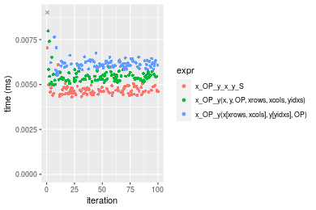

```r
> OP
[1] "-"
> stats <- microbenchmark(x_OP_y_x_y_S = x_OP_y(x_S, y_S, OP = OP, na.rm = FALSE), `x_OP_y(x, y, OP, xrows, xcols, yidxs)` = x_OP_y(x, 
+     y, OP = OP, xrows = xrows, xcols = xcols, yidxs = yidxs, na.rm = FALSE), `x_OP_y(x[xrows, xcols], y[yidxs], OP)` = x_OP_y(x[xrows, 
+     xcols], y[yidxs], OP = OP, na.rm = FALSE), unit = "ms")
```

_Table: Benchmarking of x_OP_y_x_y_S(), x_OP_y(x, y, OP, xrows, xcols, yidxs)() and x_OP_y(x[xrows, xcols], y[yidxs], OP)() on integer+10x10+sub data. The top panel shows times in milliseconds and the bottom panel shows relative times._


|   |expr                                  |      min|       lq|      mean|    median|        uq|      max|
|:--|:-------------------------------------|--------:|--------:|---------:|---------:|---------:|--------:|
|1  |x_OP_y_x_y_S                          | 0.004234| 0.004568| 0.0047562| 0.0046955| 0.0048160| 0.007858|
|2  |x_OP_y(x, y, OP, xrows, xcols, yidxs) | 0.005095| 0.005311| 0.0058629| 0.0054710| 0.0056495| 0.030825|
|3  |x_OP_y(x[xrows, xcols], y[yidxs], OP) | 0.005517| 0.006083| 0.0062789| 0.0062375| 0.0063515| 0.009541|


|   |expr                                  |      min|       lq|     mean|   median|       uq|      max|
|:--|:-------------------------------------|--------:|--------:|--------:|--------:|--------:|--------:|
|1  |x_OP_y_x_y_S                          | 1.000000| 1.000000| 1.000000| 1.000000| 1.000000| 1.000000|
|2  |x_OP_y(x, y, OP, xrows, xcols, yidxs) | 1.203354| 1.162653| 1.232691| 1.165158| 1.173069| 3.922754|
|3  |x_OP_y(x[xrows, xcols], y[yidxs], OP) | 1.303023| 1.331655| 1.320153| 1.328399| 1.318833| 1.214177|

_Figure: Benchmarking of x_OP_y_x_y_S(), x_OP_y(x, y, OP, xrows, xcols, yidxs)() and x_OP_y(x[xrows, xcols], y[yidxs], OP)() on integer+10x10+sub data.  Outliers are displayed as crosses.  Times are in milliseconds._


```r
> OP
[1] "*"
> stats <- microbenchmark(x_OP_y_x_y_S = x_OP_y(x_S, y_S, OP = OP, na.rm = FALSE), `x_OP_y(x, y, OP, xrows, xcols, yidxs)` = x_OP_y(x, 
+     y, OP = OP, xrows = xrows, xcols = xcols, yidxs = yidxs, na.rm = FALSE), `x_OP_y(x[xrows, xcols], y[yidxs], OP)` = x_OP_y(x[xrows, 
+     xcols], y[yidxs], OP = OP, na.rm = FALSE), unit = "ms")
```

_Table: Benchmarking of x_OP_y_x_y_S(), x_OP_y(x, y, OP, xrows, xcols, yidxs)() and x_OP_y(x[xrows, xcols], y[yidxs], OP)() on integer+10x10+mul data. The top panel shows times in milliseconds and the bottom panel shows relative times._


|   |expr                                  |      min|        lq|      mean|    median|        uq|      max|
|:--|:-------------------------------------|--------:|---------:|---------:|---------:|---------:|--------:|
|1  |x_OP_y_x_y_S                          | 0.004280| 0.0044885| 0.0046744| 0.0046455| 0.0048045| 0.006006|
|2  |x_OP_y(x, y, OP, xrows, xcols, yidxs) | 0.004970| 0.0051955| 0.0054345| 0.0053545| 0.0055560| 0.009982|
|3  |x_OP_y(x[xrows, xcols], y[yidxs], OP) | 0.005588| 0.0060000| 0.0064970| 0.0061450| 0.0063345| 0.033749|


|   |expr                                  |      min|       lq|     mean|   median|       uq|      max|
|:--|:-------------------------------------|--------:|--------:|--------:|--------:|--------:|--------:|
|1  |x_OP_y_x_y_S                          | 1.000000| 1.000000| 1.000000| 1.000000| 1.000000| 1.000000|
|2  |x_OP_y(x, y, OP, xrows, xcols, yidxs) | 1.161215| 1.157514| 1.162612| 1.152621| 1.156416| 1.662005|
|3  |x_OP_y(x[xrows, xcols], y[yidxs], OP) | 1.305608| 1.336750| 1.389898| 1.322785| 1.318452| 5.619214|

_Figure: Benchmarking of x_OP_y_x_y_S(), x_OP_y(x, y, OP, xrows, xcols, yidxs)() and x_OP_y(x[xrows, xcols], y[yidxs], OP)() on integer+10x10+mul data.  Outliers are displayed as crosses.  Times are in milliseconds._

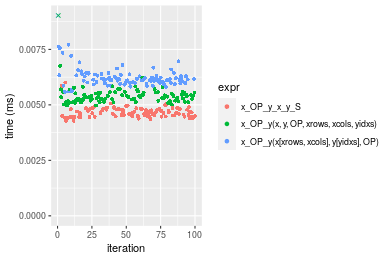

```r
> OP
[1] "/"
> stats <- microbenchmark(x_OP_y_x_y_S = x_OP_y(x_S, y_S, OP = OP, na.rm = FALSE), `x_OP_y(x, y, OP, xrows, xcols, yidxs)` = x_OP_y(x, 
+     y, OP = OP, xrows = xrows, xcols = xcols, yidxs = yidxs, na.rm = FALSE), `x_OP_y(x[xrows, xcols], y[yidxs], OP)` = x_OP_y(x[xrows, 
+     xcols], y[yidxs], OP = OP, na.rm = FALSE), unit = "ms")
```

_Table: Benchmarking of x_OP_y_x_y_S(), x_OP_y(x, y, OP, xrows, xcols, yidxs)() and x_OP_y(x[xrows, xcols], y[yidxs], OP)() on integer+10x10+div data. The top panel shows times in milliseconds and the bottom panel shows relative times._


|   |expr                                  |      min|       lq|      mean|    median|        uq|      max|
|:--|:-------------------------------------|--------:|--------:|---------:|---------:|---------:|--------:|
|1  |x_OP_y_x_y_S                          | 0.004385| 0.004566| 0.0051200| 0.0046845| 0.0048125| 0.042345|
|2  |x_OP_y(x, y, OP, xrows, xcols, yidxs) | 0.004909| 0.005276| 0.0054938| 0.0053785| 0.0055510| 0.012264|
|3  |x_OP_y(x[xrows, xcols], y[yidxs], OP) | 0.005723| 0.006022| 0.0063739| 0.0061630| 0.0064140| 0.015456|


|   |expr                                  |      min|       lq|     mean|   median|       uq|       max|
|:--|:-------------------------------------|--------:|--------:|--------:|--------:|--------:|---------:|
|1  |x_OP_y_x_y_S                          | 1.000000| 1.000000| 1.000000| 1.000000| 1.000000| 1.0000000|
|2  |x_OP_y(x, y, OP, xrows, xcols, yidxs) | 1.119498| 1.155497| 1.073004| 1.148148| 1.153455| 0.2896210|
|3  |x_OP_y(x[xrows, xcols], y[yidxs], OP) | 1.305131| 1.318879| 1.244901| 1.315615| 1.332779| 0.3650018|

_Figure: Benchmarking of x_OP_y_x_y_S(), x_OP_y(x, y, OP, xrows, xcols, yidxs)() and x_OP_y(x[xrows, xcols], y[yidxs], OP)() on integer+10x10+div data.  Outliers are displayed as crosses.  Times are in milliseconds._

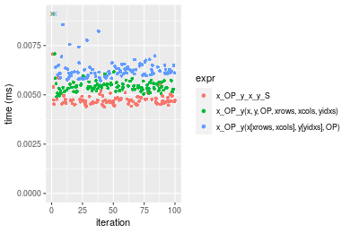


### 100x100 vector


```r
> x <- data[["100x100"]]
> y <- x[, 1L]
> xrows <- sample.int(nrow(x), size = nrow(x) * 0.7)
> xcols <- sample.int(ncol(x), size = ncol(x) * 0.7)
> x_S <- x[xrows, xcols]
> yidxs <- xrows
> y_S <- y[yidxs]
```

```r
> OP
[1] "+"
> stats <- microbenchmark(x_OP_y_x_y_S = x_OP_y(x_S, y_S, OP = OP, na.rm = FALSE), `x_OP_y(x, y, OP, xrows, xcols, yidxs)` = x_OP_y(x, 
+     y, OP = OP, xrows = xrows, xcols = xcols, yidxs = yidxs, na.rm = FALSE), `x_OP_y(x[xrows, xcols], y[yidxs], OP)` = x_OP_y(x[xrows, 
+     xcols], y[yidxs], OP = OP, na.rm = FALSE), unit = "ms")
```

_Table: Benchmarking of x_OP_y_x_y_S(), x_OP_y(x, y, OP, xrows, xcols, yidxs)() and x_OP_y(x[xrows, xcols], y[yidxs], OP)() on integer+100x100+add data. The top panel shows times in milliseconds and the bottom panel shows relative times._


|   |expr                                  |      min|        lq|      mean|   median|        uq|      max|
|:--|:-------------------------------------|--------:|---------:|---------:|--------:|---------:|--------:|
|1  |x_OP_y_x_y_S                          | 0.030722| 0.0318580| 0.0336242| 0.032477| 0.0350165| 0.066095|
|2  |x_OP_y(x, y, OP, xrows, xcols, yidxs) | 0.034107| 0.0350375| 0.0375856| 0.036580| 0.0388505| 0.052725|
|3  |x_OP_y(x[xrows, xcols], y[yidxs], OP) | 0.041637| 0.0434030| 0.0455389| 0.045449| 0.0473550| 0.060698|


|   |expr                                  |      min|       lq|     mean|   median|       uq|       max|
|:--|:-------------------------------------|--------:|--------:|--------:|--------:|--------:|---------:|
|1  |x_OP_y_x_y_S                          | 1.000000| 1.000000| 1.000000| 1.000000| 1.000000| 1.0000000|
|2  |x_OP_y(x, y, OP, xrows, xcols, yidxs) | 1.110182| 1.099802| 1.117813| 1.126336| 1.109491| 0.7977154|
|3  |x_OP_y(x[xrows, xcols], y[yidxs], OP) | 1.355283| 1.362389| 1.354350| 1.399421| 1.352362| 0.9183448|

_Figure: Benchmarking of x_OP_y_x_y_S(), x_OP_y(x, y, OP, xrows, xcols, yidxs)() and x_OP_y(x[xrows, xcols], y[yidxs], OP)() on integer+100x100+add data.  Outliers are displayed as crosses.  Times are in milliseconds._

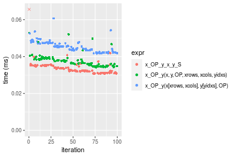

```r
> OP
[1] "-"
> stats <- microbenchmark(x_OP_y_x_y_S = x_OP_y(x_S, y_S, OP = OP, na.rm = FALSE), `x_OP_y(x, y, OP, xrows, xcols, yidxs)` = x_OP_y(x, 
+     y, OP = OP, xrows = xrows, xcols = xcols, yidxs = yidxs, na.rm = FALSE), `x_OP_y(x[xrows, xcols], y[yidxs], OP)` = x_OP_y(x[xrows, 
+     xcols], y[yidxs], OP = OP, na.rm = FALSE), unit = "ms")
```

_Table: Benchmarking of x_OP_y_x_y_S(), x_OP_y(x, y, OP, xrows, xcols, yidxs)() and x_OP_y(x[xrows, xcols], y[yidxs], OP)() on integer+100x100+sub data. The top panel shows times in milliseconds and the bottom panel shows relative times._


|   |expr                                  |      min|        lq|      mean|    median|        uq|      max|
|:--|:-------------------------------------|--------:|---------:|---------:|---------:|---------:|--------:|
|1  |x_OP_y_x_y_S                          | 0.027959| 0.0302150| 0.0317816| 0.0309780| 0.0331180| 0.048815|
|2  |x_OP_y(x, y, OP, xrows, xcols, yidxs) | 0.030694| 0.0325985| 0.0344686| 0.0342325| 0.0359345| 0.046504|
|3  |x_OP_y(x[xrows, xcols], y[yidxs], OP) | 0.038741| 0.0415725| 0.0437470| 0.0424100| 0.0453460| 0.083317|


|   |expr                                  |      min|       lq|     mean|   median|       uq|      max|
|:--|:-------------------------------------|--------:|--------:|--------:|--------:|--------:|--------:|
|1  |x_OP_y_x_y_S                          | 1.000000| 1.000000| 1.000000| 1.000000| 1.000000| 1.000000|
|2  |x_OP_y(x, y, OP, xrows, xcols, yidxs) | 1.097822| 1.078885| 1.084546| 1.105058| 1.085044| 0.952658|
|3  |x_OP_y(x[xrows, xcols], y[yidxs], OP) | 1.385636| 1.375889| 1.376489| 1.369036| 1.369225| 1.706791|

_Figure: Benchmarking of x_OP_y_x_y_S(), x_OP_y(x, y, OP, xrows, xcols, yidxs)() and x_OP_y(x[xrows, xcols], y[yidxs], OP)() on integer+100x100+sub data.  Outliers are displayed as crosses.  Times are in milliseconds._

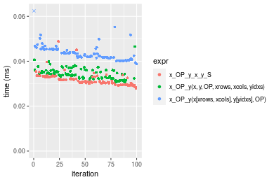

```r
> OP
[1] "*"
> stats <- microbenchmark(x_OP_y_x_y_S = x_OP_y(x_S, y_S, OP = OP, na.rm = FALSE), `x_OP_y(x, y, OP, xrows, xcols, yidxs)` = x_OP_y(x, 
+     y, OP = OP, xrows = xrows, xcols = xcols, yidxs = yidxs, na.rm = FALSE), `x_OP_y(x[xrows, xcols], y[yidxs], OP)` = x_OP_y(x[xrows, 
+     xcols], y[yidxs], OP = OP, na.rm = FALSE), unit = "ms")
```

_Table: Benchmarking of x_OP_y_x_y_S(), x_OP_y(x, y, OP, xrows, xcols, yidxs)() and x_OP_y(x[xrows, xcols], y[yidxs], OP)() on integer+100x100+mul data. The top panel shows times in milliseconds and the bottom panel shows relative times._


|   |expr                                  |      min|        lq|      mean|   median|        uq|      max|
|:--|:-------------------------------------|--------:|---------:|---------:|--------:|---------:|--------:|
|1  |x_OP_y_x_y_S                          | 0.029126| 0.0304600| 0.0319780| 0.031304| 0.0331830| 0.061293|
|2  |x_OP_y(x, y, OP, xrows, xcols, yidxs) | 0.031056| 0.0322445| 0.0338619| 0.033227| 0.0348345| 0.049440|
|3  |x_OP_y(x[xrows, xcols], y[yidxs], OP) | 0.040009| 0.0418450| 0.0442752| 0.043635| 0.0455880| 0.064907|


|   |expr                                  |      min|       lq|     mean|   median|       uq|       max|
|:--|:-------------------------------------|--------:|--------:|--------:|--------:|--------:|---------:|
|1  |x_OP_y_x_y_S                          | 1.000000| 1.000000| 1.000000| 1.000000| 1.000000| 1.0000000|
|2  |x_OP_y(x, y, OP, xrows, xcols, yidxs) | 1.066264| 1.058585| 1.058911| 1.061430| 1.049770| 0.8066174|
|3  |x_OP_y(x[xrows, xcols], y[yidxs], OP) | 1.373652| 1.373769| 1.384551| 1.393911| 1.373836| 1.0589627|

_Figure: Benchmarking of x_OP_y_x_y_S(), x_OP_y(x, y, OP, xrows, xcols, yidxs)() and x_OP_y(x[xrows, xcols], y[yidxs], OP)() on integer+100x100+mul data.  Outliers are displayed as crosses.  Times are in milliseconds._

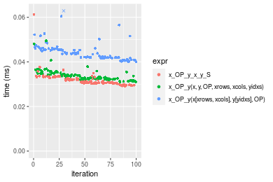

```r
> OP
[1] "/"
> stats <- microbenchmark(x_OP_y_x_y_S = x_OP_y(x_S, y_S, OP = OP, na.rm = FALSE), `x_OP_y(x, y, OP, xrows, xcols, yidxs)` = x_OP_y(x, 
+     y, OP = OP, xrows = xrows, xcols = xcols, yidxs = yidxs, na.rm = FALSE), `x_OP_y(x[xrows, xcols], y[yidxs], OP)` = x_OP_y(x[xrows, 
+     xcols], y[yidxs], OP = OP, na.rm = FALSE), unit = "ms")
```

_Table: Benchmarking of x_OP_y_x_y_S(), x_OP_y(x, y, OP, xrows, xcols, yidxs)() and x_OP_y(x[xrows, xcols], y[yidxs], OP)() on integer+100x100+div data. The top panel shows times in milliseconds and the bottom panel shows relative times._


|   |expr                                  |      min|        lq|      mean|    median|       uq|      max|
|:--|:-------------------------------------|--------:|---------:|---------:|---------:|--------:|--------:|
|2  |x_OP_y(x, y, OP, xrows, xcols, yidxs) | 0.026766| 0.0274325| 0.0289760| 0.0287645| 0.029319| 0.059735|
|1  |x_OP_y_x_y_S                          | 0.028858| 0.0298285| 0.0317642| 0.0315380| 0.032823| 0.047012|
|3  |x_OP_y(x[xrows, xcols], y[yidxs], OP) | 0.039978| 0.0417295| 0.0439793| 0.0435365| 0.045425| 0.058511|


|   |expr                                  |      min|       lq|     mean|   median|       uq|       max|
|:--|:-------------------------------------|--------:|--------:|--------:|--------:|--------:|---------:|
|2  |x_OP_y(x, y, OP, xrows, xcols, yidxs) | 1.000000| 1.000000| 1.000000| 1.000000| 1.000000| 1.0000000|
|1  |x_OP_y_x_y_S                          | 1.078159| 1.087342| 1.096222| 1.096421| 1.119513| 0.7870093|
|3  |x_OP_y(x[xrows, xcols], y[yidxs], OP) | 1.493611| 1.521170| 1.517780| 1.513550| 1.549337| 0.9795095|

_Figure: Benchmarking of x_OP_y_x_y_S(), x_OP_y(x, y, OP, xrows, xcols, yidxs)() and x_OP_y(x[xrows, xcols], y[yidxs], OP)() on integer+100x100+div data.  Outliers are displayed as crosses.  Times are in milliseconds._

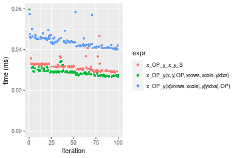


### 1000x10 vector


```r
> x <- data[["1000x10"]]
> y <- x[, 1L]
> xrows <- sample.int(nrow(x), size = nrow(x) * 0.7)
> xcols <- sample.int(ncol(x), size = ncol(x) * 0.7)
> x_S <- x[xrows, xcols]
> yidxs <- xrows
> y_S <- y[yidxs]
```

```r
> OP
[1] "+"
> stats <- microbenchmark(x_OP_y_x_y_S = x_OP_y(x_S, y_S, OP = OP, na.rm = FALSE), `x_OP_y(x, y, OP, xrows, xcols, yidxs)` = x_OP_y(x, 
+     y, OP = OP, xrows = xrows, xcols = xcols, yidxs = yidxs, na.rm = FALSE), `x_OP_y(x[xrows, xcols], y[yidxs], OP)` = x_OP_y(x[xrows, 
+     xcols], y[yidxs], OP = OP, na.rm = FALSE), unit = "ms")
```

_Table: Benchmarking of x_OP_y_x_y_S(), x_OP_y(x, y, OP, xrows, xcols, yidxs)() and x_OP_y(x[xrows, xcols], y[yidxs], OP)() on integer+1000x10+add data. The top panel shows times in milliseconds and the bottom panel shows relative times._


|   |expr                                  |      min|       lq|      mean|    median|        uq|      max|
|:--|:-------------------------------------|--------:|--------:|---------:|---------:|---------:|--------:|
|1  |x_OP_y_x_y_S                          | 0.029856| 0.031577| 0.0329250| 0.0329365| 0.0341370| 0.039397|
|2  |x_OP_y(x, y, OP, xrows, xcols, yidxs) | 0.037128| 0.038577| 0.0404953| 0.0404185| 0.0421510| 0.052627|
|3  |x_OP_y(x[xrows, xcols], y[yidxs], OP) | 0.043355| 0.045181| 0.0481844| 0.0477040| 0.0493415| 0.087143|


|   |expr                                  |      min|      lq|     mean|   median|       uq|      max|
|:--|:-------------------------------------|--------:|-------:|--------:|--------:|--------:|--------:|
|1  |x_OP_y_x_y_S                          | 1.000000| 1.00000| 1.000000| 1.000000| 1.000000| 1.000000|
|2  |x_OP_y(x, y, OP, xrows, xcols, yidxs) | 1.243569| 1.22168| 1.229924| 1.227164| 1.234760| 1.335812|
|3  |x_OP_y(x[xrows, xcols], y[yidxs], OP) | 1.452137| 1.43082| 1.463456| 1.448363| 1.445396| 2.211920|

_Figure: Benchmarking of x_OP_y_x_y_S(), x_OP_y(x, y, OP, xrows, xcols, yidxs)() and x_OP_y(x[xrows, xcols], y[yidxs], OP)() on integer+1000x10+add data.  Outliers are displayed as crosses.  Times are in milliseconds._

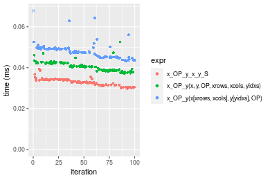

```r
> OP
[1] "-"
> stats <- microbenchmark(x_OP_y_x_y_S = x_OP_y(x_S, y_S, OP = OP, na.rm = FALSE), `x_OP_y(x, y, OP, xrows, xcols, yidxs)` = x_OP_y(x, 
+     y, OP = OP, xrows = xrows, xcols = xcols, yidxs = yidxs, na.rm = FALSE), `x_OP_y(x[xrows, xcols], y[yidxs], OP)` = x_OP_y(x[xrows, 
+     xcols], y[yidxs], OP = OP, na.rm = FALSE), unit = "ms")
```

_Table: Benchmarking of x_OP_y_x_y_S(), x_OP_y(x, y, OP, xrows, xcols, yidxs)() and x_OP_y(x[xrows, xcols], y[yidxs], OP)() on integer+1000x10+sub data. The top panel shows times in milliseconds and the bottom panel shows relative times._


|   |expr                                  |      min|        lq|      mean|    median|        uq|      max|
|:--|:-------------------------------------|--------:|---------:|---------:|---------:|---------:|--------:|
|1  |x_OP_y_x_y_S                          | 0.027611| 0.0289790| 0.0311371| 0.0310470| 0.0324020| 0.046393|
|2  |x_OP_y(x, y, OP, xrows, xcols, yidxs) | 0.033189| 0.0352065| 0.0371865| 0.0369050| 0.0384455| 0.049039|
|3  |x_OP_y(x[xrows, xcols], y[yidxs], OP) | 0.040402| 0.0431115| 0.0459137| 0.0455685| 0.0475725| 0.084907|


|   |expr                                  |      min|       lq|     mean|   median|       uq|      max|
|:--|:-------------------------------------|--------:|--------:|--------:|--------:|--------:|--------:|
|1  |x_OP_y_x_y_S                          | 1.000000| 1.000000| 1.000000| 1.000000| 1.000000| 1.000000|
|2  |x_OP_y(x, y, OP, xrows, xcols, yidxs) | 1.202021| 1.214897| 1.194282| 1.188682| 1.186516| 1.057035|
|3  |x_OP_y(x[xrows, xcols], y[yidxs], OP) | 1.463257| 1.487681| 1.474565| 1.467726| 1.468196| 1.830168|

_Figure: Benchmarking of x_OP_y_x_y_S(), x_OP_y(x, y, OP, xrows, xcols, yidxs)() and x_OP_y(x[xrows, xcols], y[yidxs], OP)() on integer+1000x10+sub data.  Outliers are displayed as crosses.  Times are in milliseconds._

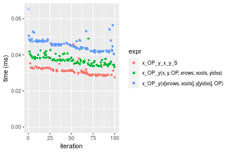

```r
> OP
[1] "*"
> stats <- microbenchmark(x_OP_y_x_y_S = x_OP_y(x_S, y_S, OP = OP, na.rm = FALSE), `x_OP_y(x, y, OP, xrows, xcols, yidxs)` = x_OP_y(x, 
+     y, OP = OP, xrows = xrows, xcols = xcols, yidxs = yidxs, na.rm = FALSE), `x_OP_y(x[xrows, xcols], y[yidxs], OP)` = x_OP_y(x[xrows, 
+     xcols], y[yidxs], OP = OP, na.rm = FALSE), unit = "ms")
```

_Table: Benchmarking of x_OP_y_x_y_S(), x_OP_y(x, y, OP, xrows, xcols, yidxs)() and x_OP_y(x[xrows, xcols], y[yidxs], OP)() on integer+1000x10+mul data. The top panel shows times in milliseconds and the bottom panel shows relative times._


|   |expr                                  |      min|        lq|      mean|    median|        uq|      max|
|:--|:-------------------------------------|--------:|---------:|---------:|---------:|---------:|--------:|
|1  |x_OP_y_x_y_S                          | 0.027365| 0.0290075| 0.0307944| 0.0298640| 0.0314190| 0.047742|
|2  |x_OP_y(x, y, OP, xrows, xcols, yidxs) | 0.032633| 0.0349620| 0.0369028| 0.0358315| 0.0383185| 0.053385|
|3  |x_OP_y(x[xrows, xcols], y[yidxs], OP) | 0.040491| 0.0437325| 0.0461154| 0.0457665| 0.0475315| 0.091787|


|   |expr                                  |      min|       lq|     mean|   median|       uq|      max|
|:--|:-------------------------------------|--------:|--------:|--------:|--------:|--------:|--------:|
|1  |x_OP_y_x_y_S                          | 1.000000| 1.000000| 1.000000| 1.000000| 1.000000| 1.000000|
|2  |x_OP_y(x, y, OP, xrows, xcols, yidxs) | 1.192509| 1.205275| 1.198360| 1.199823| 1.219596| 1.118198|
|3  |x_OP_y(x[xrows, xcols], y[yidxs], OP) | 1.479664| 1.507627| 1.497526| 1.532497| 1.512827| 1.922563|

_Figure: Benchmarking of x_OP_y_x_y_S(), x_OP_y(x, y, OP, xrows, xcols, yidxs)() and x_OP_y(x[xrows, xcols], y[yidxs], OP)() on integer+1000x10+mul data.  Outliers are displayed as crosses.  Times are in milliseconds._

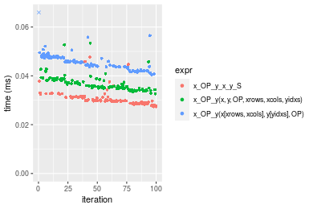

```r
> OP
[1] "/"
> stats <- microbenchmark(x_OP_y_x_y_S = x_OP_y(x_S, y_S, OP = OP, na.rm = FALSE), `x_OP_y(x, y, OP, xrows, xcols, yidxs)` = x_OP_y(x, 
+     y, OP = OP, xrows = xrows, xcols = xcols, yidxs = yidxs, na.rm = FALSE), `x_OP_y(x[xrows, xcols], y[yidxs], OP)` = x_OP_y(x[xrows, 
+     xcols], y[yidxs], OP = OP, na.rm = FALSE), unit = "ms")
```

_Table: Benchmarking of x_OP_y_x_y_S(), x_OP_y(x, y, OP, xrows, xcols, yidxs)() and x_OP_y(x[xrows, xcols], y[yidxs], OP)() on integer+1000x10+div data. The top panel shows times in milliseconds and the bottom panel shows relative times._


|   |expr                                  |      min|        lq|      mean|    median|        uq|      max|
|:--|:-------------------------------------|--------:|---------:|---------:|---------:|---------:|--------:|
|1  |x_OP_y_x_y_S                          | 0.027338| 0.0290460| 0.0305179| 0.0298460| 0.0317330| 0.043400|
|2  |x_OP_y(x, y, OP, xrows, xcols, yidxs) | 0.029133| 0.0308940| 0.0326957| 0.0315075| 0.0331765| 0.066807|
|3  |x_OP_y(x[xrows, xcols], y[yidxs], OP) | 0.040056| 0.0430065| 0.0456537| 0.0445890| 0.0475905| 0.059132|


|   |expr                                  |      min|       lq|     mean|   median|       uq|      max|
|:--|:-------------------------------------|--------:|--------:|--------:|--------:|--------:|--------:|
|1  |x_OP_y_x_y_S                          | 1.000000| 1.000000| 1.000000| 1.000000| 1.000000| 1.000000|
|2  |x_OP_y(x, y, OP, xrows, xcols, yidxs) | 1.065659| 1.063623| 1.071361| 1.055669| 1.045489| 1.539332|
|3  |x_OP_y(x[xrows, xcols], y[yidxs], OP) | 1.465213| 1.480634| 1.495964| 1.493969| 1.499716| 1.362488|

_Figure: Benchmarking of x_OP_y_x_y_S(), x_OP_y(x, y, OP, xrows, xcols, yidxs)() and x_OP_y(x[xrows, xcols], y[yidxs], OP)() on integer+1000x10+div data.  Outliers are displayed as crosses.  Times are in milliseconds._

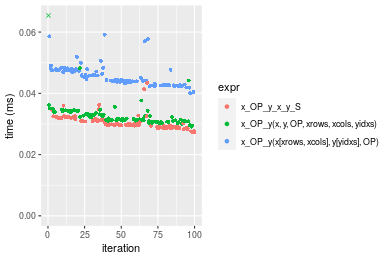


### 10x1000 vector


```r
> x <- data[["10x1000"]]
> y <- x[, 1L]
> xrows <- sample.int(nrow(x), size = nrow(x) * 0.7)
> xcols <- sample.int(ncol(x), size = ncol(x) * 0.7)
> x_S <- x[xrows, xcols]
> yidxs <- xrows
> y_S <- y[yidxs]
```

```r
> OP
[1] "+"
> stats <- microbenchmark(x_OP_y_x_y_S = x_OP_y(x_S, y_S, OP = OP, na.rm = FALSE), `x_OP_y(x, y, OP, xrows, xcols, yidxs)` = x_OP_y(x, 
+     y, OP = OP, xrows = xrows, xcols = xcols, yidxs = yidxs, na.rm = FALSE), `x_OP_y(x[xrows, xcols], y[yidxs], OP)` = x_OP_y(x[xrows, 
+     xcols], y[yidxs], OP = OP, na.rm = FALSE), unit = "ms")
```

_Table: Benchmarking of x_OP_y_x_y_S(), x_OP_y(x, y, OP, xrows, xcols, yidxs)() and x_OP_y(x[xrows, xcols], y[yidxs], OP)() on integer+10x1000+add data. The top panel shows times in milliseconds and the bottom panel shows relative times._


|   |expr                                  |      min|        lq|      mean|    median|        uq|      max|
|:--|:-------------------------------------|--------:|---------:|---------:|---------:|---------:|--------:|
|1  |x_OP_y_x_y_S                          | 0.030967| 0.0327145| 0.0343475| 0.0344375| 0.0355545| 0.046409|
|2  |x_OP_y(x, y, OP, xrows, xcols, yidxs) | 0.035892| 0.0372035| 0.0394236| 0.0393195| 0.0412400| 0.055153|
|3  |x_OP_y(x[xrows, xcols], y[yidxs], OP) | 0.043558| 0.0456250| 0.0483569| 0.0479815| 0.0500700| 0.086439|


|   |expr                                  |      min|       lq|     mean|   median|       uq|      max|
|:--|:-------------------------------------|--------:|--------:|--------:|--------:|--------:|--------:|
|1  |x_OP_y_x_y_S                          | 1.000000| 1.000000| 1.000000| 1.000000| 1.000000| 1.000000|
|2  |x_OP_y(x, y, OP, xrows, xcols, yidxs) | 1.159040| 1.137217| 1.147786| 1.141764| 1.159909| 1.188412|
|3  |x_OP_y(x[xrows, xcols], y[yidxs], OP) | 1.406594| 1.394642| 1.407875| 1.393292| 1.408261| 1.862548|

_Figure: Benchmarking of x_OP_y_x_y_S(), x_OP_y(x, y, OP, xrows, xcols, yidxs)() and x_OP_y(x[xrows, xcols], y[yidxs], OP)() on integer+10x1000+add data.  Outliers are displayed as crosses.  Times are in milliseconds._

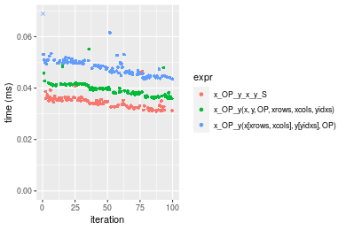

```r
> OP
[1] "-"
> stats <- microbenchmark(x_OP_y_x_y_S = x_OP_y(x_S, y_S, OP = OP, na.rm = FALSE), `x_OP_y(x, y, OP, xrows, xcols, yidxs)` = x_OP_y(x, 
+     y, OP = OP, xrows = xrows, xcols = xcols, yidxs = yidxs, na.rm = FALSE), `x_OP_y(x[xrows, xcols], y[yidxs], OP)` = x_OP_y(x[xrows, 
+     xcols], y[yidxs], OP = OP, na.rm = FALSE), unit = "ms")
```

_Table: Benchmarking of x_OP_y_x_y_S(), x_OP_y(x, y, OP, xrows, xcols, yidxs)() and x_OP_y(x[xrows, xcols], y[yidxs], OP)() on integer+10x1000+sub data. The top panel shows times in milliseconds and the bottom panel shows relative times._


|   |expr                                  |      min|        lq|      mean|    median|       uq|      max|
|:--|:-------------------------------------|--------:|---------:|---------:|---------:|--------:|--------:|
|1  |x_OP_y_x_y_S                          | 0.028568| 0.0302475| 0.0326353| 0.0322940| 0.033914| 0.063179|
|2  |x_OP_y(x, y, OP, xrows, xcols, yidxs) | 0.032340| 0.0337250| 0.0364054| 0.0365165| 0.037871| 0.055650|
|3  |x_OP_y(x[xrows, xcols], y[yidxs], OP) | 0.041306| 0.0429045| 0.0462613| 0.0463095| 0.048222| 0.070748|


|   |expr                                  |      min|       lq|     mean|   median|       uq|       max|
|:--|:-------------------------------------|--------:|--------:|--------:|--------:|--------:|---------:|
|1  |x_OP_y_x_y_S                          | 1.000000| 1.000000| 1.000000| 1.000000| 1.000000| 1.0000000|
|2  |x_OP_y(x, y, OP, xrows, xcols, yidxs) | 1.132036| 1.114968| 1.115525| 1.130752| 1.116677| 0.8808307|
|3  |x_OP_y(x[xrows, xcols], y[yidxs], OP) | 1.445884| 1.418448| 1.417524| 1.433997| 1.421891| 1.1198025|

_Figure: Benchmarking of x_OP_y_x_y_S(), x_OP_y(x, y, OP, xrows, xcols, yidxs)() and x_OP_y(x[xrows, xcols], y[yidxs], OP)() on integer+10x1000+sub data.  Outliers are displayed as crosses.  Times are in milliseconds._

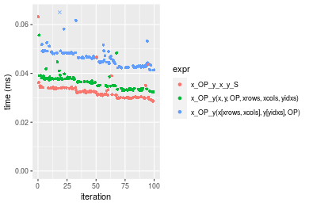

```r
> OP
[1] "*"
> stats <- microbenchmark(x_OP_y_x_y_S = x_OP_y(x_S, y_S, OP = OP, na.rm = FALSE), `x_OP_y(x, y, OP, xrows, xcols, yidxs)` = x_OP_y(x, 
+     y, OP = OP, xrows = xrows, xcols = xcols, yidxs = yidxs, na.rm = FALSE), `x_OP_y(x[xrows, xcols], y[yidxs], OP)` = x_OP_y(x[xrows, 
+     xcols], y[yidxs], OP = OP, na.rm = FALSE), unit = "ms")
```

_Table: Benchmarking of x_OP_y_x_y_S(), x_OP_y(x, y, OP, xrows, xcols, yidxs)() and x_OP_y(x[xrows, xcols], y[yidxs], OP)() on integer+10x1000+mul data. The top panel shows times in milliseconds and the bottom panel shows relative times._


|   |expr                                  |      min|        lq|      mean|    median|        uq|      max|
|:--|:-------------------------------------|--------:|---------:|---------:|---------:|---------:|--------:|
|1  |x_OP_y_x_y_S                          | 0.029175| 0.0307105| 0.0330678| 0.0322040| 0.0346325| 0.062226|
|2  |x_OP_y(x, y, OP, xrows, xcols, yidxs) | 0.032665| 0.0341040| 0.0362512| 0.0358730| 0.0381560| 0.052736|
|3  |x_OP_y(x[xrows, xcols], y[yidxs], OP) | 0.042831| 0.0437320| 0.0470083| 0.0468335| 0.0491600| 0.061798|


|   |expr                                  |      min|       lq|     mean|   median|       uq|       max|
|:--|:-------------------------------------|--------:|--------:|--------:|--------:|--------:|---------:|
|1  |x_OP_y_x_y_S                          | 1.000000| 1.000000| 1.000000| 1.000000| 1.000000| 1.0000000|
|2  |x_OP_y(x, y, OP, xrows, xcols, yidxs) | 1.119623| 1.110500| 1.096269| 1.113930| 1.101740| 0.8474914|
|3  |x_OP_y(x[xrows, xcols], y[yidxs], OP) | 1.468072| 1.424008| 1.421574| 1.454276| 1.419476| 0.9931218|

_Figure: Benchmarking of x_OP_y_x_y_S(), x_OP_y(x, y, OP, xrows, xcols, yidxs)() and x_OP_y(x[xrows, xcols], y[yidxs], OP)() on integer+10x1000+mul data.  Outliers are displayed as crosses.  Times are in milliseconds._

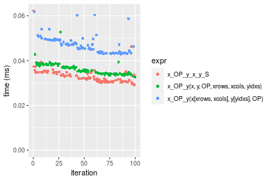

```r
> OP
[1] "/"
> stats <- microbenchmark(x_OP_y_x_y_S = x_OP_y(x_S, y_S, OP = OP, na.rm = FALSE), `x_OP_y(x, y, OP, xrows, xcols, yidxs)` = x_OP_y(x, 
+     y, OP = OP, xrows = xrows, xcols = xcols, yidxs = yidxs, na.rm = FALSE), `x_OP_y(x[xrows, xcols], y[yidxs], OP)` = x_OP_y(x[xrows, 
+     xcols], y[yidxs], OP = OP, na.rm = FALSE), unit = "ms")
```

_Table: Benchmarking of x_OP_y_x_y_S(), x_OP_y(x, y, OP, xrows, xcols, yidxs)() and x_OP_y(x[xrows, xcols], y[yidxs], OP)() on integer+10x1000+div data. The top panel shows times in milliseconds and the bottom panel shows relative times._


|   |expr                                  |      min|        lq|      mean|    median|        uq|      max|
|:--|:-------------------------------------|--------:|---------:|---------:|---------:|---------:|--------:|
|2  |x_OP_y(x, y, OP, xrows, xcols, yidxs) | 0.028529| 0.0297495| 0.0314314| 0.0308665| 0.0320280| 0.047564|
|1  |x_OP_y_x_y_S                          | 0.028690| 0.0300955| 0.0317838| 0.0309475| 0.0324165| 0.045763|
|3  |x_OP_y(x[xrows, xcols], y[yidxs], OP) | 0.042791| 0.0434645| 0.0461065| 0.0449095| 0.0474145| 0.086824|


|   |expr                                  |      min|       lq|     mean|   median|       uq|       max|
|:--|:-------------------------------------|--------:|--------:|--------:|--------:|--------:|---------:|
|2  |x_OP_y(x, y, OP, xrows, xcols, yidxs) | 1.000000| 1.000000| 1.000000| 1.000000| 1.000000| 1.0000000|
|1  |x_OP_y_x_y_S                          | 1.005643| 1.011630| 1.011211| 1.002624| 1.012130| 0.9621352|
|3  |x_OP_y(x[xrows, xcols], y[yidxs], OP) | 1.499912| 1.461016| 1.466892| 1.454959| 1.480408| 1.8254142|

_Figure: Benchmarking of x_OP_y_x_y_S(), x_OP_y(x, y, OP, xrows, xcols, yidxs)() and x_OP_y(x[xrows, xcols], y[yidxs], OP)() on integer+10x1000+div data.  Outliers are displayed as crosses.  Times are in milliseconds._

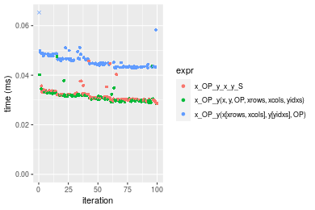


### 100x1000 vector


```r
> x <- data[["100x1000"]]
> y <- x[, 1L]
> xrows <- sample.int(nrow(x), size = nrow(x) * 0.7)
> xcols <- sample.int(ncol(x), size = ncol(x) * 0.7)
> x_S <- x[xrows, xcols]
> yidxs <- xrows
> y_S <- y[yidxs]
```

```r
> OP
[1] "+"
> stats <- microbenchmark(x_OP_y_x_y_S = x_OP_y(x_S, y_S, OP = OP, na.rm = FALSE), `x_OP_y(x, y, OP, xrows, xcols, yidxs)` = x_OP_y(x, 
+     y, OP = OP, xrows = xrows, xcols = xcols, yidxs = yidxs, na.rm = FALSE), `x_OP_y(x[xrows, xcols], y[yidxs], OP)` = x_OP_y(x[xrows, 
+     xcols], y[yidxs], OP = OP, na.rm = FALSE), unit = "ms")
```

_Table: Benchmarking of x_OP_y_x_y_S(), x_OP_y(x, y, OP, xrows, xcols, yidxs)() and x_OP_y(x[xrows, xcols], y[yidxs], OP)() on integer+100x1000+add data. The top panel shows times in milliseconds and the bottom panel shows relative times._


|   |expr                                  |      min|       lq|      mean|    median|        uq|      max|
|:--|:-------------------------------------|--------:|--------:|---------:|---------:|---------:|--------:|
|1  |x_OP_y_x_y_S                          | 0.186796| 0.197073| 0.2214871| 0.2053535| 0.2428615| 0.323011|
|2  |x_OP_y(x, y, OP, xrows, xcols, yidxs) | 0.202905| 0.213589| 0.2394878| 0.2256165| 0.2586855| 0.341566|
|3  |x_OP_y(x[xrows, xcols], y[yidxs], OP) | 0.252993| 0.267259| 0.3017059| 0.2754915| 0.3257935| 0.505944|


|   |expr                                  |      min|       lq|     mean|   median|       uq|      max|
|:--|:-------------------------------------|--------:|--------:|--------:|--------:|--------:|--------:|
|1  |x_OP_y_x_y_S                          | 1.000000| 1.000000| 1.000000| 1.000000| 1.000000| 1.000000|
|2  |x_OP_y(x, y, OP, xrows, xcols, yidxs) | 1.086239| 1.083806| 1.081272| 1.098674| 1.065157| 1.057444|
|3  |x_OP_y(x[xrows, xcols], y[yidxs], OP) | 1.354381| 1.356142| 1.362183| 1.341548| 1.341479| 1.566337|

_Figure: Benchmarking of x_OP_y_x_y_S(), x_OP_y(x, y, OP, xrows, xcols, yidxs)() and x_OP_y(x[xrows, xcols], y[yidxs], OP)() on integer+100x1000+add data.  Outliers are displayed as crosses.  Times are in milliseconds._

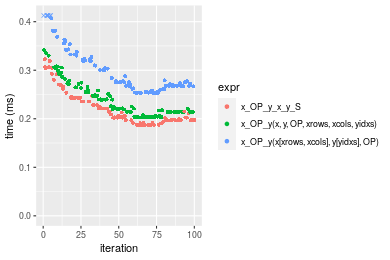

```r
> OP
[1] "-"
> stats <- microbenchmark(x_OP_y_x_y_S = x_OP_y(x_S, y_S, OP = OP, na.rm = FALSE), `x_OP_y(x, y, OP, xrows, xcols, yidxs)` = x_OP_y(x, 
+     y, OP = OP, xrows = xrows, xcols = xcols, yidxs = yidxs, na.rm = FALSE), `x_OP_y(x[xrows, xcols], y[yidxs], OP)` = x_OP_y(x[xrows, 
+     xcols], y[yidxs], OP = OP, na.rm = FALSE), unit = "ms")
```

_Table: Benchmarking of x_OP_y_x_y_S(), x_OP_y(x, y, OP, xrows, xcols, yidxs)() and x_OP_y(x[xrows, xcols], y[yidxs], OP)() on integer+100x1000+sub data. The top panel shows times in milliseconds and the bottom panel shows relative times._


|   |expr                                  |      min|        lq|      mean|    median|       uq|      max|
|:--|:-------------------------------------|--------:|---------:|---------:|---------:|--------:|--------:|
|1  |x_OP_y_x_y_S                          | 0.173985| 0.1792525| 0.2082686| 0.1933385| 0.230801| 0.308099|
|2  |x_OP_y(x, y, OP, xrows, xcols, yidxs) | 0.178718| 0.1879090| 0.2141691| 0.2017905| 0.232735| 0.296289|
|3  |x_OP_y(x[xrows, xcols], y[yidxs], OP) | 0.241083| 0.2534490| 0.2939490| 0.2835990| 0.315175| 0.499924|


|   |expr                                  |      min|       lq|     mean|   median|       uq|       max|
|:--|:-------------------------------------|--------:|--------:|--------:|--------:|--------:|---------:|
|1  |x_OP_y_x_y_S                          | 1.000000| 1.000000| 1.000000| 1.000000| 1.000000| 1.0000000|
|2  |x_OP_y(x, y, OP, xrows, xcols, yidxs) | 1.027203| 1.048292| 1.028331| 1.043716| 1.008379| 0.9616682|
|3  |x_OP_y(x[xrows, xcols], y[yidxs], OP) | 1.385654| 1.413922| 1.411394| 1.466852| 1.365570| 1.6226083|

_Figure: Benchmarking of x_OP_y_x_y_S(), x_OP_y(x, y, OP, xrows, xcols, yidxs)() and x_OP_y(x[xrows, xcols], y[yidxs], OP)() on integer+100x1000+sub data.  Outliers are displayed as crosses.  Times are in milliseconds._

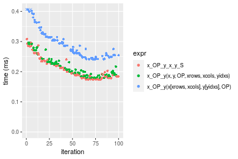

```r
> OP
[1] "*"
> stats <- microbenchmark(x_OP_y_x_y_S = x_OP_y(x_S, y_S, OP = OP, na.rm = FALSE), `x_OP_y(x, y, OP, xrows, xcols, yidxs)` = x_OP_y(x, 
+     y, OP = OP, xrows = xrows, xcols = xcols, yidxs = yidxs, na.rm = FALSE), `x_OP_y(x[xrows, xcols], y[yidxs], OP)` = x_OP_y(x[xrows, 
+     xcols], y[yidxs], OP = OP, na.rm = FALSE), unit = "ms")
```

_Table: Benchmarking of x_OP_y_x_y_S(), x_OP_y(x, y, OP, xrows, xcols, yidxs)() and x_OP_y(x[xrows, xcols], y[yidxs], OP)() on integer+100x1000+mul data. The top panel shows times in milliseconds and the bottom panel shows relative times._


|   |expr                                  |      min|        lq|      mean|    median|        uq|      max|
|:--|:-------------------------------------|--------:|---------:|---------:|---------:|---------:|--------:|
|1  |x_OP_y_x_y_S                          | 0.175891| 0.1808675| 0.2056625| 0.1959665| 0.2229560| 0.315525|
|2  |x_OP_y(x, y, OP, xrows, xcols, yidxs) | 0.179475| 0.1848660| 0.2146579| 0.1998310| 0.2377745| 0.357214|
|3  |x_OP_y(x[xrows, xcols], y[yidxs], OP) | 0.242626| 0.2504795| 0.2873048| 0.2788640| 0.3075145| 0.407485|


|   |expr                                  |      min|       lq|     mean|   median|       uq|      max|
|:--|:-------------------------------------|--------:|--------:|--------:|--------:|--------:|--------:|
|1  |x_OP_y_x_y_S                          | 1.000000| 1.000000| 1.000000| 1.000000| 1.000000| 1.000000|
|2  |x_OP_y(x, y, OP, xrows, xcols, yidxs) | 1.020376| 1.022107| 1.043739| 1.019720| 1.066464| 1.132126|
|3  |x_OP_y(x[xrows, xcols], y[yidxs], OP) | 1.379411| 1.384878| 1.396972| 1.423019| 1.379261| 1.291451|

_Figure: Benchmarking of x_OP_y_x_y_S(), x_OP_y(x, y, OP, xrows, xcols, yidxs)() and x_OP_y(x[xrows, xcols], y[yidxs], OP)() on integer+100x1000+mul data.  Outliers are displayed as crosses.  Times are in milliseconds._


```r
> OP
[1] "/"
> stats <- microbenchmark(x_OP_y_x_y_S = x_OP_y(x_S, y_S, OP = OP, na.rm = FALSE), `x_OP_y(x, y, OP, xrows, xcols, yidxs)` = x_OP_y(x, 
+     y, OP = OP, xrows = xrows, xcols = xcols, yidxs = yidxs, na.rm = FALSE), `x_OP_y(x[xrows, xcols], y[yidxs], OP)` = x_OP_y(x[xrows, 
+     xcols], y[yidxs], OP = OP, na.rm = FALSE), unit = "ms")
```

_Table: Benchmarking of x_OP_y_x_y_S(), x_OP_y(x, y, OP, xrows, xcols, yidxs)() and x_OP_y(x[xrows, xcols], y[yidxs], OP)() on integer+100x1000+div data. The top panel shows times in milliseconds and the bottom panel shows relative times._


|   |expr                                  |      min|       lq|      mean|    median|        uq|      max|
|:--|:-------------------------------------|--------:|--------:|---------:|---------:|---------:|--------:|
|2  |x_OP_y(x, y, OP, xrows, xcols, yidxs) | 0.147238| 0.165022| 0.1962571| 0.1859460| 0.2129895| 0.332220|
|1  |x_OP_y_x_y_S                          | 0.173023| 0.199325| 0.2330480| 0.2252210| 0.2837100| 0.312995|
|3  |x_OP_y(x[xrows, xcols], y[yidxs], OP) | 0.240177| 0.276577| 0.3360721| 0.3193585| 0.4119960| 0.442113|


|   |expr                                  |      min|       lq|     mean|   median|       uq|       max|
|:--|:-------------------------------------|--------:|--------:|--------:|--------:|--------:|---------:|
|2  |x_OP_y(x, y, OP, xrows, xcols, yidxs) | 1.000000| 1.000000| 1.000000| 1.000000| 1.000000| 1.0000000|
|1  |x_OP_y_x_y_S                          | 1.175125| 1.207869| 1.187462| 1.211217| 1.332037| 0.9421317|
|3  |x_OP_y(x[xrows, xcols], y[yidxs], OP) | 1.631216| 1.676001| 1.712407| 1.717480| 1.934349| 1.3307838|

_Figure: Benchmarking of x_OP_y_x_y_S(), x_OP_y(x, y, OP, xrows, xcols, yidxs)() and x_OP_y(x[xrows, xcols], y[yidxs], OP)() on integer+100x1000+div data.  Outliers are displayed as crosses.  Times are in milliseconds._

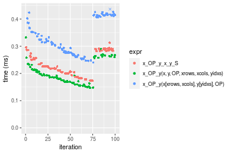


### 1000x100 vector


```r
> x <- data[["1000x100"]]
> y <- x[, 1L]
> xrows <- sample.int(nrow(x), size = nrow(x) * 0.7)
> xcols <- sample.int(ncol(x), size = ncol(x) * 0.7)
> x_S <- x[xrows, xcols]
> yidxs <- xrows
> y_S <- y[yidxs]
```

```r
> OP
[1] "+"
> stats <- microbenchmark(x_OP_y_x_y_S = x_OP_y(x_S, y_S, OP = OP, na.rm = FALSE), `x_OP_y(x, y, OP, xrows, xcols, yidxs)` = x_OP_y(x, 
+     y, OP = OP, xrows = xrows, xcols = xcols, yidxs = yidxs, na.rm = FALSE), `x_OP_y(x[xrows, xcols], y[yidxs], OP)` = x_OP_y(x[xrows, 
+     xcols], y[yidxs], OP = OP, na.rm = FALSE), unit = "ms")
```

_Table: Benchmarking of x_OP_y_x_y_S(), x_OP_y(x, y, OP, xrows, xcols, yidxs)() and x_OP_y(x[xrows, xcols], y[yidxs], OP)() on integer+1000x100+add data. The top panel shows times in milliseconds and the bottom panel shows relative times._


|   |expr                                  |      min|        lq|      mean|    median|        uq|      max|
|:--|:-------------------------------------|--------:|---------:|---------:|---------:|---------:|--------:|
|1  |x_OP_y_x_y_S                          | 0.180843| 0.1880885| 0.2119209| 0.1963410| 0.2285125| 0.309191|
|2  |x_OP_y(x, y, OP, xrows, xcols, yidxs) | 0.197919| 0.2087795| 0.2311080| 0.2192845| 0.2499530| 0.327220|
|3  |x_OP_y(x[xrows, xcols], y[yidxs], OP) | 0.245555| 0.2594810| 0.2907359| 0.2715310| 0.3132960| 0.485465|


|   |expr                                  |      min|       lq|     mean|   median|       uq|      max|
|:--|:-------------------------------------|--------:|--------:|--------:|--------:|--------:|--------:|
|1  |x_OP_y_x_y_S                          | 1.000000| 1.000000| 1.000000| 1.000000| 1.000000| 1.000000|
|2  |x_OP_y(x, y, OP, xrows, xcols, yidxs) | 1.094424| 1.110007| 1.090539| 1.116855| 1.093826| 1.058310|
|3  |x_OP_y(x[xrows, xcols], y[yidxs], OP) | 1.357835| 1.379569| 1.371907| 1.382956| 1.371023| 1.570114|

_Figure: Benchmarking of x_OP_y_x_y_S(), x_OP_y(x, y, OP, xrows, xcols, yidxs)() and x_OP_y(x[xrows, xcols], y[yidxs], OP)() on integer+1000x100+add data.  Outliers are displayed as crosses.  Times are in milliseconds._

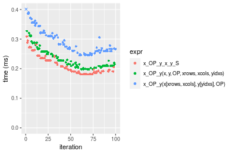

```r
> OP
[1] "-"
> stats <- microbenchmark(x_OP_y_x_y_S = x_OP_y(x_S, y_S, OP = OP, na.rm = FALSE), `x_OP_y(x, y, OP, xrows, xcols, yidxs)` = x_OP_y(x, 
+     y, OP = OP, xrows = xrows, xcols = xcols, yidxs = yidxs, na.rm = FALSE), `x_OP_y(x[xrows, xcols], y[yidxs], OP)` = x_OP_y(x[xrows, 
+     xcols], y[yidxs], OP = OP, na.rm = FALSE), unit = "ms")
```

_Table: Benchmarking of x_OP_y_x_y_S(), x_OP_y(x, y, OP, xrows, xcols, yidxs)() and x_OP_y(x[xrows, xcols], y[yidxs], OP)() on integer+1000x100+sub data. The top panel shows times in milliseconds and the bottom panel shows relative times._


|   |expr                                  |      min|        lq|      mean|    median|        uq|      max|
|:--|:-------------------------------------|--------:|---------:|---------:|---------:|---------:|--------:|
|1  |x_OP_y_x_y_S                          | 0.168634| 0.1736620| 0.1981503| 0.1887375| 0.2126645| 0.291207|
|2  |x_OP_y(x, y, OP, xrows, xcols, yidxs) | 0.174055| 0.1816790| 0.2036345| 0.1951350| 0.2209715| 0.344913|
|3  |x_OP_y(x[xrows, xcols], y[yidxs], OP) | 0.233615| 0.2404315| 0.2707032| 0.2536875| 0.2950505| 0.395924|


|   |expr                                  |      min|       lq|     mean|   median|       uq|      max|
|:--|:-------------------------------------|--------:|--------:|--------:|--------:|--------:|--------:|
|1  |x_OP_y_x_y_S                          | 1.000000| 1.000000| 1.000000| 1.000000| 1.000000| 1.000000|
|2  |x_OP_y(x, y, OP, xrows, xcols, yidxs) | 1.032147| 1.046164| 1.027677| 1.033896| 1.039062| 1.184425|
|3  |x_OP_y(x[xrows, xcols], y[yidxs], OP) | 1.385338| 1.384480| 1.366151| 1.344129| 1.387399| 1.359596|

_Figure: Benchmarking of x_OP_y_x_y_S(), x_OP_y(x, y, OP, xrows, xcols, yidxs)() and x_OP_y(x[xrows, xcols], y[yidxs], OP)() on integer+1000x100+sub data.  Outliers are displayed as crosses.  Times are in milliseconds._

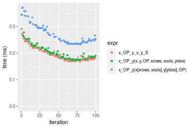

```r
> OP
[1] "*"
> stats <- microbenchmark(x_OP_y_x_y_S = x_OP_y(x_S, y_S, OP = OP, na.rm = FALSE), `x_OP_y(x, y, OP, xrows, xcols, yidxs)` = x_OP_y(x, 
+     y, OP = OP, xrows = xrows, xcols = xcols, yidxs = yidxs, na.rm = FALSE), `x_OP_y(x[xrows, xcols], y[yidxs], OP)` = x_OP_y(x[xrows, 
+     xcols], y[yidxs], OP = OP, na.rm = FALSE), unit = "ms")
```

_Table: Benchmarking of x_OP_y_x_y_S(), x_OP_y(x, y, OP, xrows, xcols, yidxs)() and x_OP_y(x[xrows, xcols], y[yidxs], OP)() on integer+1000x100+mul data. The top panel shows times in milliseconds and the bottom panel shows relative times._


|   |expr                                  |      min|        lq|      mean|    median|        uq|      max|
|:--|:-------------------------------------|--------:|---------:|---------:|---------:|---------:|--------:|
|2  |x_OP_y(x, y, OP, xrows, xcols, yidxs) | 0.174094| 0.1816295| 0.2007525| 0.1892840| 0.2187415| 0.277477|
|1  |x_OP_y_x_y_S                          | 0.170311| 0.1800660| 0.2057349| 0.2025870| 0.2219100| 0.273469|
|3  |x_OP_y(x[xrows, xcols], y[yidxs], OP) | 0.235386| 0.2468720| 0.2791036| 0.2617945| 0.2986935| 0.429722|


|   |expr                                  |       min|        lq|     mean|   median|       uq|       max|
|:--|:-------------------------------------|---------:|---------:|--------:|--------:|--------:|---------:|
|2  |x_OP_y(x, y, OP, xrows, xcols, yidxs) | 1.0000000| 1.0000000| 1.000000| 1.000000| 1.000000| 1.0000000|
|1  |x_OP_y_x_y_S                          | 0.9782704| 0.9913918| 1.024819| 1.070281| 1.014485| 0.9855556|
|3  |x_OP_y(x[xrows, xcols], y[yidxs], OP) | 1.3520627| 1.3592065| 1.390287| 1.383078| 1.365509| 1.5486761|

_Figure: Benchmarking of x_OP_y_x_y_S(), x_OP_y(x, y, OP, xrows, xcols, yidxs)() and x_OP_y(x[xrows, xcols], y[yidxs], OP)() on integer+1000x100+mul data.  Outliers are displayed as crosses.  Times are in milliseconds._

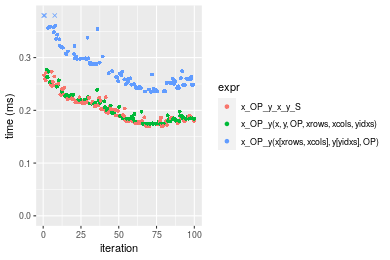

```r
> OP
[1] "/"
> stats <- microbenchmark(x_OP_y_x_y_S = x_OP_y(x_S, y_S, OP = OP, na.rm = FALSE), `x_OP_y(x, y, OP, xrows, xcols, yidxs)` = x_OP_y(x, 
+     y, OP = OP, xrows = xrows, xcols = xcols, yidxs = yidxs, na.rm = FALSE), `x_OP_y(x[xrows, xcols], y[yidxs], OP)` = x_OP_y(x[xrows, 
+     xcols], y[yidxs], OP = OP, na.rm = FALSE), unit = "ms")
```

_Table: Benchmarking of x_OP_y_x_y_S(), x_OP_y(x, y, OP, xrows, xcols, yidxs)() and x_OP_y(x[xrows, xcols], y[yidxs], OP)() on integer+1000x100+div data. The top panel shows times in milliseconds and the bottom panel shows relative times._


|   |expr                                  |      min|        lq|      mean|    median|        uq|      max|
|:--|:-------------------------------------|--------:|---------:|---------:|---------:|---------:|--------:|
|2  |x_OP_y(x, y, OP, xrows, xcols, yidxs) | 0.147386| 0.1504230| 0.1807286| 0.1790535| 0.2000180| 0.302061|
|1  |x_OP_y_x_y_S                          | 0.168148| 0.1802880| 0.2065650| 0.2051900| 0.2230125| 0.291066|
|3  |x_OP_y(x[xrows, xcols], y[yidxs], OP) | 0.233129| 0.2396775| 0.2860645| 0.2701700| 0.3192560| 0.521570|


|   |expr                                  |      min|       lq|     mean|   median|       uq|       max|
|:--|:-------------------------------------|--------:|--------:|--------:|--------:|--------:|---------:|
|2  |x_OP_y(x, y, OP, xrows, xcols, yidxs) | 1.000000| 1.000000| 1.000000| 1.000000| 1.000000| 1.0000000|
|1  |x_OP_y_x_y_S                          | 1.140868| 1.198540| 1.142957| 1.145970| 1.114962| 0.9636001|
|3  |x_OP_y(x[xrows, xcols], y[yidxs], OP) | 1.581758| 1.593357| 1.582840| 1.508879| 1.596136| 1.7267042|

_Figure: Benchmarking of x_OP_y_x_y_S(), x_OP_y(x, y, OP, xrows, xcols, yidxs)() and x_OP_y(x[xrows, xcols], y[yidxs], OP)() on integer+1000x100+div data.  Outliers are displayed as crosses.  Times are in milliseconds._

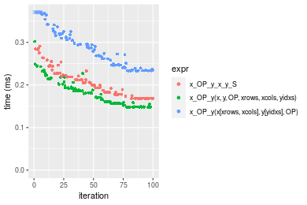


## Data type "double"
### Data
```r
> rmatrix <- function(nrow, ncol, mode = c("logical", "double", "integer", "index"), range = c(-100, 
+     +100), na_prob = 0) {
+     mode <- match.arg(mode)
+     n <- nrow * ncol
+     if (mode == "logical") {
+         x <- sample(c(FALSE, TRUE), size = n, replace = TRUE)
+     }     else if (mode == "index") {
+         x <- seq_len(n)
+         mode <- "integer"
+     }     else {
+         x <- runif(n, min = range[1], max = range[2])
+     }
+     storage.mode(x) <- mode
+     if (na_prob > 0) 
+         x[sample(n, size = na_prob * n)] <- NA
+     dim(x) <- c(nrow, ncol)
+     x
+ }
> rmatrices <- function(scale = 10, seed = 1, ...) {
+     set.seed(seed)
+     data <- list()
+     data[[1]] <- rmatrix(nrow = scale * 1, ncol = scale * 1, ...)
+     data[[2]] <- rmatrix(nrow = scale * 10, ncol = scale * 10, ...)
+     data[[3]] <- rmatrix(nrow = scale * 100, ncol = scale * 1, ...)
+     data[[4]] <- t(data[[3]])
+     data[[5]] <- rmatrix(nrow = scale * 10, ncol = scale * 100, ...)
+     data[[6]] <- t(data[[5]])
+     names(data) <- sapply(data, FUN = function(x) paste(dim(x), collapse = "x"))
+     data
+ }
> data <- rmatrices(mode = mode)
```

### Results

### 10x10 vector


```r
> x <- data[["10x10"]]
> y <- x[, 1L]
> xrows <- sample.int(nrow(x), size = nrow(x) * 0.7)
> xcols <- sample.int(ncol(x), size = ncol(x) * 0.7)
> x_S <- x[xrows, xcols]
> yidxs <- xrows
> y_S <- y[yidxs]
```

```r
> OP
[1] "+"
> stats <- microbenchmark(x_OP_y_x_y_S = x_OP_y(x_S, y_S, OP = OP, na.rm = FALSE), `x_OP_y(x, y, OP, xrows, xcols, yidxs)` = x_OP_y(x, 
+     y, OP = OP, xrows = xrows, xcols = xcols, yidxs = yidxs, na.rm = FALSE), `x_OP_y(x[xrows, xcols], y[yidxs], OP)` = x_OP_y(x[xrows, 
+     xcols], y[yidxs], OP = OP, na.rm = FALSE), unit = "ms")
```

_Table: Benchmarking of x_OP_y_x_y_S(), x_OP_y(x, y, OP, xrows, xcols, yidxs)() and x_OP_y(x[xrows, xcols], y[yidxs], OP)() on double+10x10+add data. The top panel shows times in milliseconds and the bottom panel shows relative times._


|   |expr                                  |      min|        lq|      mean|   median|        uq|      max|
|:--|:-------------------------------------|--------:|---------:|---------:|--------:|---------:|--------:|
|1  |x_OP_y_x_y_S                          | 0.004007| 0.0042435| 0.0046154| 0.004309| 0.0044575| 0.026006|
|2  |x_OP_y(x, y, OP, xrows, xcols, yidxs) | 0.004415| 0.0047690| 0.0051865| 0.004905| 0.0051000| 0.019105|
|3  |x_OP_y(x[xrows, xcols], y[yidxs], OP) | 0.005172| 0.0057000| 0.0059797| 0.005832| 0.0059885| 0.011790|


|   |expr                                  |      min|       lq|     mean|   median|       uq|       max|
|:--|:-------------------------------------|--------:|--------:|--------:|--------:|--------:|---------:|
|1  |x_OP_y_x_y_S                          | 1.000000| 1.000000| 1.000000| 1.000000| 1.000000| 1.0000000|
|2  |x_OP_y(x, y, OP, xrows, xcols, yidxs) | 1.101822| 1.123836| 1.123759| 1.138315| 1.144139| 0.7346382|
|3  |x_OP_y(x[xrows, xcols], y[yidxs], OP) | 1.290741| 1.343231| 1.295611| 1.353446| 1.343466| 0.4533569|

_Figure: Benchmarking of x_OP_y_x_y_S(), x_OP_y(x, y, OP, xrows, xcols, yidxs)() and x_OP_y(x[xrows, xcols], y[yidxs], OP)() on double+10x10+add data.  Outliers are displayed as crosses.  Times are in milliseconds._

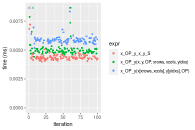

```r
> OP
[1] "-"
> stats <- microbenchmark(x_OP_y_x_y_S = x_OP_y(x_S, y_S, OP = OP, na.rm = FALSE), `x_OP_y(x, y, OP, xrows, xcols, yidxs)` = x_OP_y(x, 
+     y, OP = OP, xrows = xrows, xcols = xcols, yidxs = yidxs, na.rm = FALSE), `x_OP_y(x[xrows, xcols], y[yidxs], OP)` = x_OP_y(x[xrows, 
+     xcols], y[yidxs], OP = OP, na.rm = FALSE), unit = "ms")
```

_Table: Benchmarking of x_OP_y_x_y_S(), x_OP_y(x, y, OP, xrows, xcols, yidxs)() and x_OP_y(x[xrows, xcols], y[yidxs], OP)() on double+10x10+sub data. The top panel shows times in milliseconds and the bottom panel shows relative times._


|   |expr                                  |      min|        lq|      mean|    median|        uq|      max|
|:--|:-------------------------------------|--------:|---------:|---------:|---------:|---------:|--------:|
|1  |x_OP_y_x_y_S                          | 0.003924| 0.0042500| 0.0046433| 0.0043730| 0.0045035| 0.019671|
|2  |x_OP_y(x, y, OP, xrows, xcols, yidxs) | 0.004600| 0.0048475| 0.0052752| 0.0049585| 0.0051495| 0.027715|
|3  |x_OP_y(x[xrows, xcols], y[yidxs], OP) | 0.005362| 0.0057805| 0.0059265| 0.0058670| 0.0060230| 0.008279|


|   |expr                                  |      min|       lq|     mean|   median|       uq|       max|
|:--|:-------------------------------------|--------:|--------:|--------:|--------:|--------:|---------:|
|1  |x_OP_y_x_y_S                          | 1.000000| 1.000000| 1.000000| 1.000000| 1.000000| 1.0000000|
|2  |x_OP_y(x, y, OP, xrows, xcols, yidxs) | 1.172273| 1.140588| 1.136079| 1.133890| 1.143444| 1.4089268|
|3  |x_OP_y(x[xrows, xcols], y[yidxs], OP) | 1.366463| 1.360118| 1.276343| 1.341642| 1.337404| 0.4208734|

_Figure: Benchmarking of x_OP_y_x_y_S(), x_OP_y(x, y, OP, xrows, xcols, yidxs)() and x_OP_y(x[xrows, xcols], y[yidxs], OP)() on double+10x10+sub data.  Outliers are displayed as crosses.  Times are in milliseconds._

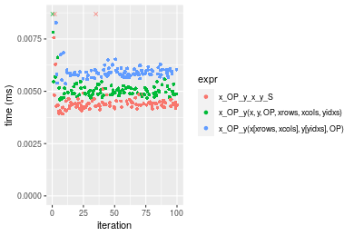

```r
> OP
[1] "*"
> stats <- microbenchmark(x_OP_y_x_y_S = x_OP_y(x_S, y_S, OP = OP, na.rm = FALSE), `x_OP_y(x, y, OP, xrows, xcols, yidxs)` = x_OP_y(x, 
+     y, OP = OP, xrows = xrows, xcols = xcols, yidxs = yidxs, na.rm = FALSE), `x_OP_y(x[xrows, xcols], y[yidxs], OP)` = x_OP_y(x[xrows, 
+     xcols], y[yidxs], OP = OP, na.rm = FALSE), unit = "ms")
```

_Table: Benchmarking of x_OP_y_x_y_S(), x_OP_y(x, y, OP, xrows, xcols, yidxs)() and x_OP_y(x[xrows, xcols], y[yidxs], OP)() on double+10x10+mul data. The top panel shows times in milliseconds and the bottom panel shows relative times._


|   |expr                                  |      min|        lq|      mean|    median|        uq|      max|
|:--|:-------------------------------------|--------:|---------:|---------:|---------:|---------:|--------:|
|1  |x_OP_y_x_y_S                          | 0.004143| 0.0044090| 0.0046136| 0.0045275| 0.0046970| 0.008978|
|2  |x_OP_y(x, y, OP, xrows, xcols, yidxs) | 0.004739| 0.0050370| 0.0052290| 0.0051570| 0.0052710| 0.009482|
|3  |x_OP_y(x[xrows, xcols], y[yidxs], OP) | 0.005533| 0.0059855| 0.0065448| 0.0060825| 0.0062325| 0.031994|


|   |expr                                  |      min|       lq|     mean|   median|       uq|      max|
|:--|:-------------------------------------|--------:|--------:|--------:|--------:|--------:|--------:|
|1  |x_OP_y_x_y_S                          | 1.000000| 1.000000| 1.000000| 1.000000| 1.000000| 1.000000|
|2  |x_OP_y(x, y, OP, xrows, xcols, yidxs) | 1.143857| 1.142436| 1.133396| 1.139039| 1.122206| 1.056137|
|3  |x_OP_y(x[xrows, xcols], y[yidxs], OP) | 1.335506| 1.357564| 1.418604| 1.343457| 1.326911| 3.563600|

_Figure: Benchmarking of x_OP_y_x_y_S(), x_OP_y(x, y, OP, xrows, xcols, yidxs)() and x_OP_y(x[xrows, xcols], y[yidxs], OP)() on double+10x10+mul data.  Outliers are displayed as crosses.  Times are in milliseconds._

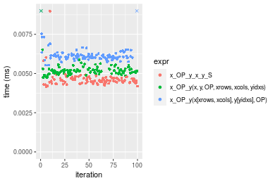

```r
> OP
[1] "/"
> stats <- microbenchmark(x_OP_y_x_y_S = x_OP_y(x_S, y_S, OP = OP, na.rm = FALSE), `x_OP_y(x, y, OP, xrows, xcols, yidxs)` = x_OP_y(x, 
+     y, OP = OP, xrows = xrows, xcols = xcols, yidxs = yidxs, na.rm = FALSE), `x_OP_y(x[xrows, xcols], y[yidxs], OP)` = x_OP_y(x[xrows, 
+     xcols], y[yidxs], OP = OP, na.rm = FALSE), unit = "ms")
```

_Table: Benchmarking of x_OP_y_x_y_S(), x_OP_y(x, y, OP, xrows, xcols, yidxs)() and x_OP_y(x[xrows, xcols], y[yidxs], OP)() on double+10x10+div data. The top panel shows times in milliseconds and the bottom panel shows relative times._


|   |expr                                  |      min|        lq|      mean|    median|        uq|      max|
|:--|:-------------------------------------|--------:|---------:|---------:|---------:|---------:|--------:|
|1  |x_OP_y_x_y_S                          | 0.004190| 0.0044060| 0.0048055| 0.0045145| 0.0046615| 0.028665|
|2  |x_OP_y(x, y, OP, xrows, xcols, yidxs) | 0.004829| 0.0050485| 0.0052809| 0.0052135| 0.0053430| 0.010504|
|3  |x_OP_y(x[xrows, xcols], y[yidxs], OP) | 0.005602| 0.0059510| 0.0061455| 0.0060545| 0.0062095| 0.012102|


|   |expr                                  |      min|       lq|     mean|   median|       uq|       max|
|:--|:-------------------------------------|--------:|--------:|--------:|--------:|--------:|---------:|
|1  |x_OP_y_x_y_S                          | 1.000000| 1.000000| 1.000000| 1.000000| 1.000000| 1.0000000|
|2  |x_OP_y(x, y, OP, xrows, xcols, yidxs) | 1.152506| 1.145824| 1.098922| 1.154834| 1.146198| 0.3664399|
|3  |x_OP_y(x[xrows, xcols], y[yidxs], OP) | 1.336993| 1.350658| 1.278839| 1.341123| 1.332082| 0.4221873|

_Figure: Benchmarking of x_OP_y_x_y_S(), x_OP_y(x, y, OP, xrows, xcols, yidxs)() and x_OP_y(x[xrows, xcols], y[yidxs], OP)() on double+10x10+div data.  Outliers are displayed as crosses.  Times are in milliseconds._


### 100x100 vector


```r
> x <- data[["100x100"]]
> y <- x[, 1L]
> xrows <- sample.int(nrow(x), size = nrow(x) * 0.7)
> xcols <- sample.int(ncol(x), size = ncol(x) * 0.7)
> x_S <- x[xrows, xcols]
> yidxs <- xrows
> y_S <- y[yidxs]
```

```r
> OP
[1] "+"
> stats <- microbenchmark(x_OP_y_x_y_S = x_OP_y(x_S, y_S, OP = OP, na.rm = FALSE), `x_OP_y(x, y, OP, xrows, xcols, yidxs)` = x_OP_y(x, 
+     y, OP = OP, xrows = xrows, xcols = xcols, yidxs = yidxs, na.rm = FALSE), `x_OP_y(x[xrows, xcols], y[yidxs], OP)` = x_OP_y(x[xrows, 
+     xcols], y[yidxs], OP = OP, na.rm = FALSE), unit = "ms")
```

_Table: Benchmarking of x_OP_y_x_y_S(), x_OP_y(x, y, OP, xrows, xcols, yidxs)() and x_OP_y(x[xrows, xcols], y[yidxs], OP)() on double+100x100+add data. The top panel shows times in milliseconds and the bottom panel shows relative times._


|   |expr                                  |      min|        lq|      mean|    median|        uq|      max|
|:--|:-------------------------------------|--------:|---------:|---------:|---------:|---------:|--------:|
|1  |x_OP_y_x_y_S                          | 0.018921| 0.0200560| 0.0208662| 0.0205905| 0.0209585| 0.047946|
|2  |x_OP_y(x, y, OP, xrows, xcols, yidxs) | 0.020011| 0.0212110| 0.0220968| 0.0216275| 0.0220920| 0.035997|
|3  |x_OP_y(x[xrows, xcols], y[yidxs], OP) | 0.034958| 0.0372825| 0.0384677| 0.0381305| 0.0385890| 0.053472|


|   |expr                                  |      min|       lq|     mean|   median|       uq|       max|
|:--|:-------------------------------------|--------:|--------:|--------:|--------:|--------:|---------:|
|1  |x_OP_y_x_y_S                          | 1.000000| 1.000000| 1.000000| 1.000000| 1.000000| 1.0000000|
|2  |x_OP_y(x, y, OP, xrows, xcols, yidxs) | 1.057608| 1.057589| 1.058975| 1.050363| 1.054083| 0.7507821|
|3  |x_OP_y(x[xrows, xcols], y[yidxs], OP) | 1.847577| 1.858920| 1.843544| 1.851849| 1.841210| 1.1152547|

_Figure: Benchmarking of x_OP_y_x_y_S(), x_OP_y(x, y, OP, xrows, xcols, yidxs)() and x_OP_y(x[xrows, xcols], y[yidxs], OP)() on double+100x100+add data.  Outliers are displayed as crosses.  Times are in milliseconds._

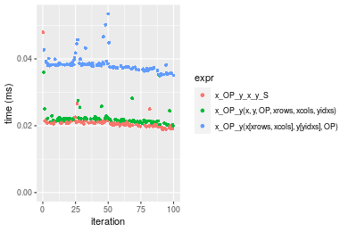

```r
> OP
[1] "-"
> stats <- microbenchmark(x_OP_y_x_y_S = x_OP_y(x_S, y_S, OP = OP, na.rm = FALSE), `x_OP_y(x, y, OP, xrows, xcols, yidxs)` = x_OP_y(x, 
+     y, OP = OP, xrows = xrows, xcols = xcols, yidxs = yidxs, na.rm = FALSE), `x_OP_y(x[xrows, xcols], y[yidxs], OP)` = x_OP_y(x[xrows, 
+     xcols], y[yidxs], OP = OP, na.rm = FALSE), unit = "ms")
```

_Table: Benchmarking of x_OP_y_x_y_S(), x_OP_y(x, y, OP, xrows, xcols, yidxs)() and x_OP_y(x[xrows, xcols], y[yidxs], OP)() on double+100x100+sub data. The top panel shows times in milliseconds and the bottom panel shows relative times._


|   |expr                                  |      min|       lq|      mean|    median|        uq|      max|
|:--|:-------------------------------------|--------:|--------:|---------:|---------:|---------:|--------:|
|2  |x_OP_y(x, y, OP, xrows, xcols, yidxs) | 0.019884| 0.020962| 0.0219376| 0.0215945| 0.0222645| 0.036253|
|1  |x_OP_y_x_y_S                          | 0.019865| 0.021299| 0.0228464| 0.0223555| 0.0230205| 0.037736|
|3  |x_OP_y(x[xrows, xcols], y[yidxs], OP) | 0.035511| 0.037379| 0.0396596| 0.0393995| 0.0400780| 0.078540|


|   |expr                                  |       min|       lq|     mean|   median|       uq|      max|
|:--|:-------------------------------------|---------:|--------:|--------:|--------:|--------:|--------:|
|2  |x_OP_y(x, y, OP, xrows, xcols, yidxs) | 1.0000000| 1.000000| 1.000000| 1.000000| 1.000000| 1.000000|
|1  |x_OP_y_x_y_S                          | 0.9990445| 1.016077| 1.041427| 1.035241| 1.033955| 1.040907|
|3  |x_OP_y(x[xrows, xcols], y[yidxs], OP) | 1.7859083| 1.783179| 1.807835| 1.824515| 1.800085| 2.166441|

_Figure: Benchmarking of x_OP_y_x_y_S(), x_OP_y(x, y, OP, xrows, xcols, yidxs)() and x_OP_y(x[xrows, xcols], y[yidxs], OP)() on double+100x100+sub data.  Outliers are displayed as crosses.  Times are in milliseconds._

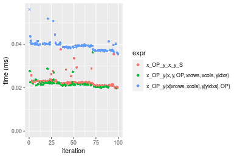

```r
> OP
[1] "*"
> stats <- microbenchmark(x_OP_y_x_y_S = x_OP_y(x_S, y_S, OP = OP, na.rm = FALSE), `x_OP_y(x, y, OP, xrows, xcols, yidxs)` = x_OP_y(x, 
+     y, OP = OP, xrows = xrows, xcols = xcols, yidxs = yidxs, na.rm = FALSE), `x_OP_y(x[xrows, xcols], y[yidxs], OP)` = x_OP_y(x[xrows, 
+     xcols], y[yidxs], OP = OP, na.rm = FALSE), unit = "ms")
```

_Table: Benchmarking of x_OP_y_x_y_S(), x_OP_y(x, y, OP, xrows, xcols, yidxs)() and x_OP_y(x[xrows, xcols], y[yidxs], OP)() on double+100x100+mul data. The top panel shows times in milliseconds and the bottom panel shows relative times._


|   |expr                                  |      min|        lq|      mean|    median|        uq|      max|
|:--|:-------------------------------------|--------:|---------:|---------:|---------:|---------:|--------:|
|1  |x_OP_y_x_y_S                          | 0.016755| 0.0179470| 0.0197936| 0.0188665| 0.0215640| 0.043107|
|2  |x_OP_y(x, y, OP, xrows, xcols, yidxs) | 0.017068| 0.0184285| 0.0195337| 0.0189670| 0.0195440| 0.033667|
|3  |x_OP_y(x[xrows, xcols], y[yidxs], OP) | 0.031789| 0.0347395| 0.0367148| 0.0362525| 0.0386495| 0.050281|


|   |expr                                  |      min|       lq|      mean|   median|        uq|      max|
|:--|:-------------------------------------|--------:|--------:|---------:|--------:|---------:|--------:|
|1  |x_OP_y_x_y_S                          | 1.000000| 1.000000| 1.0000000| 1.000000| 1.0000000| 1.000000|
|2  |x_OP_y(x, y, OP, xrows, xcols, yidxs) | 1.018681| 1.026829| 0.9868685| 1.005327| 0.9063254| 0.781010|
|3  |x_OP_y(x[xrows, xcols], y[yidxs], OP) | 1.897284| 1.935672| 1.8548853| 1.921528| 1.7923159| 1.166423|

_Figure: Benchmarking of x_OP_y_x_y_S(), x_OP_y(x, y, OP, xrows, xcols, yidxs)() and x_OP_y(x[xrows, xcols], y[yidxs], OP)() on double+100x100+mul data.  Outliers are displayed as crosses.  Times are in milliseconds._

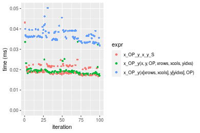

```r
> OP
[1] "/"
> stats <- microbenchmark(x_OP_y_x_y_S = x_OP_y(x_S, y_S, OP = OP, na.rm = FALSE), `x_OP_y(x, y, OP, xrows, xcols, yidxs)` = x_OP_y(x, 
+     y, OP = OP, xrows = xrows, xcols = xcols, yidxs = yidxs, na.rm = FALSE), `x_OP_y(x[xrows, xcols], y[yidxs], OP)` = x_OP_y(x[xrows, 
+     xcols], y[yidxs], OP = OP, na.rm = FALSE), unit = "ms")
```

_Table: Benchmarking of x_OP_y_x_y_S(), x_OP_y(x, y, OP, xrows, xcols, yidxs)() and x_OP_y(x[xrows, xcols], y[yidxs], OP)() on double+100x100+div data. The top panel shows times in milliseconds and the bottom panel shows relative times._


|   |expr                                  |      min|        lq|      mean|   median|        uq|      max|
|:--|:-------------------------------------|--------:|---------:|---------:|--------:|---------:|--------:|
|1  |x_OP_y_x_y_S                          | 0.020658| 0.0211830| 0.0219019| 0.021704| 0.0226035| 0.028553|
|2  |x_OP_y(x, y, OP, xrows, xcols, yidxs) | 0.021397| 0.0224315| 0.0238046| 0.022957| 0.0237585| 0.056920|
|3  |x_OP_y(x[xrows, xcols], y[yidxs], OP) | 0.035703| 0.0375210| 0.0394449| 0.038391| 0.0402820| 0.058048|


|   |expr                                  |      min|       lq|     mean|   median|       uq|      max|
|:--|:-------------------------------------|--------:|--------:|--------:|--------:|--------:|--------:|
|1  |x_OP_y_x_y_S                          | 1.000000| 1.000000| 1.000000| 1.000000| 1.000000| 1.000000|
|2  |x_OP_y(x, y, OP, xrows, xcols, yidxs) | 1.035773| 1.058939| 1.086873| 1.057731| 1.051098| 1.993486|
|3  |x_OP_y(x[xrows, xcols], y[yidxs], OP) | 1.728289| 1.771279| 1.800982| 1.768844| 1.782113| 2.032991|

_Figure: Benchmarking of x_OP_y_x_y_S(), x_OP_y(x, y, OP, xrows, xcols, yidxs)() and x_OP_y(x[xrows, xcols], y[yidxs], OP)() on double+100x100+div data.  Outliers are displayed as crosses.  Times are in milliseconds._

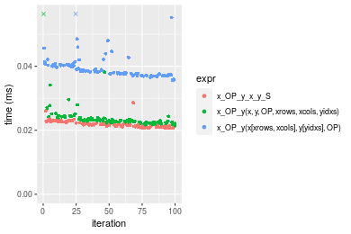


### 1000x10 vector


```r
> x <- data[["1000x10"]]
> y <- x[, 1L]
> xrows <- sample.int(nrow(x), size = nrow(x) * 0.7)
> xcols <- sample.int(ncol(x), size = ncol(x) * 0.7)
> x_S <- x[xrows, xcols]
> yidxs <- xrows
> y_S <- y[yidxs]
```

```r
> OP
[1] "+"
> stats <- microbenchmark(x_OP_y_x_y_S = x_OP_y(x_S, y_S, OP = OP, na.rm = FALSE), `x_OP_y(x, y, OP, xrows, xcols, yidxs)` = x_OP_y(x, 
+     y, OP = OP, xrows = xrows, xcols = xcols, yidxs = yidxs, na.rm = FALSE), `x_OP_y(x[xrows, xcols], y[yidxs], OP)` = x_OP_y(x[xrows, 
+     xcols], y[yidxs], OP = OP, na.rm = FALSE), unit = "ms")
```

_Table: Benchmarking of x_OP_y_x_y_S(), x_OP_y(x, y, OP, xrows, xcols, yidxs)() and x_OP_y(x[xrows, xcols], y[yidxs], OP)() on double+1000x10+add data. The top panel shows times in milliseconds and the bottom panel shows relative times._


|   |expr                                  |      min|        lq|      mean|   median|        uq|      max|
|:--|:-------------------------------------|--------:|---------:|---------:|--------:|---------:|--------:|
|1  |x_OP_y_x_y_S                          | 0.017948| 0.0190455| 0.0196756| 0.019635| 0.0199815| 0.026537|
|2  |x_OP_y(x, y, OP, xrows, xcols, yidxs) | 0.023462| 0.0247585| 0.0258214| 0.025403| 0.0261505| 0.038817|
|3  |x_OP_y(x[xrows, xcols], y[yidxs], OP) | 0.035203| 0.0380690| 0.0400503| 0.039363| 0.0401285| 0.074188|


|   |expr                                  |      min|       lq|     mean|   median|       uq|      max|
|:--|:-------------------------------------|--------:|--------:|--------:|--------:|--------:|--------:|
|1  |x_OP_y_x_y_S                          | 1.000000| 1.000000| 1.000000| 1.000000| 1.000000| 1.000000|
|2  |x_OP_y(x, y, OP, xrows, xcols, yidxs) | 1.307221| 1.299966| 1.312355| 1.293761| 1.308736| 1.462750|
|3  |x_OP_y(x[xrows, xcols], y[yidxs], OP) | 1.961388| 1.998845| 2.035529| 2.004736| 2.008283| 2.795644|

_Figure: Benchmarking of x_OP_y_x_y_S(), x_OP_y(x, y, OP, xrows, xcols, yidxs)() and x_OP_y(x[xrows, xcols], y[yidxs], OP)() on double+1000x10+add data.  Outliers are displayed as crosses.  Times are in milliseconds._


```r
> OP
[1] "-"
> stats <- microbenchmark(x_OP_y_x_y_S = x_OP_y(x_S, y_S, OP = OP, na.rm = FALSE), `x_OP_y(x, y, OP, xrows, xcols, yidxs)` = x_OP_y(x, 
+     y, OP = OP, xrows = xrows, xcols = xcols, yidxs = yidxs, na.rm = FALSE), `x_OP_y(x[xrows, xcols], y[yidxs], OP)` = x_OP_y(x[xrows, 
+     xcols], y[yidxs], OP = OP, na.rm = FALSE), unit = "ms")
```

_Table: Benchmarking of x_OP_y_x_y_S(), x_OP_y(x, y, OP, xrows, xcols, yidxs)() and x_OP_y(x[xrows, xcols], y[yidxs], OP)() on double+1000x10+sub data. The top panel shows times in milliseconds and the bottom panel shows relative times._


|   |expr                                  |      min|        lq|      mean|    median|        uq|      max|
|:--|:-------------------------------------|--------:|---------:|---------:|---------:|---------:|--------:|
|1  |x_OP_y_x_y_S                          | 0.019271| 0.0205785| 0.0219720| 0.0214275| 0.0222635| 0.036208|
|2  |x_OP_y(x, y, OP, xrows, xcols, yidxs) | 0.023510| 0.0245950| 0.0256708| 0.0257655| 0.0261990| 0.031045|
|3  |x_OP_y(x[xrows, xcols], y[yidxs], OP) | 0.038267| 0.0393525| 0.0418808| 0.0416540| 0.0421725| 0.079506|


|   |expr                                  |      min|       lq|     mean|  median|       uq|       max|
|:--|:-------------------------------------|--------:|--------:|--------:|-------:|--------:|---------:|
|1  |x_OP_y_x_y_S                          | 1.000000| 1.000000| 1.000000| 1.00000| 1.000000| 1.0000000|
|2  |x_OP_y(x, y, OP, xrows, xcols, yidxs) | 1.219968| 1.195179| 1.168343| 1.20245| 1.176769| 0.8574072|
|3  |x_OP_y(x[xrows, xcols], y[yidxs], OP) | 1.985730| 1.912311| 1.906099| 1.94395| 1.894244| 2.1958131|

_Figure: Benchmarking of x_OP_y_x_y_S(), x_OP_y(x, y, OP, xrows, xcols, yidxs)() and x_OP_y(x[xrows, xcols], y[yidxs], OP)() on double+1000x10+sub data.  Outliers are displayed as crosses.  Times are in milliseconds._


```r
> OP
[1] "*"
> stats <- microbenchmark(x_OP_y_x_y_S = x_OP_y(x_S, y_S, OP = OP, na.rm = FALSE), `x_OP_y(x, y, OP, xrows, xcols, yidxs)` = x_OP_y(x, 
+     y, OP = OP, xrows = xrows, xcols = xcols, yidxs = yidxs, na.rm = FALSE), `x_OP_y(x[xrows, xcols], y[yidxs], OP)` = x_OP_y(x[xrows, 
+     xcols], y[yidxs], OP = OP, na.rm = FALSE), unit = "ms")
```

_Table: Benchmarking of x_OP_y_x_y_S(), x_OP_y(x, y, OP, xrows, xcols, yidxs)() and x_OP_y(x[xrows, xcols], y[yidxs], OP)() on double+1000x10+mul data. The top panel shows times in milliseconds and the bottom panel shows relative times._


|   |expr                                  |      min|       lq|      mean|    median|        uq|      max|
|:--|:-------------------------------------|--------:|--------:|---------:|---------:|---------:|--------:|
|1  |x_OP_y_x_y_S                          | 0.015671| 0.016612| 0.0177387| 0.0172290| 0.0185950| 0.032977|
|2  |x_OP_y(x, y, OP, xrows, xcols, yidxs) | 0.020567| 0.021725| 0.0228417| 0.0224510| 0.0233540| 0.038974|
|3  |x_OP_y(x[xrows, xcols], y[yidxs], OP) | 0.033540| 0.035821| 0.0380847| 0.0378045| 0.0382185| 0.072395|


|   |expr                                  |      min|       lq|     mean|   median|       uq|      max|
|:--|:-------------------------------------|--------:|--------:|--------:|--------:|--------:|--------:|
|1  |x_OP_y_x_y_S                          | 1.000000| 1.000000| 1.000000| 1.000000| 1.000000| 1.000000|
|2  |x_OP_y(x, y, OP, xrows, xcols, yidxs) | 1.312424| 1.307789| 1.287680| 1.303094| 1.255929| 1.181854|
|3  |x_OP_y(x[xrows, xcols], y[yidxs], OP) | 2.140259| 2.156333| 2.146989| 2.194237| 2.055311| 2.195318|

_Figure: Benchmarking of x_OP_y_x_y_S(), x_OP_y(x, y, OP, xrows, xcols, yidxs)() and x_OP_y(x[xrows, xcols], y[yidxs], OP)() on double+1000x10+mul data.  Outliers are displayed as crosses.  Times are in milliseconds._

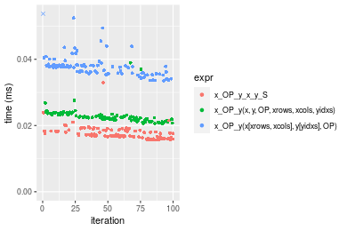

```r
> OP
[1] "/"
> stats <- microbenchmark(x_OP_y_x_y_S = x_OP_y(x_S, y_S, OP = OP, na.rm = FALSE), `x_OP_y(x, y, OP, xrows, xcols, yidxs)` = x_OP_y(x, 
+     y, OP = OP, xrows = xrows, xcols = xcols, yidxs = yidxs, na.rm = FALSE), `x_OP_y(x[xrows, xcols], y[yidxs], OP)` = x_OP_y(x[xrows, 
+     xcols], y[yidxs], OP = OP, na.rm = FALSE), unit = "ms")
```

_Table: Benchmarking of x_OP_y_x_y_S(), x_OP_y(x, y, OP, xrows, xcols, yidxs)() and x_OP_y(x[xrows, xcols], y[yidxs], OP)() on double+1000x10+div data. The top panel shows times in milliseconds and the bottom panel shows relative times._


|   |expr                                  |      min|        lq|      mean|    median|        uq|      max|
|:--|:-------------------------------------|--------:|---------:|---------:|---------:|---------:|--------:|
|1  |x_OP_y_x_y_S                          | 0.017455| 0.0183825| 0.0194611| 0.0188340| 0.0194310| 0.049882|
|2  |x_OP_y(x, y, OP, xrows, xcols, yidxs) | 0.022128| 0.0226470| 0.0238869| 0.0231430| 0.0235045| 0.070870|
|3  |x_OP_y(x[xrows, xcols], y[yidxs], OP) | 0.033198| 0.0342730| 0.0360986| 0.0352025| 0.0362200| 0.055394|


|   |expr                                  |      min|       lq|     mean|   median|       uq|      max|
|:--|:-------------------------------------|--------:|--------:|--------:|--------:|--------:|--------:|
|1  |x_OP_y_x_y_S                          | 1.000000| 1.000000| 1.000000| 1.000000| 1.000000| 1.000000|
|2  |x_OP_y(x, y, OP, xrows, xcols, yidxs) | 1.267717| 1.231987| 1.227422| 1.228788| 1.209639| 1.420753|
|3  |x_OP_y(x[xrows, xcols], y[yidxs], OP) | 1.901919| 1.864436| 1.854915| 1.869093| 1.864032| 1.110501|

_Figure: Benchmarking of x_OP_y_x_y_S(), x_OP_y(x, y, OP, xrows, xcols, yidxs)() and x_OP_y(x[xrows, xcols], y[yidxs], OP)() on double+1000x10+div data.  Outliers are displayed as crosses.  Times are in milliseconds._


### 10x1000 vector


```r
> x <- data[["10x1000"]]
> y <- x[, 1L]
> xrows <- sample.int(nrow(x), size = nrow(x) * 0.7)
> xcols <- sample.int(ncol(x), size = ncol(x) * 0.7)
> x_S <- x[xrows, xcols]
> yidxs <- xrows
> y_S <- y[yidxs]
```

```r
> OP
[1] "+"
> stats <- microbenchmark(x_OP_y_x_y_S = x_OP_y(x_S, y_S, OP = OP, na.rm = FALSE), `x_OP_y(x, y, OP, xrows, xcols, yidxs)` = x_OP_y(x, 
+     y, OP = OP, xrows = xrows, xcols = xcols, yidxs = yidxs, na.rm = FALSE), `x_OP_y(x[xrows, xcols], y[yidxs], OP)` = x_OP_y(x[xrows, 
+     xcols], y[yidxs], OP = OP, na.rm = FALSE), unit = "ms")
```

_Table: Benchmarking of x_OP_y_x_y_S(), x_OP_y(x, y, OP, xrows, xcols, yidxs)() and x_OP_y(x[xrows, xcols], y[yidxs], OP)() on double+10x1000+add data. The top panel shows times in milliseconds and the bottom panel shows relative times._


|   |expr                                  |      min|        lq|      mean|    median|        uq|      max|
|:--|:-------------------------------------|--------:|---------:|---------:|---------:|---------:|--------:|
|1  |x_OP_y_x_y_S                          | 0.019165| 0.0200490| 0.0213936| 0.0210015| 0.0217435| 0.040746|
|2  |x_OP_y(x, y, OP, xrows, xcols, yidxs) | 0.022015| 0.0224620| 0.0247404| 0.0241405| 0.0252130| 0.046853|
|3  |x_OP_y(x[xrows, xcols], y[yidxs], OP) | 0.037404| 0.0387665| 0.0416224| 0.0412025| 0.0425965| 0.087210|


|   |expr                                  |      min|       lq|     mean|   median|       uq|      max|
|:--|:-------------------------------------|--------:|--------:|--------:|--------:|--------:|--------:|
|1  |x_OP_y_x_y_S                          | 1.000000| 1.000000| 1.000000| 1.000000| 1.000000| 1.000000|
|2  |x_OP_y(x, y, OP, xrows, xcols, yidxs) | 1.148709| 1.120355| 1.156442| 1.149466| 1.159565| 1.149880|
|3  |x_OP_y(x[xrows, xcols], y[yidxs], OP) | 1.951683| 1.933588| 1.945554| 1.961884| 1.959045| 2.140333|

_Figure: Benchmarking of x_OP_y_x_y_S(), x_OP_y(x, y, OP, xrows, xcols, yidxs)() and x_OP_y(x[xrows, xcols], y[yidxs], OP)() on double+10x1000+add data.  Outliers are displayed as crosses.  Times are in milliseconds._

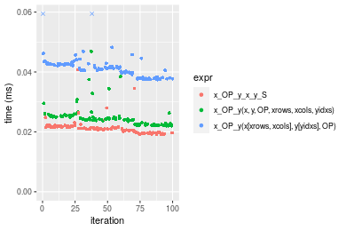

```r
> OP
[1] "-"
> stats <- microbenchmark(x_OP_y_x_y_S = x_OP_y(x_S, y_S, OP = OP, na.rm = FALSE), `x_OP_y(x, y, OP, xrows, xcols, yidxs)` = x_OP_y(x, 
+     y, OP = OP, xrows = xrows, xcols = xcols, yidxs = yidxs, na.rm = FALSE), `x_OP_y(x[xrows, xcols], y[yidxs], OP)` = x_OP_y(x[xrows, 
+     xcols], y[yidxs], OP = OP, na.rm = FALSE), unit = "ms")
```

_Table: Benchmarking of x_OP_y_x_y_S(), x_OP_y(x, y, OP, xrows, xcols, yidxs)() and x_OP_y(x[xrows, xcols], y[yidxs], OP)() on double+10x1000+sub data. The top panel shows times in milliseconds and the bottom panel shows relative times._


|   |expr                                  |      min|        lq|      mean|    median|        uq|      max|
|:--|:-------------------------------------|--------:|---------:|---------:|---------:|---------:|--------:|
|1  |x_OP_y_x_y_S                          | 0.021663| 0.0230445| 0.0244748| 0.0235825| 0.0239975| 0.057882|
|2  |x_OP_y(x, y, OP, xrows, xcols, yidxs) | 0.023220| 0.0243250| 0.0258979| 0.0251470| 0.0256180| 0.058005|
|3  |x_OP_y(x[xrows, xcols], y[yidxs], OP) | 0.040878| 0.0426105| 0.0453638| 0.0440105| 0.0445710| 0.090679|


|   |expr                                  |      min|       lq|     mean|   median|       uq|      max|
|:--|:-------------------------------------|--------:|--------:|--------:|--------:|--------:|--------:|
|1  |x_OP_y_x_y_S                          | 1.000000| 1.000000| 1.000000| 1.000000| 1.000000| 1.000000|
|2  |x_OP_y(x, y, OP, xrows, xcols, yidxs) | 1.071874| 1.055566| 1.058149| 1.066342| 1.067528| 1.002125|
|3  |x_OP_y(x[xrows, xcols], y[yidxs], OP) | 1.886996| 1.849053| 1.853495| 1.866236| 1.857319| 1.566618|

_Figure: Benchmarking of x_OP_y_x_y_S(), x_OP_y(x, y, OP, xrows, xcols, yidxs)() and x_OP_y(x[xrows, xcols], y[yidxs], OP)() on double+10x1000+sub data.  Outliers are displayed as crosses.  Times are in milliseconds._

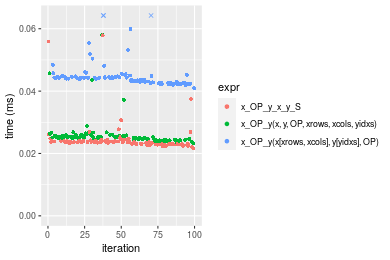

```r
> OP
[1] "*"
> stats <- microbenchmark(x_OP_y_x_y_S = x_OP_y(x_S, y_S, OP = OP, na.rm = FALSE), `x_OP_y(x, y, OP, xrows, xcols, yidxs)` = x_OP_y(x, 
+     y, OP = OP, xrows = xrows, xcols = xcols, yidxs = yidxs, na.rm = FALSE), `x_OP_y(x[xrows, xcols], y[yidxs], OP)` = x_OP_y(x[xrows, 
+     xcols], y[yidxs], OP = OP, na.rm = FALSE), unit = "ms")
```

_Table: Benchmarking of x_OP_y_x_y_S(), x_OP_y(x, y, OP, xrows, xcols, yidxs)() and x_OP_y(x[xrows, xcols], y[yidxs], OP)() on double+10x1000+mul data. The top panel shows times in milliseconds and the bottom panel shows relative times._


|   |expr                                  |      min|        lq|      mean|    median|        uq|      max|
|:--|:-------------------------------------|--------:|---------:|---------:|---------:|---------:|--------:|
|1  |x_OP_y_x_y_S                          | 0.018644| 0.0199625| 0.0212947| 0.0206335| 0.0216025| 0.049270|
|2  |x_OP_y(x, y, OP, xrows, xcols, yidxs) | 0.019222| 0.0206365| 0.0216590| 0.0214130| 0.0221410| 0.036155|
|3  |x_OP_y(x[xrows, xcols], y[yidxs], OP) | 0.036794| 0.0391210| 0.0412337| 0.0408730| 0.0419065| 0.065178|


|   |expr                                  |      min|       lq|     mean|   median|       uq|       max|
|:--|:-------------------------------------|--------:|--------:|--------:|--------:|--------:|---------:|
|1  |x_OP_y_x_y_S                          | 1.000000| 1.000000| 1.000000| 1.000000| 1.000000| 1.0000000|
|2  |x_OP_y(x, y, OP, xrows, xcols, yidxs) | 1.031002| 1.033763| 1.017109| 1.037778| 1.024928| 0.7338137|
|3  |x_OP_y(x[xrows, xcols], y[yidxs], OP) | 1.973504| 1.959725| 1.936335| 1.980905| 1.939891| 1.3228740|

_Figure: Benchmarking of x_OP_y_x_y_S(), x_OP_y(x, y, OP, xrows, xcols, yidxs)() and x_OP_y(x[xrows, xcols], y[yidxs], OP)() on double+10x1000+mul data.  Outliers are displayed as crosses.  Times are in milliseconds._

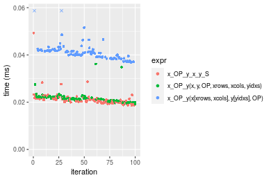

```r
> OP
[1] "/"
> stats <- microbenchmark(x_OP_y_x_y_S = x_OP_y(x_S, y_S, OP = OP, na.rm = FALSE), `x_OP_y(x, y, OP, xrows, xcols, yidxs)` = x_OP_y(x, 
+     y, OP = OP, xrows = xrows, xcols = xcols, yidxs = yidxs, na.rm = FALSE), `x_OP_y(x[xrows, xcols], y[yidxs], OP)` = x_OP_y(x[xrows, 
+     xcols], y[yidxs], OP = OP, na.rm = FALSE), unit = "ms")
```

_Table: Benchmarking of x_OP_y_x_y_S(), x_OP_y(x, y, OP, xrows, xcols, yidxs)() and x_OP_y(x[xrows, xcols], y[yidxs], OP)() on double+10x1000+div data. The top panel shows times in milliseconds and the bottom panel shows relative times._


|   |expr                                  |      min|        lq|      mean|    median|       uq|      max|
|:--|:-------------------------------------|--------:|---------:|---------:|---------:|--------:|--------:|
|1  |x_OP_y_x_y_S                          | 0.020488| 0.0217060| 0.0223496| 0.0220785| 0.022611| 0.027915|
|2  |x_OP_y(x, y, OP, xrows, xcols, yidxs) | 0.023204| 0.0247455| 0.0257294| 0.0253595| 0.025990| 0.038179|
|3  |x_OP_y(x[xrows, xcols], y[yidxs], OP) | 0.038994| 0.0408990| 0.0430385| 0.0418220| 0.043412| 0.089404|


|   |expr                                  |      min|       lq|     mean|   median|       uq|      max|
|:--|:-------------------------------------|--------:|--------:|--------:|--------:|--------:|--------:|
|1  |x_OP_y_x_y_S                          | 1.000000| 1.000000| 1.000000| 1.000000| 1.000000| 1.000000|
|2  |x_OP_y(x, y, OP, xrows, xcols, yidxs) | 1.132565| 1.140030| 1.151225| 1.148606| 1.149441| 1.367688|
|3  |x_OP_y(x[xrows, xcols], y[yidxs], OP) | 1.903260| 1.884226| 1.925697| 1.894241| 1.919950| 3.202723|

_Figure: Benchmarking of x_OP_y_x_y_S(), x_OP_y(x, y, OP, xrows, xcols, yidxs)() and x_OP_y(x[xrows, xcols], y[yidxs], OP)() on double+10x1000+div data.  Outliers are displayed as crosses.  Times are in milliseconds._

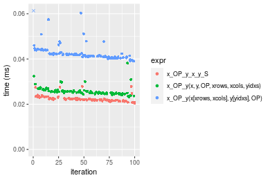


### 100x1000 vector


```r
> x <- data[["100x1000"]]
> y <- x[, 1L]
> xrows <- sample.int(nrow(x), size = nrow(x) * 0.7)
> xcols <- sample.int(ncol(x), size = ncol(x) * 0.7)
> x_S <- x[xrows, xcols]
> yidxs <- xrows
> y_S <- y[yidxs]
```

```r
> OP
[1] "+"
> stats <- microbenchmark(x_OP_y_x_y_S = x_OP_y(x_S, y_S, OP = OP, na.rm = FALSE), `x_OP_y(x, y, OP, xrows, xcols, yidxs)` = x_OP_y(x, 
+     y, OP = OP, xrows = xrows, xcols = xcols, yidxs = yidxs, na.rm = FALSE), `x_OP_y(x[xrows, xcols], y[yidxs], OP)` = x_OP_y(x[xrows, 
+     xcols], y[yidxs], OP = OP, na.rm = FALSE), unit = "ms")
```

_Table: Benchmarking of x_OP_y_x_y_S(), x_OP_y(x, y, OP, xrows, xcols, yidxs)() and x_OP_y(x[xrows, xcols], y[yidxs], OP)() on double+100x1000+add data. The top panel shows times in milliseconds and the bottom panel shows relative times._


|   |expr                                  |      min|        lq|      mean|    median|        uq|      max|
|:--|:-------------------------------------|--------:|---------:|---------:|---------:|---------:|--------:|
|2  |x_OP_y(x, y, OP, xrows, xcols, yidxs) | 0.111212| 0.1171325| 0.1428754| 0.1264610| 0.1461250| 0.246682|
|1  |x_OP_y_x_y_S                          | 0.112956| 0.1240785| 0.1563260| 0.1325065| 0.1806025| 0.256439|
|3  |x_OP_y(x[xrows, xcols], y[yidxs], OP) | 0.221258| 0.2361565| 0.3000092| 0.2565715| 0.3174245| 0.476788|


|   |expr                                  |      min|       lq|     mean|   median|       uq|      max|
|:--|:-------------------------------------|--------:|--------:|--------:|--------:|--------:|--------:|
|2  |x_OP_y(x, y, OP, xrows, xcols, yidxs) | 1.000000| 1.000000| 1.000000| 1.000000| 1.000000| 1.000000|
|1  |x_OP_y_x_y_S                          | 1.015682| 1.059300| 1.094142| 1.047805| 1.235945| 1.039553|
|3  |x_OP_y(x[xrows, xcols], y[yidxs], OP) | 1.989515| 2.016148| 2.099795| 2.028859| 2.172281| 1.932804|

_Figure: Benchmarking of x_OP_y_x_y_S(), x_OP_y(x, y, OP, xrows, xcols, yidxs)() and x_OP_y(x[xrows, xcols], y[yidxs], OP)() on double+100x1000+add data.  Outliers are displayed as crosses.  Times are in milliseconds._

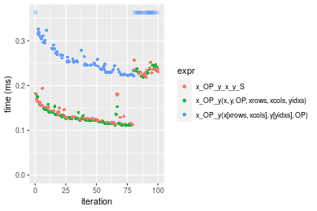

```r
> OP
[1] "-"
> stats <- microbenchmark(x_OP_y_x_y_S = x_OP_y(x_S, y_S, OP = OP, na.rm = FALSE), `x_OP_y(x, y, OP, xrows, xcols, yidxs)` = x_OP_y(x, 
+     y, OP = OP, xrows = xrows, xcols = xcols, yidxs = yidxs, na.rm = FALSE), `x_OP_y(x[xrows, xcols], y[yidxs], OP)` = x_OP_y(x[xrows, 
+     xcols], y[yidxs], OP = OP, na.rm = FALSE), unit = "ms")
```

_Table: Benchmarking of x_OP_y_x_y_S(), x_OP_y(x, y, OP, xrows, xcols, yidxs)() and x_OP_y(x[xrows, xcols], y[yidxs], OP)() on double+100x1000+sub data. The top panel shows times in milliseconds and the bottom panel shows relative times._


|   |expr                                  |      min|        lq|      mean|    median|       uq|      max|
|:--|:-------------------------------------|--------:|---------:|---------:|---------:|--------:|--------:|
|2  |x_OP_y(x, y, OP, xrows, xcols, yidxs) | 0.099193| 0.1084515| 0.1216147| 0.1185555| 0.129359| 0.181530|
|1  |x_OP_y_x_y_S                          | 0.113058| 0.1194550| 0.1381332| 0.1342135| 0.149449| 0.199032|
|3  |x_OP_y(x[xrows, xcols], y[yidxs], OP) | 0.211295| 0.2368895| 0.2643763| 0.2567880| 0.282842| 0.464185|


|   |expr                                  |      min|      lq|     mean|   median|       uq|      max|
|:--|:-------------------------------------|--------:|-------:|--------:|--------:|--------:|--------:|
|2  |x_OP_y(x, y, OP, xrows, xcols, yidxs) | 1.000000| 1.00000| 1.000000| 1.000000| 1.000000| 1.000000|
|1  |x_OP_y_x_y_S                          | 1.139778| 1.10146| 1.135827| 1.132073| 1.155304| 1.096414|
|3  |x_OP_y(x[xrows, xcols], y[yidxs], OP) | 2.130140| 2.18429| 2.173885| 2.165973| 2.186489| 2.557071|

_Figure: Benchmarking of x_OP_y_x_y_S(), x_OP_y(x, y, OP, xrows, xcols, yidxs)() and x_OP_y(x[xrows, xcols], y[yidxs], OP)() on double+100x1000+sub data.  Outliers are displayed as crosses.  Times are in milliseconds._

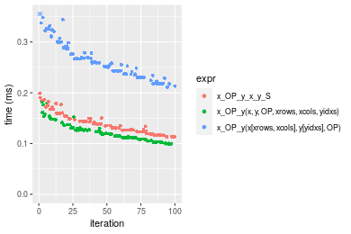

```r
> OP
[1] "*"
> stats <- microbenchmark(x_OP_y_x_y_S = x_OP_y(x_S, y_S, OP = OP, na.rm = FALSE), `x_OP_y(x, y, OP, xrows, xcols, yidxs)` = x_OP_y(x, 
+     y, OP = OP, xrows = xrows, xcols = xcols, yidxs = yidxs, na.rm = FALSE), `x_OP_y(x[xrows, xcols], y[yidxs], OP)` = x_OP_y(x[xrows, 
+     xcols], y[yidxs], OP = OP, na.rm = FALSE), unit = "ms")
```

_Table: Benchmarking of x_OP_y_x_y_S(), x_OP_y(x, y, OP, xrows, xcols, yidxs)() and x_OP_y(x[xrows, xcols], y[yidxs], OP)() on double+100x1000+mul data. The top panel shows times in milliseconds and the bottom panel shows relative times._


|   |expr                                  |      min|       lq|      mean|    median|        uq|      max|
|:--|:-------------------------------------|--------:|--------:|---------:|---------:|---------:|--------:|
|2  |x_OP_y(x, y, OP, xrows, xcols, yidxs) | 0.090981| 0.099252| 0.1115135| 0.1066405| 0.1221585| 0.249941|
|1  |x_OP_y_x_y_S                          | 0.092870| 0.103781| 0.1157310| 0.1112165| 0.1258340| 0.184918|
|3  |x_OP_y(x[xrows, xcols], y[yidxs], OP) | 0.198043| 0.217417| 0.2398771| 0.2366935| 0.2543620| 0.320824|


|   |expr                                  |      min|       lq|     mean|   median|       uq|       max|
|:--|:-------------------------------------|--------:|--------:|--------:|--------:|--------:|---------:|
|2  |x_OP_y(x, y, OP, xrows, xcols, yidxs) | 1.000000| 1.000000| 1.000000| 1.000000| 1.000000| 1.0000000|
|1  |x_OP_y_x_y_S                          | 1.020763| 1.045631| 1.037821| 1.042911| 1.030088| 0.7398466|
|3  |x_OP_y(x[xrows, xcols], y[yidxs], OP) | 2.176751| 2.190555| 2.151104| 2.219546| 2.082229| 1.2835989|

_Figure: Benchmarking of x_OP_y_x_y_S(), x_OP_y(x, y, OP, xrows, xcols, yidxs)() and x_OP_y(x[xrows, xcols], y[yidxs], OP)() on double+100x1000+mul data.  Outliers are displayed as crosses.  Times are in milliseconds._

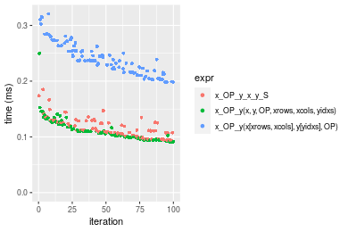

```r
> OP
[1] "/"
> stats <- microbenchmark(x_OP_y_x_y_S = x_OP_y(x_S, y_S, OP = OP, na.rm = FALSE), `x_OP_y(x, y, OP, xrows, xcols, yidxs)` = x_OP_y(x, 
+     y, OP = OP, xrows = xrows, xcols = xcols, yidxs = yidxs, na.rm = FALSE), `x_OP_y(x[xrows, xcols], y[yidxs], OP)` = x_OP_y(x[xrows, 
+     xcols], y[yidxs], OP = OP, na.rm = FALSE), unit = "ms")
```

_Table: Benchmarking of x_OP_y_x_y_S(), x_OP_y(x, y, OP, xrows, xcols, yidxs)() and x_OP_y(x[xrows, xcols], y[yidxs], OP)() on double+100x1000+div data. The top panel shows times in milliseconds and the bottom panel shows relative times._


|   |expr                                  |      min|       lq|      mean|    median|        uq|      max|
|:--|:-------------------------------------|--------:|--------:|---------:|---------:|---------:|--------:|
|1  |x_OP_y_x_y_S                          | 0.110208| 0.122033| 0.1376094| 0.1345310| 0.1491830| 0.198168|
|2  |x_OP_y(x, y, OP, xrows, xcols, yidxs) | 0.108664| 0.124796| 0.1410654| 0.1374735| 0.1560285| 0.303923|
|3  |x_OP_y(x[xrows, xcols], y[yidxs], OP) | 0.206159| 0.224439| 0.2553685| 0.2498510| 0.2713090| 0.352952|


|   |expr                                  |       min|       lq|     mean|   median|       uq|      max|
|:--|:-------------------------------------|---------:|--------:|--------:|--------:|--------:|--------:|
|1  |x_OP_y_x_y_S                          | 1.0000000| 1.000000| 1.000000| 1.000000| 1.000000| 1.000000|
|2  |x_OP_y(x, y, OP, xrows, xcols, yidxs) | 0.9859901| 1.022641| 1.025115| 1.021872| 1.045887| 1.533663|
|3  |x_OP_y(x[xrows, xcols], y[yidxs], OP) | 1.8706355| 1.839166| 1.855750| 1.857200| 1.818632| 1.781075|

_Figure: Benchmarking of x_OP_y_x_y_S(), x_OP_y(x, y, OP, xrows, xcols, yidxs)() and x_OP_y(x[xrows, xcols], y[yidxs], OP)() on double+100x1000+div data.  Outliers are displayed as crosses.  Times are in milliseconds._

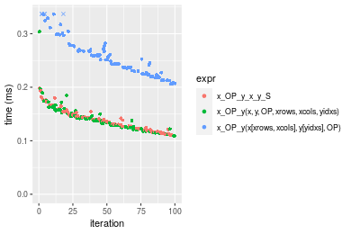


### 1000x100 vector


```r
> x <- data[["1000x100"]]
> y <- x[, 1L]
> xrows <- sample.int(nrow(x), size = nrow(x) * 0.7)
> xcols <- sample.int(ncol(x), size = ncol(x) * 0.7)
> x_S <- x[xrows, xcols]
> yidxs <- xrows
> y_S <- y[yidxs]
```

```r
> OP
[1] "+"
> stats <- microbenchmark(x_OP_y_x_y_S = x_OP_y(x_S, y_S, OP = OP, na.rm = FALSE), `x_OP_y(x, y, OP, xrows, xcols, yidxs)` = x_OP_y(x, 
+     y, OP = OP, xrows = xrows, xcols = xcols, yidxs = yidxs, na.rm = FALSE), `x_OP_y(x[xrows, xcols], y[yidxs], OP)` = x_OP_y(x[xrows, 
+     xcols], y[yidxs], OP = OP, na.rm = FALSE), unit = "ms")
```

_Table: Benchmarking of x_OP_y_x_y_S(), x_OP_y(x, y, OP, xrows, xcols, yidxs)() and x_OP_y(x[xrows, xcols], y[yidxs], OP)() on double+1000x100+add data. The top panel shows times in milliseconds and the bottom panel shows relative times._


|   |expr                                  |      min|        lq|      mean|    median|        uq|      max|
|:--|:-------------------------------------|--------:|---------:|---------:|---------:|---------:|--------:|
|1  |x_OP_y_x_y_S                          | 0.100184| 0.1099710| 0.1215489| 0.1169825| 0.1297705| 0.177145|
|2  |x_OP_y(x, y, OP, xrows, xcols, yidxs) | 0.103078| 0.1124000| 0.1255489| 0.1238145| 0.1360605| 0.166470|
|3  |x_OP_y(x[xrows, xcols], y[yidxs], OP) | 0.199365| 0.2211095| 0.2454439| 0.2370905| 0.2626015| 0.443893|


|   |expr                                  |      min|       lq|     mean|   median|       uq|       max|
|:--|:-------------------------------------|--------:|--------:|--------:|--------:|--------:|---------:|
|1  |x_OP_y_x_y_S                          | 1.000000| 1.000000| 1.000000| 1.000000| 1.000000| 1.0000000|
|2  |x_OP_y(x, y, OP, xrows, xcols, yidxs) | 1.028887| 1.022088| 1.032908| 1.058402| 1.048470| 0.9397386|
|3  |x_OP_y(x[xrows, xcols], y[yidxs], OP) | 1.989988| 2.010616| 2.019301| 2.026718| 2.023584| 2.5058173|

_Figure: Benchmarking of x_OP_y_x_y_S(), x_OP_y(x, y, OP, xrows, xcols, yidxs)() and x_OP_y(x[xrows, xcols], y[yidxs], OP)() on double+1000x100+add data.  Outliers are displayed as crosses.  Times are in milliseconds._

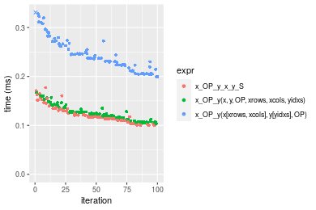

```r
> OP
[1] "-"
> stats <- microbenchmark(x_OP_y_x_y_S = x_OP_y(x_S, y_S, OP = OP, na.rm = FALSE), `x_OP_y(x, y, OP, xrows, xcols, yidxs)` = x_OP_y(x, 
+     y, OP = OP, xrows = xrows, xcols = xcols, yidxs = yidxs, na.rm = FALSE), `x_OP_y(x[xrows, xcols], y[yidxs], OP)` = x_OP_y(x[xrows, 
+     xcols], y[yidxs], OP = OP, na.rm = FALSE), unit = "ms")
```

_Table: Benchmarking of x_OP_y_x_y_S(), x_OP_y(x, y, OP, xrows, xcols, yidxs)() and x_OP_y(x[xrows, xcols], y[yidxs], OP)() on double+1000x100+sub data. The top panel shows times in milliseconds and the bottom panel shows relative times._


|   |expr                                  |      min|        lq|      mean|    median|        uq|      max|
|:--|:-------------------------------------|--------:|---------:|---------:|---------:|---------:|--------:|
|2  |x_OP_y(x, y, OP, xrows, xcols, yidxs) | 0.098278| 0.1097645| 0.1248652| 0.1199835| 0.1330065| 0.253161|
|1  |x_OP_y_x_y_S                          | 0.105373| 0.1130865| 0.1319000| 0.1284740| 0.1397205| 0.217976|
|3  |x_OP_y(x[xrows, xcols], y[yidxs], OP) | 0.201413| 0.2194830| 0.2518723| 0.2488705| 0.2701825| 0.379458|


|   |expr                                  |      min|       lq|     mean|   median|       uq|       max|
|:--|:-------------------------------------|--------:|--------:|--------:|--------:|--------:|---------:|
|2  |x_OP_y(x, y, OP, xrows, xcols, yidxs) | 1.000000| 1.000000| 1.000000| 1.000000| 1.000000| 1.0000000|
|1  |x_OP_y_x_y_S                          | 1.072193| 1.030265| 1.056340| 1.070764| 1.050479| 0.8610173|
|3  |x_OP_y(x[xrows, xcols], y[yidxs], OP) | 2.049421| 1.999581| 2.017154| 2.074206| 2.031348| 1.4988802|

_Figure: Benchmarking of x_OP_y_x_y_S(), x_OP_y(x, y, OP, xrows, xcols, yidxs)() and x_OP_y(x[xrows, xcols], y[yidxs], OP)() on double+1000x100+sub data.  Outliers are displayed as crosses.  Times are in milliseconds._

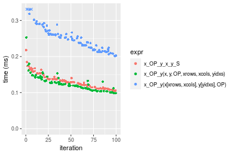

```r
> OP
[1] "*"
> stats <- microbenchmark(x_OP_y_x_y_S = x_OP_y(x_S, y_S, OP = OP, na.rm = FALSE), `x_OP_y(x, y, OP, xrows, xcols, yidxs)` = x_OP_y(x, 
+     y, OP = OP, xrows = xrows, xcols = xcols, yidxs = yidxs, na.rm = FALSE), `x_OP_y(x[xrows, xcols], y[yidxs], OP)` = x_OP_y(x[xrows, 
+     xcols], y[yidxs], OP = OP, na.rm = FALSE), unit = "ms")
```

_Table: Benchmarking of x_OP_y_x_y_S(), x_OP_y(x, y, OP, xrows, xcols, yidxs)() and x_OP_y(x[xrows, xcols], y[yidxs], OP)() on double+1000x100+mul data. The top panel shows times in milliseconds and the bottom panel shows relative times._


|   |expr                                  |      min|        lq|      mean|    median|        uq|      max|
|:--|:-------------------------------------|--------:|---------:|---------:|---------:|---------:|--------:|
|2  |x_OP_y(x, y, OP, xrows, xcols, yidxs) | 0.100973| 0.1060295| 0.1231831| 0.1167420| 0.1307630| 0.353595|
|1  |x_OP_y_x_y_S                          | 0.097044| 0.1136845| 0.1300198| 0.1257265| 0.1354095| 0.289740|
|3  |x_OP_y(x[xrows, xcols], y[yidxs], OP) | 0.210217| 0.2282090| 0.2652190| 0.2484985| 0.2884675| 0.630044|


|   |expr                                  |       min|       lq|     mean|   median|       uq|      max|
|:--|:-------------------------------------|---------:|--------:|--------:|--------:|--------:|--------:|
|2  |x_OP_y(x, y, OP, xrows, xcols, yidxs) | 1.0000000| 1.000000| 1.000000| 1.000000| 1.000000| 1.000000|
|1  |x_OP_y_x_y_S                          | 0.9610886| 1.072197| 1.055501| 1.076960| 1.035534| 0.819412|
|3  |x_OP_y(x[xrows, xcols], y[yidxs], OP) | 2.0819130| 2.152316| 2.153048| 2.128613| 2.206033| 1.781824|

_Figure: Benchmarking of x_OP_y_x_y_S(), x_OP_y(x, y, OP, xrows, xcols, yidxs)() and x_OP_y(x[xrows, xcols], y[yidxs], OP)() on double+1000x100+mul data.  Outliers are displayed as crosses.  Times are in milliseconds._

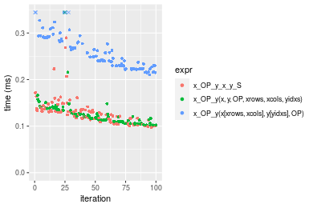

```r
> OP
[1] "/"
> stats <- microbenchmark(x_OP_y_x_y_S = x_OP_y(x_S, y_S, OP = OP, na.rm = FALSE), `x_OP_y(x, y, OP, xrows, xcols, yidxs)` = x_OP_y(x, 
+     y, OP = OP, xrows = xrows, xcols = xcols, yidxs = yidxs, na.rm = FALSE), `x_OP_y(x[xrows, xcols], y[yidxs], OP)` = x_OP_y(x[xrows, 
+     xcols], y[yidxs], OP = OP, na.rm = FALSE), unit = "ms")
```

_Table: Benchmarking of x_OP_y_x_y_S(), x_OP_y(x, y, OP, xrows, xcols, yidxs)() and x_OP_y(x[xrows, xcols], y[yidxs], OP)() on double+1000x100+div data. The top panel shows times in milliseconds and the bottom panel shows relative times._


|   |expr                                  |      min|       lq|      mean|    median|        uq|      max|
|:--|:-------------------------------------|--------:|--------:|---------:|---------:|---------:|--------:|
|1  |x_OP_y_x_y_S                          | 0.110896| 0.127263| 0.1412336| 0.1370605| 0.1531265| 0.264155|
|2  |x_OP_y(x, y, OP, xrows, xcols, yidxs) | 0.115811| 0.122829| 0.1476885| 0.1412225| 0.1533625| 0.333660|
|3  |x_OP_y(x[xrows, xcols], y[yidxs], OP) | 0.212906| 0.230869| 0.2707054| 0.2538215| 0.2939905| 0.496476|


|   |expr                                  |      min|        lq|     mean|   median|       uq|      max|
|:--|:-------------------------------------|--------:|---------:|--------:|--------:|--------:|--------:|
|1  |x_OP_y_x_y_S                          | 1.000000| 1.0000000| 1.000000| 1.000000| 1.000000| 1.000000|
|2  |x_OP_y(x, y, OP, xrows, xcols, yidxs) | 1.044321| 0.9651588| 1.045704| 1.030366| 1.001541| 1.263122|
|3  |x_OP_y(x[xrows, xcols], y[yidxs], OP) | 1.919871| 1.8141094| 1.916721| 1.851894| 1.919919| 1.879487|

_Figure: Benchmarking of x_OP_y_x_y_S(), x_OP_y(x, y, OP, xrows, xcols, yidxs)() and x_OP_y(x[xrows, xcols], y[yidxs], OP)() on double+1000x100+div data.  Outliers are displayed as crosses.  Times are in milliseconds._

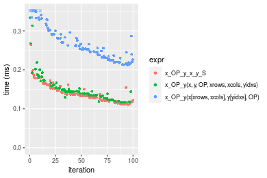


## Appendix

### Session information
```r
R version 4.1.1 Patched (2021-08-10 r80727)
Platform: x86_64-pc-linux-gnu (64-bit)
Running under: Ubuntu 18.04.5 LTS

Matrix products: default
BLAS:   /home/hb/software/R-devel/R-4-1-branch/lib/R/lib/libRblas.so
LAPACK: /home/hb/software/R-devel/R-4-1-branch/lib/R/lib/libRlapack.so

locale:
 [1] LC_CTYPE=en_US.UTF-8       LC_NUMERIC=C              
 [3] LC_TIME=en_US.UTF-8        LC_COLLATE=en_US.UTF-8    
 [5] LC_MONETARY=en_US.UTF-8    LC_MESSAGES=en_US.UTF-8   
 [7] LC_PAPER=en_US.UTF-8       LC_NAME=C                 
 [9] LC_ADDRESS=C               LC_TELEPHONE=C            
[11] LC_MEASUREMENT=en_US.UTF-8 LC_IDENTIFICATION=C       

attached base packages:
[1] stats     graphics  grDevices utils     datasets  methods   base     

other attached packages:
[1] microbenchmark_1.4-7   matrixStats_0.60.1     ggplot2_3.3.5         
[4] knitr_1.33             R.devices_2.17.0       R.utils_2.10.1        
[7] R.oo_1.24.0            R.methodsS3_1.8.1-9001 history_0.0.1-9000    

loaded via a namespace (and not attached):
 [1] Biobase_2.52.0          httr_1.4.2              splines_4.1.1          
 [4] bit64_4.0.5             network_1.17.1          assertthat_0.2.1       
 [7] highr_0.9               stats4_4.1.1            blob_1.2.2             
[10] GenomeInfoDbData_1.2.6  robustbase_0.93-8       pillar_1.6.2           
[13] RSQLite_2.2.8           lattice_0.20-44         limma_3.48.3           
[16] glue_1.4.2              digest_0.6.27           XVector_0.32.0         
[19] colorspace_2.0-2        Matrix_1.3-4            XML_3.99-0.7           
[22] pkgconfig_2.0.3         zlibbioc_1.38.0         genefilter_1.74.0      
[25] purrr_0.3.4             ergm_4.1.2              xtable_1.8-4           
[28] scales_1.1.1            tibble_3.1.4            annotate_1.70.0        
[31] KEGGREST_1.32.0         farver_2.1.0            generics_0.1.0         
[34] IRanges_2.26.0          ellipsis_0.3.2          cachem_1.0.6           
[37] withr_2.4.2             BiocGenerics_0.38.0     mime_0.11              
[40] survival_3.2-13         magrittr_2.0.1          crayon_1.4.1           
[43] statnet.common_4.5.0    memoise_2.0.0           laeken_0.5.1           
[46] fansi_0.5.0             R.cache_0.15.0          MASS_7.3-54            
[49] R.rsp_0.44.0            progressr_0.8.0         tools_4.1.1            
[52] lifecycle_1.0.0         S4Vectors_0.30.0        trust_0.1-8            
[55] munsell_0.5.0           tabby_0.0.1-9001        AnnotationDbi_1.54.1   
[58] Biostrings_2.60.2       compiler_4.1.1          GenomeInfoDb_1.28.1    
[61] rlang_0.4.11            grid_4.1.1              RCurl_1.98-1.4         
[64] cwhmisc_6.6             rappdirs_0.3.3          startup_0.15.0         
[67] labeling_0.4.2          bitops_1.0-7            base64enc_0.1-3        
[70] boot_1.3-28             gtable_0.3.0            DBI_1.1.1              
[73] markdown_1.1            R6_2.5.1                lpSolveAPI_5.5.2.0-17.7
[76] rle_0.9.2               dplyr_1.0.7             fastmap_1.1.0          
[79] bit_4.0.4               utf8_1.2.2              parallel_4.1.1         
[82] Rcpp_1.0.7              vctrs_0.3.8             png_0.1-7              
[85] DEoptimR_1.0-9          tidyselect_1.1.1        xfun_0.25              
[88] coda_0.19-4            
```
Total processing time was 45.43 secs.


### Reproducibility
To reproduce this report, do:
```r
html <- matrixStats:::benchmark('x_OP_y_subset')
```

[RSP]: https://cran.r-project.org/package=R.rsp
[matrixStats]: https://cran.r-project.org/package=matrixStats

[StackOverflow:colMins?]: https://stackoverflow.com/questions/13676878 "Stack Overflow: fastest way to get Min from every column in a matrix?"
[StackOverflow:colSds?]: https://stackoverflow.com/questions/17549762 "Stack Overflow: Is there such 'colsd' in R?"
[StackOverflow:rowProds?]: https://stackoverflow.com/questions/20198801/ "Stack Overflow: Row product of matrix and column sum of matrix"

---------------------------------------
Copyright Dongcan Jiang. Last updated on 2021-08-25 19:33:16 (+0200 UTC). Powered by [RSP].

<script>
 var link = document.createElement('link');
 link.rel = 'icon';
 link.href = "data:image/png;base64,iVBORw0KGgoAAAANSUhEUgAAACAAAAAgCAMAAABEpIrGAAAA21BMVEUAAAAAAP8AAP8AAP8AAP8AAP8AAP8AAP8AAP8AAP8AAP8AAP8AAP8AAP8AAP8AAP8AAP8AAP8AAP8AAP8AAP8AAP8AAP8AAP8AAP8AAP8AAP8AAP8AAP8AAP8AAP8AAP8AAP8AAP8AAP8AAP8AAP8AAP8AAP8AAP8AAP8AAP8BAf4CAv0DA/wdHeIeHuEfH+AgIN8hId4lJdomJtknJ9g+PsE/P8BAQL9yco10dIt1dYp3d4h4eIeVlWqWlmmXl2iYmGeZmWabm2Tn5xjo6Bfp6Rb39wj4+Af//wA2M9hbAAAASXRSTlMAAQIJCgsMJSYnKD4/QGRlZmhpamtsbautrrCxuru8y8zN5ebn6Pn6+///////////////////////////////////////////LsUNcQAAAS9JREFUOI29k21XgkAQhVcFytdSMqMETU26UVqGmpaiFbL//xc1cAhhwVNf6n5i5z67M2dmYOyfJZUqlVLhkKucG7cgmUZTybDz6g0iDeq51PUr37Ds2cy2/C9NeES5puDjxuUk1xnToZsg8pfA3avHQ3lLIi7iWRrkv/OYtkScxBIMgDee0ALoyxHQBJ68JLCjOtQIMIANF7QG9G9fNnHvisCHBVMKgSJgiz7nE+AoBKrAPA3MgepvgR9TSCasrCKH0eB1wBGBFdCO+nAGjMVGPcQb5bd6mQRegN6+1axOs9nGfYcCtfi4NQosdtH7dB+txFIpXQqN1p9B/asRHToyS0jRgpV7nk4nwcq1BJ+x3Gl/v7S9Wmpp/aGquum7w3ZDyrADFYrl8vHBH+ev9AUASW1dmU4h4wAAAABJRU5ErkJggg=="
 document.getElementsByTagName('head')[0].appendChild(link);
</script>


